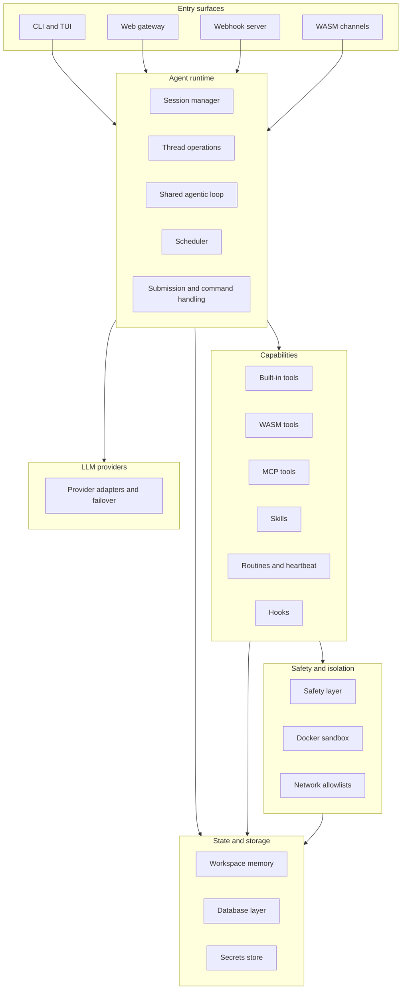

# IronClaw Architecture

## System Shape

IronClaw is a multi-surface personal agent built around a shared execution core. The architecture is not organized around channels or tools first; it is organized around an agent runtime that can be reached from many channels and can call many tool backends.

At a high level, the system divides into six layers:

1. Entry surfaces: CLI, TUI, web gateway, HTTP webhook, WASM channels.
2. Agent runtime: session management, thread operations, command routing, shared agentic loop, scheduler.
3. Capability layer: tools, skills, hooks, routines, extensions.
4. Model layer: multiple LLM providers with routing, retry, and failover.
5. Memory and persistence: workspace memory plus database stores.
6. Security and isolation: safety checks, secrets, WASM limits, Docker sandbox, network policy.

## Structural View

## Core Data Model

IronClaw treats conversation state as nested durable structures:

- Session: per user logical container.
- Thread: one conversation inside a session.
- Turn: one user request plus the resulting agent work.

This is one of the system's most reusable ideas because it gives clear places for approval, undo, compaction, and background linkage.

Thread state and turn state are explicit. That matters because approvals, interruptions, and background job interactions are first-class runtime events rather than incidental control flags.

## Shared Execution Engine

The most important architectural decision is the shared agentic loop. Interactive chat, background jobs, and container workers all delegate to the same `run_agentic_loop()` engine through different delegate implementations.

That design buys three things:

1. One reasoning and tool-execution model across surfaces.
2. Fewer behavioral mismatches between chat and autonomous jobs.
3. A natural place to inject safety, approval, and post-iteration logic.

For koklyp, this suggests a runtime core that is independent of channel adapters and independently testable.

## Tool-Centric Integration Model

IronClaw tries to route capability access through tools instead of letting every subsystem mutate state directly. That is not just style; it is an architectural control point.

Practical consequences:

- Tool execution becomes observable and auditable.
- Approval and policy checks have a stable interception boundary.
- Credential injection stays at the host boundary instead of inside prompts.
- Skills and routines can compose against the same tool contract.

This principle is stronger than the specific Rust implementation and should carry into koklyp.

## Memory As Workspace

IronClaw does not treat memory as a special-purpose vector store bolted onto chat history. It treats memory as a filesystem-like workspace backed by database tables and indexing.

Key properties:

- Named durable files like MEMORY.md, USER.md, HEARTBEAT.md, daily logs.
- Arbitrary project subtrees.
- Hybrid retrieval using full-text search plus embeddings with reciprocal rank fusion.
- Identity and instruction files isolated from cross-scope reads.

This is a strong fit for koklyp because it supports both agent-readable context and user-readable operational artifacts.

## Defense-In-Depth Security

IronClaw uses several security boundaries rather than one:

- Safety layer validates and sanitizes tool results.
- Approval pauses the loop for sensitive operations.
- Secrets are stored separately and injected at execution time.
- WASM tools declare capabilities and run under limits.
- Docker sandbox provides stronger isolation for non-trivial execution.
- Network access can be allowlisted.

This layered model is more important than any specific engine choice. Koklyp should preserve the layers even if the concrete sandbox changes.

## Background Autonomy

IronClaw is not only synchronous request/response chat. It has a scheduler, routines, heartbeat checks, and self-repair. That turns it from a chat shell into an operating assistant.

This also increases complexity significantly. For koklyp, it argues for separating:

- interactive turn execution,
- scheduled internal maintenance,
- user-created routines,
- long-running jobs.

## Important Invariants

Several documented invariants are architecturally significant:

- LLM output is retained rather than deleted from durable storage.
- Extension identity and credential identity must not be conflated.
- Identity files read from the primary scope only.
- State mutation should happen through controlled boundaries rather than arbitrary helper paths.
- Both database backends must stay feature-equivalent.

The exact backend rule may not carry into koklyp, but the broader lesson does: choose invariants early and write them down.

## What To Borrow For Koklyp

Borrow directly:

- Session, thread, and turn model.
- Shared runtime loop with delegate variants.
- Workspace-shaped memory.
- Declarative tool capabilities.
- Approval pauses and safety boundary before tool execution.
- Background maintenance jobs.

Borrow carefully:

- Dual-backend persistence.
- Complex extension registry and installer machinery.
- Full self-repair subsystem.
- Deep WASM runtime integration inside the main process.

Avoid copying blindly:

- Rust-specific crate splits that only exist for ownership or compile-time reasons.
- Any assumption that Kotlin should mirror Wasmtime or libSQL implementation details exactly.