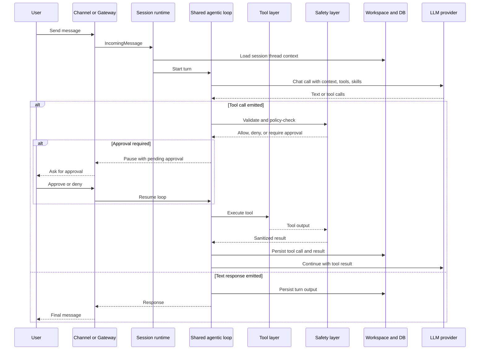

# IronClaw Logic Flow

## Primary Interactive Flow

IronClaw's main request path is best understood as a controlled loop rather than a linear request handler.

## Submission Parsing And Control Flow

Before a normal turn is created, the runtime first asks whether the message is really user content or a control action.

Control actions include:

- undo and redo,
- interrupt and stop,
- compact,
- new thread and resume,
- job status and cancel,
- approval responses,
- system commands.

This is significant because it prevents the runtime from treating operational commands as chat content.

## Approval Flow

Tools marked as requiring approval cause the loop to stop with a resumable pending state rather than failing or silently skipping.

That pattern is worth copying because it keeps:

- safety policy explicit,
- UI flow predictable,
- auditability intact,
- conversation state resumable.

## Auth Interception Flow

IronClaw also has an auth mode. When a thread is waiting for a credential or auth-card response, the next user input is intercepted before turn creation and routed to credential handling.

That means auth is modeled as runtime state, not as a brittle front-end wizard state alone.

## Compaction Flow

The runtime monitors approximate context pressure and chooses one of three strategies:

1. MoveToWorkspace for moderate pressure.
2. Summarize for high pressure.
3. Truncate for critical pressure.

Important behaviors:

- Compaction is strategy-based rather than one-size-fits-all.
- Workspace is the main landing zone for durable summaries or moved transcripts.
- Failed summarization does not silently discard history.

This flow strongly informs koklyp's memory-tier design.

## Background Job Flow

Jobs are not implemented as a different product. They are another execution path over the shared loop.

Typical flow:

1. A user command or tool creates a job.
2. The scheduler persists it and places it in the runtime maps.
3. A worker executes it using the shared loop and a job delegate.
4. Progress and results are persisted.
5. Cleanup removes completed jobs from active maps.

The key lesson is to reuse runtime semantics across chat and autonomy rather than inventing a second orchestration model.

## Heartbeat And Routine Flow

IronClaw periodically reads HEARTBEAT.md and runs an internal agent turn. If it finds something worth surfacing, it delivers a notification through a channel.

Routines extend that idea with structured triggers and actions.

This is one of the clearest signals that koklyp needs scheduled internal management as a first-class concern, especially because memory maintenance is a stated requirement.

## Self-Repair Flow

Self-repair watches for:

- stuck jobs,
- repeatedly failing tools.

It attempts recovery or rebuild, escalates to manual action when limits are exceeded, and avoids noisy user notifications for transient retry states.

For koklyp, the design lesson is to make failures observable and recoverable. Full self-repair can be deferred.

## Logic Lessons For Koklyp

The biggest reusable flow decisions are:

1. Parse control commands before conversation turns.
2. Use resumable approvals instead of ad hoc modal logic.
3. Route chat, jobs, and internal maintenance through one runtime loop.
4. Make memory compaction an explicit workflow, not a hidden implementation detail.
5. Keep tool execution behind a safety boundary and durable event log.