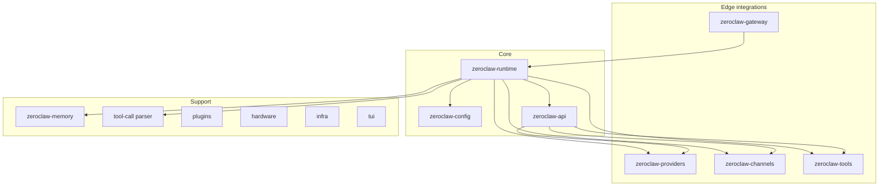

# ZeroClaw Architecture

## System Shape

ZeroClaw is a layered Rust workspace where the runtime core depends on interfaces, not on concrete integrations. Compared with IronClaw, it is more explicitly modular at the public API level.

The overall shape has three layers:

1. Core: runtime, config, and the API contracts.
2. Edge: providers, channels, tools, gateway.
3. Support: memory, plugins, hardware, infra, macros, TUI.

## Structural View

## Trait-Based Kernel Boundaries

The dedicated API crate is one of ZeroClaw's clearest architectural strengths. It defines Provider, Channel, and Tool interfaces that the runtime depends on.

Why this matters:

- the runtime can evolve independently from individual integrations,
- provider, channel, and tool additions do not require core logic rewrites,
- feature-gated builds can stay small,
- platform-specific integrations remain out of the kernel.

For koklyp, this is a strong argument for small API modules or interfaces owned outside the main runtime implementation.

## Runtime-Centered Design

Even though the workspace is modular, the runtime still owns the orchestration:

- inbound message delivery,
- context loading,
- provider streaming,
- tool-call validation,
- tool invocation,
- memory persistence,
- SOP and cron scheduling,
- onboarding and service behavior.

This balance is important. ZeroClaw separates integrations aggressively, but it does not fragment the control plane.

## Streaming As A First-Class Concern

The request lifecycle is designed for streaming rather than retrofit batching. Provider events arrive incrementally, channels can push draft updates, and tool calls may occur mid-stream.

That implies:

- channel adapters need update semantics, not just send semantics,
- the runtime must pause and resume generation cleanly,
- provider abstractions need event streams rather than simple string returns.

Koklyp should adopt this as a baseline rather than trying to add streaming later.

## Security Model

ZeroClaw layers several concepts:

- autonomy levels,
- operator approvals,
- path and command boundaries,
- OS-level sandboxing,
- cryptographic tool receipts.

Unlike IronClaw, the documentation emphasizes policy evaluation and autonomy levels more directly than workspace-oriented safety layers. The result is more explicit runtime policy language.

For koklyp, the likely synthesis is:

- IronClaw-style explicit tool and credential boundaries,
- ZeroClaw-style autonomy levels and approval policy.

## Memory Model

ZeroClaw's memory system combines persistent transcript storage, optional embeddings, vector retrieval, and consolidation. It is less workspace-shaped than IronClaw, but it is strong in retrieval and consolidation thinking.

This makes it especially useful for koklyp's multi-tier memory design:

- transcripts remain durable,
- retrieval is separate from prompt assembly,
- consolidation is a scheduled process,
- summaries and facts are products of background work.

## Product Surface And Scope

ZeroClaw extends beyond chat into:

- gateway and dashboard,
- 30+ channels,
- 20+ providers,
- SOP engine and cron,
- ACP integration,
- hardware integrations.

This breadth is useful as a feature source, but it also demonstrates the main risk: module clarity does not automatically reduce product scope.

## What To Borrow For Koklyp

Borrow directly:

- interface-first provider, channel, and tool boundaries,
- streaming-aware runtime contracts,
- autonomy-level language,
- a separate memory subsystem,
- explicit gateway as a first-class component.

Borrow carefully:

- compile-time feature flag granularity,
- plugin and hardware subsystems,
- ACP and advanced IDE integration,
- extremely broad channel matrix.

Avoid copying blindly:

- Rust-specific workspace splitting that does not buy the same clarity in Kotlin,
- assuming every integration should be present in the first release just because the architecture allows it.