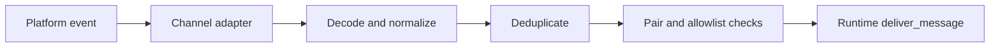
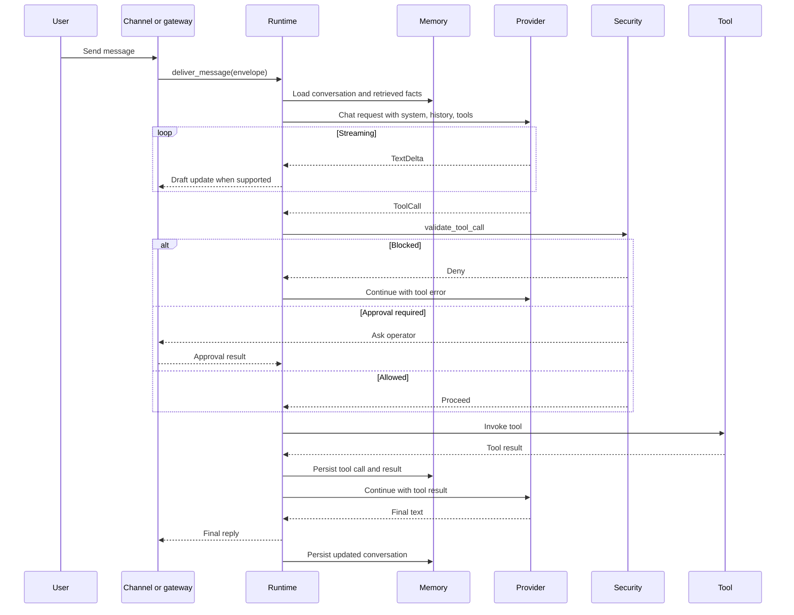

# ZeroClaw Logic Flow

## Inbound Lifecycle

ZeroClaw begins outside the runtime. Channel adapters receive native events, normalize them, deduplicate them, and enforce pairing or allowlist checks before the runtime sees anything.

That is an important architectural lesson: channel safety and channel decoding belong at the edge.

## Interactive Request Flow

## Streaming Behavior

Streaming is not decorative. It shapes the contracts between runtime, providers, and channels.

Key implications:

- Providers emit structured stream events.
- Channels need draft-update support or graceful fallback.
- Runtime must be able to pause mid-stream for tools and approvals.

This should be a koklyp baseline requirement.

## Tool Receipt Flow

Every tool execution produces a signed receipt chained to the previous one. That creates a tamper-evident action log.

Koklyp does not necessarily need this on day one, but it should at least keep structured tool execution records so a stronger receipt model can be added later.

## SOP And Cron Flow

ZeroClaw extends beyond user-initiated requests. SOP and cron can trigger runtime work from:

- webhooks,
- MQTT or other events,
- peripheral events,
- schedule-based triggers.

This makes automation part of the same runtime family rather than a separate batch system.

For koklyp, the reusable principle is that scheduled work and event-driven work should reuse agent runtime semantics where possible.

## Memory Consolidation Flow

The docs emphasize durable memory plus consolidation and fact extraction. Even where the exact algorithm is not fully documented, the architectural direction is clear:

- store full conversations,
- maintain retrieval structures,
- periodically consolidate and compress,
- keep summaries and extracted facts available across sessions.

This strongly reinforces req.md's call for scheduled internal memory management.

## Policy And Approval Flow

ZeroClaw expresses tool safety through autonomy levels and policy evaluation.

Practical runtime outcomes:

- low-risk operations can proceed automatically,
- medium-risk operations can pause for approval,
- high-risk operations can be denied,
- path and command rules can narrow what tools may do even when the tool exists.

This is a strong conceptual model for koklyp because it can scale from a cautious MVP to more autonomous later phases.

## Logic Lessons For Koklyp

The most reusable flow decisions are:

1. Keep decoding and pairing at the channel edge.
2. Design the runtime around streaming events, not final strings.
3. Treat tool calls as mid-stream control transfers.
4. Make approvals part of the runtime lifecycle.
5. Run automation through the same runtime model where possible.