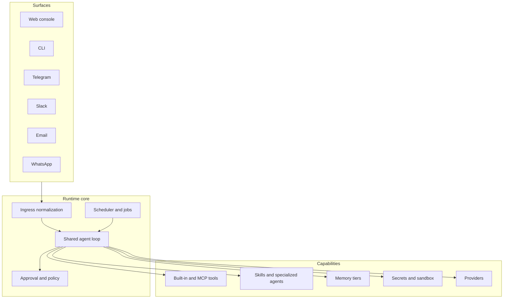

# koklyp Architecture Draft

This document proposes the first serious architecture for koklyp based on req.md, the IronClaw and ZeroClaw analysis, and selected inspiration from OpenClaw and Hermes Agent.

## Architectural Decision: JVM First, Portability-Conscious

The recommended answer to the Native versus JVM question is:

**Build koklyp on the JVM first, while keeping the core domain and adapter boundaries friendly to future Kotlin Multiplatform reuse.**

### Why this is the current recommendation

| Dimension | Kotlin Native | JVM | Decision impact |
| --- | --- | --- | --- |
| Ktor server | Supported, but current docs constrain native server use to `embeddedServer`, CIO only, and no HTTPS without a reverse proxy | Fully mature server story with multiple engines and operational tooling | Favors JVM for the gateway and console backend |
| koog core agent framework | Koog is multiplatform, but important integrations are not uniform across targets | Full support and best ecosystem fit | Favors JVM for first implementation |
| koog MCP and ACP integration | Current Koog docs describe JVM-specific MCP and ACP integration paths | Straightforward on JVM | Strong JVM bias because external tool integration is central |
| Process and shell tools | Technically possible but more target-specific and operationally awkward | Mature process execution and library support | Favors JVM for git, kubectl, shell, and background tooling |
| Storage ecosystem | More fragmented across native targets | JDBC and mature libraries make SQLite and PostgreSQL simpler | Favors JVM |
| Chat and email SDKs | Many would need raw HTTP or custom wrappers | Broad library and tooling availability | Favors JVM |
| WASM sandbox hosting | Possible, but the implementation burden is higher if everything must remain pure native | More options, including JVM bindings or a sidecar strategy | Favors JVM |
| Runtime footprint | Smaller binaries are attractive | Heavier runtime | Favors Native, but not enough to outweigh the integration surface |

### Practical interpretation

Ktor no longer blocks Native outright, which is useful. But koklyp is not just an HTTP server. It needs MCP, process tools, git, kubectl, scheduled maintenance, database integration, and several messaging adapters. That is a systems-integration product much more than a bare network runtime.

The safest near-term architecture is:

- JVM for the main runtime and gateway.
- Kotlin-first module boundaries that do not assume JVM everywhere in the domain model.
- Optional future Native reuse for selected edge pieces only if it becomes valuable.

## Core Principles

1. Single-user first, not multi-tenant first.
2. Local-first defaults, with hosted deployment possible later.
3. One runtime model for chat, jobs, and internal maintenance.
4. Explicit memory tiers with scheduled upkeep.
5. Tool access through policy and capability metadata.
6. Channels and tools are adapters around a stable runtime core.

## Proposed Module Layout

The exact Gradle module list can change, but the architecture should preserve these boundaries:

| Module | Responsibility |
| --- | --- |
| `koklyp-domain` | IDs, states, events, config models, shared contracts |
| `koklyp-runtime` | session, thread, turn handling; shared agent loop; approvals; scheduler |
| `koklyp-providers-api` | LLM provider contracts |
| `koklyp-providers-*` | concrete model adapters and routing |
| `koklyp-channels-api` | channel contracts for inbound and outbound messaging |
| `koklyp-channels-*` | Telegram, Slack, email, WhatsApp, web, CLI adapters |
| `koklyp-tools-api` | tool contract, schemas, capability metadata |
| `koklyp-tools-builtins` | filesystem, wiki, HTTP, web search, git, scheduling, memory |
| `koklyp-tools-mcp` | MCP client and tool bridge |
| `koklyp-memory` | workspace documents, transcript store, retrieval, summarization hooks |
| `koklyp-storage` | SQLite and later PostgreSQL persistence implementations |
| `koklyp-security` | secrets, approval policy, leak checks, network rules |
| `koklyp-gateway` | Ktor backend for console API, streaming, webhooks |
| `koklyp-console` | browser UI |
| `koklyp-sandbox` | optional sidecar or worker boundary for WASM and risky execution |

## Runtime Model

koklyp should unify interactive and autonomous execution under one orchestration engine.

### Core runtime rules

- Commands and approvals are parsed before a normal turn is created.
- Chat turns, routines, and jobs all execute through the same runtime core.
- Tool calls are always mediated by policy and capability metadata.
- All important work is written to durable storage as structured events.

## Channel Architecture

Each channel adapter should own:

- payload decoding and normalization,
- sender identity mapping,
- pairing or allowlist checks,
- outbound formatting,
- optional draft-update support,
- channel-specific delivery constraints.

The runtime should never depend on raw Telegram, Slack, or email payload shapes.

### Recommended first-wave channels

- Web console
- CLI
- Telegram
- Slack
- Email

WhatsApp should remain in the target architecture but may ship one phase later if it threatens the delivery of the safer first-wave surfaces.

## Tool Architecture

Tools should be described by a stable contract containing:

- name and schema,
- side-effect classification,
- approval requirements,
- network requirements,
- secret requirements,
- sandbox requirement,
- rate-limit hints.

Tool families should include:

- built-in local tools,
- MCP-backed tools,
- later, sandboxed WASM tools.

The runtime should not care which transport the tool uses once the capability contract is resolved.

## Memory Architecture

Memory is the hardest part of req.md, so koklyp should define it explicitly from the start.

### Proposed tiers

| Tier | Purpose | Storage shape |
| --- | --- | --- |
| Tier 0: live working set | Current turn context and active task state | In-memory plus checkpoint support |
| Tier 1: durable transcript log | Full conversations, tool calls, approvals, job events | Structured DB tables |
| Tier 2: curated workspace memory | Stable docs such as MEMORY.md, USER.md, runbooks, project notes | File-like document store |
| Tier 3: derived knowledge | Summaries, extracted facts, daily notes, heartbeat outputs | Document store plus structured fact tables |
| Tier 4: retrieval projections | FTS index and embeddings over selected documents and transcripts | Search indexes and vectors |

### Scheduled internal management

koklyp should have dedicated internal maintenance jobs for:

1. transcript summarization,
2. fact extraction and preference updates,
3. daily digest generation,
4. stale task cleanup,
5. embedding refresh or reindexing,
6. failed-job or failed-tool detection.

This is how the requirement for multi-tier, scheduled internal memory management becomes concrete.

## Persistence Strategy

Recommended first plan:

- SQLite as the default local storage.
- PostgreSQL as an optional second backend once the model is stable.
- Explicit tables for sessions, threads, turns, jobs, routines, tool calls, secrets metadata, documents, and search projections.

The main rule is to preserve event fidelity. Full transcript deletion or silent truncation should not be part of normal operation.

## Security And Isolation

koklyp should combine ideas from IronClaw and ZeroClaw:

- channel pairing or allowlists by default,
- autonomy levels or policy modes,
- approval pauses for risky operations,
- secret storage with execution-time injection,
- structured tool execution logs,
- sandbox boundary for risky or user-authored code.

### Sandbox recommendation

Because the runtime is JVM-first, koklyp should avoid coupling the first release to a single in-process WASM engine. A cleaner design is a dedicated sandbox boundary that can host:

- shell and process execution,
- later, WASM tools,
- high-risk integrations.

That boundary can be an internal worker process or sidecar with policy-controlled APIs. This keeps the isolation model portable even if the implementation changes later.

## Web Console

The console should be more than a chat screen. It should expose:

- conversation view,
- approval queue,
- memory browser,
- job and routine monitor,
- tool and secret status,
- channel status,
- configuration and diagnostics.

This is the operator surface for a system that is expected to run continuously.

## Suggested Delivery Phases

### Phase 1

- JVM runtime core
- SQLite
- Ktor gateway and console backend
- CLI
- Telegram, Slack, email
- built-in tools, MCP bridge, skills
- multi-tier memory core and maintenance jobs
- approvals, secret injection, channel pairing

### Phase 2

- WhatsApp
- PostgreSQL backend
- richer job management and observability
- stronger search and memory introspection
- sidecar sandbox hardening

### Phase 3

- WASM tool runtime
- specialized agents
- self-repair automation
- broader deployment options and exports

## Non-Goals For The First Implementation

The architecture should explicitly resist these scope traps in the first phase:

- deep hardware integration,
- dozens of channels,
- full multi-tenant architecture,
- perfect parity with every idea in IronClaw or ZeroClaw,
- Native-first delivery for the main runtime.