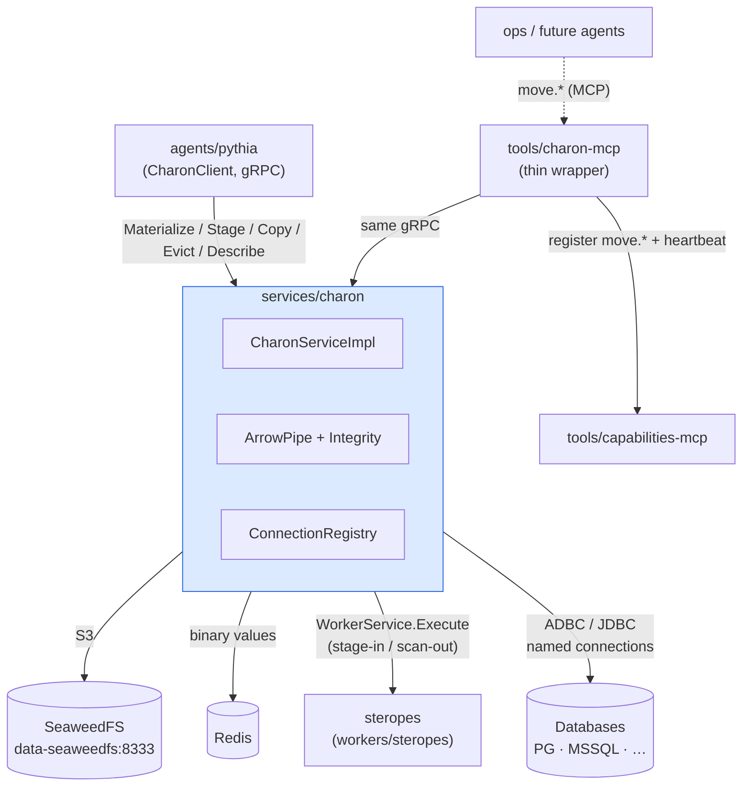

# Charon — Solution Architecture (kantheon arc, Phases 1–3)

> **Scope.** Kantheon-side architecture for **Charon**, the Arrow data mover: `services/charon` (full-spec engine, gRPC) + `tools/charon-mcp` (thin MCP wrapper). First platform-grade service migrated into kantheon per the 2026-06-12 boundary-shift direction.
>
> **What Charon is.** The data-plane utility that moves Arrow data between storage tiers and compute engines: SeaweedFS (S3), Redis, worker sessions (Polars, later Metis), and **databases via named connections** (read *and* write). Charon never *transforms* data — no filtering, no recompute, no schema surgery; Arrow↔rows encoding at DB edges is in scope (P8 refined, 2026-06-12). Callers decide *when* to move (Pythia's policies); Charon never decides on its own.
>
> **Reads with.** [`./contracts.md`](./contracts.md), [`../../implementation/v1/charon/plan.md`](../../implementation/v1/charon/plan.md), [`../pythia/architecture.md`](../pythia/architecture.md) §3/§5 (primary consumer + materialisation policies), `Pythia-v1-Design.md` §6.2 (the Mover design origin), [`../kantheon-architecture.md`](../kantheon-architecture.md) §1 (boundary shift).

## 1. Architectural goal

Three deployable outcomes:

1. **Phase 1:** `services/charon` in local K3s moving Arrow between SeaweedFS and Redis — proto, integrity core (schema fingerprints, no-partial-write), streaming movers, `Describe`/`Evict`.
2. **Phase 2:** Database edges live — named-connection registry, ADBC extract (DB → Arrow) and ingest (Arrow → DB) for Postgres and MSSQL, per-connection read/write allow-lists.
3. **Phase 3:** Compute-engine integration + constellation wiring — Polars Worker stage-in/read-out, `tools/charon-mcp` wrapper, `move.*` ToolCapability registration, observability, throughput benchmark. Ready for Pythia Phase 4.

**Consumers (in order of arrival):** Pythia (handle materialisation, evidence persistence, cross-engine staging — gRPC direct), then potentially Golem v1.x (DataFrameNode staging), Midas loaders (bulk imports), ops tooling (ad-hoc moves via MCP).

## 2. Tech stack

| Layer | Choice | Why |
|---|---|---|
| Language / service | **Kotlin 2.x + Ktor 3.2.x** (HTTP probes) + **gRPC server** (the real surface) | kantheon idiom; gRPC is the service-to-service protocol (locked 2026-06-12) |
| Proto | **`org.tatrman.charon.v1`** in kantheon `shared/proto` | migrated-service package convention: `org.tatrman.<service>.v1` |
| Arrow | **Arrow Java** (VectorSchemaRoot, IPC stream reader/writer) | the universal exchange format (P8) |
| DB edges | **ADBC** (`org.apache.arrow.adbc` — JDBC driver wrapper; native Postgres driver where stable) with **plain JDBC + `arrow-jdbc` adapter as fallback** | Arrow-native bulk ingest/extract; Java ADBC maturity is a Phase 2 Stage 2.1 spike gate |
| Object store | **AWS SDK S3 client** → SeaweedFS S3 gateway (`data-seaweedfs:8333`) | verified deployed (fabric-infra) |
| Redis | **Lettuce** (binary-safe values) | platform Redis; Arrow IPC bytes as values |
| Worker access | gRPC `cz.dfpartner.worker.v1.WorkerService` (ai-platform Maven proto) | `Execute` + `assign_to_workspace` verified; read-out path is a pre-flight verification. **Pointer (fork Phase 1.2, 2026-06-13):** the in-repo equivalent is `org.tatrman.worker.v1.WorkerService` (shared/proto/src/main/proto/org/tatrman/worker/v1/worker.proto); Charon's `WorkerEndpoint` re-targets to Steropes in fork Phase 3 Stage 3.4. |
| Secrets / connections | YAML connection registry + env/sealed-secret substitution (fabric-infra pattern) | named connections; callers never hold credentials |
| Test stack | Kotest + Testcontainers (MinIO-or-SeaweedFS, Redis, Postgres, MSSQL) + gRPC in-process server | constellation pattern |
| Container / deploy | Jib; Kustomize `base/` + `overlays/local/` | kantheon pattern |

## 3. Module map

```
kantheon/
├── services/charon/                          # first services/ module in the repo
│   ├── src/main/kotlin/org/tatrman/charon/
│   │   ├── App.kt                            # Ktor probes + gRPC server bootstrap
│   │   ├── grpc/CharonServiceImpl.kt         # the five RPCs; request validation
│   │   ├── core/
│   │   │   ├── MovePlanner.kt                # source/target legality matrix, option resolution
│   │   │   ├── ArrowPipe.kt                  # streaming pump: IPC reader → chunker → IPC writer
│   │   │   ├── Integrity.kt                  # schema fingerprint (SHA-256 of canonical logical-schema string; contracts §6), row counting
│   │   │   └── Errors.kt                     # typed failure → gRPC status mapping
│   │   ├── endpoints/
│   │   │   ├── SeaweedEndpoint.kt            # S3 get/put (temp-key + rename), multipart for large blobs
│   │   │   ├── RedisEndpoint.kt              # binary value + TTL; size cap enforced
│   │   │   ├── WorkerEndpoint.kt             # stage-in (Execute + assign_to_workspace), read-out (scan plan)
│   │   │   └── db/
│   │   │       ├── ConnectionRegistry.kt     # named connections; allow-lists; pooling
│   │   │       ├── AdbcReader.kt             # DB table → Arrow stream
│   │   │       └── AdbcWriter.kt             # Arrow stream → DB table (transactional ingest; CREATE/REPLACE/APPEND)
│   │   └── observability/Metrics.kt
│   ├── src/main/resources/{application.conf, connections.example.yaml}
│   ├── src/test/kotlin/
│   ├── bench/                                # throughput benchmark harness (Phase 3)
│   ├── k8s/{base,overlays/local}/
│   └── build.gradle.kts
│
├── tools/charon-mcp/                         # thin wrapper — Phase 3
│   ├── src/main/kotlin/org/tatrman/charon/mcp/
│   │   ├── App.kt
│   │   └── McpTools.kt                       # move.* tools: JSON ↔ proto, one gRPC call each; zero logic
│   ├── src/main/resources/manifests/         # move.*:v1 ToolCapability YAMLs (registered via heartbeat)
│   └── k8s/{base,overlays/local}/
│
└── shared/proto/src/main/proto/org/tatrman/charon/v1/charon.proto
```

**Endpoint abstraction.** Every location kind implements `Source` (`open(): ArrowStream`) and/or `Target` (`write(stream): WriteReceipt`) — the move core is a single pump (`ArrowPipe`) over any Source→Target pair. The legality matrix (which pairs each RPC allows) lives in `MovePlanner`, not in the endpoints. Adding a future endpoint kind (e.g. Parquet-on-S3, DuckDB worker) is one class + one matrix row.

## 4. Component diagram



## 5. The five operations — semantics

| RPC | Source kinds | Target kinds | Semantics |
|---|---|---|---|
| `Materialize` | any | `SeaweedBlob`, `RedisEntry`, `DbTable` | persist to a storage tier; the durable-copy verb |
| `Stage` | any | `WorkerSessionDf` | load into a compute engine session; the make-it-hot verb |
| `Copy` | any | any | generic move incl. cross-endpoint (e.g. DB→DB between connections); superset verb, kept for explicit-intent metrics |
| `Evict` | — | location | delete/expire: S3 delete, Redis del, worker DF drop, **never DB** (DB cleanup is the owner's job) |
| `Describe` | — | location | live inspection: schema (+fingerprint), row count (exact or estimate), size, liveness/TTL — no provenance store; Charon is stateless |

Invariants: **no partial writes** (S3 temp-key + rename; Redis SET single op; DB single transaction with rollback; worker stage is session-scoped and re-runnable); **schema fingerprint verified** end-to-end when `expected_schema_fingerprint` is supplied, always computed and returned; **sync unary with gRPC deadlines** at v1 (async job + NATS completion is a v1.x trigger-based addition, same discipline as Pythia's Temporal deferral).

## 6. Database edges — guardrails

- **Named connections only.** `connection_id` resolves in Charon's registry (YAML + secret substitution, fabric-infra sealed secrets). Requests never carry credentials. Per-connection allow-list: `read: bool`, `write: bool`, permitted schemas. **Pythia's internal Postgres is never provisioned.**
- **Table-level moves, no queries.** Whole-table extract/ingest. Predicate-shaped or user-scoped access belongs to query-mcp where sql-security applies. Predicate pushdown is a v1.x option with its own security review.
- **Write modes:** `CREATE` (fail if exists), `REPLACE` (transactional swap), `APPEND`. Type mapping Arrow→DDL is deterministic and documented in contracts §5; unmappable types fail the move (no silent coercion).

## 7. Deployment topology

`charon` pod (kantheon namespace; gRPC :7251, HTTP probes :7250) + `charon-mcp` pod (:7252). Reaches Seaweed/Redis/NATS-free; workers cross-namespace; DBs per connection registry. Readiness: connection registry parsed + S3/Redis reachable (DB connections validated lazily with a `/ready`-reported degraded set — one broken customer DB must not hold the pod unready).

## 8. Observability

```
charon_moves_total{rpc, source_kind, target_kind, result="ok|error"}
charon_move_bytes / charon_move_rows                  (histograms, by source/target kind)
charon_move_duration_ms{source_kind, target_kind}
charon_fingerprint_mismatch_total
charon_db_connections_up{connection_id}               (gauge)
charon_worker_stage_total{direction="in|out"}
charon_evictions_total{kind}
```

Span per move with source/target locations (keys redacted to bucket/connection level); trace context from callers (Pythia step spans nest Charon moves).

## 9. Testing strategy

- **Unit (mocked):** legality matrix, fingerprint computation, chunker
  boundaries, Arrow→DDL type mapping, connection allow-list enforcement.
  The Stage 1.2/1.3 unit suite is `mockk`-driven against the
  `S3Client` / `RedisOps` interfaces — the move-pipe contract
  (atomicity, fingerprint, byte cap, error surfacing, metric labels) is
  asserted at the call-shape level. The "no-partial-write under
  mid-stream fault" guarantee is asserted by verifying the discard
  path fires on the mocked exception, not against a live S3
  semantics.
- **Component (mocked):** full pump matrix over a fixture table, every
  legal source→target pair round-trips a reference dataset with
  byte-identical schema. Single-batch and multi-batch (3-batch
  round-trip — `core/MultiBatchMoveSpec.kt` — the gate that would
  have caught the review-006 B1 bug).
- **Integration (live local K3s + Testcontainers):** **a separate
  integration-test suite** (testing policy §4) — it does **not** gate any
  Charon stage or the `charon/v0.1.x` tag. The live K3s Seaweed/Redis
  round-trip + multipart-upload gate + mid-stream fault injection are
  tracked as carry-overs in
  [`../../implementation/v1/charon/tasks-p1-s1.4-closeout.md`](../../implementation/v1/charon/tasks-p1-s1.4-closeout.md)
  **Part B**. (The **cross-engine fingerprint** check is *not* deferred —
  it is a unit test now, `IntegritySpec` recomputing against the shared
  anchor `shared/testdata/fingerprints/`, plus a CI regen+diff guard;
  review-006 R3 / Stage 1.4 T2–T3.) The Stage 1.4 **closeout** (Part A —
  mocked-unit + CI + code) is what re-tags `charon/v0.1.1`.
- **Phase 3 (live Steropes):** live Seaweed + live **Steropes** (the in-repo
  Polars worker, `workers/steropes`, gRPC `steropes:7301`) stage-in/read-out;
  Pythia's CharonClient fixture suite runs against the live pod.
- **Bench:** `bench/` harness — rows/s + MB/s per pair on reference
  datasets (1e5 / 1e6 rows); recorded per release, fills the
  `cost_hints` of the `move.*` capability manifests.

## 10. Risks

| Risk | Mitigation | Stage |
|---|---|---|
| ADBC Java maturity (esp. MSSQL) | Stage 2.1 is a spike gate: ADBC-JDBC first; fallback locked = plain JDBC + `arrow-jdbc` adapter behind the same `AdbcReader/Writer` interface | P2 S2.1 |
| Steropes can't stream a workspace DF out | scan-plan read-out verification is a Phase 3 pre-flight, now verified against **Steropes** (`workers/steropes`, in-repo) rather than ai-platform's polars; fallback = a `ReadWorkspace` RPC added to Steropes (in-repo change, no longer an ai-platform PR) | P3 pre-flight |
| Large-blob memory pressure (whole-table moves) | Stage 1.2 single-shot PUT buffers the whole dataset in memory (O(total bytes)); Stage 1.4 hardens the S3 path with `CreateMultipartUpload` / `UploadPart` / `CompleteMultipartUpload` / `AbortMultipartUpload` so per-batch memory is bounded; the per-move byte cap (128 MiB default) is enforced. Until Stage 1.4 lands, **production moves of >100 MiB are not safe**. | P1 S1.4 |
| Multi-batch move silently produces empty object (review-006 B1) | `core/MultiBatchMoveSpec.kt` 3-batch round-trip gate; `ArrowPipe.pipe` materialises each batch into owned data per call, no references to the reader's reused root. | P1 S1.4 |
| Cross-engine fingerprint drift (review-006 H2/R3) | **Resolved:** the fingerprint is a canonical, implementation-independent logical-schema digest (NOT raw IPC bytes; see contracts §6). `IntegritySpec` recomputes against the shared cross-engine anchor `shared/testdata/fingerprints/` (`reference`/`scalars`/`list`/`map`.arrow + `fingerprints.json`) — the same fixtures Brontes (`SchemaFingerprintCrossEngineSpec`) and Steropes (`test_fingerprint.py`) verify against; all three must agree (`reference.arrow` digest `69779ea6…`). A CI regen+diff guard (`.github/workflows/ci.yml`, Stage 1.4 T3) fails the build on any fixture drift. **Live-K3s runtime cross-check is an integration-suite carry-over** (testing policy §4), not a unit gate. | done (P1 closeout, S1.4) |
| DB write path abused as a query bypass | allow-lists + table-level-only + no DB evict; security note in contracts §5; review at P2 close | P2 |
| Two `services/` conventions (Charon vs Midas report-renderer) diverging | Charon lands first and settles the `services/` module conventions; Midas plan follows them | P1 |

## 11. References

- [`./contracts.md`](./contracts.md) — wire contracts (companion). [`../../implementation/v1/charon/plan.md`](../../implementation/v1/charon/plan.md) — phased plan.
- Design origin: [`../../design/pythia/Pythia-v1-Design.md`](../../design/pythia/Pythia-v1-Design.md) §6.2 (Charon agent) + P8; consumer policies in [`../pythia/architecture.md`](../pythia/architecture.md) §5.
- Verified surfaces (in-repo since the fork): `shared/proto/.../org/tatrman/worker/v1/worker.proto` (`Execute`, `assign_to_workspace`, ResultBatch chunking, schema fingerprint), `workers/steropes/src/workers_steropes/grpc_service.py` (the Polars worker) + `workers/steropes/.../fingerprint.py` (the Python fingerprint impl), and the shared cross-engine pin `shared/testdata/fingerprints/`; `fabric-infra/platform/data/seaweed/` (S3 gateway :8333).
- Libraries: Arrow Java IPC + ADBC (`org.apache.arrow.adbc`), `arrow-jdbc` adapter, AWS SDK S3, Lettuce. `ai-platform/EXAMPLES.md` §1/§2/§8 for Ktor/serialization/OTel.

---

*Architecture owner: Bora. Charon arc planned 2026-06-12 — first migrated platform-grade service in kantheon.*
