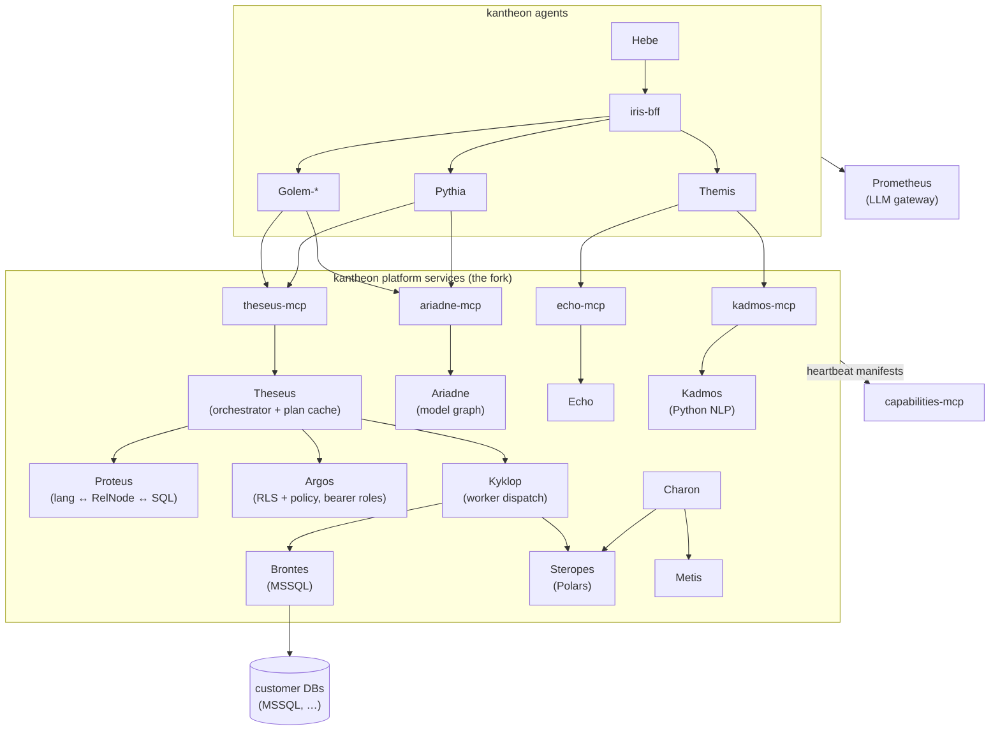

# The Platform Fork — Solution Architecture

> **Status:** v0.1 — written 2026-06-12, the session queued by [`../../implementation/v1/_archive/handover-2026-06-12-aip-migration.md`](../../implementation/v1/_archive/handover-2026-06-12-aip-migration.md). **Decision reframe (Bora, this session):** this is a **fork, not a migration** — copy-paste, not cut-paste. ai-platform stays exactly as it is and keeps running; kantheon copies the intelligent services in, renames them, and becomes a **self-contained new platform**. No bridging, no compatibility facades, no consumers left behind, no Maven inversion.
>
> **Fork point (tagged 2026-06-12):** ai-platform SHA `2575b923dca521fea0e3156257e4b779f02a6ed4` (tag `kantheon-fork-point`, branch `main`). Every fork module's README header cites this SHA + its original ai-platform path.
>
> **Reads with.** [`./contracts.md`](./contracts.md) (the rename map + wire consequences), [`../../implementation/v1/fork/plan.md`](../../implementation/v1/fork/plan.md) (phased plan), [`../kantheon-architecture.md`](../kantheon-architecture.md) §10 (cross-repo coupling — superseded by §9 below), [`../kantheon-security.md`](../kantheon-security.md) (the RLS edge moves in-repo — see §6), [`../charon/architecture.md`](../charon/architecture.md) + [`../metis/architecture.md`](../metis/architecture.md) (the conventions precedent).

---

## 1. What this is

ai-platform's current-line "intelligent" services are forked into kantheon at a recorded commit, renamed into the pantheon, re-packaged under `org.tatrman.*`, and developed here from then on. ai-platform is **maintenance-only** from the fork point: it keeps an untouched copy of everything we fork, plus its legacy ERP-SQL line (sunsetting) — its deployment keeps serving its users until its own retirement, which is not this document's concern.

> **Scope widened 2026-06-13 (Bora): everything comes over.** The original fork left four "technical" services behind (`whois`, `health`, `landing`, `backstage`) on the reasoning that kantheon read the bearer directly and didn't need them. Bora reversed that: the goal is now **one Kantheon with zero remaining relation to the ai-platform repo**, so these four fork in too — under their own names (no personas; they are infrastructure, not constellation citizens). They are documented in **§2.1** and planned in **Phase 5**; the only thing ai-platform keeps that kantheon does *not* fork is the legacy ERP-SQL line (which is sunsetting, not migrating).

**The end state has zero cross-repo coupling.** Kantheon stops consuming ai-platform Maven artifacts (`cz.dfpartner:shared-proto`, `otel-config`, `fuzzy-common`, `ktor-configurator`, `logging-config` — all forked in-repo); the one reverse runtime dependency (ai-platform tools heartbeating into capabilities-mcp) is dropped; no kantheon agent calls an ai-platform endpoint at runtime. The "boundary shift" framing of CLAUDE.md §1 (gradual migration, Charon/Metis as first movers) is superseded — Charon and Metis turn out to have been the first two citizens of the new platform, not exceptions to an old one.

**Fork provenance discipline.** Every forked module records `forked-from: ai-platform@<sha> (<original path>)` in its README header, and ai-platform gets a single tag `kantheon-fork-point` at that commit. Double-maintenance during the overlap is an accepted fork cost: a bug fixed in ai-platform's query-runner does not fix Theseus; the provenance line keeps diffs possible. Copy-paste (no `git filter-repo`) — history stays in ai-platform, reachable via the provenance pointer.

## 2. The roster

New arrivals follow the two-tier naming rule (§8): agents are the speaking gods; platform services are the older figures who serve them.

| ai-platform module(s) | kantheon home | Persona | Why the name | Package root | Language |
|---|---|---|---|---|---|
| `infra/metadata` + `tools/meta-mcp` | `services/ariadne` + `tools/ariadne-mcp` | **Ariadne** | keeper of the thread through the labyrinth — the model graph is the thread every query follows | `org.tatrman.ariadne.v1` | Kotlin |
| `services/query-runner` + `tools/query-mcp` | `services/theseus` + `tools/theseus-mcp` | **Theseus** | takes Ariadne's thread into the labyrinth and brings back the answer | `org.tatrman.theseus.v1` | Kotlin |
| `services/fuzzy-matcher` + `tools/fuzzy-mcp` | `services/echo` + `tools/echo-mcp` | **Echo** | answers with something *close* to what you called — approximate matching incarnate | `org.tatrman.echo.v1` | Kotlin |
| `infra/nlp` + `tools/nlp-mcp` | `services/kadmos` + `tools/kadmos-mcp` | **Kadmos** | brought the alphabet — the language foundation everything reads with | `org.tatrman.kadmos.v1` | **Python** (library moat: spaCy/Stanza/MorphoDiTa) |
| `services/translator` | `services/proteus` | **Proteus** | the shape-shifter: changes the form, preserves the essence | `org.tatrman.proteus.v1` | Kotlin |
| `services/dispatcher` | `services/kyklop` | **Kyklop** | the genus heads the family: the one-eyed forge-master who hands each plan to a named Kyklops kinsman | `org.tatrman.kyklop.v1` | Kotlin |
| `services/validator` **+ `infra/sql-security` (folded in)** | `services/argos` | **Argos** | Argos Panoptes, the hundred-eyed watchman — every query inspected; an eye each for RLS, TopN, column rules (Kerberos was considered and dropped: too known in his other incarnation) | `org.tatrman.argos.v1` | Kotlin |
| `infra/llm-gateway` | `services/prometheus` | **Prometheus** | brings fire (tokens) to all agents | `org.tatrman.prometheus.v1` (renamed from `org.tatrman.llmgateway.v1`) | Kotlin (Spring Boot — forked as-is; Ktor rewrite is not in scope) |
| `workers/mssql` | `workers/brontes` | **Brontes** ("thunder") | the heavy enterprise forge | implements `org.tatrman.worker.v1` | Kotlin |
| `workers/polars` | `workers/steropes` | **Steropes** ("lightning") | fast, in-memory | implements `org.tatrman.worker.v1` | **Python** |

**Arges** ("brightness") — the **Postgres worker** — is now an **active arc** (decided 2026-06-23; the Midas track's trigger fired). `workers/arges`, Kotlin, implements `org.tatrman.worker.v1`, mirrors Brontes; see [`../arges/architecture.md`](../arges/architecture.md) + [`../../implementation/v1/arges/plan.md`](../../implementation/v1/arges/plan.md). Remaining Kyklops bench: Virgil's **Pyrakmon** ("fire-anvil"), Nonnus's **Halimedes** (sea — object-storage/lake), **Euryalos** (wide-roaming — federated), **Elatreus** (hammerer), **Trachios** (rough — raw ingestion).

**Decisions folded into the roster (this session):**

- **Prometheus comes along** — self-containment demands an in-repo LLM path. The PD-11 cost-attribution headers and the tier-routing ask (`aip-v1-gateway-worker-plan.md`, never written) convert from cross-repo asks into kantheon backlog items (see `kantheon-v1.1.md` §5).
- **Argos absorbs sql-security** — the consolidation move: validator + policy engine become one service. The `user_id → whois → roles` resolution hop is **replaced by roles from the forwarded bearer** (`realm_access.roles`), per kantheon-security D3 — one identity mechanism on every hop, and the whois dependency disappears with it. sql-security's legacy SQL-fragment endpoints are *not* forked (they serve the legacy line, which stays behind).
- **Ariadne serves the prompts, not just the model** (decided 2026-06-13) — the consolidation move on the source side. The `DFPartner/ai-models` Git repo holds **both** the metadata model (`model-ttr/<package>/`) **and** the agent prompts (`prompts/{golem,resolver}/`). In ai-platform these load through **two independent mechanisms**: the metadata service polls `model-ttr/`, while each Golem (and Resolver) pod runs its *own* git-fetch client for `prompts/` (golem's `prompt_source.py`, `GOLEM_PROMPTS_GIT_*`), bundled YAML as fallback. Kantheon folds the second loader into the first: **Ariadne owns the whole `ai-models` repo and serves prompts alongside the model** via a `GetPrompts(agent_id, locale)` RPC + an `ariadne-mcp` `get_prompts` tool (contracts §1/§2). Golem and Themis drop their per-pod prompt git-fetch; bundled YAML is demoted to pure offline fallback. One loader, one refresh path, one source of truth — and the "prompts are central" constraint (one prompt set across all Golem instances, per the ai-models README) is enforced in one place. This is the runtime half of the **Shem** = model + prompts (see [`../golem/architecture.md`](../golem/architecture.md) §4.1).
- **Forked as technical services (2026-06-13 scope widening — §2.1):** `infra/whois`, `infra/health`, `frontends/landing`, `infra/backstage`, and the two shared libs whois needs (`whois-common`, and a new `keycloak-auth` extracted from `erp-sql-common`'s self-contained token-provider files).
- **Still not forked:** the entire legacy ERP-SQL line (`erp-sql*`, `sql-*-service`, `sql-metadata`, `sql-validator`, `erp-data-mcp`, `erp-sql-fe`) and the rest of `erp-sql-common` / `erp-sql-metadata` (sunsetting); `agents/golem` and `agents/resolver` (Golem rewrite and Themis already have their own kantheon arcs); `shared/libs/python/aip_security` (golem-only).

### 2.1 Technical services — the fork's second wave (no personas)

These four carry **no mythological name** — they are infrastructure that serves the platform, not speaking citizens of it, and renaming them buys nothing. They keep their directory names; only their package roots move off `infra.*` / `com.platform.*` onto `org.tatrman.*` so that `rg "cz\.dfpartner|com\.platform|infra\."` is clean at the end state (contracts §1). They land under a **new top-level `infra/`** directory (the one structural addition this wave makes) — except `landing`, which is a frontend and joins `frontends/`.

| ai-platform module | kantheon home | What it is | Package root | Language / stack |
|---|---|---|---|---|
| `infra/whois` | `infra/whois` | User/role directory (Keycloak + ERP sync → Postgres) **and OPA bundle server** (`/bundle/{type}/roles.tar.gz`). Forked as a standalone service; an **optional** role-enrichment source for Argos (§6), never an identity authority. | `org.tatrman.whois` (Kotlin pkg; no proto — REST/JSON service) | Kotlin + Ktor + Exposed + Flyway (own Postgres) |
| `infra/health` | `infra/health` | Cluster health-check aggregator (TCP / Prometheus / native probes → roll-up endpoint; the landing page reads it). Self-contained; its only libs (`otel-config`, `ktor-configurator`) are already forked. | `org.tatrman.health` | Kotlin + Ktor |
| `frontends/landing` | `frontends/landing` | Multilingual cluster landing page / service dispatcher (links to dev portal, Grafana, ArgoCD, Traefik, Keycloak). **Rebranded** off "DF Partner AI Platform" → Kantheon. | — (Vue/TS) | Vue 3 + Vite + TS + vue-i18n + Nginx |
| `infra/backstage` | `infra/backstage` | Backstage developer portal (service catalog, TechDocs, scaffolder). **Rebranded** org "DF Partner" → Kantheon; `catalog-info.yaml` files re-pointed at kantheon modules. | — (Node/TS) | Backstage (Node + Yarn) |

**Decisions folded into the technical wave (this session):**

- **whois stays off the data path by default — Argos gains a configurable role source** (§6). The fork's bearer-roles decision (D3 / contracts §3) is *not* reverted: identity always comes from the forwarded bearer via theseus-mcp. whois becomes an **opt-in role-enrichment** strategy for deployments that need the ERP role hierarchy the Keycloak token doesn't carry. Default off — the common case carries no whois dependency.
- **The erp-sql coupling is cut, not dragged.** whois imports four self-contained Keycloak token-provider files (`CachingTokenProvider`, `KeycloakTokenProvider`, `TokenProvider`, `TokenResponse`) from `erp-sql-common.auth` — these have **zero** imports from the rest of erp-sql-common. They fork into a new generic `shared/libs/kotlin/keycloak-auth` lib (renamed off "erp-sql"); the legacy line stays behind. `db-common` (also a whois dep) is already forked (Phase 1.3); `whois-common` (3 domain records) forks alongside.
- **`infra/` is introduced as a top-level directory** for platform infrastructure that isn't a constellation service or a thin MCP wrapper. Backstage, health, and whois live here; this is the only new tree the technical wave adds (`workers/` having been added in Phase 1).

## 3. End-state topology

The pipeline call chain is forked intact: agent → `theseus-mcp` → Theseus → (Proteus parse → Argos validate → Kyklop dispatch → Cyclops execute) → Arrow IPC back. Ariadne stays the hub every service consults for the model graph **and the agent prompts** (the `get_prompts` surface added 2026-06-13 — §2); `plan/v1` stays the canonical RelNode contract — both just change package roots.

## 4. Conventions inherited (nothing new invented)

Forked services adopt the Charon/Metis conventions on arrival, which the fork now makes the *general* rule rather than the precedent:

- **Layout:** logic in `services/` (or `workers/` — the fork introduces the top-level `workers/` directory for `WorkerService` implementations), thin MCP wrappers in `tools/`, `k8s/{base,overlays/local}` per deployable, Kustomize + `imagePullPolicy: Never` locally, Jib for Kotlin / Dockerfile for Python.
- **Python lanes:** Kadmos and Steropes join Metis under the uv + `just build-py/test-py` conventions Metis Phase 1 settles. Three Python modules; the "only Python module" claim in `metis/architecture.md` is amended (see contracts §6).
- **Rule 6:** every forked response message field re-targets the kantheon `common/v1` `ResponseMessage` stand-in at field 99 — which the fork **promotes to canon** (the awaited ai-platform extraction is moot; the v1.1 §1 ledger item closes).
- **Rule 7:** `string argsJson` for function-call args, unchanged.
- **Versioning:** `<dir-name>/v<semver>` tags from v0.1.0 at fork landing; branches `feat/fork-p<n>-s<n.m>-<short>`.
- **Observability:** OTel via the forked `otel-config`; Alloy/Tempo/Prometheus-the-stack unchanged (fabric-infra). (Yes: Prometheus-the-service and Prometheus-the-metrics-store now coexist; metrics config always says "the observability stack", the pantheon name always means the gateway.)

## 5. Proto strategy — one-shot rename at fork time

Because the kantheon copies have **no external consumers**, every forked `cz.dfpartner.*` package renames in the fork commit that lands it — no dual-publish, no deprecation window. Per-service packages go to `org.tatrman.<persona>.v1`; cross-service pipeline packages keep their functional names: `org.tatrman.plan.v1` (canonical RelNode/PlanNode), `org.tatrman.worker.v1`, `org.tatrman.transdsl.v1`, `org.tatrman.dfdsl.v1`. `cz.dfpartner.security.v1` does not survive — its v1 RelNode-based shapes fold into `org.tatrman.argos.v1`. The full old→new map, including gRPC service names and the import-graph consequences (notably `themis/v1`'s `cz.dfpartner.nlp.v1` import becoming `org.tatrman.kadmos.v1`), lives in [`./contracts.md`](./contracts.md).

`org.tatrman.kantheon.*` stays reserved for constellation/agent contracts — platform services never use it.

## 6. Security — the RLS edge moves in-repo

This is the most sensitive part of the fork (the handover flagged it; the fork resolves it more cleanly than a migration would have):

- **IdentityResolver forks into `theseus-mcp`**: Keycloak JWT → `PipelineContext.user_id` / `auth_roles`, exactly as it works at the query-mcp edge today. The OBO rule is unchanged — agents call theseus-mcp with the user's token, never service identity.
- **Argos reads roles from the forwarded bearer by default** — D3 discipline on the data path: one identity mechanism end-to-end, RLS predicates driven by `realm_access.roles` directly. **As of the technical wave (2026-06-13), the role source is configurable** (`argos.roleSource = bearer | whois`, default `bearer`): `bearer` is the behavior above; `whois` additionally calls the forked whois service to **enrich/expand** roles from the ERP role hierarchy, keyed by the `user_id` Argos already trusts from the bearer. The toggle governs *role sourcing only* — identity is still resolved exclusively at the theseus-mcp edge from the bearer, so whois is a role-enrichment source, never an identity authority, and `whois` mode is **not** a revert of D3. Default off means deployments that don't need ERP hierarchy carry no whois dependency and no per-query hop. Contract: contracts §3.
- **`kantheon-security.md` §1 rewrite required** (a fork-plan stage, with its own review): the sentence "ai-platform already resolves identity at the query-mcp edge" becomes "Theseus resolves identity at the theseus-mcp edge"; "the ai-platform Validator's job" becomes "Argos's job". The *principle* (kantheon builds no new authorization engine; the data layer enforces RLS) survives verbatim — only the owner changes from cross-repo to in-repo.
- **Policy content** (the HOCON policy store sql-security reads) forks with Argos; policy authoring stays a Git workflow.

## 7. Deployment & local infra

All forked pods land in the kantheon namespace beside Charon/Metis. `deployment/local` gains what the pipeline needs that kantheon doesn't have yet: **MSSQL** (for Brontes — reuse ai-platform's local-infra manifest), Wiremock fixtures for Prometheus upstream LLMs, and Ariadne's model **and prompt** fixtures (the `ai-models` `model-ttr/` + `prompts/` trees fork as test fixtures; the live deployment polls the Git repo). SeaweedFS/Redis/Keycloak/NATS remain fabric-infra-owned. Persistence: none of the *pipeline* forked services needs a database at v1 (Ariadne and Echo are in-memory from fixtures; Theseus's plan cache is in-process LRU) — the one-Kantheon-PG / DB-per-agent topology (§7.1) is untouched.

**Technical wave (Phase 5) deployment.** whois is the one technical service with a database — it keeps its **own Postgres** (Keycloak/ERP sync tables, Flyway migrations V1–V5), provisioned as a schema/DB in the one Kantheon PG instance (consistent with §7.1; it is infrastructure, not a constellation agent, so it sits beside the agent DBs rather than claiming an agent slot). health is stateless. landing is a static Nginx bundle; backstage runs its own Node backend (port 7007) with the catalog re-pointed at kantheon `catalog-info.yaml` files. Local infra adds Keycloak realm fixtures for whois sync (or Wiremock for the Keycloak/ERP upstreams in CI). Ports for the four are reserved in contracts §7.1 (whois 7110, health 7000 — kept from ai-platform; backstage 7007; landing served by Nginx).

## 8. Naming canon update

The fork settles the naming convention the handover left as a trap ("don't force mythology on services" — overridden by Bora this session):

- **Agents** (the speaking personas): Olympian/oracular figures — Iris, Themis, Pythia, Hebe. Golem stays the deliberate non-Greek exception.
- **Platform services**: the older, chthonic, or heroic figures who serve the gods — Charon, Metis, Ariadne, Theseus, Echo, Kadmos, Proteus, Kyklop, Argos, Prometheus, and the Kyklops in `workers/`.
- **Greek transliterations, not Latin/English forms** (locked 2026-06-12): Kadmos not Cadmus, Argos not Argus, Kyklops not Cyclopes, Pyrakmon not Pyracmon. The taxonomy rule: the dispatcher carries the genus (**Kyklop**), the workers the individual names (**Brontes**, **Steropes**, bench in §2).
- Directory names are the persona, lowercase (`services/argos`); MCP wrappers are `tools/<persona>-mcp`; vocabulary canon (CLAUDE.md §9) gains the rule "use the persona name, not the function name" (Theseus, not "query-runner") once the fork lands — the functional description stays in docs as apposition ("Theseus — the query orchestrator").
- **Technical services are the deliberate exception to the persona rule** (2026-06-13): `whois`, `health`, `landing`, `backstage` keep their plain functional names. They are infrastructure, not gods or the heroes who serve them; forcing a myth onto a health-check aggregator or a Backstage portal would be noise. The rule reads: *constellation services and workers get personas; off-constellation infrastructure keeps its functional name.*

## 9. Cross-repo coupling — end state

> **Independence assertion — ACHIEVED for the pipeline (Phases 1–4, 2026-06-17) AND the technical wave (Phase 5, 2026-06-24). TOTAL.**
> The forked data plane no longer couples to ai-platform in either direction:
> - **Build:** ai-platform Maven/GitHub-Packages consumption removed in Phase 1 (the only standing external Maven dep is the `Collite/modeler` TTR toolchain — not ai-platform; CLAUDE.md §7.3).
> - **Runtime egress:** a repo-wide grep of `*.conf` / `*.yaml` / `*.yml` / `*.properties` / k8s manifests for ai-platform service hosts (`*.ai-platform.svc`, `query-mcp.`/`nlp-mcp.`/`fuzzy-mcp.`/`metadata-mcp.`/`llm-gateway.` hosts) returns **zero** — no kantheon pod dials an ai-platform host. The only residual `ai-platform` / `llm-gateway` strings are **provenance/persona-name comments** (`forked from infra/llm-gateway`), swept for naming in Stage 4.2; none is an endpoint.
> - **Tests:** the full mocked unit/component suite (`just test-all`) passes with **no ai-platform client wired** — every external dependency is mocked in-process.
>
> The live "ai-platform stack down/unreachable, full e2e still green" confirmation is the separate integration-test suite's job (planning-conventions §4). **Total** independence (incl. the technical wave — whois/health/landing/backstage) **landed with Phase 5 (2026-06-24)**: the four technical services are forked in-repo (`infra/{whois,health,backstage}` + `frontends/landing`), their package roots/branding/catalogs swept off ai-platform, so ai-platform can now be switched off entirely.

| Coupling (today) | After the fork |
|---|---|
| Maven: ai-platform publishes shared-proto + 4 libs → kantheon consumes | **Dropped.** Libs and protos forked in-repo; GitHub Packages consumption removed from `libs.versions.toml`; PAT bootstrap step deleted from AGENTS.md |
| Runtime: ai-platform tools heartbeat into capabilities-mcp | **Dropped.** Forked tools heartbeat internally; ai-platform keeps its own untouched stack |
| Runtime: Themis → ai-platform nlp-mcp / fuzzy-mcp | **Swapped** to kadmos-mcp / echo-mcp (Themis switch-over stage, plan Phase 2) |
| Runtime: Charon → ai-platform workers/polars (`WorkerService`) | **Swapped** to Steropes (same proto shape, new package) |
| Planned: Pythia/Golem → ai-platform query-mcp / metadata-mcp | **Re-pointed** (before they're built) to theseus-mcp / ariadne-mcp — pre-flight edits only, arcs stay locked |
| Operational: dev portal / landing / health / identity directory served by ai-platform's `backstage` / `landing` / `health` / `whois` | **Forked** in Phase 5 (technical wave, §2.1) — kantheon serves its own; nothing in kantheon points at an ai-platform-hosted instance of these |

After Phase 4, `rg "cz\.dfpartner" kantheon/` returned nothing for the pipeline. **After Phase 5 (2026-06-24), the independence is total:** no live `com.platform.*` / `infra.{whois,health}` / `infra.erp.sql.common` package root or import survives (the Stage-5.6 sweep verified zero — the only remaining `cz.dfpartner|com.platform|df-partner|ai-platform` strings are provenance headers, guard tests that assert *against* the patterns, the rename-map, and historical doc notes), no kantheon pod opens a connection outside the kantheon + fabric-infra estate, and ai-platform can be retired without breaking a single kantheon path. The one standing external Maven dependency remains the `Collite/modeler` TTR toolchain (CLAUDE.md §7.3) — not ai-platform coupling.

## 10. Impact on locked arcs (slot around, don't reopen)

- **Themis (mid-Stage 2.4):** one added switch-over stage (proto import + endpoint swap + eval re-run). Smallest possible touch; scheduled when fork Phase 2 lands.
- **Iris → Golem → Pythia order unchanged.** Their plans' pre-flights change pointers (query-mcp → theseus-mcp, metadata-mcp → ariadne-mcp); Pythia Phase 4 gains fork-Phase-3 tags as gates alongside `charon/v0.3.0` + `metis/v0.3.0` (same gating idiom).
- **Hebe, Midas:** untouched. Midas's Postgres worker is **Arges**, in `workers/arges` — now an active arc (trigger fired 2026-06-23; gates Midas Phase 3 Stage 3.2). See [`../arges/`](../arges/).
- **Sequencing:** per Bora — **fork first, then develop**: the fork phases run before Iris task-list execution begins. Iris *task-list writing* (pure documentation) may proceed in parallel.
- **Phase 5 (technical wave) is independent of Phases 1–4 and of the constellation arcs.** Only health and the keycloak-auth/whois-common libs touch the build; whois's Argos role-source hook (Stage 5.3) is *additive* to the already-shipped Argos (Phase 3 Stage 3.1 still delivers bearer-only RLS), so it reopens nothing. Phase 5 can run any time after Phase 1 (shared-lib infra exists) and does not gate Iris — but it is the phase that lets ai-platform actually be switched off.

## 11. Risks

> Status as of **2026-06-24** (Phases 1–5 complete — the fork is done).

| Risk | Mitigation | Status |
|---|---|---|
| Fork lands as one unreviewable mega-change | Three build-green waves (plan Phases 1–3), each independently deployable and tagged | **Mitigated** — Phases 1–4 shipped as stacked stage branches, each `test-all`+`lint-all` green |
| Rename sweep misses a `cz.dfpartner` reference and it builds anyway (string-typed lookups, manifest YAMLs, dashboards) | Phase 4 has an explicit `rg`-sweep DONE criterion incl. resources, HOCON, k8s manifests | **Mitigated** — Stage 4.2 T1 sweep: zero live refs; `scripts/verify-forked-proto-layout.sh` guards proto refs in CI |
| Argos fold breaks RLS semantics while nobody is looking | Fork the validator test suite first; bearer-roles rework is TDD'd against the existing policy fixtures; dedicated security-review stage | **Mitigated** — Phase 3 Stages 3.1–3.2 landed Argos + sql-security fold with the forked policy suite green |
| Spring Boot (Prometheus) drags a second JVM stack into the repo | Accepted consciously; forked as-is, no rewrite; revisit only on real pain | **Realized & accepted** — Prometheus forked as-is (Stage 2.5); no rewrite pain to date |
| Python lane (Kadmos, Steropes) lands before Metis settles the conventions | Fork Phase 1 pre-flight: Metis Phase 1 conventions (uv, just recipes, CI lane) must be locked — or fork Phase 1 settles them itself and Metis inherits | **Mitigated** — uv/ruff/pytest + `*-py` recipes settled; Kadmos (2.3) + Steropes (3.4) landed on them |
| Double-maintenance drift during overlap | Provenance headers + `kantheon-fork-point` tag; conscious choice not to backport routinely | **Ongoing (accepted)** — the standing fork cost until ai-platform retires (after Phase 5) |

---

*Doc owner: Bora. Fork decided 2026-06-12; supersedes the "gradual migration" framing of the same date's handover.*
