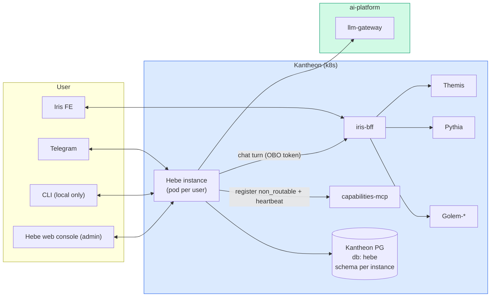
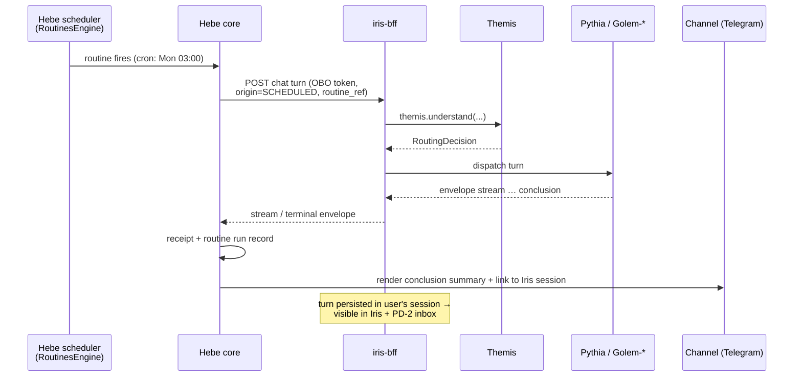

# Hebe — Kantheon Integration Architecture

> **Status:** draft v0.1 — locked decisions from the 2026-06-12 integration session.
>
> **Companion docs:**
> - [`contracts.md`](./contracts.md) — wire contracts, PG schema, config/profile schema, manifest YAML.
> - [`standalone-v1-architecture.md`](./standalone-v1-architecture.md) — the wiring diagram of the code as moved in (kernel ABI, plugin ABI, SQLite schema, tool dispatcher, boot sequence). This doc describes the *delta* to make Hebe a Kantheon citizen; the standalone doc remains the reference for Hebe's internals.
> - Design records: [`/docs/design/hebe/`](../../design/hebe/) (brainstorming, features, blueprint, standalone v1 scope).
> - Plan: [`/docs/implementation/v1/hebe/plan.md`](../../implementation/v1/hebe/plan.md).
> - Product motivation: PD-2 / PD-10 in [`/docs/design/product-design-issues.md`](../../design/product-design-issues.md).

---

## 1. What Hebe is in the constellation

Hebe (cup-bearer) is the **personal autonomous agent**: a per-user agent with its own memory, scheduler, security posture, and messaging channels. In Kantheon it plays a role no other agent plays — it is a **client of the constellation, not a question-answerer within it**:

- **It is never routed to.** Themis must never choose Hebe to answer an analytical question. Hebe registers in capabilities-mcp with `non_routable = true` (field added 2026-06-12).
- **It initiates turns on the user's behalf.** Hebe's scheduler fires a routine → Hebe calls **iris-bff** (never Pythia/Golem directly) with an on-behalf-of token → the turn flows through Themis routing like any user turn → results land in the user's Iris session and the PD-2 investigation inbox.
- **It delivers out-of-band.** When the scheduled run concludes, Hebe pushes the conclusion through its channels (Telegram first). This is the resolution of PD-10 layer 3 ("run this RCA every Monday at 3AM and message me") and the notification path noted in PD-2.

Hebe is **per-user**, like Golem is per-Shem: many instances of one codebase. Unlike Golem (config-only instantiation), a Hebe instance also owns mutable state (memory, receipts, routines) — hence the schema-per-instance model in §5.

## 2. Deployment profiles — axes first, presets second

Hebe runs in four deployment worlds and must stay first-class in all of them. The standalone thesis ("a single human runs `hebe run` on their machine") is preserved at one end; a pod inside the platform sits at the other; two useful midpoints fill the gap. **The four profiles are not a four-valued enum** — they are **named presets over a set of orthogonal axes**. Each subsystem reads its own axis, never `when(profile)`; the profile name only selects a *bundle of axis defaults*, and any axis remains individually overridable. This keeps us out of the combinatorial trap (the next deployment shape — air-gapped enterprise box, multi-tenant host — is a new preset, not a code sweep) and preserves the standing invariant that no profile introduces a dead code path.

The four presets:

- **`local`** — PC/notebook, run in isolation. SQLite, BYOK direct LLM, **no platform access at all**. Filesystem persistent (memory files, receipts log live on disk). The standalone experience, unchanged.
- **`personal`** — PC/notebook, but a **client of the platform**: LLM-gateway + the full Kantheon (iris-bff). SQLite, filesystem persistent. Defining trait: the host **goes away** — lid closes, network drops — so it must tolerate the platform being unreachable and catch up afterward (§7.1).
- **`server`** — a dedicated always-on box (VPS, home server). **External** PG for db; full platform access over the public ingress; filesystem persistent. Stable, rarely switched off. The cheapest "real" deployment: one binary + one PG, no K3s.
- **`k8s`** — a pod **inside** the platform. Talks to AI services in-cluster; PG db; **ephemeral filesystem** — all durable state must live in PG. One pod per instance.

### 2.1 The axes

| Axis | `local` | `personal` | `server` | `k8s` |
|---|---|---|---|---|
| `db.backend` | sqlite | sqlite | postgres (external) | postgres (in-cluster) |
| `fs.durability` | persistent | persistent | persistent | **ephemeral** |
| `platform.reach` | none | remote (ingress) | remote (ingress) | in-cluster |
| `platform.availability` | — | **intermittent** | always | always |
| `llm.source` | byok | **gateway + byok fallback** | gateway | gateway |
| `platform.identity` (OBO to iris-bff) | none | keycloak | keycloak | keycloak |
| `console.auth` | password | password | oidc | oidc |
| `secrets` | keychain | keychain | file / keychain | k8s secret |
| `memory.backend` | sqlite (FTS5 + sqlite-vec + RRF) | sqlite | postgres (`tsvector` + pgvector + RRF) | postgres |
| `workspace.backend` | files | files | **files** (FS persists) | **postgres** (FS ephemeral) |
| `receipts.backend` | file (NDJSON hash-chain) | file | **file** | **postgres** (V7 table) |
| `otel` | off | off / local | on | on |
| `capabilities.register` | off | optional | on | on |
| `tools.posture` | full | full | full / restricted | restricted |
| `channels` | cli + web + tg | cli + web + tg | web + tg (+ cli) | web + tg |
| `packaging` | shadowJar + `hebe.sh` | shadowJar | shadowJar + systemd unit | Jib image + Kustomize pod |
| migrations | Flyway → SQLite file | Flyway → SQLite file | Flyway → instance schema | Flyway → instance schema |

Two axis relationships are load-bearing and worth stating outright:

- **`fs.durability` — not the profile — decides whether workspace + receipts must move into PG.** Only `ephemeral` (k8s) forces the PG `workspace_files` (§5.3) and `receipts` (contracts §4.3) tables. `server`, despite running PG for the db, keeps the **human-editable file workspace** and the **NDJSON hash-chained receipts log** because its disk persists. This is the `db = postgres` + `fs = persistent` combination the old binary switch could not express; the `WorkspaceStore` / `MemoryStore` seams already accommodate it.
- **`platform.identity` follows `platform.reach`, not the profile.** Any profile that reaches the platform (`personal`, `server`, `k8s`) needs a real Keycloak OBO identity to call iris-bff; only `local` is Keycloak-free. This corrects the earlier "Keycloak in k8s only" framing (§6).

### 2.2 Profile principles

1. **Axes, not branches.** Subsystems read axis values (`db.backend`, `fs.durability`, `platform.reach`, …); the profile is a default bundle resolved once at boot. `profile = "local" | "personal" | "server" | "k8s"` in `config.toml` (overridable by `HEBE_PROFILE`); any individual axis still overridable. Configure heavily, hardcode nothing.
2. **No dead code paths.** Every backend of every seam (`MemoryStore`, `WorkspaceStore`, `ReceiptsStore`, secrets, auth, LLM source) is real, tested code, selected by an axis. The seams already exist in the standalone design — the profile work is axis plumbing + the offline-tolerance machinery (§7.1), not re-architecture.
3. **Static expectation vs. live reality.** `platform.availability` is a *config expectation* (does this host plan to be always-on?). It is distinct from the **runtime connectivity signal** — a circuit-breaker/probe that knows whether the platform is reachable *right now* (§7.1). The profile sets posture; the breaker handles facts.
4. **`hebe doctor` is axis-aware.** It verifies exactly the dependency set the resolved axes need — `local`: LLM endpoint + keychain + writable data dir; `personal`: same + gateway/Keycloak/iris-bff reachability *probed, not required* (degraded ≠ failed); `server`/`k8s`: PG + schema, Keycloak token mint, gateway, capabilities-mcp, iris-bff health.

## 3. Position in the constellation

The diagram shows the `k8s` topology (Hebe in-cluster). `personal`/`server` are the same edges with `platform.reach = remote`: Hebe runs outside the cluster and reaches iris-bff + llm-gateway over the **public ingress** (TLS, OBO bearer) rather than in-cluster service URLs; `personal` additionally routes those two edges through the outbox/breaker of §7.1. `local` has none of the right-hand edges.

Key edges:

- **Hebe → iris-bff is the only path into the analytical constellation.** Hebe never calls Themis, Pythia, Golem, query-mcp, or metadata-mcp directly. Rationale: scheduled turns must land in the user's conversation surface (session log, PD-2 inbox, audit trail) exactly like interactive turns; iris-bff is where that surface lives. See [`contracts.md`](./contracts.md) §3 for the turn-origin marker this requires on the Iris side.
- **Hebe → llm-gateway** for its own reasoning loop (k8s profile). Hebe's agent loop is independent of the constellation's — it reasons about *routines, memory, and message handling*, not about analytics.
- **Hebe → capabilities-mcp** registration is presence-and-discovery only (Pythia and Iris can see Hebe exists, e.g. for future notification fan-out); `non_routable = true` keeps it out of all four Themis routing layers.

## 4. Module and package alignment

### 4.1 Packages

- Kotlin code: `com.hebe.*` → **`org.tatrman.kantheon.hebe.*`** (matches Themis's pattern: code and proto share the root).
- Protos: **`org.tatrman.kantheon.hebe.v1`** under `shared/proto/src/main/proto/org/tatrman/kantheon/hebe/v1/`. Hebe is an agent, so it takes the constellation root — `org.tatrman.<service>.v1` stays reserved for migrated platform-grade services (Charon, Metis).

### 4.2 Gradle — full merge (decision 2026-06-12)

Hebe's standalone build (own `settings.gradle.kts`, `build-logic/`, version catalog, Gradle wrapper) **merges fully into the kantheon root build** — no `includeBuild` half-step:

- Modules become `:agents:hebe:modules:api`, `:agents:hebe:modules:core`, … (all 21).
- Hebe's `gradle/libs.versions.toml` entries merge into kantheon's central catalog; version conflicts resolve to kantheon's pin unless Hebe has a hard requirement (then kantheon bumps). Kotlin version: kantheon's canon wins.
- Hebe's `build-logic/` convention plugins retire in favour of ai-platform's published build-convention plugins; Hebe-specific build logic that has no kantheon equivalent (e.g. the shadowJar packaging for the local binary) moves into the module build files or a kantheon-side convention plugin.
- `modules/detekt-rules` (the mutation-funnel guard — every state change must flow through `ToolDispatcher.dispatch`) **survives** and wires into kantheon's lint pipeline. It is Hebe's most valuable invariant; keep it enforced.
- Hebe's `justfile` recipes fold into kantheon's root `justfile` (`just build hebe`, `just deploy hebe`, `just hebe-run-local`).
- CI: kantheon's `ci.yml` auto-detects Jib modules — Hebe's `cli-app` keeps shadowJar for the local artifact *and* gains Jib for the k8s image.

### 4.3 What is deliberately NOT consolidated

- **Hebe's agent-level security stays.** Autonomy levels, approval gates, and the tamper-evident receipts log are orthogonal to platform auth (Keycloak) and remain in both profiles. The receipts log is a working prototype of the constellation's PD-8 audit / PD-9 provenance direction — flatten it later *into* the constellation design, not out of Hebe.
- **The web console stays.** It is the *admin-of-Hebe* surface (routines, receipts, autonomy settings, plugin management); Iris is the Kantheon user surface. No merge.
- **The plugin system (PF4J + OCI) stays.** Constellation-internal tools come via capabilities-mcp; Hebe plugins are personal extensions, a different axis.
- **Koog usage stays behind the `KoogLlmProvider` adapter** — same isolation rule the standalone design already enforces.

## 5. Storage architecture

### 5.1 One Kantheon PG, one database per agent, schema-per-instance for Hebe

Platform decision (2026-06-12): Kantheon runs **one internal Postgres instance**; each agent gets **its own database** (`iris`, `pythia`, `golem`, `midas`, `hebe`). Because Hebe is multi-instance, the `hebe` database is **schema-split**: one schema per Hebe instance — `hebe_<instance_id>` (e.g. `hebe_bora`). This mirrors how Golem is config-split per Shem, applied to the persistence layer.

- Provisioning a new instance = create schema + run Flyway against it + issue instance config + K8s Secret (see [`contracts.md`](./contracts.md) §4).
- Flyway migrations are written once and applied per-schema (`flyway.schemas=hebe_<id>`); the migration set is shared by all instances.
- Connection pool per pod, `search_path` pinned to the instance schema. No cross-schema queries, ever — instance isolation is a hard rule.
- Kantheon's Exposed-DSL + Flyway convention applies to the new PG backend code.

### 5.2 Dual memory backend (decision 2026-06-12)

The `MemoryStore` trait keeps two implementations:

| | SQLite (`local`) | Postgres (`k8s`) |
|---|---|---|
| Full-text | FTS5 | `tsvector` + GIN index |
| Vector | sqlite-vec | pgvector (`vector` column + HNSW) |
| Fusion | Reciprocal Rank Fusion, k₀ = 60 | identical RRF, same k₀ — **semantics contract: same corpus + same query ⇒ same ranking** (golden-fixture tested) |
| Schema | as standalone §5 | port of the same logical schema (see [`contracts.md`](./contracts.md) §4) |

The RRF parity test is the gate for the PG backend: a fixture corpus with expected rankings runs against both backends in CI.

### 5.3 Workspace + receipts: backend follows `fs.durability`, not the profile

The driver is the **`fs.durability`** axis, not the profile name. Where the disk persists (`local`, `personal`, `server`), workspace stays as files (`~/.hebe/workspace/`) and receipts stay as the NDJSON hash-chained log (standalone §13) — the human-editable, no-PVC story. Only `ephemeral` (k8s) forces both into PG:

- The markdown workspace (`MEMORY.md`, `IDENTITY.md`, `HEARTBEAT.md`, `daily/*.md`) becomes a `workspace_files` table in the instance schema (path, content, updated_at, revision); the `WorkspaceStore` seam in `modules/memory` carries file-system and PG implementations.
- The receipts log becomes the PG `receipts` table (contracts §4.3) behind a `ReceiptsStore` seam, same hash-chain + Ed25519 algorithm; the signing key moves from `secrets.db` to the instance's K8s Secret.

Consequence: `server` runs PG for the db **and** keeps file workspace + file receipts — the combination the old binary switch couldn't express. Trade-off, narrowed: file-watching / manual editing of workspace files is available on every persistent-FS profile (`local`/`personal`/`server`); only on `k8s` is the web console the sole editing surface.

## 6. Security model — two independent auth concerns

The earlier "Keycloak in k8s only" framing was wrong once `personal` and `server` also became platform clients. Auth splits into two orthogonal concerns, each on its own axis:

- **`console.auth`** — how the human logs into Hebe's *own* admin console: `password` + OS keychain (`local`, `personal`) or OIDC (`server`, `k8s`).
- **`platform.identity`** — how Hebe authenticates *outbound* to iris-bff. Needed by **every** profile with `platform.reach != none` (`personal`, `server`, `k8s`); only `local` is Keycloak-free.

Three layers, separated on purpose:

1. **Platform identity — Keycloak (any platform-reaching profile).** Each Hebe instance is bound to exactly one Keycloak user at provisioning. Outbound iris-bff calls use the **on-behalf-of flow** — the turn arrives carrying the user's identity, so Themis routing, future PD-8 authorization filtering, and the audit trail all see the real user, not a service account. On `personal`/`server` the OBO grant is obtained via device-code + cached refresh token against the public Keycloak; on `k8s` it is the in-cluster client-credentials → OBO exchange. The bound-user model is identical across all three.
2. **Channel identity mapping.** Telegram chat-id ↔ Keycloak user mapping is part of instance config; a message from an unmapped chat-id is rejected before it reaches the loop. (`local` keeps today's allowlist.)
3. **Agent-level security — Hebe's own.** Autonomy levels, approval gates, receipts: unchanged across all profiles, applied *after* platform auth. Tool posture per the `tools.posture` axis (§2); receipts record the active profile and instance id.

Open coupling to PD-8: when the constellation authorization doc lands, Hebe's OBO token simply inherits it — no Hebe-side changes expected. That is the payoff of routing through iris-bff.

## 7. The scheduled-investigation flow (the product loop)

Design points:

- The scheduled turn is a *real* turn in a *real* session (a dedicated per-routine session, named after the routine). Re-running weekly appends turns to the same session — the user gets investigation history for free.
- Hebe consumes the same SSE stream Iris's FE would; for long Pythia runs Hebe is a patient client (it has no human waiting). `AWAITING_*` pause states are delivered to the user as channel messages with a link into Iris to answer — Hebe does not attempt to answer clarifications itself in v1.
- Failure handling: stream error or timeout → receipt + retry per routine policy → notification of failure (never silent).
- The envelope→Telegram rendering is intentionally minimal in v1: conclusion text blocks + counts of tables/charts + deep link into the Iris session. No chart rendering in Telegram.

### 7.1 Offline tolerance — the `personal` profile's defining machinery

`local` never touches the platform; `server`/`k8s` assume it is always up. **`personal` is the one profile where the host disappears mid-flight** — the lid closes at 02:55, the cron was due at 03:00, the network is on a train. This is the only part of the four-profile expansion that is *new engineering* rather than axis plumbing, and it rests on three mechanisms gated by `platform.availability = intermittent` (none of them harm the always-on profiles, so they stay enabled there too, just rarely exercised):

1. **Durable scheduler with missed-trigger catch-up.** Today's loop fires on `jobs(status='pending', trigger_at <= now)` but has no notion of a fire that was *owed while the process was down*. The scheduler gains a catch-up policy per routine — `run_once_on_wake` (default for `kantheon_question`), `run_all_missed`, or `skip` — evaluated on boot against `next_run_at` in the past. Coalescing avoids a thundering herd of catch-up runs after a long sleep.
2. **Outbox (store-and-forward).** The iris-bff turn dispatch and the channel deliveries become durable queue rows, not synchronous calls. A routine that fires offline enqueues its turn; the outbox drains when connectivity returns. Delivery of a conclusion the user wasn't online to receive is likewise queued. This makes the §7 flow asynchronous at two seams (H→I and H→C) without changing its shape.
3. **Runtime connectivity probe / circuit-breaker.** Distinct from the static `platform.availability` axis: a breaker tracks whether llm-gateway and iris-bff are reachable *now*. Open breaker ⇒ outbox holds, doctor reports *degraded* (not failed), and the LLM source falls back per the rule below. Half-open probes restore flow.

**LLM fallback on `personal` (`llm.source = gateway + byok fallback`).** When the gateway is unreachable, the split is by *what is reasoning*:

- **Hebe's own reasoning routines** (heartbeat, summariser, fact-extract, an ad-hoc local chat) **fall back to a configured BYOK model** — Hebe stays useful offline for its personal-assistant duties.
- **Constellation turns** (`kantheon_question` via iris-bff) **cannot fall back** — they need the platform — so they **defer via the outbox** and catch up when the breaker closes. Never silent: the user gets a "queued, will run when reconnected" channel note.

`server`/`k8s` set `llm.source = gateway` with no fallback (the gateway is part of their always-on contract); `local` is `byok` with nothing to fall back *from*.

## 8. Observability

Driven by the `otel` axis. `otel = on` (`server`/`k8s`): ai-platform `otel-config` (`createOpenTelemetrySdk()`), Alloy collector, JSON logs to Loki, traces to Tempo. Hebe's existing `observability` module becomes a thin adapter over `otel-config` rather than its own plumbing. Spans: routine fire → iris-bff turn → delivery, linked to the constellation trace via W3C context propagation on the iris-bff call (one trace from cron tick to Pythia conclusion). `otel = off` (`local`, `personal` default): OTel off, human-readable or JSON logs only — zero collector dependency. `personal` may opt into a local OTLP endpoint without otherwise changing posture.

## 9. Build / test / deploy flow

- `just init` → kantheon root init now also builds Hebe modules.
- `just test` → Hebe Kotest suites run in the kantheon pipeline; PG-backend tests use Testcontainers Postgres (kantheon convention) — note this overrides Hebe's standalone "no testcontainers" rule; H2 is not acceptable for pgvector/tsvector paths.
- `just build hebe` → shadowJar (local artifact); `just deploy hebe` → Jib → K3s.
- Versioning: `hebe/v<major>.<minor>.<patch>` tags, starting `hebe/v0.1.0` at Phase 1 close (see plan).
- CI gates: lint (incl. detekt mutation-funnel rule), unit + component tests both profiles' seams, RRF parity golden test, proto-compat check once `hebe/v1` lands.

## 10. Open questions

| # | Question | Leaning |
|---|---|---|
| O-1 | **Telegram bot topology for multi-instance:** one bot token per instance (simple, N BotFather registrations) vs one shared bot + chat-id→instance routing layer (operationally nicer, needs a router component) | Per-instance token in v1; shared-bot router is a v1.x operability improvement |
| O-2 | **Instance provisioning automation:** manual runbook (schema + secret + manifest by hand) vs `hebe-operator`/provisioner job | Manual runbook in v1 (instances are few); revisit when instance count grows |
| O-3 | **Scheduled turns against which agent set during rollout:** Pythia is the target but its arc lands third. Do scheduled *Golem questions* ship first (works as soon as iris-bff + Golem are live)? | Yes — Phase 4 demo targets a scheduled Golem question; investigation flow lights up when Pythia ships, no Hebe-side change |
| O-4 | **Does Hebe's mcp-server expose constellation data?** (e.g. an IDE asking Hebe about investigation results) | Out of scope v1; revisit with PD-15 (sharing) |

## 11. Resolved decisions — quick reference

| Decision | Locked | Notes |
|---|---|---|
| Hebe lives at `agents/hebe`; source moved from `~/Dev/hebe` | 2026-06-12 | Original repo keeps git history |
| Code pkg `org.tatrman.kantheon.hebe.*`; protos `org.tatrman.kantheon.hebe.v1` | 2026-06-12 | Matches Themis pattern; service root reserved for Charon/Metis-class migrations |
| ~~Two profiles `local`/`k8s`~~ → **four profiles `local`/`personal`/`server`/`k8s` as presets over orthogonal axes** | 2026-06-13 | Axes (db, fs.durability, platform.reach/availability, llm.source, identity, console.auth, secrets, otel, posture, channels, packaging); profile = default bundle, every axis overridable; no `when(profile)` branches |
| `fs.durability` (not the profile) decides PG workspace/receipts | 2026-06-13 | Only `ephemeral` (k8s) forces PG; `server` runs PG db + **file** workspace + **file** NDJSON receipts |
| `personal` offline tolerance: durable scheduler + catch-up, outbox, runtime circuit-breaker | 2026-06-13 | Gated by `platform.availability = intermittent`; the one piece of new engineering (§7.1) |
| `llm.source = gateway + byok fallback` on `personal` | 2026-06-13 | Hebe's own routines fall back to BYOK offline; constellation turns defer via outbox (never silent) |
| Dual memory backend: SQLite (`local`/`personal`), PG (`server`/`k8s`), behind `MemoryStore` | 2026-06-12 | RRF parity golden-tested |
| One Kantheon PG; DB per agent; `hebe` DB schema-per-instance | 2026-06-12 | `hebe_<instance_id>`; Flyway per schema; `server` uses an **external** PG, same schema model |
| Keycloak/OBO for **any** platform-reaching profile (`personal`/`server`/`k8s`); `console.auth` split from `platform.identity` | 2026-06-13 | Corrects "Keycloak in k8s only"; only `local` is Keycloak-free |
| No OTel in `local` (optional/local in `personal`) | 2026-06-12 | `server`/`k8s` use ai-platform `otel-config` |
| `non_routable = true` registration; `AgentKind.PERSONAL_ASSISTANT` | 2026-06-12 | Proto field 16 added to `AgentCapability` |
| Hebe calls iris-bff, never Pythia/Golem/Themis directly | 2026-06-12 | Scheduled turns land in session + PD-2 inbox |
| Iris and Hebe web console stay separate | 2026-06-12 | Console = admin-of-Hebe; Iris = Kantheon UI |
| Full Gradle merge into kantheon root build (no includeBuild step) | 2026-06-12 | Catalog merged; hebe build-logic retires; detekt-rules survives |
| Hebe docs migrated into three-area structure | 2026-06-12 | Design records + standalone v1 architecture + M0–M10 history relocated |

---

*Doc owner: Bora. Part of the Hebe integration arc; update on every load-bearing decision.*
