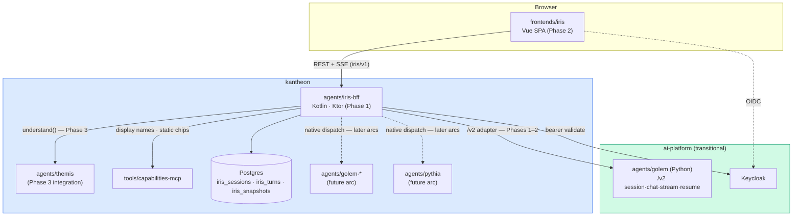

# Iris — Solution Architecture (kantheon arc, Phases 1–3)

> **Scope.** Kantheon-side architecture for the Iris arc: the `agents/iris-bff` dispatch BFF (Kotlin + Ktor), the `frontends/iris` Vue SPA (extracted from `ai-platform/frontends/agents-fe`), the constellation-wide `envelope/v1` proto (defined in this arc, consumed by every agent), and the `iris/v1` session + streaming contract.
>
> **Reads with.** [`../../design/iris/iris-design.md`](../../design/iris/iris-design.md) (outward design; see the 2026-06-12 reality note — FE source is agents-fe, not `golem/frontend/`), [`../kantheon-architecture.md`](../kantheon-architecture.md) §2/§7/§8, [`./contracts.md`](./contracts.md) (wire contracts), [`../../implementation/v1/iris/plan.md`](../../implementation/v1/iris/plan.md) (phased plan), [`../themis/contracts.md`](../themis/contracts.md) §1.2–1.3 (Themis routing types + RoutingPickChip).
>
> **Pattern references.** `ai-platform/EXAMPLES.md` for Ktor / serialization / OTel patterns; `ai-platform/frontends/agents-fe/` is the living FE reference until extraction.

## 1. Architectural goal

Bring the constellation's conversation surface live in kantheon. Three deployable outcomes, in order:

1. **Phase 1:** `agents/iris-bff` running in local K3s — session persistence in Postgres, SSE stream multiplexing, dispatching to today's `ai-platform/agents/golem` (Python, `/v2` contract) via a **transitional adapter**. `envelope/v1` and `iris/v1` protos defined; `envelope-ts` generated.
2. **Phase 2:** `frontends/iris` extracted from `ai-platform/frontends/agents-fe` via `git filter-repo`, consuming the BFF instead of new-golem's `/v2` endpoints directly; `envelope-ts` bindings replace the hand-written `types/envelope.ts`.
3. **Phase 3:** Routing UX live — BFF calls `themis.understand()` per turn, `RoutingPickChip` flow round-trips, typed actions + edit-and-resend + entity context migrate onto the BFF. Co-designed with Themis Phase 3 Stage 3.6.

**The load-bearing transitional decision:** Iris ships *before* the Kotlin Golem exists. The BFF's `AgentDispatcher` therefore has a `GolemV2Client` speaking today's Python `/v2` contract (session/chat/stream/resume) and translating it onto `IrisStreamEvent`/`FormatEnvelope`. When the Kotlin Golem and Pythia land, they plug in as native clients; the `/v2` adapter is deleted at cutover. This makes the Iris arc independently shippable and gives the Golem rewrite a stable consumer to cut over against.

## 2. Tech stack

| Layer | Choice | Why |
|---|---|---|
| BFF language / framework | **Kotlin 2.x + Ktor 3.2.x** | Constellation-wide; Ktor version pinned by the Koog 0.8 spike outcome |
| BFF persistence | **Postgres + Flyway + jOOQ** | Mirrors the Midas-core stack decision — one DB-access idiom across kantheon services |
| Wire | **protobuf 3** (`envelope/v1`, `iris/v1`) over REST + SSE | Wire policy: proto is source of truth even on REST; tested against proto in CI |
| FE framework | **Vue 3.5 + TypeScript 5.9 + Vite 7** | Carried verbatim from agents-fe |
| FE state / UI | **Pinia 3, PrimeVue 4, dockview-vue 5, Tailwind 3** | Carried from agents-fe |
| FE charts / markdown | **Vega-Lite 5 (vega-embed), markdown-it + mermaid** | Carried from agents-fe; Vega-Lite-everywhere decision (Pythia OQ-8) |
| FE i18n / auth | **vue-i18n (cs + en), keycloak-js + oidc-client-ts** | Carried from agents-fe |
| Streaming | **SSE over POST + ReadableStream** (not EventSource) | agents-fe pattern; custom event names |
| Test stack | **Kotest + Testcontainers + Wiremock (BFF); Vitest + @vue/test-utils (FE)** | ai-platform pattern |
| Observability | **OTel** via `cz.dfpartner:otel-config` (BFF); OTel web SDK (FE, carried) | ai-platform pattern |
| Container | **Jib** (BFF); **nginx static image** (FE) | ai-platform pattern |

## 3. Module map — what gets created or moved

### 3.1 In kantheon (new or extracted)

```
kantheon/
├── agents/
│   └── iris-bff/                            # NEW — Phase 1
│       ├── src/main/kotlin/org/tatrman/kantheon/iris/bff/
│       │   ├── App.kt
│       │   ├── api/                          # ChatRoutes, SessionRoutes, ActionRoutes, HealthRoutes
│       │   ├── conversation/                 # SessionStore, ConversationExcerpt, EntityContext, Snapshot
│       │   ├── routing/                      # ThemisClient (Phase 3)
│       │   ├── dispatch/                     # AgentDispatcher, GolemV2Client (transitional),
│       │   │                                 #   GolemClient + PythiaClient (later arcs)
│       │   ├── stream/                       # IrisStreamMux, EnvelopeForwarder
│       │   ├── capabilities/                 # CapabilitiesReadClient wrapper (display names, static chips, /discover cards)
│       │   ├── inbox/                        # Phase 4: inbox aggregation, NATS lifecycle subscriber (PD-2)
│       │   ├── artifacts/                    # Phase 4: pins & dashboards, refresh orchestration (PD-6)
│       │   ├── audit/                        # iris_audit chain writer + verify (PD-8; from Phase 1, D6)
│       │   ├── feedback/                     # Phase 4: turn feedback + eval export (PD-3)
│       │   └── auth/                         # Keycloak bearer validation; bearer forwarding (OBO rule, security §2)
│       ├── src/main/resources/{application.conf, db/migrations/}
│       ├── src/test/kotlin/
│       ├── k8s/{base,overlays/local}/
│       └── build.gradle.kts
│
├── frontends/
│   └── iris/                                # EXTRACTED in Phase 2 from ai-platform/frontends/agents-fe
│       └── (agents-fe tree, re-pointed: services/irisStream.ts, services/typedAction.ts,
│            generated envelope bindings from shared/libs/ts/envelope-ts)
│
├── shared/
│   ├── proto/src/main/proto/org/tatrman/kantheon/
│   │   ├── envelope/v1/envelope.proto        # FULL definition lands here (Phase 1 Stage 1.1);
│   │   │                                     #   Themis Phase 3 contributed RoutingPickChip only
│   │   └── iris/v1/iris.proto                # NEW — session, turn, stream events
│   └── libs/
│       └── ts/envelope-ts/                   # NEW — generated TS bindings + FormatRenderer helpers
```

### 3.2 In ai-platform (touched, not moved)

- `frontends/agents-fe/` — source of the Phase 2 `git filter-repo` extraction. Stays running against new-golem `/v2` until Iris Phase 2 cutover; retires with the old stack at constellation cutover (kantheon-architecture §11 waypoint 8).
- `agents/golem/` (new-golem v2, Python) — **not modified**. The BFF's `GolemV2Client` consumes its existing `/v2` surface read-only. Retires after the Golem-rewrite arc's cutover.

### 3.3 Out of scope (named because adjacent)

- `agents/golem/` Kotlin rewrite — separate arc ([`../golem/architecture.md`](../golem/architecture.md)). This arc only defines the `envelope/v1` types Golem will emit.
- `agents/pythia/` — separate arc ([`../pythia/architecture.md`](../pythia/architecture.md)). The `IrisStreamEvent` variants reserve event kinds for investigation streams. *(The investigation **inbox + hypothesis-tree pane** are NOT out of scope — they are this arc's Phase 4 Stage 4.1, per PD-2.)*
- ~~Iris dashboard system — Midas arc Phase 3 concern~~ **superseded by PD-6 (2026-06-12): the generic artifact system is this arc's Phase 4 Stage 4.2; Midas supplies templates + content.**
- `agents/sysifos-bff` — forms-shaped sibling; Midas arc. The `bff-base` shared-lib extraction happens there, *after* iris-bff exists (extract-on-second-use rule).

## 4. Component diagram



## 5. Module dependency graph

Build order: `shared/proto` (envelope/v1 + iris/v1) → `shared/libs/ts/envelope-ts` → `agents/iris-bff` → `frontends/iris`.

- `agents/iris-bff` depends on: kantheon proto bindings (`envelope/v1`, `iris/v1`, `common/v1`, `themis/v1` for dispatch, `capabilities/v1` via `capabilities-client`), ai-platform Maven libs (`ktor-configurator`, `otel-config`, `logging-config`). **Note:** the MCP/Ktor server base lives in `ktor-configurator` — `mcp-server-base` does not exist as a published artifact (older docs that name it are wrong; corrected 2026-06-12).
- **Runtime dependencies added by Phase 4 / the audit chain (cohesion review 2026-06-12):** **NATS JetStream** — subscriber on `pythia.lifecycle.{user_id}` for the inbox stream (degrades to polling when down; `iris.nats.*` config); **Ed25519 signing key** — `iris_audit` chain signature, mounted from a K8s Secret (`iris.audit.signing-key-ref`); **Pythia REST** — inbox aggregation + control-endpoint proxy (`iris.pythia.*`). Local-infra implication: NATS reachable from the BFF (`deployment/local` infra stage, kantheon-architecture §7.1).
- `frontends/iris` depends on: `shared/libs/ts/envelope-ts` (generated via `just proto`). No other cross-module TS deps.
- No kantheon module depends on `iris/v1` except the BFF and FE — deliberate (kantheon-architecture §4): agents never see Iris's wire.

## 6. BFF internals

### 6.1 Session model

Implements kantheon-architecture §7 verbatim: `IrisSession { entity_context, snapshots, turns: [TurnPointer] }`, persisted in Postgres (DDL in [`contracts.md`](./contracts.md) §4). The BFF owns **`current_display`** (the user's rendering choices — column visibility, chart-type swaps); the producing agent owns **`current_view`** (which dataset the conversation is about). This pins the open question from `iris-design.md` §10 — decision locked 2026-06-12.

During the transitional period, `TurnPointer.artifact_ref` for `/v2` turns stores the new-golem `bubble_id`/`thread_id` pair; the full envelope is additionally snapshotted into `iris_turns.envelope_json` so conversation history survives new-golem retirement. Native agents (Golem-Kotlin, Pythia) persist their own artifacts and the BFF stores only the pointer — the snapshot column becomes a fallback cache.

### 6.2 Turn dispatch — transitional vs target

```
Phase 1–2 (no Themis routing):                Phase 3+ (routing live):
SPA → BFF /chat/stream                        SPA → BFF /chat/stream
BFF builds conversation_excerpt               BFF builds conversation_excerpt
BFF → GolemV2Client (only target)             BFF → themis.understand(CHAT_QUICK, routing_hint?)
   /v2/chat/stream                              ├─ needs_user_pick → RoutingPickChips → reissue
golem v2 SSE → IrisStreamEvent mapping          └─ chosen_agent_id → AgentDispatcher
SPA renders                                          → native client (golem-kt / pythia / v2 adapter)
BFF appends TurnPointer                        stream → IrisStreamEvent → SPA; TurnPointer appended
```

Clarification resume: `pending_clarification.resume_token` is opaque to the BFF; the BFF records *which agent* issued it on the turn and routes `/chat/resume` back to the issuer (transitionally always new-golem `/v2/chat/resume`; later Themis-issued tokens flow back through the chosen agent per the Themis HITL contract).

### 6.3 Stream multiplexing

`IrisStreamMux` maps upstream events onto the `IrisStreamEvent` oneof (`envelope | step | tool_call | thinking | error | done`). The transitional mapping from new-golem's `/v2` SSE event names is a fixed table (contracts.md §6): `node_start/node_done → step`, `plan_pick/exec_done → step` (with `detail`), `envelope → envelope`, `error → error`. Future Pythia investigation events (`hypothesis_*`, `plan_*`, `batch_*`) map onto `step` with structured `detail` at v1 — the dedicated investigation-UI event surface is deferred to the Pythia-arc Iris follow-up.

Heartbeat comments every 15 s on idle streams; client reconnect re-hydrates from the persisted turn rather than replaying the stream (chat streams are not resumable at v1 — **investigation streams are**: Phase 4's inbox reattaches via Pythia's `/events?from_seq=N` replay-then-live bridge, PD-2).

## 7. Frontend — extraction deltas

The agents-fe tree carries over essentially intact (stores, dockview layout, format renderers, slash commands, i18n, Keycloak auth, OTel web). Deltas at extraction (Phase 2):

| agents-fe today | frontends/iris | Why |
|---|---|---|
| `src/types/envelope.ts` (hand-written) | generated `envelope-ts` bindings + local `DisplayState` types | proto becomes source of truth; golden-sample tests pin compatibility |
| `src/services/agentService.ts` (`/v2/*`) | `services/irisStream.ts` + `services/typedAction.ts` (BFF endpoints) | BFF is the only backend the SPA sees |
| `vite.config.ts` proxies (`/golem`, `/llm/api`, `/erp/mcp`, `/fuzzy/mcp`) | single `VITE_BFF_BASE_URL` | SPA never calls platform services directly |
| `src/services/{llmGatewayService,metadataService,mcpClient}.ts` | dropped (or moved behind BFF endpoints if a pane needs them) | no direct platform access from the browser |
| SSE event names `node_start/node_done/plan_pick/exec_done/envelope/error` | `iris/v1` event names (`step/envelope/error/done/...`) | one mapping, done once in the BFF |

The `formatCatalog` renderer registry, `chatStore` streaming lifecycle (`beginAssistantTurn` → `appendOrReplaceEnvelope` → `finalizeAssistantTurn`), per-bubble `displayState` overlay, and edit-and-resend optimistic discard all carry over unchanged — they were built against FormatEnvelope v2, and `envelope/v1` is field-compatible by construction (contracts.md §1.1).

## 8. Deployment topology — local K3s

`iris-bff` (Jib image, kantheon namespace) + `iris-fe` (nginx static, kantheon namespace) + the **Kantheon PG `iris` database** (kantheon-architecture §7.1). The BFF reaches: Themis + capabilities-mcp in-namespace; new-golem `/v2` cross-namespace in ai-platform during transition; Keycloak per ai-platform conventions; **NATS JetStream + Pythia (Phase 4)**. Secrets: DB creds + the audit signing key. Readiness: BFF `/ready` gates on DB migration completion (NATS is non-gating — inbox degrades to polling); FE container is static and trivially ready.

## 9. Build, test, deploy — `just` recipes

Existing recipes cover the BFF (`build-kt iris-bff`, `test-kt iris-bff`, `deploy-kt iris-bff`). Phase 2 adds FE recipes mirroring ai-platform's frontend handling: `just build-fe iris`, `just test-fe iris` (vitest), `just lint-fe iris` (oxlint + eslint), `just deploy-fe iris` (nginx image → K3s). `just proto` already emits TS; Phase 1 Stage 1.1 wires the `envelope-ts` packaging step into it.

## 10. Observability

### 10.1 BFF metrics

```
iris_turns_total{agent_id="...", outcome="done|error|clarification"}
iris_turn_duration_ms                       (histogram; full turn, dispatch-inclusive)
iris_dispatch_total{client="golem-v2|golem|pythia", result="ok|error"}
iris_routing_pick_shown_total / iris_routing_pick_clicked_total     (Phase 3)
iris_stream_open_gauge
iris_session_active_gauge
iris_typed_action_total{action="sort|filter|paginate|select_row|chip|edit_resend|reask_agent"}
iris_excerpt_build_duration_ms

# Phase 4 + audit (added 2026-06-12, cohesion review):
feedback_total{agent_id, verdict, reason}                       (PD-3)
iris_inbox_open_total / iris_inbox_reattach_total               (PD-2)
iris_lifecycle_nats_connected_gauge                             (0 → polling fallback active)
iris_artifact_refresh_total{kind="pin|dashboard", result}       (PD-6)
iris_investigate_chip_shown_total / _clicked_total              (PD-1)
iris_audit_write_total / iris_audit_chain_verify_failures_total (PD-8)
```

### 10.2 Tracing

One trace per turn: SPA `traceparent` (OTel web) → BFF → Themis → agent → platform tools. The BFF is the natural root span owner for turn-shaped traces; `X-Correlation-Id` carries through to the `/v2` adapter for parity with today's stack.

## 11. Testing strategy

- **Unit (Kotest):** SessionStore, ConversationExcerpt builder, Snapshot mechanics, IrisStreamMux event mapping (table-driven against recorded `/v2` SSE fixtures), resume-routing bookkeeping.
- **Component:** Ktor `testApplication` + Testcontainers Postgres + Wiremock new-golem: full turn lifecycle (POST turn → SSE out → TurnPointer row), clarification round-trip, edit-and-resend snapshot/discard.
- **FE (Vitest):** golden-sample envelope parsing (recorded new-golem v2 envelopes parsed via `envelope-ts` — the compatibility gate), chatStore lifecycle, renderer smoke per FormatKind.
- **Integration (K3s):** Phase 1 Stage 1.4 — live BFF against live new-golem; Phase 3 — chip round-trip against Themis fixture LLM (shared with Themis Stage 3.6). Full E2E excluded per planning-conventions §4.

## 12. Risks tied to architecture

| Risk | Mitigation | Resolution stage |
|---|---|---|
| `envelope/v1` proto drifts from FormatEnvelope v2 and breaks the carried-over FE renderers | Golden-sample tests: recorded v2 envelopes must round-trip through `envelope-ts` bindings unchanged | Phase 1 Stage 1.1 |
| Double-hop SSE (golem→BFF→SPA) adds latency or drops events | Mux is a pass-through with bounded buffering; component test asserts event ordering + completeness against recorded streams | Phase 1 Stage 1.3 |
| Session semantics diverge between BFF and new-golem's thread state during transition | `thread_id` is owned by new-golem during transition; BFF maps `session_id ↔ thread_id` 1:1 and never forks threads | Phase 1 Stage 1.3 |
| filter-repo extraction loses agents-fe history or breaks its build | Dry-run on scratch clone; CI green gate before any re-pointing work starts | Phase 2 Stage 2.1 |
| Themis Phase 3 not done when Iris Phase 3 starts | Iris Phases 1–2 have zero Themis dependency; Phase 3 pre-flight requires `themis/v0.2.0` or co-development (shared fixture LLM) | Phase 3 pre-flight |
| Keycloak flows differ between direct-FE and via-BFF | BFF validates bearer only (no token exchange at v1); FE keeps its existing OIDC flow | Phase 1 Stage 1.2 |

## 13. References

- [`./contracts.md`](./contracts.md) — wire contracts (companion).
- [`../../implementation/v1/iris/plan.md`](../../implementation/v1/iris/plan.md) — phased plan (companion).
- [`../themis/contracts.md`](../themis/contracts.md) §1.2 (ResolveRequest/RoutingDecision), §1.3 (RoutingPickChip).
- `ai-platform/frontends/agents-fe/` — living reference: `src/types/envelope.ts` (FormatEnvelope v2), `src/services/agentService.ts` (SSE consumption), `src/stores/chatStore.ts` (streaming lifecycle).
- `ai-platform/agents/golem/src/api/v2_routes.py` + `src/api/v2/models.py` — the `/v2` contract the transitional adapter speaks.
- `ai-platform/EXAMPLES.md` §1 (Ktor), §2 (serialization), §8 (OTel).
- `~/Dev/view-only/kotlin-mcp-sdk` — not used by the BFF at v1 (REST+SSE only); cited for completeness.

---

*Architecture-doc owner: Bora. Iris arc planned 2026-06-12. Update on every load-bearing decision; revision history via git.*
