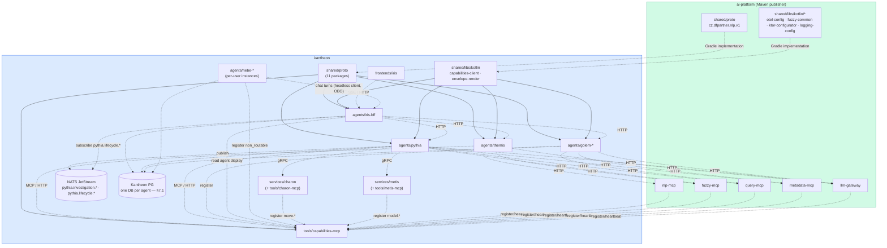

# Kantheon — v1 Architecture

> **Status:** v0.3 — locked 2026-05-11 from the Iris-evolution brainstorm and Themis detour; relocated to `docs/architecture/` 2026-05-15; refreshed 2026-06-12 by the cohesion review (Hebe integrated, post-PD contract deltas, persistence topology, Rule-6/AgentId decisions); **refreshed 2026-06-14 — full post-fork constellation listing (§2) + full repo tree (§3)** so the whole of kantheon is enumerated in one place.
>
> **Cross-cutting companion:** [`kantheon-security.md`](./kantheon-security.md) — authorization + audit (PD-8 resolution).
>
> **Companion design docs (`docs/design/`):**
> - [`iris/iris-design.md`](../design/iris/iris-design.md) + [`iris/iris-brainstorming.md`](../design/iris/iris-brainstorming.md) — Iris BFF + Vue FE
> - [`themis/themis-design.md`](../design/themis/themis-design.md) + [`themis/themis-brainstorming.md`](../design/themis/themis-brainstorming.md) + [`themis/themis-brief.md`](../design/themis/themis-brief.md) — Themis (= Resolver)
> - [`pythia/Pythia-v1-Design.md`](../design/pythia/Pythia-v1-Design.md) + [`pythia/Pythia-Brainstorming.md`](../design/pythia/Pythia-Brainstorming.md) — Pythia (relocated from `/Users/bora/Dev/pythia` 2026-05-11)
> - [`golem/golem-template-design.md`](../design/golem/golem-template-design.md) — Golem template (Kotlin + Koog rewrite of today's Python LangGraph BE)
>
> **Companion architecture + contracts (`docs/architecture/`):**
> - [`themis/architecture.md`](./themis/architecture.md) — Themis-in-kantheon implementation architecture.
> - [`themis/contracts.md`](./themis/contracts.md) — Themis-in-kantheon wire contracts.
>
> **Companion implementation docs (`docs/implementation/v1/`):**
> - [`themis/plan.md`](../implementation/v1/themis/plan.md) — Themis phased plan (Phases 1 → 2 → 3).
> - [`themis/tasks-stage-01-infra-nlp.md`](../implementation/v1/themis/tasks-stage-01-infra-nlp.md) through [`themis/tasks-stage-06-consumer-migration.md`](../implementation/v1/themis/tasks-stage-06-consumer-migration.md) — six Resolver-era stage docs (Stages 01–04 essentially complete in ai-platform; 05–06 reframe-pending).

---

## 1. Vision

Kantheon ("Kotlin pantheon") is the agent constellation **and — since the 2026-06-12 fork — the self-contained platform that succeeds `ai-platform`**. It hosts the user-facing frontend (Iris), the routing/understanding service (Themis), the analytical investigator (Pythia), the per-domain Q&A agents (Golem instances), the personal agent (Hebe), the brokerage domain (Midas + Sysifos), the surviving platform services (Charon, Metis, report-renderer), the `landing` page, and the agent/capability registry (`capabilities-mcp`). Iris talks to Themis to route turns; the chosen agent answers with a structured artifact; Iris renders.

> **Read spine extracted to `tatrman-server` (2026-07, SV-P0/P1).** The forked platform line — Ariadne, Theseus, Echo, Kadmos, Proteus, Kyklop, Argos, Prometheus + the Kyklops workers (Brontes/Steropes/Arges) — together with the off-constellation infrastructure `whois`/`health`/`backstage`, was **moved out of kantheon** into the open-source [`tatrman-server`](https://github.com/Collite/tatrman-server) repo and renamed to functional names (see §2 for the full map). Only `landing` of the technical wave stays in kantheon. The mythology and the dated fork narrative below are kept as kantheon's build history; the services themselves now live in tatrman-server.

> **The split below is historical.** It describes the pre-fork boundary between kantheon and ai-platform. The **fork (decided 2026-06-12, §10) dissolves it**: ai-platform's intelligent + technical services are copied into kantheon and renamed into the pantheon; ai-platform goes maintenance-only and, after fork Phase 5, can be switched off entirely. The end-state coupling to ai-platform is zero. Read §2 (full constellation) and §3 (full repo tree) for the post-fork shape; read this split only for context on where the modules came from.

The original split between Kantheon and ai-platform was deliberate:

- **ai-platform** owns platform infrastructure: `query-mcp`, `metadata-mcp`, `fuzzy-mcp`, `llm-gateway`, `nlp-mcp`, `infra/nlp` (Czech NLP foundation, including Stanza / spaCy / NameTag / MorphoDiTa). Stays in its existing repo.
- **Kantheon** owns the agent constellation: the agents themselves, the conversation surface, the agent/tool registry. New repo.

Cross-repo coupling has two directions:

- **Kantheon depends on ai-platform via Maven** — ai-platform publishes its `shared/proto` (`cz.dfpartner.nlp.v1` and others) and `shared/libs/kotlin/*` (`otel-config`, `fuzzy-common`, `ktor-configurator`, `logging-config`, build-convention plugins) as versioned Maven artifacts; Kantheon consumes them via `gradle/libs.versions.toml`. (The MCP/Ktor server base lives in `ktor-configurator` — `mcp-server-base` does not exist as a published artifact; corrected 2026-06-12.)
- **ai-platform tools register into Kantheon at startup** — every ai-platform tool service heartbeats into Kantheon's `tools/capabilities-mcp`. This is a cross-repo write dependency, the inverse of the publish direction. Tools that can't reach Kantheon warn-and-continue (no platform outage if Kantheon is down).

This is the only ai-platform → Kantheon coupling. Everything else flows Kantheon → ai-platform.

## 2. The constellation

The full kantheon, grouped by tier. **Personas** (the speaking gods + the chthonic/heroic figures who serve them) carry mythological names; **infrastructure** keeps functional names (two-tier naming rule, §13).

#### 2.a Agents — the speaking gods

| Module | Role | Stack |
|---|---|---|
| `frontends/iris` | Vue SPA — user-facing conversation UI; extracted from `agents-fe` | Vue 3 + TypeScript + dockview + PrimeVue + Vega-Lite |
| `agents/iris-bff` | Dispatch BFF — conversation state, slash UX, Themis dispatch, stream multiplexing back to Vue | Kotlin + Ktor |
| `agents/themis` | Question understanding + routing; forked + extracted from `ai-platform/agents/resolver` | Kotlin + Koog |
| `agents/pythia` | Autonomous analytical investigator | Kotlin + Koog (LLM-call layer); custom DAG executor (coroutines + Postgres checkpointer) |
| `agents/golem` | Parameterised per-domain Q&A template; one pod per Shem (Golem-ERP, Golem-HR, Golem-Sales, Golem-Investment, …) | Kotlin + Koog |
| `agents/hebe` | Personal autonomous agent — per-user instances; CLI/web/Telegram, cron scheduler + routines, security/receipts, PF4J plugins, MCP server+client. Four profiles over orthogonal axes (2026-06-13): `local` (SQLite, BYOK), `personal` (SQLite, platform client + offline tolerance), `server` (external PG, always-on), `k8s` (in-cluster PG). Keycloak OBO for any platform-reaching profile; calls **iris-bff** for scheduled turns; registers `non_routable`. Owns scheduled investigations + out-of-band notifications (PD-2/PD-10). Arc: [`hebe/architecture.md`](./hebe/architecture.md) + [`hebe/contracts.md`](./hebe/contracts.md) + [`../implementation/v1/hebe/plan.md`](../implementation/v1/hebe/plan.md). | Kotlin + Koog + Ktor; SQLite / PG |

#### 2.b Platform services — the forked line + the migrated services

Logic lives in `services/`; thin MCP wrappers in `tools/`. Proto root `org.tatrman.<service>.v1`; Kotlin source roots `org.tatrman.kantheon.<service>` (fork Stage 2.1 lock). All **forked** into kantheon (copy-paste, decided 2026-06-12, §10; Phases 1–4 complete 2026-06-17); ai-platform stays untouched. Old ai-platform names in parentheses.

> **The "read spine" was extracted to `tatrman-server` (2026-07, SV-P0/P1).** The eight forked query-path services in the table below — Ariadne, Theseus, Echo, Kadmos, Proteus, Kyklop, Argos, Prometheus — were **moved out of kantheon** into the open-source [`tatrman-server`](https://github.com/Collite/tatrman-server) repo and renamed to functional names (`services/ariadne` and its dirs no longer exist here). Mapping — including the wire packages and MCP edges: Ariadne→**Veles** (`ariadne.v1`→`meta.v1`, `ariadne-mcp`→`ttr-meta-mcp`); Theseus→**ttr-query** (`theseus.v1`→`query.v1`, `theseus-mcp`→`ttr-query-mcp`); Echo→**ttr-fuzzy** (`echo.v1`→`fuzzy.v1`, `echo-mcp`→`ttr-fuzzy-mcp`); Kadmos→**ttr-nlp** (`kadmos.v1`→`nlp.v1`, `kadmos-mcp`→`ttr-nlp-mcp`); Proteus→**ttr-translate** (`proteus.v1`→`translate.v1`); Kyklop→**ttr-dispatch** (`kyklop.v1`→`dispatch.v1`); Argos→**ttr-validate** (`argos.v1`→`validate.v1`); Prometheus→**ttr-llm-gateway** (`prometheus.v1`→`llm.v1`). **Charon, Metis, report-renderer, and `capabilities-mcp` stay in kantheon.** The rows below are kept with their fork-era detail as history; the persona names and `fork:`-origin annotations are naming history, not a current-location claim.

| Module | Role | Stack |
|---|---|---|
| `services/ariadne` (+ `tools/ariadne-mcp`) — **→ `tatrman-server`: Veles (+ `ttr-meta-mcp`)** | Model graph / metadata; serves Shem **model + prompts** (`GetModel` / `GetPrompts`) from the `ai-models` repo (fork: `infra/metadata`) | Kotlin + Ktor + gRPC |
| `services/theseus` (+ `tools/theseus-mcp`) — **→ `tatrman-server`: ttr-query (+ `ttr-query-mcp`)** | Query orchestrator + plan cache; the data-path edge (`theseus-mcp`) agents call under OBO (fork: `services/query-runner`) | Kotlin + Ktor + gRPC |
| `services/echo` (+ `tools/echo-mcp`) — **→ `tatrman-server`: ttr-fuzzy (+ `ttr-fuzzy-mcp`)** | Czech-aware fuzzy matcher (fork: `services/fuzzy-matcher`) | Kotlin + Ktor + gRPC |
| `services/kadmos` (+ `tools/kadmos-mcp`) — **→ `tatrman-server`: ttr-nlp (+ `ttr-nlp-mcp`)** | NLP foundation — Stanza / spaCy / NameTag / MorphoDiTa (fork: `infra/nlp`) | **Python** + gRPC |
| `services/proteus` — **→ `tatrman-server`: ttr-translate** | Translator: lang ↔ RelNode ↔ SQL; consumes the `Collite/modeler` TTR toolchain (fork: `services/translator`) | Kotlin + gRPC |
| `services/kyklop` — **→ `tatrman-server`: ttr-dispatch** | Worker dispatcher — routes plans to the Kyklops workers (fork: `services/dispatcher`) | Kotlin + Ktor + gRPC |
| `services/argos` — **→ `tatrman-server`: ttr-validate** | Validator + RLS policy; **sql-security folded in**; reads roles from the forwarded bearer (`argos.roleSource = bearer \| whois`, default bearer) (fork: `services/validator` + `infra/sql-security`) | Kotlin + Ktor |
| `services/prometheus` — **→ `tatrman-server`: ttr-llm-gateway** | LLM gateway (fork: `infra/llm-gateway`, forked as-is). *(Distinct from the Prometheus monitoring stack / Micrometer / `/metrics`, which stays.)* | **Spring Boot** |
| `services/charon` (+ `tools/charon-mcp`) | Arrow data mover — Seaweed / Redis / worker sessions / DB tables via named connections; registers `move.*`. **First migrated platform-grade service.** Arc: [`charon/architecture.md`](./charon/architecture.md) + [`charon/contracts.md`](./charon/contracts.md) + [`../implementation/v1/charon/plan.md`](../implementation/v1/charon/plan.md); `charon/v0.3.0` gates Pythia Phase 4. | Kotlin + Ktor + gRPC + ADBC |
| `services/metis` (+ `tools/metis-mcp`) | Model estimation — SARIMAX / Prophet / linear; diagnose / project / simulate; session workspace; registers `model.*`. **Second migrated service; library-moat Python.** Arc: [`metis/architecture.md`](./metis/architecture.md) + [`metis/contracts.md`](./metis/contracts.md) + [`../implementation/v1/metis/plan.md`](../implementation/v1/metis/plan.md); `metis/v0.3.0` gates Pythia Phase 4 Stage 4.2. | **Python** + statsmodels + prophet + gRPC |
| `services/report-renderer` | Standalone XLSX/PPTX/PDF/HTML report rendering from repo-bundled templates (Midas arc) | Kotlin + Ktor + Apache POI + Playwright |
| `tools/capabilities-mcp` | Unified registry of agent capabilities (`AgentManifest`, `ShemManifest`) + tool capabilities (`theseus.*`, `ariadne.*`, `model.*`, `move.*`, `midas.*`, …); `kind: TOOL \| AGENT` | Kotlin + Ktor + MCP SDK |

#### 2.c Workers — the Kyklops

> **All three workers extracted to `tatrman-server` (2026-07)** as `ttr-worker-{mssql,polars,postgres}` (Brontes→ttr-worker-mssql, Steropes→ttr-worker-polars, Arges→ttr-worker-postgres). Kept here as naming history.

| Module | Role | Stack |
|---|---|---|
| `workers/brontes` — **→ `tatrman-server`: ttr-worker-mssql** | MSSQL worker — DB → Arrow extract / Arrow → DB ingest (fork: `workers/mssql`) | Kotlin + gRPC |
| `workers/steropes` — **→ `tatrman-server`: ttr-worker-polars** | Polars DataFrame worker — scan plans, materialisation, read-out (fork: `workers/polars`) | **Python** + Polars + gRPC |
| `workers/arges` — **→ `tatrman-server`: ttr-worker-postgres** | Postgres worker — re-homes ai-platform `workers/postgres` (needed by Midas P3.2) | Kotlin + gRPC |

#### 2.d Infrastructure — the technical wave (no personas, fork Phase 5)

> **`whois`, `health`, `backstage` extracted to `tatrman-server` (2026-07)** — whois→**ttr-identity** (the `roleSource: bearer|whois` config vocabulary and the `whois-common` lib name are retained). **`landing` stays in kantheon.**

| Module | Role | Stack |
|---|---|---|
| `infra/whois` — **→ `tatrman-server`: ttr-identity** | User/role directory + OPA bundle server; own Postgres; optional Argos role-enrichment source (fork: `infra/whois`) | Kotlin + Ktor + Postgres |
| `infra/health` — **→ `tatrman-server`** | Cluster health aggregator (fork: `infra/health`) | Kotlin + Ktor |
| `infra/backstage` — **→ `tatrman-server`** | Developer portal (fork: `infra/backstage`) | Backstage / Node |
| `frontends/landing` *(stays in kantheon)* | Multilingual landing page / service dispatcher, rebranded (fork: `frontends/landing`) | Vue 3 + Nginx |

#### 2.e Domain — Midas (brokerage) + Sysifos (data entry)

| Module | Role | Stack |
|---|---|---|
| `agents/midas/core` | Brokerage operational service: write-API for clients/portfolios/transactions, calc engine (TWR/MWR/FIFO), MCP tools for Golem-Investment. Owns the `midas` DB on the Kantheon PG (§7.1) | Kotlin + Ktor + Postgres + jOOQ |
| `agents/midas/loaders/*` | Per-source statement loaders: Excel (v1), Google Finance (v1), Yahoo / SFTP / REST (v1.x). Parse → preview → commit via Midas-core | Kotlin + Ktor + POI / Quartz |
| `agents/midas/shem` | Mounted Shem (`shem-investment.yaml`) — runs as a Golem template pod = Golem-Investment | YAML mounted into Golem |
| `agents/sysifos-bff` | Data-entry BFF for the Sysifos frontend; forms-shaped sibling to Iris-BFF (own arc, split 2026-06-13) | Kotlin + Ktor |
| `frontends/sysifos` | Vue SPA for data entry — clients, portfolios, transactions, balance entry, import, reconciliation | Vue 3 + TypeScript + PrimeVue + Pinia |

Naming follows the **two-tier mythology rule** (§13): **agents** are the speaking gods (Iris = messenger, Themis = divine order, Pythia = the Delphic oracle, Hebe = cup-bearer; Golem is the one non-Greek persona — Hebrew/Yiddish, kept for the inscription/Shem metaphor); **platform services** are the older chthonic/heroic figures who serve them (Charon, Metis, Ariadne, Theseus, Echo, Kadmos, Proteus, Kyklop, Argos, Prometheus), with the workers as the individually-named Kyklops (Brontes, Steropes, Arges — Arges the Postgres worker became an active arc 2026-06-23). The domain personas: Midas (the golden touch — investment) and Sysifos (the eternal toiler — data entry). **Infrastructure** (whois, health, landing, backstage) keeps functional names — infra is not a constellation citizen. *(This naming rule is retained as kantheon's naming history: the read-spine personas — Ariadne, Theseus, Echo, Kadmos, Proteus, Kyklop, Argos, Prometheus, and the Brontes/Steropes/Arges workers — were extracted to `tatrman-server` in 2026-07 and renamed to functional names, and whois/health/backstage moved with them; see §2.b–§2.d.)*

Adding a new domain means a new ShemManifest YAML + a new pod with the Golem template image and that Shem mounted. No code change. Golem-Investment (Phase 3 of the Midas arc) is the third such instance — adds zero lines of Golem template code.

The Midas arc is the first kantheon-side work that **owns its own operational, mutable data** (the kantheon-owned operational Postgres). Until now everything has been read-only against customers' source-of-truth systems. See [`midas/architecture.md`](./midas/architecture.md) for the full arc shape.

## 3. Top-level layout

The full post-fork target layout. Mirrors [`CLAUDE.md`](../../CLAUDE.md) §3 and [`fork/architecture.md`](./fork/architecture.md) §2–§2.1, with proto packages and domain modules expanded.

> **Stale as of the 2026-07 extraction.** The tree below is the fork-era target layout. Since then the **read spine** (`services/{ariadne,theseus,echo,kadmos,proteus,kyklop,argos,prometheus}` + their `tools/*-mcp` wrappers), the **workers** (`workers/{brontes,steropes,arges}`), and the **technical-wave infra** `infra/{whois,health,backstage}` were extracted to the open-source [`tatrman-server`](https://github.com/Collite/tatrman-server) repo and renamed to functional names (Veles / ttr-{query,fuzzy,nlp,translate,dispatch,validate,llm-gateway} + ttr-worker-{mssql,polars,postgres}; whois→ttr-identity). **Those directories no longer exist in kantheon.** What remains under `services/` is `charon`, `metis`, `report-renderer`; `frontends/landing` stays; the agents, `tools/capabilities-mcp`, `shared/`, and the domain modules are unaffected. The annotations below mark the moved subtrees.

```
kantheon/
├── agents/                              # the speaking gods (personas)
│   ├── iris-bff/                        # Kotlin + Ktor — dispatch BFF
│   ├── themis/                          # Kotlin + Koog — routing (forked ex-Resolver)
│   ├── pythia/                          # Kotlin + Koog + custom DAG executor
│   ├── golem/                           # Kotlin + Koog (template; one pod per Shem)
│   ├── hebe/                            # Kotlin + Koog + Ktor — personal agent (per-user instances)
│   ├── sysifos-bff/                     # Kotlin + Ktor — data-entry BFF (Sysifos arc)
│   └── midas/
│       ├── core/                        # Kotlin + Ktor + Postgres + jOOQ — brokerage operational service
│       ├── loaders/                     # excel/ · google-finance/ · (yahoo·sftp·rest = v1.x)
│       └── shem/                        # shem-investment.yaml → Golem-Investment
├── services/                            # survivors: charon · metis · report-renderer  (read spine EXTRACTED → tatrman-server, 2026-07)
│   ├── charon/                          # Arrow data mover (migrated)         + tools/charon-mcp
│   ├── metis/                           # model estimation (Python; migrated) + tools/metis-mcp
│   │   # ── read spine below EXTRACTED to tatrman-server (2026-07) — dirs no longer here ──
│   ├── ariadne/                         # → tatrman-server: Veles             + tools/ttr-meta-mcp
│   ├── theseus/                         # → tatrman-server: ttr-query         + tools/ttr-query-mcp
│   ├── echo/                            # → tatrman-server: ttr-fuzzy         + tools/ttr-fuzzy-mcp
│   ├── kadmos/                          # → tatrman-server: ttr-nlp (Python)  + tools/ttr-nlp-mcp
│   ├── proteus/                         # → tatrman-server: ttr-translate
│   ├── kyklop/                          # → tatrman-server: ttr-dispatch
│   ├── argos/                           # → tatrman-server: ttr-validate
│   ├── prometheus/                      # → tatrman-server: ttr-llm-gateway (Spring Boot)
│   └── report-renderer/                 # XLSX/PPTX/PDF/HTML rendering (POI + Playwright)  [stays]
├── workers/                             # the Kyklops — ALL EXTRACTED → tatrman-server (2026-07)
│   ├── brontes/                         # → tatrman-server: ttr-worker-mssql
│   ├── steropes/                        # → tatrman-server: ttr-worker-polars (Python)
│   └── arges/                           # → tatrman-server: ttr-worker-postgres
├── infra/                               # technical wave — whois/health/backstage EXTRACTED → tatrman-server (2026-07)
│   ├── whois/                           # → tatrman-server: ttr-identity (user/role directory + OPA bundles)
│   ├── health/                          # → tatrman-server (cluster health aggregator)
│   └── backstage/                       # → tatrman-server (developer portal)
├── frontends/
│   ├── iris/                            # Vue 3 SPA — chat (extracted from agents-fe)
│   ├── sysifos/                         # Vue 3 SPA — data entry
│   └── landing/                         # Vue 3 + Nginx — multilingual landing / dispatcher
├── tools/
│   ├── capabilities-mcp/                # Kotlin + Ktor + MCP SDK — unified registry
│   └── {charon,metis}-mcp/              # thin MCP wrappers (ariadne/theseus/echo/kadmos-mcp extracted → tatrman-server as ttr-{meta,query,fuzzy,nlp}-mcp)
├── shared/
│   ├── proto/
│   │   └── src/main/proto/
│   │       ├── org/tatrman/kantheon/    # constellation / agent contracts
│   │       │   ├── common/v1/           # ResponseMessage stand-in · AgentId · HandoffContext · provenance
│   │       │   ├── capabilities/v1/
│   │       │   ├── envelope/v1/
│   │       │   ├── themis/v1/  pythia/v1/  golem/v1/  iris/v1/  hebe/v1/
│   │       │   ├── midas/v1/            # brokerage domain (Midas arc)
│   │       │   ├── sysifos/v1/          # data-entry surface (Sysifos arc)
│   │       │   └── report/v1/           # report-renderer I/O
│   │       └── org/tatrman/             # platform-service + pipeline protos
│   │           ├── {charon,metis}/v1/                    # survivors
│   │           ├── {ariadne,theseus,echo,kadmos,proteus,kyklop,argos,prometheus}/v1/  # EXTRACTED → tatrman-server, renamed {meta,query,fuzzy,nlp,translate,dispatch,validate,llm}.v1
│   │           └── {plan,worker,transdsl,dfdsl}/v1/      # cross-service pipeline packages (moved with the read spine)
│   └── libs/
│       ├── kotlin/
│       │   ├── capabilities-client/     # client for capabilities-mcp
│       │   ├── envelope-render/         # server-side envelope rendering helpers
│       │   ├── keycloak-auth/           # extracted auth lib (fork Phase 5)
│       │   ├── whois-common/            # whois shared types (fork Phase 5)
│       │   ├── bff-base/                # shared BFF scaffolding (Iris + Sysifos)
│       │   └── {fuzzy-common, ktor-configurator, logging-config, otel-config, …}   # forked from ai-platform (Phase 1)
│       ├── python/                      # otel-config (Kadmos, Metis, Steropes)
│       └── ts/
│           └── envelope-ts/             # TS bindings + render helpers for the FE
├── deployment/local/                    # local-infra: Kantheon PG (pgvector) · NATS · Keycloak dev realm · Seaweed/Redis
├── docs/                                # three-area structure — see docs/README.md
│   ├── design/                          # what we decided to build, and why
│   ├── architecture/                    # how it is built (this doc; per-arc architecture + contracts; fork/)
│   └── implementation/                  # what we're building now (master-plan.md · per-arc plans · v1.1 ledger)
├── gradle/libs.versions.toml            # central version catalog (no hardcoded versions)
├── build.gradle.kts
├── settings.gradle.kts
├── justfile
├── CLAUDE.md  ·  AGENTS.md  ·  EXAMPLES.md  ·  README.md
└── .github/workflows/ci.yml             # init → lint-check → test-all
```

> **Persona vs proto-root nuance.** Proto package roots are `org.tatrman.<service>.v1` for platform services (not `org.tatrman.kantheon.*`, which is reserved for agent/constellation contracts), but the forked services' **Kotlin source roots** are `org.tatrman.kantheon.<service>` (fork Stage 2.1 lock); the no-proto technical-wave services use `org.tatrman.{whois,health}.*`. See §4 and [`fork/contracts.md`](./fork/contracts.md) §1 for the full old→new package map. The one standing external Maven dependency is the `Collite/modeler` TTR toolchain (consumed by Ariadne + Proteus — both since extracted to `tatrman-server` as Veles + ttr-translate) — not ai-platform coupling.

Each Kotlin module follows the standard layout (`src/main/kotlin/`, `src/main/resources/`, `src/test/kotlin/`, `build.gradle.kts`). Each deployable service gets a `k8s/{base,overlays/local}/` directory with Kustomize manifests; `imagePullPolicy: Never` in the local overlay. Each agent gets an `eval/` directory for fixture corpora and a `prompts/` directory for config-driven prompts. Each gets a `README.md` describing API surface, configuration, and how to extend.

Build conventions:

- **Build-convention plugins** (`id("my.kotlin-ktor")`, etc.) consumed from ai-platform's published Maven artifacts — single source of truth across both repos. Not vendored in Kantheon.
- **Versions centralised** in `gradle/libs.versions.toml`; never hardcoded in module `build.gradle.kts`.
- **CI pipeline** (`.github/workflows/ci.yml`): init → lint-check → test-all. Auto-detect Jib vs Docker from Gradle plugins; do not hardcode service lists in GitHub Actions.
- **Task runner**: `just`. Commands mirror ai-platform: `just init`, `just build-kt <module>`, `just deploy-kt <module>`, `just test-all`, `just lint-all`, `just proto-all`, `just debug-tunnel`.
- **Versioning**: git tags follow ai-platform's `<service-directory-name>/v<major>.<minor>.<patch>` convention (e.g., `themis/v0.1.0`).

## 4. Proto packaging

Constellation/agent protos live under `org.tatrman.kantheon.<package>.v1`. **Migrated platform-grade services use `org.tatrman.<service>.v1`** (`org.tatrman.charon.v1`, `org.tatrman.metis.v1` — boundary-shift direction 2026-06-12); `org.tatrman.kantheon.*` stays reserved for constellation/agent contracts. Eleven kantheon packages, each owning a coherent slice of the constellation's wire contracts:

| Package | Contents | Imports |
|---|---|---|
| `common/v1` | `ResponseMessage` (Rule 6 — **kantheon-local stand-in**, see note below); `AgentId` (**moved from themis/v1 2026-06-12, cohesion review D2** — envelope references it and imports only common); `HandoffContext` + `EntityBinding` + `ViewProvenance` (typed cross-agent context handoff — PD-1/PD-4 resolution 2026-06-12; defines `themis_prior_context`; `ViewProvenance` mirrors new-golem v2 `CurrentView` and is the single provenance shape for PD-9); `BlockProvenance` (PD-9) | — |
| `capabilities/v1` | `Capability` sealed union; `ToolCapability`; `AgentCapability` with `AgentManifest` / `ShemManifest` discriminated by `agent_kind`; `non_routable = 16` + `visibility_roles = 17` (2026-06-12); `IntentKind`; search / list / register / heartbeat surface | — |
| `envelope/v1` | `FormatEnvelope`; `Block` (text / table / chart / markdown; `provenance` = `common.v1.BlockProvenance`, PD-9 2026-06-12); `Chip` (incl. `RoutingPickChip`, `InvestigateChip`); `Drilldown`; `TableDetails`; `ChartDetails`; `ChartIntent` | `common/v1` **only** (deliberate bottom-layering; the themis/v1 import was removed with the AgentId move — it dragged `cz.dfpartner.nlp/metadata` into every envelope consumer incl. `envelope-ts`) |
| `themis/v1` | `ResolveRequest`; `ResolveResponse`; `Resolution`; `RoutingDecision`; `AwaitingClarification` (with `MultiQuestionDetected` variant); `RefusalWithGaps`; `Profile`; intent-kind classifier outputs | `cz.dfpartner.nlp.v1` (ai-platform Maven), `capabilities/v1` |
| `pythia/v1` | `Investigation`; `InvestigationArtifact`; `PlanDag`; `Hypothesis`; `StepRecord`; `Conclusion`; lifecycle events | `envelope/v1`, `capabilities/v1` |
| `golem/v1` | `GolemRequest`; `ConversationalResponse`; `MiniPlan` types; step records | `envelope/v1`, `capabilities/v1` |
| `iris/v1` | `Session`; `TurnPointer` (with PD-1 `current_view`/`applied_context` snapshot); `ChatTurnRequest` (with `TurnOrigin`/`origin_ref` — Hebe co-design, landed 2026-06-12); `IrisStreamEvent` (`envelope` / `step` / `tool_call` / `thinking` / `error` variants); slash-command surface | `envelope/v1`, `common/v1` |
| `hebe/v1` | `Routine`; `RoutineBody` (`skill` / `tool` / `kantheon_question`); `RoutineRun`; `DeliveryRecord` — boundary-crossing types only (console-API alignment = v1.x); lands Hebe arc Phase 4 | `common/v1` |
| `midas/v1` | Brokerage domain: `Client`, `Portfolio`, `Asset`, `Transaction`, `Position`, `PerformanceMetric`, `FxRate`, `Money`; Midas-core REST + MCP tool I/O; loader-internal types (`LoaderRun`, `LoaderPreview`, …); reconciliation types. **Derived cash legs (S2, 2026-06-13, baseline):** `TransactionKind` += `TX_CASH_CREDIT`/`TX_CASH_DEBIT`; `Portfolio.track_cash`; `Transaction.correlation_id` — owned by the Midas arc (folded into the baseline schema), consumed by Sysifos | `common/v1` (Rule-6 stand-in) |
| `sysifos/v1` | **Owned by the Sysifos arc** (split 2026-06-13). `SysifosSession`, `Draft` (async write surface), `SysifosStreamEvent` (incl. `BatchRowResult`), form payloads (`ClientForm`, `PortfolioForm` w/ `track_cash`, `TransactionForm`, `TransactionBatchForm`, `AssetForm`, `BalanceEntryForm`, `ReconciliationDecisionForm`) | `envelope/v1`, `midas/v1`, `common/v1` |
| `report/v1` | `ReportTemplate`, `ParamDef`, `RenderReportRequest`, `RenderReportResponse`; XLSX/PPTX/PDF/HTML output formats | — |

Two invariants are load-bearing:

- **`envelope/v1`** is what every backend agent emits and what Iris consumes. Pythia's `InvestigationArtifact.blocks` and Golem's `ConversationalResponse.blocks` both reference the same `Block` types from `envelope/v1`. The shared envelope is what lets Iris render a Pythia investigation and a Golem turn through the same chat-bubble pipeline.
- **`capabilities/v1`** is what every agent registers under. The `kind: TOOL | AGENT` discriminator means one MCP service, one search surface, one query surface for Themis (which reads agent manifests) and Pythia (which reads agent + tool manifests for cross-domain plans).

Note that `iris/v1` does **not** import `themis/v1` / `pythia/v1` / `golem/v1`. The BFF's *code* depends on those agents' proto bindings for dispatch, but Iris's own outward wire — to its Vue FE — exposes only `IrisStreamEvent` events carrying `FormatEnvelope` payloads. The FE never sees the agent-side types directly.

Every response carries `repeated ResponseMessage messages = 99;` per the platform-wide Rule 6 inherited from ai-platform. **ResponseMessage identity (locked 2026-06-12, cohesion review D1):** all kantheon protos use `org.tatrman.kantheon.common.v1.ResponseMessage` — ai-platform's lives in `cz.dfpartner.metadata.v1` and carries a metadata-domain `ObjectRef`, so it is not portable. When ai-platform extracts a domain-free `cz.dfpartner.common.v1.ResponseMessage`, kantheon swaps imports and deletes the stand-in (tracked in `kantheon-v1.1.md` §1).

**Wire policy:** protobuf is the source of truth for every cross-service contract, even when the wire is REST (not gRPC). REST endpoints are tested against the proto definitions in CI — same pattern as ai-platform. Hand-rolled JSON shapes that bypass the proto are not permitted.

## 5. Shared Kotlin libs

Two libraries at v1; one explicitly deferred.

### `shared/libs/kotlin/capabilities-client`

Kotlin client for `capabilities-mcp`. Single source of the cache + TTL + fail-fast logic. Used by:

- Themis — heavy: reads `list_agents()` at startup for routing; refreshes on TTL or signal.
- Pythia — reads Shems for cross-domain plans; treats other agents' `preferred_queries` / `preferred_capabilities` / `area_terminology` as planner context.
- Iris-BFF — light: agent display names + alternates rendering when Themis returns `needs_user_pick`.
- Golem — self-registration at startup only (declares its own `ShemManifest`).

The fail-fast policy at boot (Themis refuses to start on empty registry) lives in this library — see Stage 4.5 task 5.

### `shared/libs/kotlin/envelope-render`

Server-side envelope assembly helpers. Vega-Lite spec construction from `ChartIntent`; header inference for tables; the retry + deterministic-fallback patterns from the current Python BE's hard-won lessons (the G-21 through G-25 gotchas from `golem`'s v2 codebase, re-implemented in Kotlin). Used by every backend agent's format pipeline — Pythia, Golem, and (for ad-hoc rendering) Themis. **PD-9 (2026-06-12): envelope-render stamps `Block.provenance` uniformly at format time** (view + producing agent id; callers add step/hypothesis/model refs) — agents using the lib get provenance for free.

Lives Kantheon-side because envelope is a constellation concept, not platform infrastructure.

### `shared/libs/kotlin/agent-base` (deferred)

Common Koog patterns that *will* surface across Themis / Pythia / Golem — `conversation_excerpt` threading, OTel span-builder conventions, structured-output retry + deterministic-fallback wrappers. Not scaffolded at v1: premature shared abstractions calcify. Pattern: when two agents implement the same helper independently, extract into `agent-base`. Until then, each agent grows its own.

### `shared/libs/ts/envelope-ts`

TypeScript bindings for `envelope/v1` plus a hand-written `FormatRenderer` helper for the Vue FE. Generated from proto via `just proto-all`. Used by `frontends/iris`.

## 6. Module dependency graph

> **This graph predates the fork.** It shows ai-platform as the Maven publisher and the ai-platform tool services (nlp-mcp / fuzzy-mcp / query-mcp / metadata-mcp / llm-gateway) that Themis/Pythia/Golem called at runtime. The fork brought those in-repo (Kadmos, Echo, Theseus via theseus-mcp, Ariadne, Prometheus), dropping the Maven/runtime arrows to ai-platform (§10). **Those forked services have since been extracted to `tatrman-server` (2026-07) and renamed** — ttr-nlp / ttr-fuzzy / ttr-query (via ttr-query-mcp) / Veles / ttr-llm-gateway — so the runtime edges from Themis/Pythia/Golem now point at tatrman-server-hosted services, not in-repo ones. The post-fork runtime topology is authoritative in [`fork/architecture.md`](./fork/architecture.md) §2. The kantheon-internal edges below (Iris→BFF→agents, agents→capabilities-mcp, Pythia→Charon/Metis, NATS, Kantheon PG) remain accurate.



No cycles. Maven dependency direction is ai-platform → kantheon (kantheon consumes published artifacts). Runtime HTTP/MCP calls go both directions: kantheon agents consume ai-platform tools, and ai-platform tools register into kantheon's capabilities-mcp.

## 7. Conversation state model

Iris owns the conversation as the user sees it. Each backend agent persists its own per-turn record. The session is a chronological list of pointers across agents.

```
Iris session (per user):
  EntityContext     — active entity bindings (e.g. "active customer = Shell UK PLC")
  Snapshots         — rollback history for the conversation
  Turns: [TurnPointer]

TurnPointer {
  turn_id: UUID
  agent_id: AgentId            -- pythia | golem-erp | golem-hr | ...
  artifact_ref: string         -- pointer to the agent's persisted turn record
  displayed_blocks: [BlockId]  -- which blocks the user actually saw (after edits)
  current_view: ViewProvenance?       -- PD-1 (2026-06-12): agent-echoed "what the user is looking at";
  applied_context: [EntityBinding]    --   BFF snapshots both per turn; feeds HandoffContext assembly
  origin: USER | SCHEDULED            -- TurnOrigin (Hebe co-design, landed 2026-06-12)
}
```

On **every dispatch** the BFF assembles a `common.v1.HandoffContext` from the previous TurnPointer + the session EntityContext and sends it to Themis (`ResolveRequest.prior_context`) and to the routed agent (PD-1 assembly rule, `iris/contracts.md` §1.2). Agents echo `current_view` + `applied_context` on every response; the BFF compares against what it dispatched and renders scope indicators / mismatch warnings (PD-4).

- **Iris** persists the session: turn log, EntityContext, snapshot history, edit-and-resend semantics.
- **Pythia** persists `InvestigationArtifact` (one per turn) in its own Postgres — full plan + hypotheses + step records + checkpoints for pause-resume.
- **Golem** persists `ConversationalResponse` (one per turn) in its own Postgres — no checkpoints, no event log (Golems don't pause).

Iris always passes `conversation_excerpt` (last N relevant turns) into the chosen agent's request. Both `GolemRequest.context` and `Investigation.context` have this slot.

**Edit-and-resend** re-routes through Themis — the edited message may have a different routing decision than the original. Iris's session log discards turns after the edited point (optimistic) and re-issues the edited message as a fresh turn.

### 7.1 Persistence topology — one Kantheon PG (locked 2026-06-12, promoted from the Hebe arc)

Kantheon runs **one internal Postgres instance**; each agent gets **its own database**:

| Database | Owner | Notes |
|---|---|---|
| `iris` | iris-bff | sessions, turns, snapshots, `iris_audit` (hash-chained), `iris_artifacts`, `iris_feedback` |
| `pythia` | agents/pythia | investigations, hypotheses, steps, handles, checkpoints, events |
| `golem` | agents/golem-* | **one database, schema per Shem pod** (`golem_erp`, `golem_hr`, …) — cohesion review D4: mirrors "DB per agent" with Golem-the-template as the agent |
| `midas` | agents/midas/core | the operational brokerage data — **folded into the Kantheon PG** (cohesion review D5; supersedes the Midas arc's separate `midas-postgres` instance — the CloudNativePG operator runs *this* instance, not a per-arc one) |
| `hebe` | agents/hebe | **schema-split per instance** (`hebe_<instance_id>`); needs `pgvector` |
| `whois` *(since extracted to `tatrman-server` as `ttr-identity` — its DB moved too)* | infra/whois | **fork Phase 5** — Keycloak/ERP user+role sync tables (Flyway V1–V5: `users`, `user_identities`, `roles`, `user_roles`, `role_hierarchy`). whois is *infrastructure*, not a constellation agent, so it sits beside the agent DBs without claiming an agent slot; it is the one technical-wave service with persistence (health/landing/backstage are stateless) |

Operational consequences: `deployment/local` provisions the single PG (with pgvector) + per-agent databases + the Keycloak dev realm (incl. `kantheon-area-<area>` roles) + NATS reachability for the BFF — owned as an infra pre-flight stage (see `implementation/v1/iris/plan.md` pre-flight). Flyway migration sets stay per-module; no cross-database access; `iris_audit`/`receipts` append-only grants per `kantheon-security.md`.

## 8. Routing model

Iris dispatches; Themis decides; Pythia is one of N peer agents.

Per turn:

1. Iris calls `themis.understand(question, conversation_excerpt, profile=CHAT_QUICK, routing_hint?)`.
2. Themis returns `UnderstandingResult { resolution, routing_decision }`. `resolution` carries parse + entities + intent_kind + structured function-call binding (against the chosen agent's domain registry). `routing_decision` carries `chosen_agent_id`, `confidence`, `alternates`, `needs_user_pick`.
3. If `needs_user_pick: true`, Iris renders the alternates as `RoutingPickChip`s. Chip click reissues the turn to Themis with `routing_hint = picked_agent_id`; Themis honours at Layer 0.
4. Otherwise, Iris dispatches to `routing_decision.chosen_agent_id`'s HTTP endpoint and streams the response back to Vue.

Themis's four-layer routing cascade is fully specified in `tasks-themis-stage-04.5-routing-layer.md` and will be promoted to `themis-design.md` after Stage 4.5 ships. Summary:

- **Layer 0**: explicit override via `routing_hint`.
- **Layer 1**: rule-based scoring over agent manifests from `capabilities-mcp.list_agents()` — no LLM call.
- **Layer 2**: CHEAP-tier LLM fallback when Layer 1 is tied or undecided.
- **Layer 3**: `needs_user_pick: true` with top-3 alternates as chips.

`MultiQuestionDetected` is a Themis-side cheap rule (one node before extractUniversal) that fires when N clauses appear in one turn. **PD-13 (2026-06-12):** it carries a `decomposition` verdict — `SPLIT` (disjoint intents → Iris decomposes UI-side into N follow-up turns) vs `KEEP_TOGETHER` (a relating intent — compare / correlate / explain-by / rank-across — routes the whole turn as one cross-domain question, typically → Pythia).

**Routing-view derivation (2026-06-12):** before any layer runs, Themis derives its routing view per request — drop `non_routable` entries (Hebe) → filter by the caller's roles against `visibility_roles` (PD-8; roles read from the forwarded bearer) → Layers 0–3. No agent survives → `RefusalWithGaps(NO_ENTITLED_AGENT)`.

`RefusalWithGaps` is the STRICT-mode terminal outcome when no agent can answer (entity unmapped, capability unavailable, out-of-data-scope, irreducibly ambiguous intent).

## 9. Agent contracts

Three response shapes — one per agent kind — all sharing the `envelope/v1` `Block` contract:

| Agent | Request type | Response type | Streaming | Persistence |
|---|---|---|---|---|
| Themis | `ResolveRequest` | `ResolveResponse` (`Resolution` / `AwaitingClarification` / `RefusalWithGaps`) | single-response in v1 | stateless (HMAC resume tokens for HITL rounds) |
| Pythia | `Investigation` | `InvestigationArtifact` | streaming events; **12 statuses incl. five `AWAITING_*` pause states** (PD-11 added `AWAITING_BUDGET_DECISION`, 2026-06-12) | Postgres-checkpointed |
| Golem | `GolemRequest` | `ConversationalResponse` (echoes `current_view` + `applied_context` per PD-1/PD-4) | streaming events (subset of Pythia's); no pause states | one row per turn in Postgres |
| Hebe | *(not routed — `non_routable`)* | n/a — Hebe is a **headless Iris client**: it dispatches `ChatTurnRequest`s with the bound user's OBO token and consumes `IrisStreamEvent`s | consumes SSE | own PG database, schema per instance |

`AgentResponse = ConversationalResponse | InvestigationArtifact` as a sealed type at Iris's consumption surface — Iris renders both via the shared `Block` contract from `envelope/v1`.

## 10. Cross-repo coupling with ai-platform — dissolved by the fork (decided 2026-06-12; pipeline ACHIEVED 2026-06-17)

> **Read spine since extracted (2026-07, SV-P0/P1).** Everything this section describes as "in-repo" or "forked in" — Themis's kadmos-mcp/echo-mcp/Prometheus edges, and the theseus-mcp → Theseus → Proteus/Argos/Kyklop → Brontes/Steropes data path — was later **moved out of kantheon** into the open-source [`tatrman-server`](https://github.com/Collite/tatrman-server) repo and renamed to functional names (Ariadne→Veles, Theseus→ttr-query, Echo→ttr-fuzzy, Kadmos→ttr-nlp, Proteus→ttr-translate, Kyklop→ttr-dispatch, Argos→ttr-validate, Prometheus→ttr-llm-gateway, workers→ttr-worker-*; whois→ttr-identity, health/backstage too). Read the "in-repo" claims below as fork-era history; those services now run from tatrman-server.

**The platform fork supersedes this section's premise.** ai-platform's intelligent services were forked into kantheon (copy-paste; ai-platform stays untouched, maintenance-only); kantheon is now self-contained on the query pipeline. Authoritative: [`fork/architecture.md`](./fork/architecture.md) §9 (the independence assertion) + [`fork/contracts.md`](./fork/contracts.md) + [`../implementation/v1/fork/plan.md`](../implementation/v1/fork/plan.md).

**Pipeline end state (fork Phases 1–4) — ACHIEVED 2026-06-17 (Stage 4.1 T6):**

- **No Maven consumption.** `shared/proto` slices and `otel-config` / `fuzzy-common` / `ktor-configurator` / `logging-config` are forked in-repo (fork Phase 1); GitHub Packages consumption + PAT bootstrap removed. No reverse publishing — ai-platform never consumes from kantheon.
- **No runtime calls in either direction.** Themis → kadmos-mcp/echo-mcp/Prometheus (in-repo, fork Phase 2); the data path is theseus-mcp → Theseus → Proteus/Argos/Kyklop → Brontes/Steropes (in-repo, fork Phase 3); the ai-platform PoC heartbeat into capabilities-mcp is decommissioned (fork Phase 4).
- **Local dev:** the kantheon stack on local K3s is complete by itself; no ai-platform reachability needed.
- Source-controlled manifest fixtures (YAML in `capabilities-mcp/manifests/`) still cover bootstrap; runtime registrations — now all in-repo — supersede them once each tool heartbeats.

**Total independence (fork Phase 5, added 2026-06-13).** The pipeline end state above (Phase 4) leaves four "technical" services — `whois`, `health`, `landing`, `backstage` — still served by ai-platform. The **technical wave** forks these too (under their own functional names, no personas, into a new top-level `infra/` — `landing` → `frontends/`), so **nothing operational ties kantheon to ai-platform**: identity directory + OPA bundles (whois), health roll-up (health), landing page, and developer portal are all in-repo. whois additionally becomes an *optional* role-enrichment source for Argos (`argos.roleSource = bearer | whois`, default `bearer` — additive, identity stays bearer-only; see [`kantheon-security.md`](./kantheon-security.md) §3.6). After Phase 5, **ai-platform can be switched off** without breaking a single kantheon path; the only standing external Maven dependency is the `Collite/modeler` TTR toolchain (not ai-platform coupling). Authoritative: [`fork/architecture.md`](./fork/architecture.md) §2.1 + [`../implementation/v1/fork/plan.md`](../implementation/v1/fork/plan.md) Phase 5.

The pre-fork couplings on the pipeline are **gone** (Phases 1–4 landed; see the git history of this section for what they were). The **technical wave (Phase 5) landed 2026-06-24** (branch `fork-5`): `infra/{whois,health,backstage}` + `frontends/landing` are forked in-repo and swept off ai-platform branding/package roots, so **no kantheon path depends on an ai-platform-hosted equivalent. ai-platform can be switched off — the fork is complete.**

## 11. Sequencing — Themis first; then Iris → Golem → Pythia (locked 2026-06-12)

The path from "today's `golem` repo running" to "Kantheon constellation live" runs through Themis. Five waypoints:

1. **Resolver Stage 04 closes in ai-platform** — the Koog graph ships, eval gate passes. Resolver is callable but does not have the agent-routing layer yet.
2. **Kantheon bootstrap** (Stage 4.4 task 1) — `kantheon` repo set up with the build, `justfile`, CI, proto codegen, Maven-from-ai-platform consumption.
3. **`tools/capabilities-mcp` lands** (Stage 4.4) — registry running with Pythia's `AgentManifest` and Golem-ERP's `ShemManifest` as source-controlled fixtures. ai-platform's `query-mcp` registers as proof-of-concept consumer.
4. **Resolver → Themis extraction** — `git filter-repo` moves `ai-platform/agents/resolver` into `kantheon/agents/themis`. Proto package renames `cz.dfpartner.resolver.v1` → `org.tatrman.kantheon.themis.v1`. Image names, K8s manifests, dashboards, alert rules all rewire.
5. **Routing layer added** (Stage 4.5) — `classifyIntentKind`, `routeToAgent`, four-layer cascade, profile parameter, `MultiQuestionDetected`, `RefusalWithGaps`. Iris-side `needs_user_pick` chip flow co-designed.

After Themis-with-routing is live:

6. **Iris BFF + FE extraction from golem** — the Vue FE and a Kotlin/Ktor BFF land in `kantheon/frontends/iris` and `kantheon/agents/iris-bff` respectively. Iris consumes Themis for routing.
7. **Golem Python → Kotlin + Koog rewrite** — the residual Python BE in today's `golem` (pattern catalog + mini-plan + format envelope + typed-action handler + ConversationalResponse persistence) rewrites to Kotlin in `kantheon/agents/golem`. The first Shem (`Golem-ERP`) lands.
8. **Cutover and retirement** — once Iris + Themis + Golem-ERP are live in Kantheon and consumers are migrated, today's `golem` repo retires.

The arc order after Themis is **locked (2026-06-12): Iris → Golem → Pythia** — Iris ships against the transitional new-golem `/v2` adapter; the Golem rewrite cuts over against a stable Iris; Pythia lands third (Charon + Metis arcs gate its Phase 4).

In parallel after Themis:

8a. **Hebe arc** — independent for Phases 1–3 (build merge → profiles → PG/instances); Phase 4 (constellation client) gates on iris-bff ≥ Iris Phase 2. See [`hebe/architecture.md`](./hebe/architecture.md) + [`../implementation/v1/hebe/plan.md`](../implementation/v1/hebe/plan.md).

9. **Midas arc** — brokerage-domain agent constellation. Introduces the first kantheon-owned operational data, the report-renderer service, Iris's dashboard system, and Golem-Investment as a new Shem. Cross-repo dependency on ai-platform `workers/postgres` (parallel track). See [`midas/architecture.md`](./midas/architecture.md), [`midas/contracts.md`](./midas/contracts.md), [`../implementation/v1/midas/plan.md`](../implementation/v1/midas/plan.md), and the coordination doc [`../implementation/v1/_archive/aip-v1-pg-worker-plan.md`](../implementation/v1/_archive/aip-v1-pg-worker-plan.md).

10. **Sysifos arc** — the Midas data-entry workbench (second BFF + FE pair). Split out of the Midas arc 2026-06-13 (decision S1). Two phases (Foundation shell → data-entry screens). Owns `sysifos/v1` + the Sysifos-BFF API; consumes Midas-core. Depends on Midas-core's write API and its derived-cash-leg behaviour (`TX_CASH_*` + `track_cash`, baseline in the Midas arc). See [`sysifos/architecture.md`](./sysifos/architecture.md), [`sysifos/contracts.md`](./sysifos/contracts.md), [`../implementation/v1/sysifos/plan.md`](../implementation/v1/sysifos/plan.md).

The existing `golem` repo stays running throughout the transition; nothing is deleted prematurely.

## 12. Open items

Pruned 2026-06-12 (cohesion review) — resolved items removed: the Iris/Golem/Pythia design + architecture + contracts + plan artefacts all exist (arcs planned 2026-06-12); the format-catalog spike is Golem plan Phase 1; `capabilities-client` is kantheon-side (shipped with `capabilities-mcp/v0.1.0`). Still open:

- **`Pythia-v1-Design.md` divergence fold-in** — the §9 divergence list (pythia contracts) folds back into the design doc at Pythia Stage 5.3; includes the PD-11 12th status and the vocabulary sweep.
- ~~**aip-v1-impl roadmap distribution**~~ — **closed 2026-06-12, superseded by the fork**: ai-platform goes maintenance-only, so the Phases 2–8 roadmap has no successor to distribute into; the equivalent work lives in the Iris/Golem/Pythia arcs + the fork plan.
- ~~**`aip-v1-gateway-worker-plan.md`**~~ — **closed 2026-06-12, absorbed by the fork**: gateway tier routing → Prometheus backlog (`kantheon-v1.1.md` §5); Polars workspace read-out → Steropes/Charon (fork plan Stage 3.4). No cross-repo coordination doc needed.
- **E3 full phasing** — parallel-deploy vs roadmap rewrite for the current single-agent `golem` cutover. Largely answered by the Iris `/v2` adapter + Golem Stage 4.2 soak strategy; the fork doesn't change it (old golem keeps calling ai-platform, which stays up).

## 13. Resolved decisions — quick reference

| Decision | Locked | Notes |
|---|---|---|
| Framework: Kotlin + Koog across all backend agents | 2026-05-10 | Was: pragmatic Python+LangGraph hedge for Golem — rejected after pros/cons |
| Iris BFF: Kotlin + Ktor, dispatch-shaped | 2026-05-10 | Owns conversation state, dispatch, stream multiplexing |
| Conversation state: Iris owns session, agents own per-turn artifacts | 2026-05-10 | `TurnPointer` list in Iris's session |
| Sequencing: Themis first, then Golem rewrite | 2026-05-10 | Most of "hard Python" goes into Themis, not Golem |
| Themis = Resolver moved from ai-platform after Stage 04 | 2026-05-10 | Routing layer added as Stage 4.5 post-extraction |
| `capabilities-mcp` lives in Kantheon | 2026-05-10 | Unified registry: `kind: TOOL` + `kind: AGENT` |
| Shared libs published from ai-platform | 2026-05-10 | Maven artifacts; kantheon consumes via `libs.versions.toml` |
| Proto package root: `org.tatrman.kantheon` | 2026-05-11 | Kantheon-owned protos; ai-platform-owned protos stay `cz.dfpartner.*` |
| Repo name: `kantheon` (Kotlin pantheon) | 2026-05-11 | Was "pantheon" in earlier sessions |
| `iris-bff` and `iris-frontend` as siblings (not nested) | 2026-05-11 | `agents/iris-bff` + `frontends/iris` |
| `agent-base` shared lib: deferred | 2026-05-11 | Wait for cross-agent patterns to surface |
| Build-convention plugins from ai-platform via Maven | 2026-05-11 | Not vendored locally in Kantheon |
| `iris/v1` as separate proto package | 2026-05-11 | Carries `IrisStreamEvent` + session API; doesn't import other agent protos |
| `envelope-render` Kantheon-side | 2026-05-11 | Constellation concept; not pushed to ai-platform Maven |
| Midas arc consolidated planning | 2026-06-02 | One architecture / contracts / plan covering Midas-core + loaders + Sysifos + report-renderer + Iris dashboards + Golem-Investment Shem |
| Midas = Golem-Investment Shem + `agents/midas/core` service split | 2026-06-02 | No new agent kind. Midas-core registers tool capabilities; Golem-Investment is a Shem in the existing template |
| Kantheon owns the operational Postgres for Midas | 2026-06-02 | Schema in `agents/midas/core/db/migrations/`; engine served via ai-platform `workers/postgres` (parallel-track plan). Writes via direct JDBC in v1 |
| Sysifos as a separate BFF + FE | 2026-06-02 | Forms-shape too different from Iris's chat shape; `bff-base` shared lib extracted |
| Sysifos as its own arc (S1) | 2026-06-13 | Split from the Midas arc; owns `sysifos/v1` + Sysifos-BFF API; references Midas-core. See [`sysifos/architecture.md`](./sysifos/architecture.md) |
| Sysifos manual entry: form + bulk grid; hybrid write model; quick-create modal (S3/S5/S6) | 2026-06-13 | Sync for single records, async Draft+SSE for bulk grid + import; unknown symbol → inline quick-create |
| Derived cash leg in Midas-core (S2) | 2026-06-13 | Baseline in the Midas arc (folded in, no separate migration): `TransactionKind` += `TX_CASH_CREDIT`/`TX_CASH_DEBIT`; per-portfolio `track_cash`; `CashLegDerivation`; auto-provisioned cash asset. Sysifos sends security leg only |
| Event-sourced transactions; balance entry derives ADJUSTMENT | 2026-06-02 | Transactions append-only; edits via reversal + new entry; calc home is hybrid (DB views for simple, Midas-core MCP tools for complex) |
| Report templates: separate `report/v1` proto package | 2026-06-02 | Standalone `services/report-renderer` (POI + Playwright headless Chromium); repo-bundled templates in v1, S3-backed in v1.x |
| Arc order: Iris → Golem → Pythia | 2026-06-12 | Iris ships on the `/v2` adapter; Golem cuts over against stable Iris; Charon/Metis gate Pythia P4 |
| Hebe in the constellation | 2026-06-12 | `agents/hebe`; `non_routable`; headless Iris client; profiles `local`/`k8s` |
| One Kantheon PG; DB per agent; `hebe` schema-per-instance; `golem` schema-per-Shem | 2026-06-12 | §7.1; Midas's separate instance folded in (cohesion review D4/D5) |
| Rule-6 `ResponseMessage` = kantheon `common/v1` stand-in | 2026-06-12 | Cohesion review D1; **promoted to canon by the fork** — the awaited ai-platform extraction is moot (`kantheon-v1.1.md` §1 struck) |
| **The platform fork** — ai-platform's intelligent services forked in (copy-paste, not migration); kantheon self-contained, zero cross-repo coupling at end state | 2026-06-12 | Roster: Ariadne, Theseus, Echo, Kadmos, Proteus, Kyklop (dispatcher), Argos (sql-security folded in, bearer roles), Prometheus, Brontes + Steropes. Fork-first sequencing (before Iris execution). `fork/architecture.md` + `fork/contracts.md` + `v1/fork/plan.md` |
| **Everything forks** — the four technical services fork too (fork Phase 5), so ai-platform is switch-off-able | 2026-06-13 | `whois`, `health`, `landing`, `backstage` — **no personas** (infra keeps functional names); new top-level `infra/` (landing → `frontends/`); roots → `org.tatrman.{whois,health}`; `keycloak-auth` lib extracted from `erp-sql-common.auth` (legacy line not forked). whois off the data path by default; Argos role source configurable (`bearer`\|`whois`, additive — D3 intact). Off the critical path (does not gate Iris). `fork/architecture.md` §2.1 |
| Two-tier mythology naming: agents = gods, platform services = the figures who serve them | 2026-06-12 | Overrides the handover's "don't force mythology on services"; CLAUDE.md §2/§9 |
| `AgentId` lives in `common/v1` | 2026-06-12 | Cohesion review D2; envelope/v1 imports only common/v1 |
| Caller-roles transport = forwarded bearer (no roles field) | 2026-06-12 | Cohesion review D3; `kantheon-security.md` §2 |
| Long-running OBO: fail closed, resolved by resume | 2026-06-12 | Cohesion review D7; `kantheon-security.md` §2.1; agent-held token exchange = v1.1 |

---

*Architecture doc owner: Bora. Lives in `kantheon/docs/architecture/`. Update on every load-bearing decision; revision history via git.*
