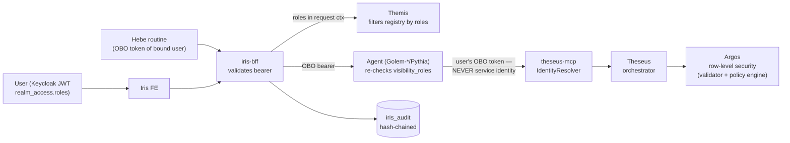

# Kantheon — Security Architecture (authorization + audit)

> **Status:** v0.1 — locked 2026-06-12 as the PD-8 resolution (Bora-approved). Cross-cutting; applies to every agent and both Hebe profiles' `k8s` side.
>
> **Fork executed (Stage 3.6, 2026-06-15):** the platform fork moved the identity/RLS edge in-repo — query-mcp → **theseus-mcp** (IdentityResolver forked unchanged), ai-platform Validator → **Argos** (validator + in-process policy engine; reads roles from the forwarded bearer, whois hop removed by default). §1, §2, and §3.4 below are rewritten to the in-repo owners; the principle (no *new* authorization engine — the platform's enforcement code is forked intact; RLS at the data layer; OBO everywhere) is unchanged. Reviewed against the Stage 3.6 mocked component tests (`tasks-p3-s3.6-security-review.md` T2–T4). See [`fork/architecture.md`](./fork/architecture.md) §6 + [`fork/contracts.md`](./fork/contracts.md) §3.
>
> **Technical-wave addendum (2026-06-13):** the fork's Phase 5 forks `whois` back in (as a standalone user/role directory + OPA bundle server) and gives Argos a **configurable role source** — see **§3.6**. Identity stays bearer-only at the theseus-mcp edge (D3 intact); whois, when enabled, only *enriches* roles from the ERP hierarchy. Default is `bearer`, so the §1 principle and the §2 flow below are unchanged for any deployment that doesn't opt in.
>
> **Scope:** domain-level authorization, identity propagation, audit trail. Out of scope: row-level security policy *content* (lives in the model — Ariadne — and Argos's in-process policy store), authentication mechanics (Keycloak, platform standard), per-session ACLs/sharing (PD-15, v2).

---

## 1. Principle

Kantheon does **not** build a *new* authorization engine — it forks the platform's enforcement code intact and runs it in-repo. Identity is resolved at the **theseus-mcp** edge (`IdentityResolver`, forked unchanged: Keycloak JWT `realm_access.roles` → `PipelineContext.user_id` / `auth_roles`) and **Argos** (the forked validator + in-process policy engine) applies row-level security predicates (role-gated admin bypass, DF-V02). On top of that enforcement, Kantheon adds the three things it owns:

1. **Domain entitlements** — who may talk to which agent/domain.
2. **Identity propagation discipline** — the user's identity reaches the data layer on every path.
3. **The audit trail** — who asked what and saw which data.

## 2. Identity flow



**The one load-bearing rule:** *agents call theseus-mcp (and every data tool) with the user's on-behalf-of token, never a service identity.* This makes Argos's row-level security work per-user end-to-end with zero new enforcement code. Scheduled turns inherit it automatically — Hebe dispatches with the bound user's OBO token (Hebe arc, locked 2026-06-12).

**Roles transport (locked 2026-06-12, cohesion review D3):** "roles in request ctx" means the BFF **forwards the user's bearer** on the Themis hop — no roles field on `ResolveRequest`. Themis validates the token and reads `realm_access.roles` itself. One identity mechanism on every hop; no trust-upstream role claims.

### 2.1 Token lifetime for long-running agents (locked 2026-06-12, cohesion review D7)

The OBO rule meets reality at investigation timescales: a Pythia run can outlive the access token, and `AWAITING_*` pauses last days. The v1 stance is **fail closed, resolved by resume**:

- Resume-triggered work (clarification answers, budget decisions, `replay`/`reproduce`, artifact refresh `manual`/`on_open`) always runs under the **fresh bearer of the triggering request** — no stored tokens.
- A mid-flight step whose data call fails on token expiry parks the investigation as `AWAITING_USER_INPUT` with a Rule-6 message ("session expired — resume to continue"); checkpointed work is preserved, PD-5 resume semantics re-materialize what's needed under the new token.
- Hebe's scheduled paths are unaffected — its OBO token service (Hebe Stage 2.3) mints/refreshes per run.
- An agent-held token-exchange/refresh mechanism (run-scoped, bounded by run lifetime) is **deferred to v1.1** — see `kantheon-v1.1.md` §1; trigger: the first real investigation failing on expiry at a customer.

## 3. Domain entitlements

### 3.1 Declaration — `visibility_roles` on the manifest

`AgentCapability` gains `repeated string visibility_roles = 17` (capabilities/v1; mirrored in `themis/contracts.md` §1.1). Empty = visible to all authenticated users. Example: the accounting Golem declares `visibility_roles: [kantheon-area-accounting]`.

**Role naming convention (locked; renamed `domain → area` 2026-06-25):** per-**area** realm roles `kantheon-area-<area>` (e.g. `kantheon-area-accounting`, `kantheon-area-hr`), created at Shem onboarding and mapped to the customer's existing groups **in Keycloak**, not in manifests. Manifests stay portable across customers; the customer-specific mapping lives where group management already happens. *("area" is the subject-area term; "domain" is now a TTR value concept — see CLAUDE.md vocabulary canon.)*

### 3.2 Enforcement point 1 — Themis filtering

Themis filters its routing view by the caller's roles **before Layer 1 scores**: a non-entitled agent is *invisible, not forbidden* — never scored, never in a Layer 2 prompt, never a Layer 3 chip alternate. (Composes with the Hebe-arc rule: the routing view excludes `non_routable` entries first, then filters by roles.)

- If no agent survives filtering → `RefusalWithGaps` with gap kind `NO_ENTITLED_AGENT = 5`.
- **Explicit naming (locked: reveal existence, deny access):** when the user names a domain they cannot access ("ask HR…"), Themis refuses with `NO_ENTITLED_AGENT` and a description that names the domain — "the HR domain exists; your account has no access to it" — rather than pretending it doesn't exist. Honest and debuggable; full invisibility was considered and rejected.

### 3.3 Enforcement point 2 — agent-side re-check

Every agent validates the inbound bearer and re-checks its own `visibility_roles`. Covers Themis-bypassed paths (direct API callers, future programmatic clients). One policy check at request admission; reject = 403 with a Rule-6 message.

### 3.4 Enforcement point 3 — the data layer (in-repo: Argos)

Row-level scoping within a domain is **Argos's** job (the forked validator + in-process policy engine), driven by the identity in `PipelineContext` (§2 rule). A `ShemManifest` may *reference* the applicable policy for documentation; Kantheon never *re-implements* RLS — it forks the platform's RLS code and runs it in-repo. The policy content lives in Argos's policy store (`argos.policies`, default `tenant_isolation`; `ARGOS_POLICIES_FILE` override) rather than across a repo boundary.

### 3.5 Pythia cross-domain rule (locked: constrain and disclose)

Pythia plans against the registry *as filtered by the user's roles*: Shems and tools the user is not entitled to are not planning material. On partial entitlement the investigation **proceeds, constrained**, and the `Conclusion` discloses the exclusion ("HR data excluded — no access") as a `LooseEnd` + conclusion note. Refusing the whole investigation was considered and rejected.

### 3.6 Argos role source — `bearer` default, `whois` opt-in (fork Phase 5, 2026-06-13)

> **Implemented (fork Stage 5.3, 2026-06-24).** `RoleSource` (`BearerRoleSource` default | `WhoisRoleSource`) lives in `services/argos/.../roles/`; `ArgosServiceImpl` resolves the effective role set through it before the admin gate + SecurityApplier and writes it back into `PipelineContext.auth_roles`. The `whois` lookup (`KtorWhoisRoleLookup`) enforces the envelope + fail-closed posture below, all covered by mocked unit/component tests. Wire surface unchanged; the default posture is byte-for-byte the Phase-3 behavior.

Where §3.4's RLS gets the user's **roles** is configurable per deployment (`argos.roleSource`, default `bearer`). This is a sourcing knob on the data layer, not a new enforcement point — the §1 principle (Kantheon builds no authorization engine) holds in both modes.

- **`bearer` (default):** Argos derives `auth_roles` from the forwarded bearer's `realm_access.roles` — the post-fork behavior of §2/§3.4, no whois dependency, no per-query hop.
- **`whois` (opt-in):** for deployments whose RLS depends on **ERP-sourced roles or a role hierarchy that Keycloak does not stamp into the token**, Argos resolves base roles from the bearer and then **enriches** them via the forked whois service (`GET /whois?userId=…`), keyed by the bearer-trusted `user_id`. Results are cached (TTL) so the hot path takes the whois hop at most once per user per TTL.

**The invariant that keeps this from reopening D3:** identity is resolved **exclusively** at the theseus-mcp edge from the user's OBO bearer. whois is a *role-enrichment* source, never an identity authority — a whois response keyed to any `user_id` other than the bearer's is rejected, and whois being unreachable in `whois` mode **fails closed** (Rule-6 message, §2.1 semantics), never widening the role set. So enabling `whois` adds roles a deployment has deliberately chosen to honor; it never changes *whose* roles are used. Default-off means the §2 flow and the Phase-3 security posture are unchanged unless a deployment explicitly opts in. Contract: [`fork/contracts.md`](./fork/contracts.md) §3.

## 4. Audit trail

### 4.1 Owner and content

**Iris-BFF owns the audit log** — it already holds who/when/what: the question, the `RoutingDecision`, and (post-PD-1) `applied_context` + `ViewProvenance` per turn, which is precisely *what data the user saw* (pattern/SQL/args/row count). Audited events: turn finalization, typed actions (sort/filter/paginate/drilldown re-issues; `reask_agent` audits as a typed action), exports, clarification resumes, `InvestigateChip` escalations, artifact refreshes (PD-6, `event_kind: artifact_refresh`), session shares (future, PD-15).

### 4.2 Shape — Hebe's receipts pattern, verbatim

One chained-log format across the constellation (consolidation): the `receipts` shape from the Hebe arc (`hebe/contracts.md` §4.3).

```sql
CREATE TABLE iris_audit (
  seq        bigint GENERATED ALWAYS AS IDENTITY PRIMARY KEY,
  ts         timestamptz NOT NULL,
  user_id    text NOT NULL,
  event_kind text NOT NULL,        -- turn | typed_action | export | resume | escalation | artifact_refresh
  payload    jsonb NOT NULL,       -- question, routing decision, agent_id, applied_context,
                                   -- view provenance (pattern_id/sql/args/total_rows), refs
  segment    text NOT NULL,        -- "YYYY-MM" — retention + verification unit
  prev_hash  text NOT NULL,        -- self_hash of seq-1; segment header anchors to the
                                   -- previous segment's terminal hash
  self_hash  text NOT NULL,        -- sha256(canonical(payload) + prev_hash)
  sig        text NOT NULL         -- Ed25519 over self_hash (iris-bff signing key)
);
-- append-only: app role has INSERT + SELECT only
```

### 4.3 Retention (locked: configurable)

Config key `iris.audit.retention_months` (default: unlimited — Hebe's never-delete instinct). Retention operates on **whole monthly segments**: a segment past retention is exported to cold storage (file dump incl. its terminal hash) and its rows deleted by a maintenance job using a privileged role; later segments stay verifiable because each segment header anchors to the previous segment's terminal hash. Verification endpoint: `GET /v1/audit/verify?segment=YYYY-MM` (admin-role gated).

## 5. What was rejected

- **Separate ACL service / policy DB** — roles-in-JWT + manifest declarations cover v1; an ACL store solves a multi-tenancy problem we don't have yet.
- **Per-session ACLs** — sharing semantics, not security; deferred with PD-15.
- **Full domain invisibility on explicit naming** — rejected for reveal-and-deny (§3.2).
- **Refusing partially-entitled investigations** — rejected for constrain-and-disclose (§3.5).
- **A second chained-log format** — Iris audit reuses Hebe's receipts shape.

## 6. Contract insertion points

| Doc | Change |
|---|---|
| `shared/proto/.../capabilities/v1/capabilities.proto` | `repeated string visibility_roles = 17` on `AgentCapability` |
| `themis/contracts.md` | field mirror; `GapKind.NO_ENTITLED_AGENT = 5`; routing-view filter rule |
| `iris/contracts.md` §3 | `iris_audit` DDL + audit event list + retention config key |
| `golem/contracts.md` / `pythia/contracts.md` | request-admission re-check note — **landed 2026-06-12 (cohesion review)**: golem §2, pythia §2; rule stays normative here |
| Shem onboarding (PD-12 toolchain, later) | create `kantheon-area-<area>` realm role as an onboarding step |
| `services/argos` `application.conf` + `fork/contracts.md` §3 | `argos.roleSource = bearer \| whois` (default `bearer`) + `argos.whois.{baseUrl,cacheTtlSeconds}` — the §3.6 knob; **landed fork Stage 5.3 (2026-06-24)** |

---

*Doc owner: Bora. PD-8 resolution; update on every load-bearing security decision.*
