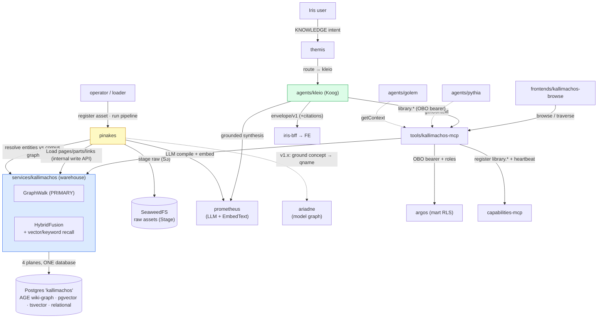

# The Librarian — Solution Architecture (DocWH: Pinakes · Kallimachos · Kleio, Phases 1–5)

> **Scope.** Kantheon-side architecture for the **Document Warehouse (DocWH)** — a wiki-structured knowledge warehouse over the enterprise corpus, of which RAG-serving is *one* use case among conversation (NotebookLM) and browse. Four runtime modules + a stage tier:
> - **Stage** — raw assets in SeaweedFS (the platform object store).
> - **`services/pinakes`** — pipeline manager + asset catalog + lineage + the **LLM compile** that turns sources into a wiki. The write path.
> - **`services/kallimachos`** — the corpus warehouse (wiki pages + parts + the four planes) + retrieval. The read path.
> - **`tools/kallimachos-mcp`** — thin MCP wrapper for the read/RAG/browse surface.
> - **`agents/kleio`** — the conversational NotebookLM agent over a mart.
>
> **The reframe (Bora, 2026-06-20).** The seed repo `~/Dev/doc-store` was a *RAG-store*. The target is a **DocWH** on the data-warehouse analogy: **Stage → ETL pipelines → warehouse → marts → serving**. Building on Karpathy's *LLM Wiki* (`gist.github.com/karpathy/442a6bf555914893e9891c11519de94f`): the corpus is not a chunk heap re-derived per query — it is a **compiled, interlinked, compounding wiki** (entity/concept pages, materialised cross-references, flagged contradictions) that sits between the user and raw sources. RAG retrieves against the compiled wiki; it does not rediscover from scratch.
>
> **The two-tier names** (`CLAUDE.md` §2 — speaking gods vs serving figures). **Kleio** (Muse of records) is the agent. **Kallimachos** (the Alexandria librarian) is the warehouse engine. **Pinakes** (the catalogue Kallimachos authored — what exists and where) is the pipeline/catalogue manager. Historically apt: Kallimachos *wrote* the Pinakes.
>
> **Locked decisions (brainstorm 2026-06-20).** Ktor + Exposed + Koog, no Spring. **Single Postgres**, all four planes (pgvector + tsvector + Apache AGE + relational). **Graph-primary retrieval** (the wiki-graph is the backbone; vector + keyword are recall boosters — the inverse of doc-store). **LLM compile in v1** (entity/concept page synthesis + cross-linking). **One multilingual embedding model corpus-wide** (a conformed dimension; per-type variation lives in chunking, not the model). **Embeddings via Prometheus** (`EmbedText`, additive). **Notebooks = marts** (m:n shared-pool membership; owner + `visibility_roles`; **read-only v1 except pipelines**). **Ariadne convergence noticed, bridged-not-merged** (§12). Kleio is **routable** (`KNOWLEDGE` intent) + picker. Qdrant/OpenSearch/Neo4j → v1.1.
>
> **Reads with.** [`./contracts.md`](./contracts.md), [`../../implementation/v1/kleio/plan.md`](../../implementation/v1/kleio/plan.md), [`../golem/architecture.md`](../golem/architecture.md) (Koog turn/envelope patterns Kleio borrows), [`../charon/architecture.md`](../charon/architecture.md) (`services/` + Seaweed conventions), [`../ariadne/architecture.md`](../ariadne/architecture.md) (the metadata/model graph — §12 bridge), [`../kantheon-architecture.md`](../kantheon-architecture.md) §7.1 (one-PG topology), [`../kantheon-security.md`](../kantheon-security.md) (OBO + Argos + `visibility_roles`). Seed repo: `~/Dev/doc-store`.

## 1. Architectural goal — five deployable outcomes

1. **Phase 1 — warehouse core + stage.** `services/kallimachos` (Ktor + Exposed) on **one Postgres**: sources + parts + notebooks(marts); mechanical ingestion (parse txt/md/html/pdf → `DocNode` → parts, one ACID transaction); keyword `query` + `getById`. `services/pinakes` skeleton: raw assets staged to SeaweedFS + an asset catalogue. Deployed to local K3s.
2. **Phase 2 — retrieval planes + graph-primary `getContext`.** pgvector plane + the Prometheus embeddings client; Apache AGE plane (sources/parts structure + `CONTAINS`); `getContext` as a **graph-led** fusion (graph walk first, vector + keyword recall-boost) over source parts — already useful RAG.
3. **Phase 3 — Pinakes pipelines + the LLM wiki-compile.** The stage library + a handful of per-source named pipeline DAGs; the **compile** stage (entity/concept extraction → page synthesis via Prometheus → cross-linking → **global entity resolution** → contradiction flags), loaded into Kallimachos. The corpus becomes a wiki; `getContext` now leads with concept/entity pages. The `concept_ref` Ariadne seam is reserved here.
4. **Phase 4 — serving: MCP + identity + browse.** `tools/kallimachos-mcp` (`library.*` — getContext / search / findSimilar / traverse / browse) + `ToolCapability` registration; **OBO bearer + Argos** notebook RLS; Golem/Pythia consume `getContext` (RAG GA); a minimal wiki **browse** frontend.
5. **Phase 5 — `agents/kleio` (NotebookLM).** Koog graph: scope-to-mart → graph-primary retrieve → grounded synthesis (Prometheus) → `envelope/v1` with per-claim `BlockProvenance` + Drilldown-to-source; artifact generation (summary/FAQ/timeline/briefing); the `KNOWLEDGE` intent in Themis + the Iris notebook picker.

**Use cases the DocWH serves (RAG is one of three):** RAG-serving (`getContext` → Golem/Pythia, from P2/P4); conversational notebooks (Kleio, P5); wiki browse (FE, P4). Plus the v1.x horizon: the Ariadne concept bridge (§12) and Karpathy's write-back loop (answers filed as pages).

## 2. The warehouse spine (the DWH analogy, made literal)

```
  STAGE              PIPELINES (Pinakes)            WAREHOUSE (Kallimachos)        MARTS         SERVING
 ┌───────┐   ┌──────────────────────────────┐   ┌──────────────────────────┐  ┌─────────┐  ┌──────────────┐
 │Seaweed│──▶│ extract→classify→chunk  [head]│──▶│  CORPUS = wiki           │──│notebook │──│ getContext   │ →Golem/Pythia
 │ raw   │   │  ───────────────────────       │   │  sources · parts · PAGES │  │ = mart  │  │ Kleio (chat) │ →Iris user
 │assets │   │  embed→COMPILE→link→resolve    │   │  (entity/concept/summary)│  │ (subset │  │ browse (wiki)│ →FE
 │(PDF…) │   │  [conformed, shared tail]      │   │  4 planes, ONE Postgres  │  │  m:n)   │  └──────────────┘
 └───────┘   └──────────────────────────────┘   └──────────────────────────┘  └─────────┘
                         ▲ LLM (Prometheus)              ▲ AGE wiki-graph = backbone
```

- **Stage** is immutable raw truth (Karpathy's "raw sources"). Reuses the platform SeaweedFS S3 gateway (`data-seaweedfs:8333`) Charon already lands Arrow into — reuse the infra, not the Charon service (raw blobs go direct via the S3 SDK).
- **Pipelines** are the ETL: a *head* that varies per source (extract + chunk) and a **conformed tail** every pipeline shares (embed in the one space → LLM compile → link → globally resolve entities → load). Pinakes owns definitions, runs, and lineage (asset → run → corpus entries).
- **Warehouse** is the compiled wiki (Kallimachos): immutable-ish **source** parts + LLM-authored **pages** + the four planes, with the **AGE wiki-graph as the primary structure**.
- **Marts** are notebooks — m:n subsets/views over the corpus (subgraphs), owner + role scoped.
- **Serving** is the three use cases over marts/corpus.

## 3. Tech stack

| Layer | Choice | Why |
|---|---|---|
| Service language / framework | **Kotlin 2.x + Ktor 3.2.x** | kantheon idiom; replaces doc-store's Spring Boot (no Spring in the tree) |
| Persistence DSL | **Exposed (DSL, not ORM)** + Flyway | doc-store precedent; `AGENTS.md` rule; one idiom with iris-bff/midas-core |
| Service protos | **`org.tatrman.pinakes.v1`**, **`org.tatrman.kallimachos.v1`** | platform-service convention `org.tatrman.<service>.v1` |
| Agent proto | **`org.tatrman.kantheon.kleio.v1`** | constellation/agent contract convention |
| Agent framework | **Koog 0.8.x** (`AIAgentStrategy`) | graph-shaped flow; reuses Golem's node-port patterns |
| Store — four planes | **One Postgres**: pgvector · `tsvector` · **Apache AGE** (openCypher) · Exposed tables | doc-store has 3/4 PG adapters; single-PG = topology §7.1 + ACID ingestion, zero new infra |
| LLM (compile + synthesis) | **Prometheus** (`CreateResponse`/`Chat` + additive `EmbedText`) | one model egress; the compile stage is Prometheus-driven |
| Ingestion parsers | jsoup / flexmark / PDFBox / plain — ported from doc-store | already written; framework-agnostic |
| Object stage | **SeaweedFS** (AWS S3 SDK) | reuse the platform gateway; raw-asset landing |
| MCP wrapper | Kotlin MCP SDK (streamable-HTTP) + `capabilities-client` | charon-mcp / metis-mcp template |
| Identity | Keycloak **OBO bearer** at the MCP edge; **Argos** notebook-scope | security §2/§3; replaces doc-store's `X-API-Key` |
| Test stack | Kotest (StringSpec) + MockK + Wiremock + in-memory `Port` fakes | mocked-unit policy (planning-conventions §4) |
| Container / deploy | Jib; Kustomize `base/` + `overlays/local/` | kantheon pattern |

**Polyglot adapters retained, not wired.** doc-store's Qdrant / OpenSearch / Neo4j / Redis / Cosmos adapters survive behind the four `Port`s as a documented scale-out profile; only the single-PG profile is wired and tested at v1. Swapping the vector plane to Qdrant is a config change, not a code change.

## 4. Module map

```
kantheon/
├── services/pinakes/                            # pipeline manager + catalogue + lineage + LLM compile (write path)
│   └── src/main/kotlin/org/tatrman/pinakes/
│       ├── App.kt
│       ├── stage/SeaweedAssetStore.kt           # raw-asset landing (S3 SDK → data-seaweedfs:8333)
│       ├── catalog/{AssetCatalog, Lineage}.kt   # asset → run → corpus entries
│       ├── pipeline/
│       │   ├── Pipeline.kt                       # a named DAG over the stage library
│       │   ├── StageLibrary.kt                   # extract · classify · chunk · embed · compile · link · resolve · load
│       │   ├── Runner.kt                         # executes a run; per-stage status; resumable
│       │   └── stages/{Extract,Chunk,Embed,Compile,Link,Resolve,Load}Stage.kt
│       ├── compile/WikiCompiler.kt               # LLM: entity/concept pages, synthesis, contradiction flags (Prometheus)
│       ├── resolve/EntityResolver.kt             # GLOBAL conformed resolution against the corpus graph (+ Ariadne hook, §12)
│       ├── clients/{KallimachosWriteClient, PrometheusClient}.kt
│       └── observability/Metrics.kt
│
├── services/kallimachos/                         # the corpus warehouse + retrieval (read path)
│   └── src/main/kotlin/org/tatrman/kallimachos/
│       ├── App.kt
│       ├── ingestion/{DocNode, *Handler, ParagraphSplitter}.kt   # PORTED from doc-store
│       ├── corpus/
│       │   ├── Source.kt / Part.kt / Page.kt    # raw source parts + LLM-authored wiki pages
│       │   └── WikiGraph.kt                      # node + edge types (contracts §3)
│       ├── notebook/{NotebookService, MartScope}.kt              # marts; m:n membership; RLS predicate
│       ├── adapters/                             # PORTED ports + wired PG adapters
│       │   ├── relational/{RelationalPort, ExposedRelationalAdapter}.kt
│       │   ├── fulltext/{FullTextPort, PostgresFullTextAdapter}.kt
│       │   ├── vector/{VectorPort, PgVectorAdapter, EmbeddingsPort}.kt
│       │   └── graph/{GraphPort, CypherGraphPort, AgeGraphAdapter}.kt    # AgeGraphAdapter = NEW
│       ├── retrieval/
│       │   ├── GraphWalk.kt                      # PRIMARY: wiki-graph traversal from seed nodes
│       │   ├── VectorRecall.kt / KeywordRecall.kt   # recall boosters
│       │   ├── HybridFusion.kt                   # graph-led fusion → ranked, cited chunks
│       │   └── Citations.kt                      # chunk → BlockProvenance + Drilldown
│       ├── write/LoadApi.kt                      # internal write surface — Pinakes-only (cluster-internal)
│       ├── http/{SearchRoutes, BrowseRoutes, NotebookRoutes, LoadRoutes}.kt
│       └── embeddings/PrometheusEmbeddingsClient.kt
│
├── tools/kallimachos-mcp/                         # thin read/RAG/browse wrapper — Phase 4
│   └── src/main/kotlin/org/tatrman/kallimachos/mcp/{App,McpTools}.kt   # library.* ; OBO bearer forward; zero logic
│
├── agents/kleio/                                 # the NotebookLM agent — Phase 5
│   └── src/main/kotlin/org/tatrman/kantheon/kleio/
│       ├── graph/KleioStrategy.kt                # Koog: scope → retrieve → ground → render
│       ├── nodes/{Scope,Retrieve,GroundedAnswer,Render,Artifact}Node.kt
│       ├── clients/{KallimachosMcpClient, PrometheusClient, CapabilitiesClient}.kt
│       └── persistence/{KleioTurns, NotebookArtifacts}.kt
│
├── frontends/kallimachos-browse/                 # minimal wiki browse FE — Phase 4 (Vue; graph + pages)
│
└── shared/proto/src/main/proto/org/tatrman/
    ├── pinakes/v1/pinakes.proto
    ├── kallimachos/v1/kallimachos.proto
    └── kantheon/kleio/v1/kleio.proto
```

## 5. Component diagram



## 6. The corpus: a wiki, not a chunk heap

Kallimachos stores three node families and a typed edge set (full schema in contracts §3):

- **Source** + **Part** — the ingested document and its paragraph chunks. Faithful, immutable-per-ingest, citeable. (doc-store's whole model.)
- **Page** — LLM-authored wiki pages: `ENTITY`, `CONCEPT`, `SUMMARY`, `OVERVIEW`. Markdown content + frontmatter. Pinakes's compile stage creates and maintains them; one ingested source touches many pages (Karpathy: "10–15 pages").
- **Edges** (the wiki links, in AGE): structural `CONTAINS` (source→part), provenance `DERIVED_FROM` (page→source/part), and the **content links** `MENTIONS`, `ABOUT`, `RELATED`, `SAME_AS`, `CONTRADICTS` (page↔page, page↔entity). These are the "associative trails"; they are what graph-primary retrieval walks.

The wiki is **compounding**: re-ingesting or adding a source updates existing pages and links rather than appending an isolated blob. (Write-back from conversation — Kleio filing good answers as pages — is the Karpathy loop, deferred to v1.x with the rest of the write surface.)

## 7. Pipelines & the stage library (Pinakes)

A **pipeline** is a named DAG composed from a shared **stage library**. The *head* (extract + chunk) varies per source/type; the **tail is conformed** and shared by every pipeline:

```
[head, per-source]            [tail, conformed — shared by all pipelines]
extract → classify → chunk  →  embed → compile → link → resolve(GLOBAL) → load
```

- **Per-source binding, not per-document auto-classification.** Each feed (ERP export, SharePoint, Confluence, Slack) declares its pipeline; Pinakes records `asset → feed → pipeline run → corpus entries` lineage. Auto-classification can be a branch *inside* a pipeline. "A handful, not hundreds."
- **`embed` is conformed.** One multilingual model for the whole corpus (§11) — it lives in the pipeline definition but must agree across all pipelines feeding one corpus (disagreement = two corpora, not one).
- **`compile` is the valuable, expensive, LLM-driven stage** — entity/concept extraction, page synthesis, contradiction detection (Prometheus). This is the DocWH's differentiator, far more than chunk/embed plumbing.
- **`resolve` is GLOBAL and conformed.** Entity resolution reconciles against the *whole* corpus graph so "Kaufland" is one node regardless of feed — pipelines branch at the head but **must funnel through one resolver**, or the wiki fragments. This is also the Ariadne bridge insertion point (§12).
- **`load` is the only writer** of the corpus (Kallimachos internal `LoadApi`, Pinakes-only).

## 8. Retrieval — graph-primary `getContext`

The inversion from doc-store (which is vector-primary, graph-reranks): here the **wiki-graph leads**.

1. **Seed.** Resolve the query to seed nodes — entity/concept pages via the catalogue index + an entity match, plus a vector recall pass to catch nodes the index missed.
2. **Walk.** Traverse the wiki-graph from the seeds along content links (`ABOUT`/`RELATED`/`MENTIONS`/`SAME_AS`), gathering relevant pages and their `DERIVED_FROM` source parts; honour the mart subgraph (notebook scope).
3. **Boost.** Vector KNN + keyword (tsvector) add recall for chunks the graph didn't reach.
4. **Fuse.** `HybridFusion` ranks (graph proximity weighted first), returns top-k **chunks with citations** (page/source/part refs). Pure retrieval — no LLM.

`getContext` is what Golem/Pythia embed in their own answers (the RAG use case). Karpathy's note that the index + links carry retrieval at moderate scale is exactly why the graph leads and vectors assist, not the reverse.

## 9. Notebooks (marts), identity, entitlements

- **Notebook = a mart**: an m:n subset of the corpus (a subgraph), owner `user_id` + `visibility_roles`. The corpus is the DWH; marts are curated views. Documents live in a shared pool and are compiled/embedded **once**, referenced by many marts (no re-ingest, no re-embed).
- **Visibility:** a caller may read mart `N` iff `N.owner == caller` **OR** `N.visibility_roles ∩ caller_roles ≠ ∅` — roles from the **forwarded OBO bearer** (Argos `bearer` source, security §3.6), never service identity. Notebook is the authorization unit (a chunk is readable via a mart you may read); "add document to mart" is the share action and is itself permission-checked (v1.x write).
- **Enforcement** at the `kallimachos-mcp` edge before the store is touched; the store filters by the scoped mart (defence in depth). `kallimachos_mart_rls_denied_total` watched; audit row per ingest/retrieval (security §4 receipts).
- **v1 is read-only except pipelines.** The only write is Pinakes ingestion; users query and browse, they do not edit the wiki.

## 10. Build/test/deploy flow

Per-module Gradle subprojects; Jib images; Kustomize `base/` + `overlays/local/` (`imagePullPolicy: Never`). `just proto` regenerates the three packages. CI: `init → lint-check → test-all` (mocked unit/component only — §13). Tags per module (contracts §11). One internal Kantheon Postgres hosts the `kallimachos` and `kleio` databases (topology §7.1); the `vector` + `age` extensions are installed cluster-side (confirmed available, Bora 2026-06-20).

## 11. Embeddings as a conformed dimension

One multilingual embedding model (e.g. BGE-M3 / multilingual-e5 / text-embedding-3) for the **whole corpus** — preserving a single comparable space and, crucially, **cross-lingual recall** (a Czech query retrieving an English page; Kantheon is cs+en). Per-document-type *models* are rejected: they fragment the space and break cross-type/cross-lingual KNN for a marginal within-domain gain; the per-type budget goes to **chunking** (same space) and the **compile** stage instead. Vectors are keyed by `(part, model_id, model_version)` so a model upgrade is a clean dual-write re-embed (doc-store already carries those columns). The model is declared in the pipeline `embed` stage but is a conformed corpus property.

## 12. Future convergence with Ariadne — the bridge, not the merge

**Noticed now, planned as a bridge, unified far later (Bora: "somewhere in v6.3 they become one").** Two graphs describe the same concepts from opposite ends: **Ariadne** maps a concept *down* to its data representation (`Customer` → `dim_customer`, `qname`-addressable; physical + E-R today, multidimensional + conceptual/ontology to come — it already exposes `ObjectDescriptor.kind="entity"` and a Phase-2.2 "conceptual roles" surface). **Kallimachos** compiles a concept *up* from prose (`Customer` → a concept page synthesised from documents). The convergence node is the concept/entity.

The bridge currency already exists in the constellation: **`common/v1.EntityBinding`** (`entity_type`, `entity_id`, …) — how Themis/Golem/Pythia already pass resolved entities, carried across agents by `HandoffContext`. The seam is two cheap v1 affordances, zero Ariadne coupling now:

- Every Kallimachos **concept/entity node carries an optional `concept_ref`** shaped as `EntityBinding` (able to hold an Ariadne `qname` later). v1: wiki-local / null. The *field exists*, so nothing is re-modelled when the bridge lands.
- The **global `EntityResolver` (§7) gains an optional Ariadne grounding source** later — additive, exactly the `bearer | whois` pattern Argos already uses: v1 resolves against the wiki; a future flag also calls `Ariadne.Search`/`GetObject` to ground an extracted concept to a model `qname` and writes a cross-graph `SAME_AS`/`denotes` edge.

Staged path: **(1) v1** — independent graphs, reserved `concept_ref`; **(2) bridge** — resolver optionally grounds against Ariadne → cross-graph edges + Kleio emitting `EntityBinding`s so "I read about churn" → "show me the churn numbers" rides the *existing* `HandoffContext` handoff (docs→data), and Golem/Ariadne pull `getContext` to explain a model element in prose (data→docs); **(3) v6.3** — one conceptual model both sides project from. Only step 1 is in this arc, and it is nearly free. **The merge itself is explicitly out of scope here.**

## 13. Observability & testing

```
pinakes_pipeline_runs_total{pipeline, result} / pinakes_run_duration_ms
pinakes_compile_pages_written{kind} / pinakes_compile_llm_calls_total{result}
pinakes_entities_resolved_total{outcome="new|merged"}            (wiki coherence signal)
kallimachos_ingest_total{format,result} / kallimachos_pending_embeddings (gauge)
kallimachos_retrieval_total{lead="graph", boosted="vector|keyword"}
kallimachos_graph_walk_depth / kallimachos_retrieval_candidates{plane}
kallimachos_mart_rls_denied_total                                (security signal)
kleio_turns_total{status} / kleio_grounded_citations{count} / kleio_artifact_total{kind}
```

Testing — **mocked unit/component only** inside stages (planning-conventions §4); Testcontainers/integration/e2e separate. Unit: parsers → `DocNode`; `HybridFusion` graph-led ranking; `WikiCompiler` page-synthesis prompt shaping (Wiremock Prometheus); `EntityResolver` merge/new logic; citation mapping; RLS predicate. Component: ingestion fan-out over four `Port` fakes in one tx; a pipeline run end-to-end over fakes producing pages + links; Kleio Koog graph with a mock executor asserting every cited claim has a retrieved source. Deferred to integration: real pgvector recall, AGE openCypher round-trips, live Prometheus, OBO/Argos RLS, in-K3s ingest→compile→retrieve→answer e2e.

## 14. Risks

| Risk | Mitigation | Stage |
|---|---|---|
| **LLM compile cost/quality** (the valuable stage is also the expensive one) | per-run token budgets + `pinakes_compile_llm_calls_total`; compile is batch/offline (not query-path); page-synthesis prompts in `prompts/`, eval'd on a fixture corpus; degrade to mechanical-links-only if a run's compile fails (corpus still queryable on source parts) | P3 |
| **Wiki fragmentation** (duplicate entities across feeds) | single GLOBAL `EntityResolver` against the whole corpus graph; `pinakes_entities_resolved_total{merged}` watched; resolver is conformed-tail, never per-pipeline | P3 |
| **Apache AGE adapter is net-new** (doc-store has no AGE) | AGE = openCypher → reuse doc-store `CypherGraphPort` DSL; only the driver layer is new; spike-gate in P2; fallback = adjacency tables behind `GraphPort` | P2 |
| **Prometheus has no embeddings RPC** | `EmbedText` additive (contracts §10) — P2 pre-flight; fallback = doc-store `RemoteHttpEmbeddingsClient` behind `EmbeddingsPort` | P2 |
| **Graph-primary retrieval underperforms a thin wiki** (early corpus has few pages) | P2 `getContext` works on source parts (vector+keyword) before pages exist; graph lead degrades gracefully to recall-only until the compile (P3) thickens the wiki | P2→P3 |
| **Cross-mart leakage** (RAG over "my sources") | RLS at the MCP edge against bearer roles + owner; security-note sign-off at P4; callers forward the user bearer, never service identity | P4 |
| **Two service conventions (Pinakes write vs Kallimachos read) drift** | Kallimachos `LoadApi` is the only corpus writer; Pinakes never touches PG directly; boundary asserted in component tests | P3 |
| **`KNOWLEDGE` intent + `KNOWLEDGE_QA` kind** touch `capabilities/v1` / Themis | additive enums (proto3-safe); land with Themis P3; counter-examples keep doc questions off Golem/Pythia | P5 |
| **Ariadne bridge tempts early merge** | §12 keeps it a reserved slot + additive resolver source; merge explicitly out of scope; revisit at the multidimensional/ontology Ariadne milestone | — |
| Spring→Ktor rewrite drops a doc-store behaviour | port the `Port`/adapter + ingestion code as-is (framework-agnostic); the doc-store test corpus is the parity oracle | P1 |

## 15. References

- [`./contracts.md`](./contracts.md) — wire contracts (companion). [`../../implementation/v1/kleio/plan.md`](../../implementation/v1/kleio/plan.md) — phased plan.
- Seed repo `~/Dev/doc-store` — `docs/kotlin/architecture.md`, `docs/history/{requirements,workplan}.md`, `req-multi-backend.md`, `com.docstore.{service,ingestion,model}`.
- Karpathy, *LLM Wiki* — `https://gist.github.com/karpathy/442a6bf555914893e9891c11519de94f` (compiled, compounding, interlinked corpus; ingest/query/lint; index + log; Memex lineage).
- Patterns reused: [`../golem/architecture.md`](../golem/architecture.md) (Koog `AIAgentStrategy`, trust-Themis, envelope emission); [`../charon/architecture.md`](../charon/architecture.md) (`services/` conventions, Seaweed gateway).
- Contracts referenced: `envelope/v1` (`Block` + `BlockProvenance` + `Drilldown`), `capabilities/v1` (`AgentCapability`/`ToolCapability`, additive `KNOWLEDGE`/`KNOWLEDGE_QA`), `common/v1` (`EntityBinding`, `HandoffContext`, `ViewProvenance` — the §12 bridge currency), `org.tatrman.prometheus.v1` (`EmbedText` additive), `org.tatrman.ariadne.v1` (`ObjectDescriptor`/`qname` — §12).
- Libraries: Exposed, pgvector, Apache AGE (openCypher-on-PG), jsoup/flexmark/PDFBox, Koog (`~/Dev/view-only/koog`), Kotlin MCP SDK (`~/Dev/view-only/kotlin-mcp-sdk`). `ai-platform/EXAMPLES.md` §1/§2/§3.

---

*Architecture owner: Bora. Librarian/DocWH arc planned 2026-06-20 — the constellation's knowledge-warehouse citizen, forked and re-scoped from `~/Dev/doc-store` (RAG-store → DocWH).*
