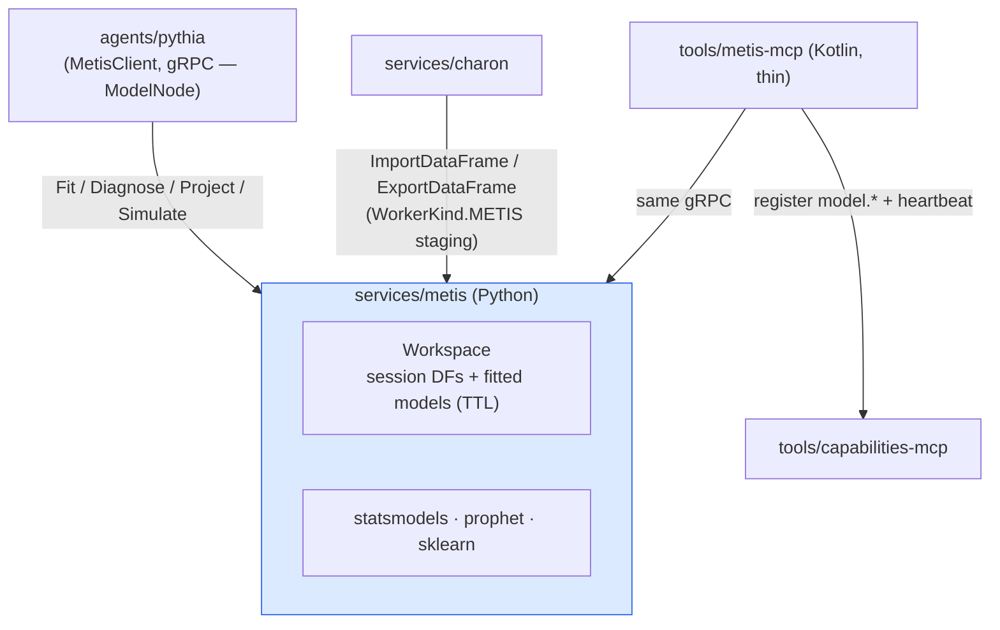

# Metis — Solution Architecture (kantheon arc, Phases 1–3)

> **Scope.** Kantheon-side architecture for **Metis**, the model-estimation service: `services/metis` (Python — full-spec engine, gRPC) + `tools/metis-mcp` (thin Kotlin wrapper). Second platform-grade service in kantheon's migration direction.
>
> **Python lane (amended 2026-06-12 by fork Phase 1 Stage 1.1 T4).** Metis is **the first** of the three kantheon Python modules — Kadmos (NLP) and Steropes (Polars Worker) join it under the conventions settled in [`../../AGENTS.md`](../../AGENTS.md) §4.1 (uv, `just test-py/lint-py`, CI lane). The earlier "only Python module" framing is superseded by [`docs/architecture/fork/contracts.md`](../fork/contracts.md) §6.
>
> **What Metis is.** Fit / diagnose / project / simulate over prepared time series: SARIMAX (statsmodels, auto-order), Prophet, linear regression. Metis does **no data wrangling** — inputs arrive as prepared Arrow series (staged into its session workspace by Charon, or inlined for small series); outputs are Arrow (forecast frames) and in-session model artifacts. `model.decompose.variance` is v1.5 (Pythia backlog).
>
> **Why Python (locked 2026-06-12).** The moat is estimation, not computation: SARIMAX with seasonal auto-order + diagnostics (Ljung-Box, ADF, residual normality) exists mature only in statsmodels; **Prophet has no JVM implementation** (Python/R over Stan). Same rule that put `infra/nlp` in Python: the service lives where the ecosystem lives. Dataframe math stays in the Polars Worker; folding Metis into that worker was rejected (image bloat on the hot query path — prophet+cmdstan; coupled failure domains; opposite scaling profiles; `Execute(plan)` doesn't express fit/project lifecycles; and the worker is ai-platform-owned — the wrong direction).
>
> **Reads with.** [`./contracts.md`](./contracts.md), [`../../implementation/v1/metis/plan.md`](../../implementation/v1/metis/plan.md), [`../pythia/architecture.md`](../pythia/architecture.md) (primary consumer — ModelNode), [`../charon/contracts.md`](../charon/contracts.md) (staging into Metis sessions; `WorkerKind.METIS`), `Pythia-v1-Design.md` §6.2 (Metis origin) + §4.3 (forecast worked example — the acceptance scenario).

## 1. Architectural goal

Three deployable outcomes:

1. **Phase 1:** `services/metis` in local K3s — proto, session workspace (Arrow DFs + fitted-model registry, TTL, caps — ported from the Polars Worker's workspace patterns), `ImportDataFrame`/`ExportDataFrame`/`Drop` surface so Charon can stage in/out. Kantheon's Python-module conventions settled (uv, `just build-py/test-py`, CI lane).
2. **Phase 2:** Models live — `Fit` (LINEAR, ARIMA with auto-order, PROPHET), `Diagnose`, `Project` (with CI bands), `SimulateScenario`. Numerical golden suite pins results against reference notebooks.
3. **Phase 3:** Constellation wiring — Charon `WorkerKind.METIS` activation, `tools/metis-mcp` + `model.*` ToolCapability registration with benchmarked cost hints, observability. Gates Pythia Phase 4 Stage 4.2 (forecast/simulation e2e).

## 2. Tech stack

| Layer | Choice | Why |
|---|---|---|
| Language / runtime | **Python 3.13 + uv** | library moat; mirrors `workers/polars` conventions |
| Serving | **grpcio** (`org.tatrman.metis.v1.MetisService`) + FastAPI probes (`/health`, `/ready`, `/metrics`) | worker pattern; gRPC is the service-to-service protocol |
| Estimation | **statsmodels** (SARIMAX, diagnostics), **prophet** (cmdstanpy backend), **scikit-learn** (linear; later regressors) | the moat itself |
| Data | **pyarrow** (IPC in/out), **polars** (light frame handling only — no wrangling API exposed) | P8: Arrow everywhere |
| Workspace | session store keyed `(session_id, name)` for **DataFrames and fitted models**, idle-TTL + caps — port of `workers/polars` `workspace.py` | proven pattern; sticky-session affinity per design |
| Proto | `org.tatrman.metis.v1` in kantheon `shared/proto` (Python bindings via `just proto` — already emitted) | migrated-service package convention |
| Wrapper | `tools/metis-mcp` — **Kotlin**, ktor-configurator MCP base, zero logic | constellation wrapper idiom (charon-mcp twin) |
| Test stack | pytest + pytest-asyncio + in-process gRPC; **numerical golden fixtures** with tolerances | ruff + mypy strict (worker conventions) |
| Container | Dockerfile (uv multi-stage; **prophet/cmdstan in a cached base layer** — build-time risk control) | Jib is JVM-only |

## 3. Module map

```
kantheon/
├── services/metis/                            # the first of the three Python modules (Kadmos, Steropes)
│   ├── src/metis/
│   │   ├── main.py                            # gRPC server + FastAPI probes bootstrap
│   │   ├── grpc_service.py                    # MetisService — RPC impls, validation
│   │   ├── workspace.py                       # session store: DFs + fitted models; TTL sweeper; caps
│   │   ├── models/
│   │   │   ├── linear.py                      # sklearn/statsmodels OLS; coef table out
│   │   │   ├── arima.py                       # SARIMAX fit (auto-order), project w/ CI bands
│   │   │   ├── prophet_model.py               # prophet fit/project (regressors v1.x)
│   │   │   ├── diagnostics.py                 # Ljung-Box, ADF, residual normality → typed result
│   │   │   └── scenario.py                    # delta application over forecast frames
│   │   ├── arrow_io.py                        # IPC stream read/write, chunking, schema fingerprint
│   │   │                                      #   (same algorithm as workers/polars — shared fixtures)
│   │   └── telemetry.py                       # OTel (worker conventions)
│   ├── tests/                                 # unit + golden/ (reference notebooks → pinned values)
│   ├── pyproject.toml, Dockerfile
│   └── k8s/{base,overlays/local}/
│
├── tools/metis-mcp/                           # thin Kotlin wrapper — Phase 3
│   ├── src/main/kotlin/org/tatrman/metis/mcp/{App.kt, McpTools.kt}
│   ├── src/main/resources/manifests/          # metis.{model.*,data.*}:v1 ToolCapability YAMLs
│   └── k8s/{base,overlays/local}/
│
└── shared/proto/src/main/proto/org/tatrman/metis/v1/metis.proto
```

## 4. Component diagram



Failure isolation: a Stan/optimizer blow-up kills one fit (per-RPC process-pool isolation with timeouts), never query execution — that lives in a different pod and repo.

## 5. Execution model

**Session-centric.** Pythia derives `session_id` from the investigation (sticky affinity); Charon stages the prepared series into the Metis session (`ImportDataFrame`), then Pythia calls `Fit(input_df=…)` → model lands in the same session under `model_name`; `Diagnose`/`Project`/`Simulate` reference it. Small series (< inline cap) may bypass Charon via `inline_arrow_ipc` on `FitRequest`. Outputs (`Project`/`Simulate` forecast frames) are written back as session DFs; Charon materialises them to Seaweed evidence per Pythia's policies. Models are **in-session only** at v1 (TTL-bound; serialisation-to-Seaweed is v1.x — revisit when reproduce() needs frozen models beyond Seaweed evidence frames).

**Long fits.** Sync unary with generous deadlines (config; prophet on long series can take tens of seconds). Per-model-kind timeout + memory caps; `RESOURCE_EXHAUSTED` on cap. Async-job mode is a v1.x trigger (same discipline as Charon/Pythia deferrals).

**Auto-order.** `Fit(ARIMA)` without explicit orders runs a bounded grid/stepwise search (pmdarima-style, implemented over SARIMAX with information-criterion selection); the chosen order is returned in `FitResult` and recorded by Pythia in the step record — reproducibility over magic.

## 6. Deployment topology

`metis` pod (kantheon namespace; gRPC :7261, HTTP probes :7260; CPU-heavy resource profile, no GPU at v1) + `metis-mcp` pod (:7262). Readiness: workspace initialised + estimation libs importable (prophet import is the slow one — readiness gate catches broken images). Scales independently of everything else; one replica at v1 (sessions are pod-local — same constraint and answer as the Polars Worker).

## 7. Observability

```
metis_fits_total{model_kind, result="ok|error|timeout"}
metis_fit_duration_ms{model_kind}            (histogram)
metis_projects_total{model_kind} / metis_simulates_total
metis_diagnose_total{verdict="pass|fail"}
metis_workspace_dfs / metis_workspace_models / metis_workspace_bytes   (gauges)
metis_workspace_evictions_total{reason="ttl|cap"}
metis_auto_order_search_ms                   (histogram)
```

Span per RPC with model_kind + row_count; trace context from Pythia step spans (OTel python, worker conventions).

## 8. Testing strategy

- **Unit:** workspace (port the polars-worker test patterns: TTL, caps, keying), arrow_io fingerprint cross-check against shared fixtures (Python↔Python here, but pinned to the same canonical bytes as Charon/worker), request validation, scenario delta math.
- **Golden numerical suite (the load-bearing layer):** reference notebooks (committed under `tests/golden/notebooks/`) produce pinned values — ARIMA orders + AIC + forecast points + CI bands on reference series (airline-passengers-class fixtures + a Czech-calendar monthly series), prophet changepoint forecasts, OLS coefficients. Assertions with explicit tolerances (`rtol` documented per metric). Library upgrades that move results must update goldens consciously, in a dedicated PR.
- **Component:** full gRPC flows in-process — import → fit → diagnose → project → export; Pythia's design §4.3 forecast example end-to-end with pinned outputs.
- **Integration (K3s):** Phase 3 — Charon stages in/out of a live Metis; Pythia fixture investigation drives ModelNode against it.

## 9. Risks

| Risk | Mitigation | Stage |
|---|---|---|
| prophet/cmdstan image weight + build time | cached base layer in Dockerfile; readiness gate on import; prophet isolated so only Metis pays | P1 |
| Numerical drift across library upgrades silently corrupting forecasts | golden suite with explicit tolerances; goldens change only in dedicated PRs | P2 |
| Auto-order search runaway on pathological series | bounded search space + per-fit timeout + `max_order` config | P2 |
| Python module conventions diverging from Kotlin repo norms (CI, lint, versioning) | Stage 1.1 settles `just build-py/test-py/lint-py` + CI lane once; documented in module README; mirrors ai-platform's uv conventions | P1 |
| Single-replica session locality (pod restart loses fitted models) | acceptable at v1 (re-fit is cheap relative to investigation budgets); Pythia treats `NOT_FOUND` model as re-fittable; serialisation v1.x | P3 |
| Charon `WorkerKind.METIS` interop drift | Import/Export contract tested from Charon's component suite (cross-arc fixture exchange) | P3 |

## 10. References

- [`./contracts.md`](./contracts.md) — wire contracts (companion). [`../../implementation/v1/metis/plan.md`](../../implementation/v1/metis/plan.md) — phased plan.
- Design origin: [`../../design/pythia/Pythia-v1-Design.md`](../../design/pythia/Pythia-v1-Design.md) §6.2 (Metis capability set) + §4.3 (forecast trace = acceptance scenario); deferral record in [`../../implementation/v1/pythia/v1.5-backlog.md`](../../implementation/v1/pythia/v1.5-backlog.md) (`model.decompose.variance`).
- Pattern source: `ai-platform/workers/polars` (`workspace.py`, probes, telemetry, pyproject conventions) — ported, not imported (cross-repo dependency avoided).
- Consumers: [`../pythia/architecture.md`](../pythia/architecture.md) §5 (ModelNode), [`../charon/contracts.md`](../charon/contracts.md) §1 (`WorkerKind.METIS`).

---

*Architecture owner: Bora. Metis arc planned 2026-06-12 — second migrated platform-grade service; first of the three kantheon Python modules (Metis, Kadmos, Steropes — "Kotlin unless a library moat says otherwise").*
