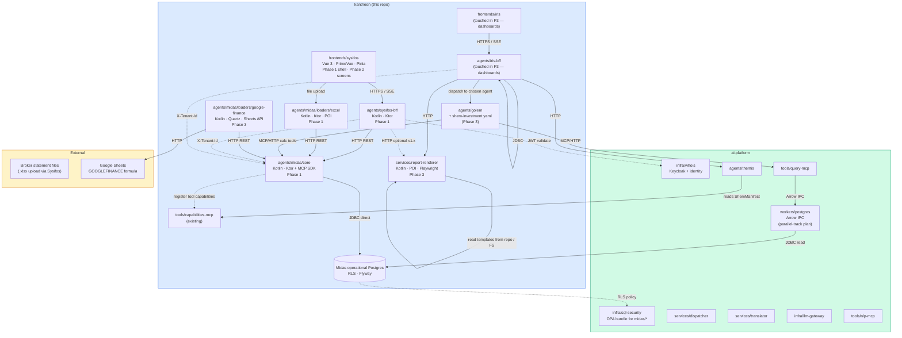
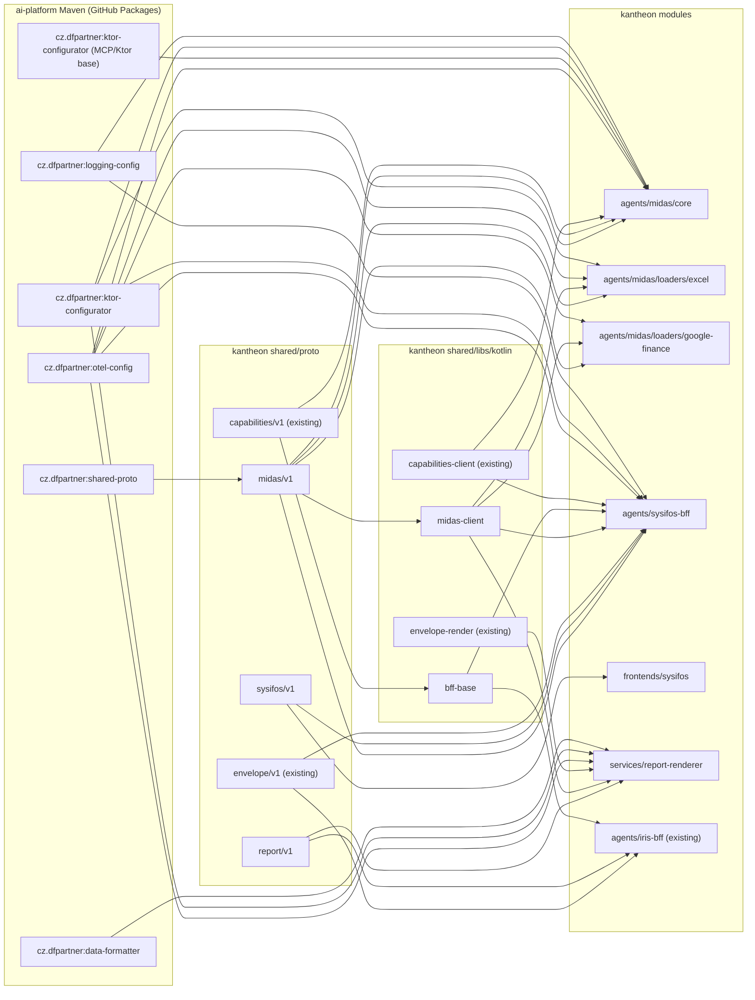

# Midas — Solution Architecture (kantheon arc, Phases 1–3)

> **🔄 SUPERSEDED-PENDING (FO-12, 2026-07-23).** Midas-as-an-app is superseded by the **investment domain
> package** (`kantheon/packages/investment` — one TTR-M model + TTR-P canon + ttrl forms + plugins + golem
> slot), whose two faces replace this arc's surfaces: the deterministic **Studio Data Entry** face (FO-P3)
> supersedes Sysifos, and the **Golem-Investment** agentic face (the package's `golem/config.yaml`, seam
> C-1) supersedes the standalone Midas-core agent. The cash-leg derivation this arc hardcoded in Kotlin
> (`CashLegDerivation`, contracts §1.1.A) is now reviewable TTR-P (`packages/investment/canon/transaction-entry-apply.ttrp`, FO-P4 S3.T3).
>
> **No rug-pull (FO-12).** This is *pending*, not deleted: Midas-core, the loaders, and Sysifos keep
> running on any live estate until that estate is migrated — the cutover is the **LF-5 handoff** wake
> condition (Kantheon-side), NOT this document's retirement. Until LF-5 fires, this architecture remains
> the authority for the running Midas estate. Migration steps: [`./migration-to-investment-package.md`](./migration-to-investment-package.md).
>
> **Scope.** This document describes the kantheon-side architecture for the Midas arc — the brokerage-domain agent constellation. The arc is **consolidated**: it covers Midas-core, Midas loaders, the kantheon-owned operational Postgres, Golem-Investment, the new Sysifos data-entry app (BFF + FE), the `report-renderer` service, and Iris's dashboard-system extensions, all in one arc. The ai-platform PostgreSQL worker is a parallel-track dependency tracked separately at [`../../implementation/v1/_archive/aip-v1-pg-worker-plan.md`](../../implementation/v1/_archive/aip-v1-pg-worker-plan.md).
>
> **Reads with.** [`midas-brief.md`](./midas-brief.md) (the originating brief), [`../kantheon-architecture.md`](../kantheon-architecture.md) (overall constellation), [`../themis/architecture.md`](../themis/architecture.md) (the reference arc, same shape), [`./contracts.md`](./contracts.md) (wire contracts for this arc), [`../../implementation/v1/midas/plan.md`](../../implementation/v1/midas/plan.md) (phased implementation plan).
>
> **Pattern references.** [`ai-platform/EXAMPLES.md`](../../../../ai-platform/EXAMPLES.md) is the canonical source for Ktor, serialization, MCP server, Kotlin coroutines, and OTel patterns. Cite by section number when task lists reference them.
>
> **⚠️ Revision pending (2026-06-21).** Parts of this doc predate the testing arc and the fork completion. The authoritative reconciliation is the **Revision 2026-06-21 banner in [`plan.md`](../../implementation/v1/midas/plan.md) §3 (Phase 1)**. In short: **(1)** DB access is **Exposed** (via `shared/libs/kotlin/db-common`), not jOOQ; **(2)** Postgres is **one shared Kantheon PG** in `deployment/local/` (the `midas` database), not a midas-owned CloudNativePG cluster (already reflected in §13); **(3)** the **testing arc** added `componentTest`/`integrationTest` source sets + `component-testkit`/`integration-harness` — stage gates stay mocked, real-PG verification ships as in-CI `src/componentTest` specs (so wherever this doc says "Testcontainers", read "the `component-testkit` component tier"); **(4)** `cz.dfpartner` Maven coupling is **gone** (fork complete) — shared code is consumed in-repo from `shared/libs/kotlin/*`, not ai-platform Maven; **(5)** Sysifos (BFF + FE + `sysifos/v1`) is the **Sysifos arc**, not this one. The inline tech-stack rows below are corrected for (1)–(2); the rest is governed by this banner.

---

## 1. Architectural goal

Bring a complete brokerage-domain product live in Kantheon:

1. **Phase 1 — Foundation.** `agents/midas/core` deployed in local K3s with the operational Postgres provisioned, Flyway-migrated, RLS-policed. Excel loader writes through Midas-core's REST write API. Sysifos-BFF and Sysifos FE shells run with auth + nav (no business screens yet). Proto packages `midas/v1`, `sysifos/v1`, `report/v1` published.
2. **Phase 2 — Sysifos data entry.** Sysifos serves the full v1 data-entry surface: Clients, Portfolios, Assets, Transactions, Balance entry, Statement import, Reconciliation. End-to-end: a user imports an Excel statement, the loader writes via Midas-core, Sysifos renders the imported transactions, the user edits one manually, the edit creates a reversing entry. Balance entry derives an `ADJUSTMENT` transaction.
3. **Phase 3 — Q&A + reports + dashboards.** Golem-Investment serves chat-side Q&A against the operational DB via `query-mcp` + the new `workers/postgres`. Midas-core exposes complex-calc capabilities (TWR, MWR, FIFO cost basis) as MCP tools registered into `capabilities-mcp`. The `report-renderer` service generates XLSX/PPTX/PDF/HTML from repo-bundled templates. Iris's dashboard system supports templated dashboards and pane CRUD. Google Finance poller runs on schedule, populating FX rates + market prices.

The end state: a user can manage clients/portfolios/transactions in Sysifos, ask "what's the YTD return on portfolio X" in Iris, get a templated dashboard for their book, and export an XLSX statement — all backed by the same operational database.

---

## 2. Tech stack

| Layer | Choice | Why |
|---|---|---|
| Language (all kantheon services) | **Kotlin 2.0+** | Constellation-wide; `pythia_framework_choice` memory locked 2026-05-10 |
| Service framework | **Ktor 3.x** | ai-platform pattern; `KtorServerBootstrap` + `installKtorServerBase` consumed from Maven |
| Agent framework (Golem-Investment) | **Koog 0.8.x or current** | Same as Themis; Golem template provides the runtime |
| MCP framework | **Kotlin MCP SDK** + the MCP/Ktor base from `ktor-configurator` | `mcp-server-base` does not exist as an artifact (corrected 2026-06-12); Midas-core exposes its calc capabilities as MCP tools |
| Proto / wire | **protobuf 3** | `cz.dfpartner.*` from ai-platform Maven; `org.tatrman.kantheon.*` owned here |
| Build | **Gradle (Kotlin DSL) + `gradle/libs.versions.toml`** | Versions centralised; never hardcoded |
| Container | **Jib** for Kotlin services; static SPA via nginx | ai-platform pattern |
| Orchestration | **K3s** local; Kustomize `base/` + `overlays/local/` | ai-platform pattern; `imagePullPolicy: Never` in local overlay |
| Observability | **OpenTelemetry** via `shared/libs/kotlin/otel-config` → Alloy → Tempo / Prometheus / Loki | ai-platform pattern |
| Test stack | **Kotest (StringSpec) + Wiremock + MockK** for the mocked stage gate (`src/test`); **`component-testkit` (`Containers.postgres()`) + `integration-harness`** for the `componentTest`/`integrationTest` tiers | Testing arc (2026-06-19); stage gate stays mocked, real-PG verification in CI via componentTest |
| Operational storage | **PostgreSQL 16** with **row-level security** via `infra/sql-security` OPA policies; `tenant_id` on every row | First kantheon-owned operational DB |
| Migrations | **Flyway** | ai-platform `infra/whois` pattern |
| Direct DB access (writes) | **HikariCP** + **Exposed** (via `shared/libs/kotlin/db-common`) | Decision 2026-06-21: match the in-repo precedent (iris-bff) + reuse `db-common`; Flyway owns DDL, Exposed `Table`s map onto it (no jOOQ codegen-PG) |
| Read path (Phase 3+) | **`workers/postgres`** (Arrow IPC) via `query-mcp` | Mirrors `workers/mssql` pattern |
| Frontend (Sysifos) | **Vue 3 + TypeScript + PrimeVue 4 (Aura)** + **TanStack Query** | Mirrors Iris stack; forms-heavy variant |
| FE state | **Pinia** (Sysifos) — single-page-app conventions | Different from Iris's dockview-driven state |
| Loaders — Excel parsing | **Apache POI 5.x** | Library standard; same engine used by report-renderer |
| Loaders — Google Finance (Phase 3) | **Google Sheets API v4** via service-account, **Yahoo Finance YFInance unofficial REST** (Phase 3+) | Google Finance has no direct quote API; Sheets `GOOGLEFINANCE` formula path is the supported route |
| Report templates | **Apache POI** (XLSX, PPTX) + **headless Chromium** (Playwright Kotlin) for PDF/HTML | POI for template-substitution; Chromium for fidelity-true PDF |
| Auth | **Keycloak** via `infra/whois` (ai-platform) | Same JWT validation across all kantheon BFFs |
| Tenant isolation | **OPA-backed RLS** via `infra/sql-security` | Single-DB multi-tenant; ai-platform pattern |
| Scheduling (pollers) | **Quartz 2.x** embedded in loaders | Lightweight; pollers run in-process |
| Task runner | **`just`** | ai-platform pattern; recipes mirror the rest of kantheon |

---

## 3. Module map — what gets created or touched

### 3.1 In kantheon (new)

```
kantheon/
├── agents/
│   ├── midas/
│   │   ├── core/                                            # Phase 1 Stage 1.3
│   │   │   ├── src/main/kotlin/org/tatrman/kantheon/midas/core/
│   │   │   │   ├── App.kt
│   │   │   │   ├── api/                                     # REST routes (write API)
│   │   │   │   ├── mcp/                                     # MCP tool routes (calc capabilities)
│   │   │   │   ├── domain/                                  # Client / Portfolio / Asset / Transaction / Position
│   │   │   │   ├── calc/                                    # ROI, TWR, MWR, FIFO cost basis, fee allocation
│   │   │   │   ├── reconcile/                               # statement-vs-system diff
│   │   │   │   ├── repository/                              # jOOQ-typed repos
│   │   │   │   ├── derivation/                              # balance-entry → ADJUSTMENT
│   │   │   │   ├── fx/                                      # FX-rate lookup helpers
│   │   │   │   ├── tenant/                                  # tenant-scoping middleware
│   │   │   │   └── observability/
│   │   │   ├── src/main/resources/
│   │   │   │   └── db/migration/                            # Flyway V0001__schema.sql, …
│   │   │   ├── src/test/kotlin/                             # Kotest specs + Testcontainers Postgres
│   │   │   ├── k8s/{base,overlays/local}/
│   │   │   └── build.gradle.kts
│   │   │
│   │   ├── loaders/
│   │   │   ├── excel/                                       # Phase 1 Stage 1.5
│   │   │   │   ├── src/main/kotlin/org/tatrman/kantheon/midas/loaders/excel/
│   │   │   │   │   ├── App.kt
│   │   │   │   │   ├── parser/                              # POI-based parsers, one per broker template
│   │   │   │   │   ├── mapper/                              # parsed-row → Transaction draft
│   │   │   │   │   ├── preview/                             # diff vs existing transactions
│   │   │   │   │   ├── commit/                              # midas-core REST client
│   │   │   │   │   └── api/                                 # REST: upload, preview, commit, status
│   │   │   │   ├── src/main/resources/templates/            # broker-specific Excel templates (fixtures)
│   │   │   │   ├── src/test/kotlin/
│   │   │   │   ├── k8s/{base,overlays/local}/
│   │   │   │   └── build.gradle.kts
│   │   │   └── google-finance/                              # Phase 3 Stage 3.6
│   │   │       └── … (same shape; Quartz-scheduled poller; no upload UX)
│   │   │
│   │   └── shem/                                            # Phase 3 Stage 3.1
│   │       └── shem-investment.yaml                         # ShemManifest mounted into Golem template
│   │
│   └── sysifos-bff/                                         # Phase 1 Stage 1.6
│       ├── src/main/kotlin/org/tatrman/kantheon/sysifos/bff/
│       │   ├── App.kt
│       │   ├── api/                                         # REST routes per Sysifos screen
│       │   ├── stream/                                      # SSE for long-running operations (import)
│       │   ├── session/                                     # Sysifos-side session state (forms, drafts)
│       │   ├── auth/                                        # Keycloak JWT verification
│       │   └── midas/                                       # midas-core client
│       ├── src/test/kotlin/
│       ├── k8s/{base,overlays/local}/
│       └── build.gradle.kts
│
├── frontends/
│   └── sysifos/                                             # Phase 1 Stage 1.6 (shell) → Phase 2 (screens)
│       ├── src/
│       │   ├── App.vue
│       │   ├── router/                                      # vue-router; routes per screen
│       │   ├── views/                                       # Clients, Portfolios, Assets, Txns, Import, Recon
│       │   ├── components/                                  # PrimeVue-based forms + tables
│       │   ├── stores/                                      # Pinia: session, drafts, dictionaries
│       │   ├── api/                                         # generated TS client from sysifos/v1 + envelope-ts
│       │   ├── i18n/
│       │   └── main.ts
│       ├── public/
│       ├── vite.config.ts
│       └── package.json
│
├── services/
│   └── report-renderer/                                     # Phase 3 Stage 3.4
│       ├── src/main/kotlin/org/tatrman/kantheon/report/
│       │   ├── App.kt
│       │   ├── api/                                         # REST: render, list templates, get template
│       │   ├── engine/
│       │   │   ├── xlsx/                                    # POI XLSX templating
│       │   │   ├── pptx/                                    # POI PPTX templating
│       │   │   ├── pdf/                                     # Playwright Kotlin → headless Chromium
│       │   │   └── html/                                    # straight render-to-HTML
│       │   ├── templates/                                   # template-resolution layer (repo-bundled or S3)
│       │   └── storage/                                     # artifact persistence (S3 in v1.x; FS in v1)
│       ├── src/main/resources/templates/                    # repo-bundled XLSX/PPTX templates
│       ├── src/test/kotlin/
│       ├── k8s/{base,overlays/local}/
│       └── build.gradle.kts
│
├── shared/
│   ├── proto/src/main/proto/org/tatrman/kantheon/
│   │   ├── midas/v1/midas.proto                             # Phase 1 Stage 1.2
│   │   ├── sysifos/v1/sysifos.proto                         # Phase 1 Stage 1.2
│   │   └── report/v1/report.proto                           # Phase 1 Stage 1.2
│   │
│   └── libs/kotlin/
│       ├── bff-base/                                        # Phase 1 Stage 1.6 — extracted from Iris-BFF if needed
│       │   ├── auth/                                        # Keycloak JWT verification
│       │   ├── tenant/                                      # tenant-header middleware
│       │   ├── envelope/                                    # FormatEnvelope re-render helpers (reuse envelope-render)
│       │   └── capabilities/                                # capabilities-client re-export wrappers for BFFs
│       └── midas-client/                                    # Phase 1 Stage 1.3 — Kotlin client for Midas-core REST
│           ├── domain/
│           ├── calc/
│           └── http/
└── docs/
    ├── architecture/midas/
    │   ├── midas-brief.md                                   # (already present)
    │   ├── architecture.md                                  # this doc
    │   └── contracts.md                                     # companion
    └── implementation/v1/midas/
        ├── plan.md
        └── tasks-p<n>-s<n.m>-*.md                           # generated after plan locks
```

### 3.2 In kantheon (touched, not new)

- `agents/iris-bff/` — Phase 3 Stage 3.5 adds dashboard endpoints (`/dashboards/*`, `/preferences/*`), Postgres tables for `dashboard`, `dashboard_pane`, `user_preference`, and a `/reports/render` proxy to `report-renderer`.
- `frontends/iris/` — Phase 3 Stage 3.5 adds dashboard library view, pane management UI, report export modal. New SPA routes; new dockview workspace ("Dashboard").
- `tools/capabilities-mcp/` — Phase 1 Stage 1.4 ingests Midas-core's tool manifests (heartbeat) and Sysifos-BFF's agent-side manifest (read-only display in Iris later). Phase 3 ingests Golem-Investment's ShemManifest from `agents/midas/shem/shem-investment.yaml`.
- `agents/golem/` (template) — Phase 3 Stage 3.1 mounts `shem-investment.yaml` and runs an additional pod, `golem-investment`. **No template code change** — same Golem image, different Shem.

### 3.3 In ai-platform (touched, separate plan)

- **New: `workers/postgres/`** — full Arrow-IPC worker mirroring `workers/mssql`. Plan: [`../../implementation/v1/_archive/aip-v1-pg-worker-plan.md`](../../implementation/v1/_archive/aip-v1-pg-worker-plan.md). Lands by end of Phase 2; required from Phase 3 Stage 3.2 onward.
- `services/dispatcher/` — register a new connection target (`pg-midas` profile pointing at the kantheon operational DB). Single PR; no architectural change.
- `services/translator/` — PG dialect support (mostly inherited from existing PG paths; verify CTE/window-function output).
- `services/validator/` — PG dialect rule set.
- `tools/query-mcp/` — register `pg-midas` connection profile; no surface change.
- `infra/sql-security/` — new OPA policy bundle for Midas tables (RLS predicates over `tenant_id`).

### 3.4 Out of scope (named because adjacent)

- **Custom write-worker for Midas-core.** Deferred per D2 — direct JDBC for writes through v1; write-worker is a later optimisation when Sysifos load patterns justify it.
- **Yahoo Finance / SFTP / REST adapter loaders.** v1.x backlog. Architecture supports them (same loader pattern as Excel + Google Finance) but no module is created.
- **Corporate actions handling.** v1.x. Manual transactions only.
- **Cost basis methods beyond FIFO.** v1.x.
- **User-editable report templates.** v1.x. Repo-bundled only in v1.
- **S3-backed template storage.** v1.x. Filesystem-based template loader in v1, with the seam for swapping later.
- **Iris chat-side Excel upload flow.** Locked out per D6 — Sysifos owns import UX.

---

## 4. Component diagram



Key invariants visible in the diagram:

- **Sysifos writes never bypass Midas-core.** Loaders and Sysifos-BFF both go through Midas-core's REST write API; Midas-core is the only writer to the operational DB.
- **Golem-Investment reads via query-mcp**, not via Midas-core. The DB is the read surface; Midas-core REST is the *calc* surface (TWR/MWR/etc.) and the *write* surface.
- **Auth at every BFF boundary** — JWT validation, `X-Tenant-Id` header forwarded; RLS at the DB enforces.
- **Midas-core is BOTH an agent service (data ownership) AND a tool service (calc capabilities)** — it heartbeats into `capabilities-mcp` with `kind=TOOL` entries. Golem-Investment's ShemManifest references those tool capabilities.

---

## 5. Module dependency graph (Gradle)



No cycles. Build order (Phase 1):

1. `shared/proto` (all three new packages compile together).
2. `shared/libs/kotlin/midas-client` and `shared/libs/kotlin/bff-base`.
3. `agents/midas/core`.
4. `agents/midas/loaders/excel`, `agents/sysifos-bff` (parallel).
5. `frontends/sysifos` (parallel to the BFF).

`services/report-renderer` and `agents/midas/loaders/google-finance` build in Phase 3; `agents/golem` is touched only by adding a YAML file (no code rebuild).

---

## 6. Midas-core internal structure

Midas-core is the **only writer** to the operational DB and the **calc capability provider** for Golem-Investment.

### 6.1 Module layout

```
midas/core/
└── src/main/kotlin/org/tatrman/kantheon/midas/core/
    ├── App.kt                                # Ktor bootstrap; ≤45 lines per EXAMPLES.md §1b
    ├── api/
    │   ├── ClientsRoute.kt                   # CRUD
    │   ├── PortfoliosRoute.kt                # CRUD
    │   ├── AssetsRoute.kt                    # CRUD (admin) + read
    │   ├── TransactionsRoute.kt              # CRUD (POST = insert; PATCH = reverse+new)
    │   ├── PositionsRoute.kt                 # read-only (computed)
    │   ├── BalanceEntryRoute.kt              # POST → derive + commit ADJUSTMENT
    │   ├── ReconciliationRoute.kt            # diff endpoints
    │   └── FxRateRoute.kt                    # admin set, read
    ├── mcp/
    │   ├── McpServer.kt                      # Kotlin MCP SDK bootstrap; EXAMPLES.md §3c
    │   ├── PortfolioPerformanceTool.kt       # TWR / MWR / total return
    │   ├── PositionValuationTool.kt          # current value, base-ccy roll-up
    │   ├── CostBasisTool.kt                  # FIFO lot allocation
    │   ├── FeeAllocationTool.kt              # per-position fee distribution
    │   └── ReconciliationTool.kt             # statement-vs-system diff (also REST)
    ├── domain/                               # data classes — straight 1:1 with midas/v1 proto
    │   ├── Client.kt
    │   ├── Portfolio.kt
    │   ├── Asset.kt
    │   ├── Transaction.kt
    │   ├── Position.kt
    │   ├── PerformanceMetric.kt
    │   └── FxRate.kt
    ├── repository/                           # jOOQ-typed repos; all queries explicit
    │   ├── ClientRepository.kt
    │   ├── PortfolioRepository.kt
    │   ├── AssetRepository.kt
    │   ├── TransactionRepository.kt
    │   ├── PositionRepository.kt             # reads from materialized views
    │   └── FxRateRepository.kt
    ├── derivation/
    │   ├── BalanceToTransaction.kt           # balance entry → ADJUSTMENT generator
    │   └── ReverseAndReplace.kt              # edit transaction → reverse + new
    ├── calc/
    │   ├── Twr.kt                            # time-weighted return
    │   ├── Mwr.kt                            # money-weighted (IRR)
    │   ├── Fifo.kt                           # cost-basis lot tracking
    │   ├── PnL.kt                            # realised / unrealised
    │   └── FxConversion.kt                   # multi-ccy roll-up
    ├── reconcile/
    │   ├── StatementDiff.kt
    │   └── ReconRules.kt                     # rules for "expected" / "investigate"
    ├── tenant/
    │   ├── TenantHeaderInterceptor.kt        # extract X-Tenant-Id; bind to call ctx
    │   └── RlsSessionVar.kt                  # SET app.tenant_id = ? on each JDBC connection borrow
    └── observability/
        └── TracingSetup.kt                   # OTel spans named per-route
```

### 6.2 Write path — invariants

1. **All writes go through Midas-core REST**, including Sysifos manual entry, loader commits, and balance entries.
2. **`transactions` is append-only** — edits never UPDATE a row; they INSERT a reversing entry (`reverses_transaction_id = original.id`) and a new entry. The current-state view computes net.
3. **Tenant scoping at the JDBC layer** — on every connection borrow, `SET app.tenant_id = ?` runs; RLS policies in the DB use this session variable. The interceptor is mandatory; refusing to set tenant_id rejects the request at the route layer.
4. **Idempotency keys on loader writes** — `Transaction.external_id = "{broker}:{statement_id}:{line_no}"`; UNIQUE constraint per `(tenant_id, external_id)` to prevent duplicate imports.
5. **No business logic in repositories** — repos are typed JDBC wrappers. Logic lives in `derivation/`, `calc/`, `reconcile/`.

### 6.3 Read path — invariants

1. **Simple reads (current positions, recent transactions, current value) go through materialized views**: `mv_position_current`, `mv_portfolio_value_daily`, `mv_realised_pnl_ytd`. Refreshed on transaction-table triggers (or scheduled, depending on cost).
2. **Complex calcs (TWR, MWR, FIFO cost basis attribution) are MCP tool calls** to Midas-core. Not stored — computed on demand from the transaction log.
3. **Phase 3 — Golem-Investment reads via `query-mcp` + `workers/postgres`** against the operational DB and its views. Midas-core's REST read endpoints exist for Sysifos but aren't on Golem's path. The split keeps Sysifos snappy (direct JDBC) and Golem on the standard query pipeline.

### 6.4 MCP tool registration

At startup, Midas-core registers `kind=TOOL` capabilities into `capabilities-mcp`. Capability IDs:

- `midas.portfolio.performance:v1` — TWR/MWR/total-return for a portfolio over a period.
- `midas.position.valuation:v1` — current value, base-currency roll-up.
- `midas.position.cost_basis:v1` — FIFO lot allocation.
- `midas.transaction.fee_allocation:v1` — per-position fee distribution.
- `midas.reconcile.statement:v1` — diff a statement against system state.

Golem-Investment's ShemManifest declares these in `preferred_capabilities`. Themis Layer 2 reads the manifest at routing time. See [`contracts.md`](./contracts.md) §3 for the tool input/output schemas.

---

## 7. Operational database — design principles

Full DDL is in [`contracts.md`](./contracts.md) §6. Architectural principles here:

### 7.1 Event-sourced transactions

`transactions` is the event log. Every state-changing event is a row. Rows are immutable after insert. State-as-of-time is derived from the log:

- **Edit** = insert reversing entry + insert corrected entry; `reverses_transaction_id` FK ties them.
- **Manual balance entry** = `derivation/BalanceToTransaction.kt` reads current computed position, diffs against entered balance, inserts `ADJUSTMENT` transaction(s) to close the gap.
- **Import** = insert with `external_id` for idempotency.
- **Delete** = insert reversing entry; the original is never removed.

### 7.2 Materialized views over the log

Computed state lives in materialized views to keep Sysifos read paths fast:

- `mv_position_current` — quantity, avg cost (FIFO), unrealised P&L per `(portfolio_id, asset_id)`.
- `mv_portfolio_value_daily` — daily portfolio value at base currency, fed by `fx_rates` for non-base-ccy holdings.
- `mv_realised_pnl_ytd` — realised gains/losses YTD.

Refresh strategy: triggered-on-write for small portfolios; scheduled `REFRESH MATERIALIZED VIEW CONCURRENTLY` nightly for the rest. Decision deferred to Phase 1 Stage 1.4 based on Testcontainers benchmarks.

### 7.3 Multi-currency from day one

Every monetary column is `(amount NUMERIC(20,4), currency CHAR(3))`. `fx_rates` table has `(from_ccy, to_ccy, rate_date, rate)` with PRIMARY KEY `(from_ccy, to_ccy, rate_date)`. Portfolio.base_currency is the report currency. Position valuations roll up via `fx_rates` keyed by `as_of` date.

Google Finance loader (Phase 3) populates `fx_rates` daily for the currency pairs in use.

### 7.4 Tenant isolation via RLS

Every table has `tenant_id UUID NOT NULL`. RLS policy on every table:

```sql
CREATE POLICY tenant_isolation ON {table_name}
  USING (tenant_id = current_setting('app.tenant_id', true)::uuid);
```

`infra/sql-security` (ai-platform) hosts the OPA bundle; Midas-core sets `app.tenant_id` per connection borrow. No row from another tenant is ever readable.

### 7.5 Audit columns

Every table: `created_at`, `created_by_user_id`, `updated_at`, `updated_by_user_id`. Updates to mutable tables (clients, portfolios, assets) bump `updated_at`. `transactions` is immutable so `updated_at` always equals `created_at`.

---

## 8. Loader pattern

Loaders share a four-stage pipeline. Each loader is a separately-deployable Ktor service so failure isolation is clean — Excel loader can be redeployed without touching the Google Finance poller.

```
   Source recognition      Parse                Map                   Commit
┌─────────────────┐    ┌─────────────────┐  ┌─────────────────┐   ┌─────────────────┐
│ file MIME / API │ →  │ POI / JSON / FX │→ │ raw row →       │ → │ midas-core      │
│ broker template │    │ schema → typed  │  │ Transaction     │   │ REST POST       │
│ detection       │    │ row objects     │  │ Draft           │   │ /transactions   │
└─────────────────┘    └─────────────────┘  └─────────────────┘   └─────────────────┘
                                                                    │
                                                                    └→ idempotent on
                                                                       external_id
```

Three lifecycle endpoints per loader (Excel pattern):

- `POST /upload` → returns a `LoaderRun` handle; parses + maps, persists draft in `loader_run`/`loader_run_row` tables (loader-side DB or in-memory for v1 simple).
- `GET /run/{id}/preview` → returns the parsed drafts + diff against existing transactions, as a `LoaderPreview` envelope (renderable by Sysifos).
- `POST /run/{id}/commit` → calls Midas-core's batch insert; returns committed count + skipped (already-exists) count.

Pollers (Google Finance) have a different lifecycle — Quartz-scheduled job calls `parse → map → commit` with no preview UI. A `GET /runs?last=N` endpoint serves status for Sysifos's Loader-status screen.

### 8.1 Broker templates (Excel)

Excel loader v1 supports two broker templates as fixtures. Each template is a `.xlsx.template` file in `loaders/excel/src/main/resources/templates/{broker_id}/` declaring:

- Sheet name(s) containing transactions.
- Header row index + column mapping (column letter → field name).
- Row-level filters (skip totals, sub-totals).
- Date / number / currency parser configuration.

Adding a new broker = new template file + an entry in `BrokerRegistry.kt`. No code change for "trivial" brokers; bespoke parser if a broker statement is structurally weird.

---

## 9. Sysifos service shape

> **Split out 2026-06-13 (decision S1).** Sysifos is now its **own arc** — see [`../sysifos/architecture.md`](../sysifos/architecture.md), [`../sysifos/contracts.md`](../sysifos/contracts.md), [`../../implementation/v1/sysifos/plan.md`](../../implementation/v1/sysifos/plan.md). This section is retained as the originating requirements; the BFF/FE design, the bulk grid (S3), the hybrid write model (S5), the import-correction UX, and the asset quick-create (S6) live in the Sysifos arc. The Midas arc retains Midas-core, the loaders, report-renderer, Iris dashboards, and Golem-Investment — plus the cash-leg amendment (§1.1.A of [`contracts.md`](./contracts.md)) that Sysifos consumes.

Sysifos is a forms-shaped sibling to Iris. Same auth, same envelope library, **different** session/state model.

### 9.1 Why a separate BFF (recap from D4)

Iris-BFF's state model is chat-shaped: `IrisSession`, `TurnPointer[]`, `EntityContext`, snapshot history, SSE streaming of `IrisStreamEvent`. Sysifos-BFF's state model is forms-shaped: `SysifosSession`, drafts (in-flight forms), validation state, optimistic-update queue. The two diverge sharply at the second level. Shared concerns (auth, tenant header, JWT verification, envelope-render usage) are extracted into `shared/libs/kotlin/bff-base`.

### 9.2 BFF responsibilities

- **Auth.** Validates Keycloak JWT, surfaces user identity + tenant ID, forwards `X-Tenant-Id` to Midas-core.
- **Form orchestration.** Routes per-screen requests to Midas-core. For complex flows (statement import) coordinates Excel-loader + Midas-core sequencing.
- **Optimistic updates.** Client posts a draft; BFF returns an optimistic ack with a draft-id; commits asynchronously and emits a confirmation via SSE (or polling for v1).
- **Validation pre-flight.** Echoes Midas-core's validation rules back to the client for instant feedback (e.g., "trade_date must be <= today").
- **Read multiplexing.** Some screens need 3–4 Midas-core calls (Transactions screen: portfolio list + asset dictionary + transaction page). BFF fans out + assembles to keep FE round-trips low.
- **No business logic.** All calc/validation/derivation in Midas-core.

### 9.3 FE responsibilities

- **PrimeVue + TanStack Query**, vue-router for screen-level routing, Pinia for cross-screen state (current tenant, user profile, asset dictionary cache).
- **Reactive forms with inline validation.** PrimeVue's form components + Yup/Zod schemas generated from `sysifos/v1` proto.
- **Table-heavy UX** — DataTables with virtual scroll, server-side filter/sort/page, inline editing for transactions, multi-select for batch operations (mark-as-reconciled).
- **File upload UX** for statement import — chunked upload (large XLSX files), progress, preview, commit.
- **No charts in v1** — Iris owns visual analytics. Sysifos shows numbers in tables.

### 9.4 Stream semantics

Sysifos uses SSE only for **long-running operations**: statement-import preview (parser can take seconds for large XLSX), bulk recalc, reconciliation diff over a year. Everything else is plain HTTP request/response with TanStack Query caching.

---

## 10. Report-renderer service

Standalone Kotlin/Ktor service. Two reasons it's standalone (recap from D8):

1. **Heavy dependencies** — Apache POI (~30 MB), Playwright Kotlin + headless Chromium (~200 MB). Isolating keeps Midas-core and BFFs small.
2. **Different lifecycle** — Report generation is bursty (user clicks export, gets 2–30s of work). Separating it lets us scale it horizontally without touching transactional services.

### 10.1 Template resolution

```
template_id "portfolio-statement:v1"
  → /resources/templates/portfolio-statement.v1.xlsx   (repo-bundled in v1)
  → /var/midas/templates/portfolio-statement.v1.xlsx   (v1.x, S3-backed)
```

`TemplateResolver` interface with `RepoBundledResolver` (v1) and `S3Resolver` (v1.x). Swap-out without API change.

### 10.2 Rendering pipeline

```
RenderReportRequest
  → TemplateResolver.resolve(template_id) → Template
  → ParamValidator.validate(params, Template.params) → ValidatedParams
  → DataFetcher.fetch(ValidatedParams) → ReportData               # calls Midas-core MCP tools
  → Engine.render(Template, ReportData) → Bytes (XLSX or PPTX)
  → if output != native: PdfConverter.convert(Bytes) → PdfBytes    # Playwright route
  → ArtifactStore.put(Bytes) → artifact_ref                        # FS in v1; S3 in v1.x
  → response: { artifact_ref, blocks: [DownloadLinkBlock + Preview] }
```

XLSX templating uses POI's named-range substitution + table-region filling. PPTX uses POI's slide-and-shape API. PDF/HTML go via the XLSX or PPTX renderer + a headless-Chromium screenshot pass over a print-CSS-styled HTML rendering (we render the data to HTML first, then ask Chromium to print to PDF).

### 10.3 v1 templates

- `portfolio-statement:v1` — XLSX. Inputs: `portfolio_id`, `as_of_date`. Output: positions, transactions ledger, performance summary.
- `performance-report:v1` — XLSX + PPTX variants. Inputs: `portfolio_id`, `period_start`, `period_end`. TWR/MWR/benchmark.
- `transaction-ledger:v1` — XLSX. Full transaction list for a portfolio over a period.

PPTX templates for v1: `performance-report:v1` (the slide-deck variant).

---

## 11. Iris dashboard system

> **Superseded by PD-6 (2026-06-12, Bora-approved).** The dashboard *system* is now a constellation-level Iris concern — generic pins & dashboards specced at [`../iris/contracts.md`](../iris/contracts.md) §2.8 + §3.3 (`iris_artifacts`; pane source = `common.v1.ViewProvenance` capture, replacing this section's ad-hoc `agent_call_spec`; refresh = deterministic typed-action/replay re-execution). **This section remains as the requirements input and the description of what Midas *supplies*: domain templates (`investment-overview:v1`), Golem-Investment pinnable content, report-preview panes.** Stage 3.5 reframed accordingly (plan.md). §11.1's template/param model carries over into the generic system's `template_id`/`params_json`; §11.2's trigger paths carry over as-is; §11.3's refresh model is replaced.

Phase 3 Stage 3.5 adds Midas *content* to the generic system. Storage details in [`../iris/contracts.md`](../iris/contracts.md) §3.3 (formerly this arc's `contracts.md` §7, now superseded).

### 11.1 Conceptual model

```
DashboardTemplate (repo-bundled)
  ├─ ParamDefs: [client_id, portfolio_id, period]
  └─ Panes: [
       { kind: CHART,  source: "golem-investment.answer(question='YTD performance for {portfolio_id}')" },
       { kind: TABLE,  source: "midas.position.valuation.tool(portfolio_id={portfolio_id})" },
       { kind: REPORT_PREVIEW, source: "report-renderer.render(portfolio-statement:v1, {portfolio_id, period.end})" },
     ]

Dashboard (per-user instance of a template)
  ├─ owner_user_id
  ├─ template_id          # nullable for free-form dashboards
  ├─ resolved_params      # { client_id: "abc", portfolio_id: "xyz", period: "ytd" }
  └─ layout               # dockview JSON, user-edited
```

### 11.2 Trigger paths

1. **Chip from a chat envelope.** When a chart or table block renders, a chip "Save as dashboard pane" appears. Click → modal asks "which dashboard" → adds a `DashboardPane` to the chosen Dashboard.
2. **Dashboard library.** New Iris route `/dashboards` showing user's saved dashboards + templates. Click template → param fill modal → "Investment overview for Client X, portfolio Y, last 12 months" → new Dashboard row, opened in a dockview workspace.

### 11.3 Pane refresh model

Each pane stores `source: agent_call_spec` (JSON: agent_id + method + params). On dashboard open, Iris-BFF fires all pane calls in parallel (with per-pane cache TTLs). Pane-level reload button re-issues the call.

### 11.4 What doesn't go here

- **Dashboard sharing across users** — v1.x. Per-user only in v1.
- **Embedded report generation** — render-on-demand pane (REPORT_PREVIEW) calls report-renderer, but cross-user template sharing waits.
- **Dashboard versioning / history** — out of v1.

---

## 12. ai-platform cross-repo dependency: `workers/postgres`

**Critical-path slot:** required by Phase 3 Stage 3.2. Not required for Phases 1 or 2 — Sysifos and loaders use direct JDBC through Midas-core.

The plan for this work lives in ai-platform (we mirror it under [`../../implementation/v1/_archive/aip-v1-pg-worker-plan.md`](../../implementation/v1/_archive/aip-v1-pg-worker-plan.md) for cross-repo coordination). Shape is straight mirror of `workers/mssql`:

- Kotlin/Ktor service exposing the existing worker dispatch protocol.
- HikariCP connection pool to the Midas operational DB.
- Query execution → Arrow IPC streaming back to the dispatcher.
- Dispatcher routing key: `pg-midas` connection profile.
- Translator/validator PG dialect — verify (or implement) PG SQL output for CTEs, window functions, JSON ops.

Once it lands, `query-mcp` can route Golem-Investment's compile-plan-cached queries at the Midas DB exactly like ERP queries against `workers/mssql`.

---

## 13. Deployment topology

All services deploy to local K3s. Production-tier topology is the same set of pods plus a managed-Postgres source (RDS/CloudSQL/etc.) instead of the local Postgres container.

| Service | Pod count (local) | Resource shape |
|---|---|---|
| `agents/midas/core` | 1 | 2 CPU / 2 GiB; HikariCP pool 10 |
| `agents/midas/loaders/excel` | 1 | 1 CPU / 1 GiB; POI is the heavy bit |
| `agents/midas/loaders/google-finance` (P3) | 1 | 0.5 CPU / 512 MiB |
| `agents/sysifos-bff` | 1 | 1 CPU / 1 GiB |
| `frontends/sysifos` (nginx) | 1 | 0.25 CPU / 256 MiB |
| `services/report-renderer` (P3) | 1 | 2 CPU / 2 GiB; Chromium memory |
| `agents/golem` (template) + `shem-investment` (P3) | 1 (new pod alongside existing golem-erp/hr/sales) | 1 CPU / 1 GiB |
| ~~`midas-postgres`~~ → the **Kantheon PG** (one instance, `midas` database) | (shared) | **Superseded 2026-06-12 (cohesion review D5; kantheon-architecture §7.1):** no separate Midas instance — the platform decision is one internal Kantheon PG with one database per agent. The CloudNativePG operator (or plain StatefulSet for v1 simplicity) runs *that* instance; Midas owns the `midas` database + its Flyway set. |

Local-overlay specifics:

- `imagePullPolicy: Never` for kantheon images (built via Jib + loaded into K3s).
- Postgres = the Kantheon PG provisioned by the `deployment/local` infra stage (kantheon-architecture §7.1); Midas's Flyway init job migrates the `midas` database.
- `infra/whois` (Keycloak) reached via Service from the ai-platform stack.

Network: all internal traffic on cluster network; Iris and Sysifos FEs exposed via Traefik Ingress.

---

## 14. Security model

- **AuthN.** Keycloak realm shared with the rest of the constellation; JWT bearer on every request to Iris-BFF / Sysifos-BFF.
- **AuthZ.** Coarse: Keycloak roles (`midas:read`, `midas:write`, `midas:admin`). Sysifos admin screen behind `midas:admin`. v1.x adds finer-grained per-portfolio ACLs.
- **Tenant isolation.** `tenant_id` claim in JWT → BFF forwards `X-Tenant-Id` (signed/HMACed) → Midas-core sets `app.tenant_id` session var → DB RLS enforces.
- **Secrets.** Postgres password via K8s Secret; Keycloak public key fetched from JWKS endpoint at startup with rotation polling.
- **Audit logging.** All writes through Midas-core emit `audit_log` rows: `(actor_user_id, tenant_id, entity_type, entity_id, operation, before_jsonb, after_jsonb, occurred_at)`. Retained 7 years per typical brokerage compliance defaults.
- **Sensitive data.** Client names + contact details are PII; redacted in OTel span attrs (`tenant_id` only). Trade data is sensitive but not PII.

---

## 15. Observability

Each service emits OTel via `shared/libs/kotlin/otel-config`:

- **Spans** per route. Spans named `midas.core.api.transactions.insert`, `sysifos.bff.import.preview`, `loader.excel.parse`, etc.
- **Attributes:** `tenant_id`, `user_id`, `portfolio_id` (where applicable), `loader_run_id`, `external_id` (for de-dup tracing).
- **Metrics:** `midas_transactions_inserted_total`, `loader_run_duration_seconds`, `mcp_calc_duration_seconds`, `mv_refresh_duration_seconds`.
- **Logs:** structured JSON via `shared/libs/kotlin/logging-config`. Correlation via `traceparent` header forwarded across BFF → Midas-core.

Grafana dashboards (defined per service in `k8s/base/grafana/`):

- "Midas-core write throughput" — inserts/sec by entity type, error rate, RLS rejections.
- "Loader runs" — last-N statement imports, success/failure, throughput.
- "MCP calc latency" — p50/p95/p99 per tool, grouped by portfolio size.
- "Sysifos UX" — request latency by screen.

---

## 16. Test strategy

Per kantheon convention (mirroring Themis arc):

- **Unit tests (Kotest StringSpec)** — `derivation/`, `calc/`, `reconcile/` modules have ≥ 90% line coverage. TDD: tests written before implementation per stage's task lists.
- **Repository/integration tests (Kotest + Testcontainers Postgres)** — every repo class hits a real PG with the Flyway-migrated schema + seeded fixtures + RLS policies active. Cross-tenant leakage tests: try to read another tenant's data, assert 0 rows.
- **Route-component tests** — Ktor TestApplication; tests the JWT → tenant scoping → repository call path.
- **MCP-component tests** — Wiremock-driven against the MCP tool surface; assert `structuredContent` shape and error responses.
- **Loader-component tests** — fixture XLSX files in `src/test/resources/fixtures/`; parser tests against full sample statements from each supported broker; commit tests against a stubbed Midas-core.
- **Sysifos FE component tests** — Vitest + @vue/test-utils for stateful components; MSW for API mocking.
- **Sysifos FE E2E (smoke only)** — Playwright; one happy-path smoke per screen. Full E2E lives in the integration-testing flow (separate arc).
- **No full E2E in this arc** — integration testing has its own flow per planning convention.

---

## 17. Build, deploy, eval

- `just init` — bootstrap deps.
- `just proto` — regenerate Kotlin/TS bindings from `midas/v1`, `sysifos/v1`, `report/v1`.
- `just build-kt midas-core` / `just build-kt sysifos-bff` / etc. — Jib build to local K3s.
- `just deploy-kt midas-core` / etc. — Kustomize apply to local overlay.
- `just test-kt midas-core` — Kotest run for a module.
- `just test-all` — full kantheon test run.
- `just lint-all` — ktlint + ESLint.
- `just sysifos-dev` — Vite dev server with proxy to Sysifos-BFF.

CI mirrors Themis arc's CI: `init → lint-check → test-all` on every PR; Jib publishes images on `main` push.

No eval gate at v1 — this arc has no LLM in the critical path (Golem-Investment uses the existing Golem template's eval; the Shem is data, not logic). v1.x may add a calc-correctness eval gate (reference portfolios with hand-computed performance metrics).

---

## 18. Open items

- **Materialized-view refresh strategy.** Trigger-on-write vs scheduled vs hybrid — decided in Phase 1 Stage 1.4 after benchmarks with 100k / 1M transactions.
- **External-id naming for non-Excel sources.** Locked for Excel as `{broker}:{statement_id}:{line_no}`. Google Finance is appendix data (FX, prices) — its `external_id` shape needs a separate decision in Phase 3.
- **Report-renderer artifact retention.** Per-user vs tenant-scoped temporary storage; auto-cleanup after N days. Decision in Phase 3 Stage 3.4.
- **`bff-base` lib extraction trigger.** Currently planned for Phase 1 Stage 1.6 when Sysifos-BFF first needs shared bits from Iris-BFF. If only auth + tenant-header are shared, the lib may be deferred to Phase 2.
- **Dashboard sharing model (v1.x).** Read-only vs editable; per-team vs per-org.

---

## 19. Resolved decisions — quick reference

| Decision | Locked | Notes |
|---|---|---|
| D1 — Midas = Golem-Investment ShemManifest + Midas-core service split | 2026-06-02 | Consolidation move; no new agent kind |
| D2 — Schema in kantheon; writes via direct JDBC for v1; write-worker deferred | 2026-06-02 | Sysifos load patterns will drive worker need |
| D3 — Loaders live kantheon-side (`agents/midas/loaders/*`) | 2026-06-02 | Domain-specific enough; talks directly to Midas-core |
| D4 — Sysifos = separate BFF + FE; shared concerns extracted to `bff-base` | 2026-06-02 | Forms shape too different from Iris's chat shape |
| D5 — Event-sourced transactions; balance-entry → ADJUSTMENT; hybrid calc home (views for simple, MCP tools for complex) | 2026-06-02 | Materialized views over the log |
| D6 — Excel statement upload UX in Sysifos only (not Iris) | 2026-06-02 | Iris stays read-only against Midas |
| D7 — v1 scope: FIFO only, multi-ccy mandatory, no corporate actions, no derivatives, partial sells in scope, no manual lot picking | 2026-06-02 | Reconciliation is statement-vs-system diff only |
| D8 — Report templates: separate `report/v1` proto package; repo-bundled in v1; POI + headless Chromium; standalone `services/report-renderer` | 2026-06-02 | Storage seam via `TemplateResolver` interface |
| D9 — Proto packages: `midas/v1`, `sysifos/v1`, `report/v1`; loaders fold into `midas/v1` | 2026-06-02 | Three new packages |
| D10 — Auth: shared Keycloak via `infra/whois`; tenant scoping via RLS (`tenant_id`) using `infra/sql-security` | 2026-06-02 | Single-DB multi-tenant |
| D11 — Sysifos screens for v1: Clients, Portfolios, Assets, Transactions, Balance, Import, Reconciliation, Loader status | 2026-06-02 | No dashboards in Sysifos; Iris owns those |
| D12 — Iris dashboards: state in Iris-BFF Postgres; new tables `dashboard`, `dashboard_pane`, `user_preference`; repo-bundled templates v1 | 2026-06-02 | ~~Pane source = agent_call_spec~~ **Amended by PD-6 (2026-06-12):** generic `iris_artifacts` (Iris arc) supersedes; pane source = `ViewProvenance`; Midas supplies templates + content (§11 note) |
| D13 — Three phases (foundation → Sysifos data entry → Q&A + reports + dashboards) | 2026-06-02 | Consolidated arc covers Midas + Sysifos + reports + Iris dashboards |
| Consolidated planning arc covering Midas + Sysifos | 2026-06-02 | Single `architecture.md` / `contracts.md` / `plan.md` |

---

*Architecture doc owner: Bora. Lives in `docs/architecture/midas/`. Update on every load-bearing decision; revision history via git.*
