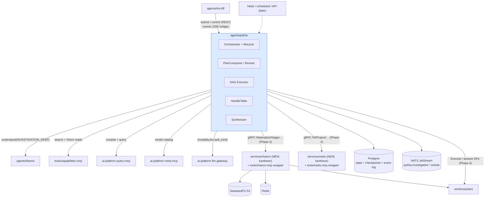

# Pythia — Solution Architecture (kantheon arc, Phases 1–5)

> **Scope.** Kantheon-side architecture for Pythia, the autonomous analytical investigator. Implements the full [`Pythia-v1-Design.md`](../../design/pythia/Pythia-v1-Design.md) contract — all four intent kinds, four AWAITING_* pause states, NATS event streaming, Arrow data plane — phased so that every stage ships against infrastructure that verifiably exists.
>
> **Infrastructure reality check (2026-06-12).** Verified live: **Polars Worker** (`ai-platform/workers/polars` — `cz.dfpartner.worker.v1.WorkerService`, stateful session DataFrames keyed `(session_id, df_name)` with idle-TTL, Arrow IPC streaming, deployed via fabric-infra `worker-polars` overlay), **SeaweedFS** (fabric-infra `data-seaweedfs`, S3 gateway :8333), **NATS JetStream** (fabric-infra middleware, domain `local`), **llm-gateway** pricing fields + Redis response cache + embeddings endpoint. **Absent and therefore planned as deliverables:** Metis, Charon, llm-gateway tier-based routing. **Consolidated away:** `chart-formatter` (folded into `shared/libs/kotlin/envelope-render` — one chart pipeline for Golem + Pythia), `Report Renderer` (the Midas arc's `services/report-renderer` + `report/v1` is the same service; Pythia is a consumer, not an owner).
>
> **Reads with.** [`./contracts.md`](./contracts.md), [`../../implementation/v1/pythia/plan.md`](../../implementation/v1/pythia/plan.md), design set under [`../../design/pythia/`](../../design/pythia/) (v1 design, open-questions — all resolved, v1.5-backlog), [`../iris/contracts.md`](../iris/contracts.md) §1.1 (envelope/v1), [`../golem/contracts.md`](../golem/contracts.md) (executor-primitive kinship), [`../themis/contracts.md`](../themis/contracts.md) (INVESTIGATION_DEEP profile).

## 1. Architectural goal

Five deployable outcomes:

1. **Phase 1:** `agents/pythia` skeleton in local K3s — `pythia/v1` contract, Postgres state + checkpointer, lifecycle state machine (all 12 statuses — PD-11 added AWAITING_BUDGET_DECISION, 2026-06-12), typed event stream (NATS + Postgres event log + SSE bridge), REST control surface.
2. **Phase 2:** Procedural investigations end-to-end (the Nescafe-Maggi worked example, SQL-only plans): Themis INVESTIGATION_DEEP resolution, STRONG-tier planner, coroutine DAG executor, rules-first evaluator, budget tracker, synthesizer v0.
3. **Phase 3:** Hypothesis machinery + HITL complete: plan reviser (PRUNE/PIVOT/DECOMPOSE/HALT), prioritisation, suspicion classifier, all five AWAITING_* states (incl. AWAITING_BUDGET_DECISION, PD-11 2026-06-12) with drain + resume, replay/reproduce. RCA end-to-end with heuristic explained-variance.
4. **Phase 4:** Data plane + models: Charon + Metis integration (both built as their **own kantheon arcs** — [`../charon/`](../charon/), [`../metis/`](../metis/)), DataFrameNode on Polars Worker session DFs, Seaweed/Redis materialisation, ModelNode. Forecast + simulation end-to-end.
5. **Phase 5:** Constellation integration: master-of-Golems Shem reads, Iris investigation UX (v1 = standard envelopes + step events), AgentManifest content, eval gates in CI, deploy + tag.

## 2. Tech stack

| Layer | Choice | Why |
|---|---|---|
| Language / service | **Kotlin 2.x + Ktor 3.2.x** | Constellation-wide |
| LLM orchestration | **Koog 0.8.x — LLM-call subset only** (`PromptExecutor`, structured output via `StructureFixingParser`); **NOT** the graph runtime | Locked decision (open-questions Q1): Pythia's DAG executor is custom |
| DAG executor | **Custom Kotlin coroutines** (structured concurrency, `Semaphore` caps, drain semantics) + **Postgres checkpointer** | Locked (design §5.2, pressure point 7); Temporal is v2 |
| State / events | **Postgres** (authoritative: investigations, plans, hypotheses, steps, handles, event log) + **NATS JetStream** (live stream, subject `pythia.investigation.{id}.events`, 24 h retention) | Design §3.3; both verified deployed |
| Data plane | **Arrow IPC everywhere** (P8): Polars Worker session DFs ↔ Seaweed S3 blobs ↔ Redis hot entries, moved by **Charon** | Worker + Seaweed verified; Charon is a Phase 4 deliverable |
| Persistence access | Postgres + Flyway + jOOQ | kantheon idiom |
| Rendering | `shared/libs/kotlin/envelope-render` (RenderNode + synthesizer blocks → envelope/v1 `Block`s) | chart-formatter consolidation |
| LLM access | llm-gateway via a `GatewayClient` that maps `(modality, tier, task_kind)` → model **tag** until gateway-native tier routing lands (ai-platform extension) | decouples Pythia from the gateway gap |
| Test stack | Kotest + Testcontainers (PG, NATS) + Wiremock + mock executor | constellation pattern |

## 3. Module map

```
kantheon/agents/pythia/
├── src/main/kotlin/org/tatrman/kantheon/pythia/
│   ├── App.kt
│   ├── api/                  # REST control surface (submit/status/artifact/approve/answer/halt/replay/reproduce)
│   │                         #   + GET /v1/investigations/{id}/events (SSE bridge over NATS/PG log)
│   ├── orchestrator/         # InvestigationOrchestrator — lifecycle state machine, one coroutine per investigation
│   ├── resolve/              # ThemisClient (INVESTIGATION_DEEP, prior-context threading, clarification parking)
│   ├── plan/                 # PlanComposer (STRONG, task_kind PLANNING), PlanValidator, node types
│   ├── executor/             # DagExecutor — frontier scheduler, batches, retries, drain, sticky affinity
│   ├── evaluate/             # HypothesisEvaluator (Predicate rules first; CHEAP LLM fallback)
│   ├── revise/               # PlanReviser (STRONG, PRUNE/PIVOT/DECOMPOSE/HALT) + prioritisation scoring
│   ├── suspicion/            # SuspicionClassifier (rules checklist; CHEAP fallback)
│   ├── budget/               # BudgetTracker — 4 dimensions, 75/90/100/110 ladder, project-and-reserve
│   ├── handles/              # HandleTable + Handle types (LiveQueryRef / WorkerSessionDF / SeaweedArrowBlob / RedisArrowEntry)
│   ├── dataplane/            # CharonClient (Phase 4), WorkerClient (Polars Execute/session DFs), MetisClient (Phase 4)
│   ├── synth/                # Synthesizer — block-streaming conclusion composer
│   ├── persistence/          # repositories + Checkpointer + EventLog (Flyway migrations)
│   ├── events/               # EventEmitter — NATS publisher + PG log + sequence numbers
│   ├── clients/              # QueryMcpClient, MetadataClient, CapabilitiesReadClient, GatewayClient
│   └── auth/
├── src/main/resources/{application.conf}
├── prompts/                  # planner / evaluator / reviser / suspicion / synthesizer / narrative-fragment (cs+en)
├── eval/                     # investigation corpus (procedural / RCA / forecast / simulation buckets)
├── src/test/kotlin/
├── k8s/{base,overlays/local}/
└── build.gradle.kts
```

### Charon — kantheon-side deliverable (locked 2026-06-12)

**`kantheon/services/charon`** (full-spec engine: gRPC `org.tatrman.charon.v1.CharonService`, owns storage + DB credentials, ADBC DB edges, Arrow streaming + integrity) **+ `kantheon/tools/charon-mcp`** (thin wrapper: `move.*` MCP tools + capability registration; no logic). Locations: Seaweed, Redis, worker sessions, **DB tables via named connections (read + write)**; Pythia's internal PG is never a provisioned connection. Pythia calls gRPC directly — gRPC is the service-to-service protocol. **Built as its own arc** — [`../charon/architecture.md`](../charon/architecture.md) + [`../charon/contracts.md`](../charon/contracts.md) (authoritative) + [`../../implementation/v1/charon/plan.md`](../../implementation/v1/charon/plan.md); `charon/v0.3.0` gates this arc's Phase 4.

Charon is the **first platform-grade service migrated into kantheon** per Bora's 2026-06-12 direction to gradually shift such services out of ai-platform — hence the package root `org.tatrman.charon.v1` (not `org.tatrman.kantheon.*`, which stays reserved for constellation/agent contracts).

### Cross-repo deliverables (ai-platform side; coordination doc `docs/implementation/v1/aip-v1-gateway-worker-plan.md`)

| Piece | Proposed home | Surface | Why ai-platform-side |
|---|---|---|---|
| **llm-gateway tier routing** | `ai-platform/infra/llm-gateway` | accept `(modality, tier, task_kind)`; per-tier model map in config; keep tag-routing as fallback | gateway-native; until it lands Pythia's GatewayClient maps tiers → tags |
| **Worker workspace read-out** | `ai-platform/workers/polars` | verify scan-plan over a workspace DF streams `ResultBatch` out; else add `ReadWorkspace` RPC | Charon's Stage/Materialize-from-worker path depends on it |

### Metis — kantheon-side deliverable (locked 2026-06-12)

**`kantheon/services/metis`** (Python — statsmodels/prophet/sklearn; the library-moat justification) **+ `kantheon/tools/metis-mcp`** (thin Kotlin wrapper). Own arc: [`../metis/architecture.md`](../metis/architecture.md) + [`../metis/contracts.md`](../metis/contracts.md) + [`../../implementation/v1/metis/plan.md`](../../implementation/v1/metis/plan.md); `metis/v0.3.0` gates this arc's Phase 4 Stage 4.2. Pythia's `MetisClient` is gRPC-direct (`org.tatrman.metis.v1.MetisService`); ModelNode mapping in Metis contracts §4.

All capability providers register `ToolCapability` manifests into capabilities-mcp (heartbeat).

## 4. Component diagram



## 5. Execution model — the load-bearing internals

**Orchestrator.** One coroutine per investigation in a supervised scope; explicit state machine over the 12 statuses (design §3.4 + the PD-11 AWAITING_BUDGET_DECISION addition, 2026-06-12). Entering any `AWAITING_*`: checkpoint full state, drain in-flight steps, emit `scheduler_drained`. Resume is idempotent (first signal wins, enforced via a status-conditional UPDATE).

**DAG executor.** Frontier = nodes whose `DataDep`s are satisfied. Batches launched with three caps (per-investigation default 5, per-provider, global) via `Semaphore`s; priority order from hypothesis scoring; promotion as slots free. Sticky affinity: children of `WorkerSessionDF` handles carry the parent's `session_id` so Polars chains stay on-pod (Worker keying verified: `(session_id, df_name)`). Tiered failure handling: transient → retry with jittered backoff; permanent → hypothesis INCONCLUSIVE; systemic → HALT.

**Budget tracker.** Projects per-batch cost from `(modality, tier) × task_kind token constants × batch size` using gateway pricing (pricing fields exist on `/v1/models` today); reserve→launch→reconcile. Ladder 75 % warn / 90 % ASK-if-policy / 100 % HALT_GRACEFULLY (synthesizer runs on current evidence) / 110 % hard stop.

**Handle table.** In-memory + persisted. v0–v3 handles: `LiveQueryRef` and **`PgResultSnapshot`** (small results inlined to Pythia's Postgres — a pragmatic fifth handle type added 2026-06-12 so Phases 2–3 run without Charon; capped by `pythia.handles.inline-max-bytes`). Phase 4 adds `WorkerSessionDF`, `SeaweedArrowBlob`, `RedisArrowEntry` with Charon-mediated materialisation per the design's policies. The handle-type set is otherwise verbatim design §3.2.

**Events.** Every event → Postgres `pythia_events` (authoritative, sequence-numbered) and NATS (live). Iris-bff consumes the SSE bridge (`GET /v1/investigations/{id}/events?from_seq=N`) rather than NATS directly at v1 — one fewer client protocol in the BFF; NATS remains the bus for Hebe/scheduled consumers later.

**Master-of-Golems (Phase 5).** Cross-domain plans read `ShemManifest`s via `CapabilitiesReadClient`; `preferred_queries` + `area_terminology` + `preferred_capabilities` enter the planner prompt as structured context. No agent-to-agent delegation at v1 (R4).

## 6. Iris rendering at v1

Pythia streams investigation events; the BFF maps lifecycle/hypothesis/batch events onto `IrisStreamEvent.step` (with `detail_json`) and synthesizer blocks onto `envelope` events (one envelope per block, `agent_id: "pythia"`). The dedicated investigation UI (hypothesis tree, plan DAG pane, budget bar) is an Iris follow-up after this arc — the event vocabulary already carries everything it needs.

## 7. Deployment topology

`pythia` pod (kantheon namespace) + Postgres + NATS (existing middleware) + ai-platform services cross-namespace. Readiness gates: DB migrated, NATS reachable (warn-and-degrade to PG-log-only if NATS is down — events are never lost, only not-live), capabilities-mcp reachable (warn-and-continue), Themis reachable (required — Pythia without resolution is useless, but boot proceeds; submits fail fast with a clear error).

## 8. Observability

```
pythia_investigations_total{status, intent_kind, caller_kind}
pythia_investigation_duration_ms{intent_kind}            (histogram)
pythia_steps_total{node_kind, status}
pythia_batch_parallelism                                  (histogram)
pythia_llm_calls_total{tier, task_kind} / pythia_llm_cost_usd_total{task_kind}
pythia_budget_halts_total{ladder_step}
pythia_hypotheses_total{terminal_status}
pythia_plan_revisions_total{kind}
pythia_awaiting_total{state} / pythia_awaiting_duration_ms{state}
pythia_handle_materialisations_total{from, to}            (Phase 4)
pythia_checkpoint_bytes / pythia_event_lag_seconds
```

Span-per-step tracing; investigation-id as trace baggage; LLM spans carry task_kind + tier + cached flag.

## 9. Testing strategy

- **Unit:** state-machine transition table (exhaustive), frontier computation, budget ladder, predicate evaluators, scoring formula, handle resolution, resume idempotency.
- **Component:** orchestrator + executor + evaluator against Wiremock platform + Testcontainers PG/NATS — the three worked examples from design §4 as fixture investigations (procedural / RCA / forecast) with scripted LLM outputs.
- **Eval (gated in CI from Phase 5):** investigation corpus per bucket; metrics: plan-validity rate, hypothesis-verdict accuracy on synthetic ground truth, budget adherence, replay determinism.
- Full E2E excluded per planning-conventions §4.

## 10. Risks

| Risk | Mitigation | Stage |
|---|---|---|
| Custom DAG executor correctness (races, drain, resume) | exhaustive state-machine unit table + property tests on frontier/drain; checkpoint-restore round-trip tests | P1–P2 |
| Planner output quality (typed PlanDag from STRONG LLM) | validator with feedback-retry (max 3) + fixture-LLM component tests + eval gate; planner prompt iterates on corpus | P2, P5 |
| Charon/Metis cross-repo sequencing slips | Phases 1–3 have zero dependency on them (PgResultSnapshot bridge); Phase 4 pre-flight gates explicitly; coordination doc mirrors the pg-worker precedent | P4 |
| Polars Worker can't stream a workspace DF *out* (Charon Stage/Materialize source) | verify scan-plan-over-workspace-DF path first; fallback = small `ReadWorkspace` RPC on the worker (coordination-doc pre-flight) | P4 pre-flight |
| Charon DB write/read becomes a query-path bypass (security) | named connections only (no credentials in requests; Pythia PG never provisioned); table-level moves only — predicate/user-scoped access stays on query-mcp | P4 |
| llm-gateway tier routing gap | GatewayClient tag-mapping shim from day one; gateway extension is additive | P2 |
| NATS operational surprises in K3s | PG event log is authoritative; NATS degrade-to-off mode tested | P1 |
| Investigation cost runaway in dev | depth_budget defaults (SHALLOW in dev fixtures), hard caps, fixture LLM in CI | P2+ |
| Scope breadth (this is the largest arc) | strict phase gates; Phases 1–3 alone already ship a useful RCA investigator | all |

## 11. References

- Design set: [`Pythia-v1-Design.md`](../../design/pythia/Pythia-v1-Design.md) (contract authority for §3), [`open-questions.md`](../../design/pythia/open-questions.md) (all resolved), [`framework-evaluation.md`](../../design/pythia/framework-evaluation.md), [`v1.5-backlog.md`](../../implementation/v1/pythia/v1.5-backlog.md).
- Verified infra: `ai-platform/workers/polars` (WorkerService, workspace store), `ai-platform/shared/proto/.../worker/v1/worker.proto`, `fabric-infra/platform/data/seaweed/`, `fabric-infra/platform/middleware/jetstream/`.
- `~/Dev/view-only/koog` (PromptExecutor, StructureFixingParser), `ai-platform/EXAMPLES.md` §1/§2/§8; query-mcp tool schemas in `ai-platform/tools/query-mcp/docs/technical/query-mcp-service.md`.

---

*Architecture owner: Bora. Pythia arc planned 2026-06-12 (supersedes the "parked" status). Update on every load-bearing decision.*
