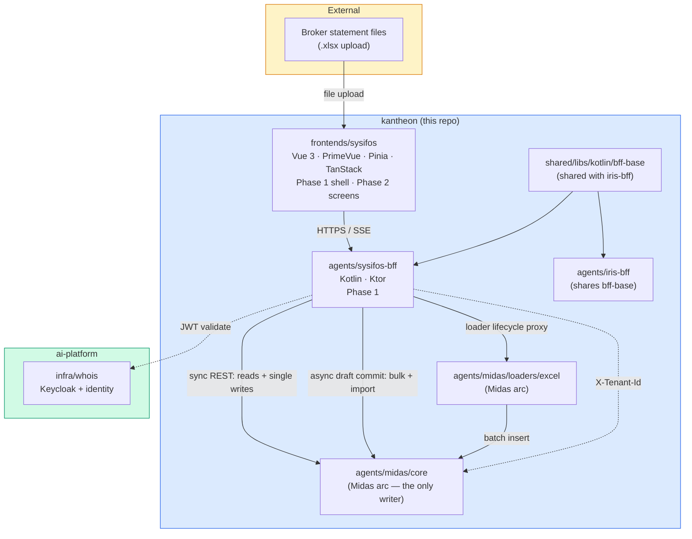
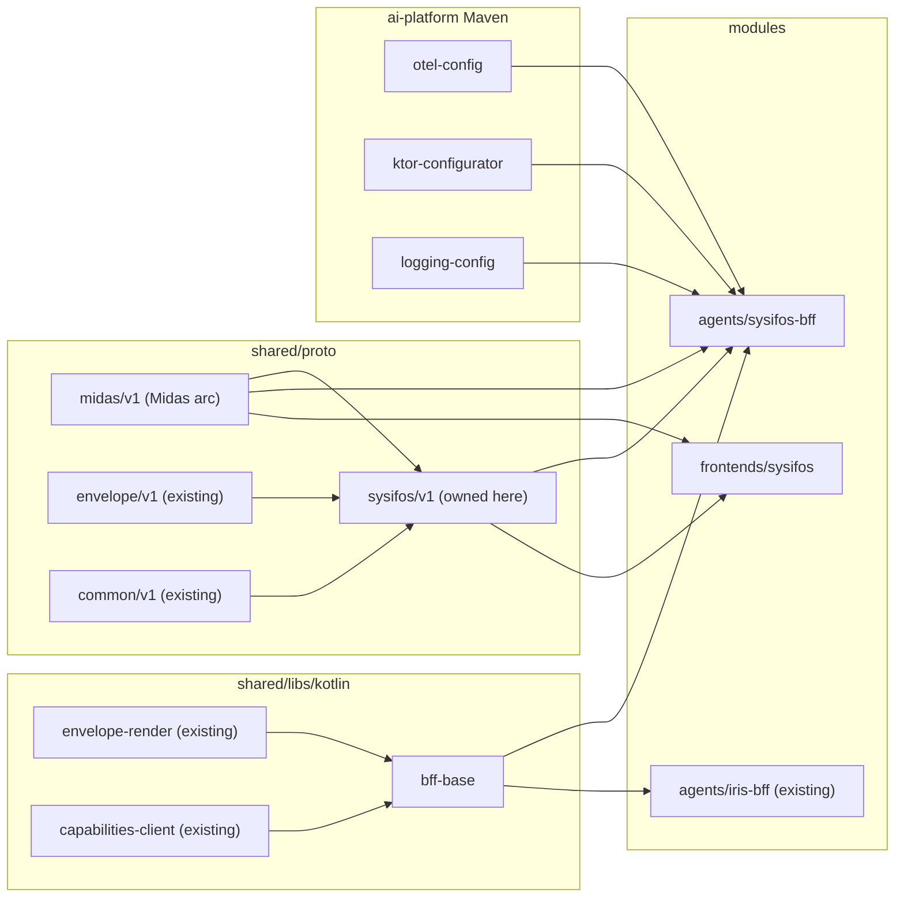

# Sysifos — Solution Architecture (kantheon arc)

> **Scope.** The kantheon-side architecture for the **Sysifos arc** — the data-entry + data-management workbench for the Midas brokerage product (Sysifos-BFF + Sysifos FE). Split out of the Midas arc per decision **S1** (2026-06-13). This arc owns `sysifos/v1`, the Sysifos-BFF API, the Vue FE, and the data-entry stages; it **consumes** Midas-core's contracts (referenced by section, never duplicated) and depends on one Midas-arc amendment (the derived cash leg, §10).
>
> **Reads with.** [`../../design/sysifos/sysifos-design.md`](../../design/sysifos/sysifos-design.md) (the locked design + decisions S1–S6), [`./contracts.md`](./contracts.md) (wire contracts for this arc), [`../../implementation/v1/sysifos/plan.md`](../../implementation/v1/sysifos/plan.md) (phased plan), [`../midas/contracts.md`](../midas/contracts.md) (Midas-core REST + `midas/v1`, consumed here), [`../iris/architecture.md`](../iris/architecture.md) (the sibling BFF/FE this one shares `bff-base` with), [`../themis/architecture.md`](../themis/architecture.md) (reference arc, same doc shape).
>
> **Pattern references.** [`../../../EXAMPLES.md`](../../../EXAMPLES.md) is canonical for Ktor bootstrap (§1), proto wire rules (§3), Kotest+Wiremock (§9), Kustomize (§10), and Vue envelope consumption (§11). Cite by section in task lists.

---

## 1. Architectural goal

Bring the forms-shaped half of Midas to life:

1. **Phase 1 — Foundation.** `agents/sysifos-bff` deployed in local K3s: Keycloak auth, `X-Tenant-Id` forwarding, session + draft surface, dictionaries, SSE stream, a Midas-core HTTP client. `frontends/sysifos` shell renders the nav + login + placeholder routes. `sysifos/v1` proto (moved here from the Midas arc) published; `shared/libs/kotlin/bff-base` extracted (or folded — §11). The hybrid write model (§6) is skeletoned: sync proxy path live, async draft+SSE path stubbed.
2. **Phase 2 — Data entry.** Every v1 screen ships end-to-end against Midas-core: Clients, Portfolios (with the `track_cash` toggle), Assets + the quick-create modal, Transactions (form + inline edit + cash sub-rows), the **bulk grid**, Balance entry, Statement import (upload → preview → inline correction → commit), Reconciliation, Loader status, Audit. By phase close a back-office user can do a full day of operational work in the UI.

End state: a back-office user opens Sysifos, manages master data, enters trades singly and in bulk, sets balances, imports a broker statement and corrects the rows that don't map, reconciles, and reviews the audit trail — all written through Midas-core's append-only API.

---

## 2. Tech stack

| Layer | Choice | Why |
|---|---|---|
| BFF language | **Kotlin 2.0+** | constellation-wide (`pythia_framework_choice`) |
| BFF framework | **Ktor 3.x** | ai-platform pattern; `installKtorServerBase` (EXAMPLES.md §1) |
| Proto / wire | **protobuf 3** | `sysifos/v1` owned here; `midas/v1` consumed from the Midas arc |
| Build | **Gradle (Kotlin DSL) + `gradle/libs.versions.toml`** | versions centralised |
| Container | **Jib** (BFF); static SPA via **nginx** | ai-platform pattern |
| Orchestration | **K3s** local; Kustomize `base/` + `overlays/local/` | `imagePullPolicy: Never` local |
| Observability | **OpenTelemetry** via `shared/libs/kotlin/otel-config` | ai-platform pattern |
| Test stack (BFF) | **Kotest (StringSpec) + Ktor TestApplication + Wiremock + mockk** | EXAMPLES.md §9 |
| Auth | **Keycloak** JWT (shared realm via `infra/whois`) | same as all kantheon BFFs |
| Tenant scoping | forward `X-Tenant-Id`; RLS enforced by Midas-core/DB | no DB of record in Sysifos |
| FE framework | **Vue 3 + TypeScript** | mirrors Iris/Midas FE |
| FE UI kit | **PrimeVue 4 (Aura)** | forms + DataTable + FileUpload heavy |
| FE data | **TanStack Query** (reads) + **Pinia** (cross-screen state) | server-cache vs app-state split |
| FE routing | **vue-router** | one route per screen |
| FE validation | **Zod**, schemas generated from `sysifos/v1` + `midas/v1` + a shared rule manifest | three-layer validation (§7) |
| Bulk grid | **PrimeVue DataTable (editable + virtual scroll)** or a dedicated grid lib if paste ergonomics demand it (decided Stage 2.3) | paste / tab-through / per-cell validation |
| FE build / dev | **Vite** | `just sysifos-dev` proxy to BFF |
| Task runner | **`just`** | mirrors the rest of kantheon |

No DB, no Flyway, no jOOQ in this arc — Sysifos is stateless beyond session/draft scratch (in-memory in v1; durable drafts are v1.x). All persistence belongs to Midas-core.

---

## 3. Module map

### 3.1 New in kantheon

```
kantheon/
├── agents/
│   └── sysifos-bff/                                  # Phase 1 Stage 1.2
│       ├── src/main/kotlin/org/tatrman/kantheon/sysifos/bff/
│       │   ├── App.kt                                # Ktor bootstrap (≤45 lines; EXAMPLES.md §1b)
│       │   ├── auth/                                 # Keycloak JWT (via bff-base)
│       │   ├── tenant/                               # X-Tenant-Id forward (via bff-base)
│       │   ├── api/
│       │   │   ├── SessionRoute.kt
│       │   │   ├── DraftRoute.kt                     # async write seam (bulk/import)
│       │   │   ├── CrudProxyRoute.kt                 # sync read/write proxies to midas-core
│       │   │   ├── BalanceRoute.kt                   # preview/commit proxy
│       │   │   ├── LoaderProxyRoute.kt               # excel loader lifecycle proxy
│       │   │   ├── ReconcileRoute.kt
│       │   │   └── DictionaryRoute.kt                # brokers / currencies / tx-kinds (cached)
│       │   ├── stream/StreamRoute.kt                 # SSE: SysifosStreamEvent
│       │   ├── write/                                # hybrid dispatch: sync vs draft+SSE
│       │   │   ├── WriteDispatcher.kt
│       │   │   └── DraftStateMachine.kt
│       │   ├── session/                              # SysifosSession + in-memory draft scratch
│       │   ├── midas/MidasCoreClient.kt              # Ktor HttpClient to midas-core REST
│       │   └── observability/
│       ├── src/test/kotlin/
│       ├── k8s/{base,overlays/local}/
│       └── build.gradle.kts
│
├── frontends/
│   └── sysifos/                                      # Phase 1 Stage 1.3 (shell) → Phase 2 (screens)
│       ├── src/
│       │   ├── App.vue
│       │   ├── main.ts
│       │   ├── router/                               # one route per §8 screen
│       │   ├── views/                                # Clients, Portfolios, Assets, Transactions,
│       │   │                                         #   BalanceEntry, Import, ImportPreview,
│       │   │                                         #   Reconcile, Loaders, Audit
│       │   ├── components/
│       │   │   ├── forms/                            # PrimeVue reactive forms (Zod-validated)
│       │   │   ├── grids/                            # virtualized DataTables + the bulk-entry grid
│       │   │   ├── import/                           # upload, preview, inline-correction
│       │   │   └── AssetQuickCreate.vue              # the mid-entry modal
│       │   ├── stores/                               # Pinia: session, drafts, dictionaries, tenant
│       │   ├── api/                                  # generated TS clients (sysifos/v1, midas/v1, envelope-ts)
│       │   ├── validation/                           # Zod schemas generated from proto + rule manifest
│       │   └── i18n/                                 # cs / en
│       ├── public/
│       ├── vite.config.ts
│       └── package.json
│
└── shared/
    ├── proto/src/main/proto/org/tatrman/kantheon/
    │   └── sysifos/v1/sysifos.proto                  # moved here from the Midas arc (Phase 1 Stage 1.1)
    └── libs/kotlin/
        └── bff-base/                                 # Phase 1 Stage 1.2 — shared with iris-bff
            ├── auth/                                 # KeycloakJwtVerifier
            ├── tenant/                               # TenantHeaderForwarder
            ├── envelope/                             # FormatEnvelope re-render (reuse envelope-render)
            └── capabilities/                         # capabilities-client wrappers
```

### 3.2 Touched, not new

- `shared/proto` — `sysifos/v1` relocates from the Midas arc's listing into this arc's ownership; `midas/v1` stays in Midas and is imported by `sysifos/v1` (form payloads reference `midas.v1` types). No type changes to `sysifos/v1` from the move.
- `agents/iris-bff` — only insofar as `bff-base` is extracted from it (or co-developed). No behavioural change.
- `settings.gradle.kts`, root `build.gradle.kts`, `justfile`, `.github/workflows/ci.yml` — learn the two new modules.

### 3.3 Consumed from the Midas arc (not owned here)

- **Midas-core REST** (`../midas/contracts.md` §2) — every Sysifos write/read proxies here.
- **`midas/v1`** (`../midas/contracts.md` §1.1) — domain types the forms map to.
- **Excel loader REST** (`../midas/contracts.md` §4.1) — the import lifecycle Sysifos drives.
- **Derived cash legs** (§10) — `TX_CASH_*`, `track_cash`, `CashLegDerivation` — baseline Midas-core behaviour Sysifos renders.

### 3.4 Out of scope (named because adjacent)

- Interactive column-mapping for ad-hoc Excel (S4 → v1.x). Predefined broker templates only.
- Durable draft persistence across refresh (v1.x; in-memory scratch in v1).
- Charts / analytics (Iris owns; Midas D6).
- Any direct DB access (Midas-core is the only writer).
- Per-portfolio ACLs (v1 stops at tenant + coarse roles).

---

## 4. Component diagram



Invariants visible:

- **Sysifos never writes the DB.** Every write proxies to Midas-core; single records sync, bulk/import via the draft path. The Excel loader also commits through Midas-core (Sysifos drives its lifecycle only).
- **Auth at the BFF boundary** — JWT validated, `X-Tenant-Id` forwarded; RLS at the DB (Midas-core) enforces.
- **`bff-base` is the only code shared with Iris** — auth, tenant, envelope-render reuse.

---

## 5. Module dependency graph (Gradle)



No cycles. Build order (Phase 1): `shared/proto` (sysifos/v1) → `shared/libs/kotlin/bff-base` → `agents/sysifos-bff` → `frontends/sysifos`.

---

## 6. The hybrid write model (S5)

The central runtime decision. Two paths, one dispatcher (`write/WriteDispatcher.kt`):

```
                       ┌─────────────────────────────────────────────┐
   single record  ───► │ SYNC: BFF → midas-core REST → response       │ ─► 200 + entity (both legs)
 (client/portfolio/    └─────────────────────────────────────────────┘
  one txn/balance/                                                       (TanStack Query invalidates)
  asset quick-create)
                       ┌─────────────────────────────────────────────┐
   long op        ───► │ ASYNC: BFF accepts Draft → 202 + draft_id    │
 (bulk grid commit,    │   DraftStateMachine: PENDING → COMMITTING     │ ─► SSE: DraftAck →
  statement import)    │   → per-item midas-core batch                │     LoaderProgress* →
                       │   → COMMITTED / REJECTED                      │     DraftCommitted | DraftRejected
                       └─────────────────────────────────────────────┘
```

- **Sync path** is plain request/response — `CrudProxyRoute.kt` forwards to Midas-core with `X-Tenant-Id`, returns the result. The FE shows the derived cash leg from the response. No optimistic ceremony.
- **Async path** uses `sysifos/v1.Draft` + `SysifosStreamEvent`. The client POSTs a draft, gets a `draft_id`, and subscribes to `/stream`. `DraftStateMachine.kt` drives it through Midas-core's `POST /transactions:batch` (bulk grid) or the loader commit (import), emitting progress and per-row outcomes. Failure emits `DraftRejected` with `FieldValidationError`s.
- The `Draft` types stay defined for both, but only the async path exercises them in v1. This keeps simple paths simple and gives heavy paths honest progress.

---

## 7. Validation topology (three layers)

Authoritative in exactly one place, echoed for UX (design §7.2):

| Layer | Where | Source | Role |
|---|---|---|---|
| 1 | FE (Zod) | generated from `sysifos/v1` + `midas/v1` + rule manifest | instant inline feedback; no round-trip |
| 2 | BFF pre-flight | same rule manifest + dictionary lookups | reject malformed drafts early; cross-field checks (asset exists, portfolio active) |
| 3 | Midas-core | RLS, CHECK constraints, idempotency, derivation invariants | **the authority**; its `FieldValidationError`s are the truth |

Drift control: layers 1–2 are **generated** from the proto + a small shared `validation-rules.yaml` manifest (contracts §4), never hand-maintained in parallel. Rules that can't be expressed declaratively live only in core; the FE surfaces core's returned error verbatim.

---

## 8. Screens (v1)

| Screen | Route | Midas-core surface (`../midas/contracts.md`) | Phase/Stage |
|---|---|---|---|
| Clients | `/clients` | §2.1 | 2.1 |
| Portfolios | `/portfolios` | §2.2 (+ `track_cash` via §10 amendment) | 2.1 |
| Assets | `/assets` | §2.3 (write gated `midas:admin`) | 2.2 |
| Transactions | `/transactions` | §2.4 (form, inline edit = PATCH reverse+replace, cash sub-rows) | 2.2 |
| Bulk grid | `/transactions` (mode) | §2.4 `POST /transactions:batch` via draft path | 2.3 |
| Balance entry | `/balance` | §2.5 preview + commit | 2.4 |
| Import | `/import` | loader §4.1 → core batch | 2.5 |
| Reconcile | `/reconcile` | §2.8 | 2.6 |
| Loader status | `/loaders` | loader `/runs` | 2.6 |
| Audit | `/audit` | `audit_log` read (admin) | 2.6 |

No dashboards in Sysifos (Iris owns them).

---

## 9. Deployment topology

All to local K3s; production tier is the same pods against managed services.

| Service | Pod count (local) | Resource shape |
|---|---|---|
| `agents/sysifos-bff` | 1 | 1 CPU / 1 GiB |
| `frontends/sysifos` (nginx) | 1 | 0.25 CPU / 256 MiB |

Local-overlay specifics: `imagePullPolicy: Never` (Jib-built BFF image loaded into K3s); FE served by nginx from the Vite build; `infra/whois` (Keycloak) reached by Service; Midas-core + Excel loader reached by Service (Midas arc). Sysifos FE exposed via Traefik Ingress. No Postgres in this arc.

---

## 10. Midas-arc dependency: the derived cash leg (S2)

Sysifos's cash-leg behaviour is **not implementable in this arc** — derivation belongs to the only writer. This arc consumes Midas-core baseline behaviour, defined authoritatively in [`../midas/contracts.md`](../midas/contracts.md) §1.1.A (folded into the Midas baseline, not a forward migration) and summarised here for the dependency:

- **`midas/v1.TransactionKind`** gains `TX_CASH_CREDIT = 9`, `TX_CASH_DEBIT = 10`.
- **`midas/v1.Portfolio`** gains `bool track_cash` (default true); DDL adds the column with default.
- **`midas-core/derivation/CashLegDerivation.kt`** emits the cash counter-leg inside the same commit as the security leg, against an auto-provisioned `ASSET_CASH` instance per `(portfolio, currency)`; a shared correlation id ties the legs so reversing one reverses both.
- The Sysifos role: send the **security leg only**; render both legs (cash as a linked sub-row in the Transactions grid + confirmation); surface the `track_cash` toggle on the Portfolio form.

**Critical-path note:** the Sysifos bulk grid (Stage 2.3) and Transactions cash sub-rows (Stage 2.2) need this behaviour live in Midas-core (built in Midas Stage 1.3) before Sysifos Phase 2 Stage 2.2. Sysifos Phase 1 (shell) does not need it.

---

## 11. `bff-base` extraction

The shared surface with Iris-BFF: `KeycloakJwtVerifier`, `TenantHeaderForwarder`, envelope-render reuse, capabilities-client wrappers. Extracted in Phase 1 Stage 1.2. **Hedge (carried from Midas plan):** if the genuinely-shared surface is < ~200 LOC, fold the helpers directly into both BFFs and defer the lib to v1.x. Decided by an audit at Stage 1.2 against the then-current Iris-BFF.

---

## 12. Observability

OTel via `shared/libs/kotlin/otel-config`:

- **Spans** per route: `sysifos.bff.draft.commit`, `sysifos.bff.import.preview`, `sysifos.bff.crud.proxy`, `sysifos.bff.stream`.
- **Attributes:** `tenant_id`, `user_id`, `draft_id`, `loader_run_id`, `portfolio_id` (where applicable). Client PII never in span attrs (tenant_id only).
- **Metrics:** `sysifos_draft_commit_duration_seconds`, `sysifos_draft_rejected_total`, `sysifos_import_rows_total`, request latency by screen.
- **Logs:** structured JSON via `logging-config`; `traceparent` forwarded BFF → Midas-core for correlation.

Grafana: "Sysifos UX" (latency by screen), "Sysifos writes" (draft commit/reject rates, bulk-grid throughput).

---

## 13. Test strategy

Per kantheon convention (mirroring Themis arc):

- **BFF unit (Kotest StringSpec)** — `write/DraftStateMachine`, `validation` pre-flight, `tenant` forwarding. TDD; tests before impl per stage.
- **BFF component (Ktor TestApplication + Wiremock)** — JWT → tenant → Midas-core proxy path; draft commit → SSE event emission, with Midas-core stubbed by Wiremock (EXAMPLES.md §9).
- **FE component (Vitest + @vue/test-utils + MSW)** — stateful screens, forms, the bulk grid, the import wizard, the quick-create modal.
- **FE E2E (smoke only, Playwright)** — one happy-path per screen. Full E2E lives in the separate integration-testing flow.
- **No DB tests** in this arc — Sysifos has no DB; persistence behaviour is tested in the Midas arc.
- **No eval gate** — no LLM in the Sysifos path.

---

## 14. Build, deploy

- `just proto` — regenerate `sysifos/v1` Kotlin + TS bindings.
- `just build-kt sysifos-bff` / `just deploy-kt sysifos-bff` — Jib build + Kustomize apply.
- `just test-kt sysifos-bff` — Kotest run.
- `just sysifos-dev` — Vite dev server proxying to Sysifos-BFF.
- `just build-fe sysifos` — Vite production build.

CI mirrors the rest of kantheon: `init → lint-check → test-all`; Jib publishes the BFF image on `main`.

---

## 15. Open items

Carried from design §12: `bff-base` extraction trigger (Stage 1.2 audit); draft scratch durability (in-memory v1); cash-asset identity (per-portfolio vs per-tenant — feeds the Midas amendment); bulk-grid paste column-mapping heuristic (Stage 2.3); reconcile granularity (transaction-level v1); grid decimal/date locale formatting.

---

## 16. Resolved decisions — quick reference

The six locked in the 2026-06-13 design session (full rationale in [`../../design/sysifos/sysifos-brainstorming.md`](../../design/sysifos/sysifos-brainstorming.md)):

| # | Decision | Notes |
|---|---|---|
| S1 | Sysifos = own arc (architecture/contracts/plan); references Midas, never duplicates | §3.3, §10 |
| S2 | Cash leg derived in Midas-core via `TX_CASH_*`; per-portfolio `track_cash` | §10 — baseline Midas behaviour (folded in) |
| S3 | Manual entry = single-record form + bulk grid | §6 async path, Stage 2.3 |
| S4 | Import = predefined broker templates v1; column-mapping v1.x | §3.4, Stage 2.5 |
| S5 | Hybrid write model — sync single, async draft+SSE for bulk/import | §6 |
| S6 | Unknown symbol → inline quick-create modal | §8, Stage 2.2 |

---

*Architecture doc owner: Bora. Lives in `docs/architecture/sysifos/`. Update on every load-bearing decision; revision history via git.*
