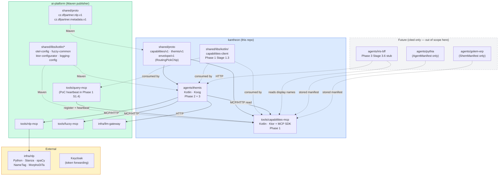
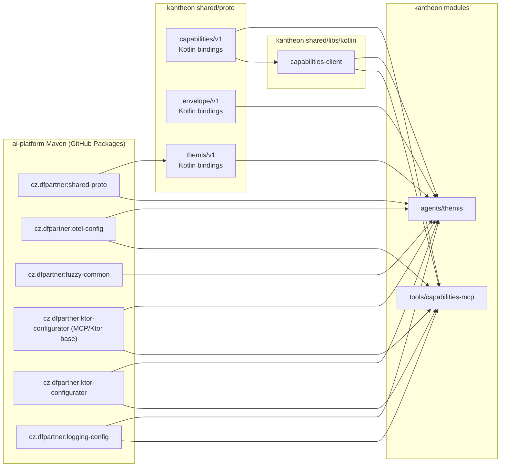

# Themis — Solution Architecture (kantheon arc, Phases 1–3)

> **Scope.** This document describes the kantheon-side architecture for the work covered by Phases 1, 2, and 3 of the Themis-in-kantheon arc — repo bootstrap, `tools/capabilities-mcp`, Resolver-to-Themis extraction with Koog adoption, and the agent routing layer.
>
> **Reads with.** [`themis-design.md`](../../design/themis/themis-design.md) (the outward design of Themis as a service; still Resolver-era prose pending the routing-layer fold-in), [`themis-brainstorming.md`](../../design/themis/themis-brainstorming.md), [`../kantheon-architecture.md`](../kantheon-architecture.md) (overall constellation), [`./contracts.md`](./contracts.md) (wire contracts), [`../../implementation/v1/themis/plan.md`](../../implementation/v1/themis/plan.md) (phased implementation plan).
>
> **Pattern references.** [`ai-platform/EXAMPLES.md`](../../../../ai-platform/EXAMPLES.md) is the canonical source for Ktor, serialization, MCP server, and OTel patterns. Cite by section number when task lists reference them.

## 1. Architectural goal

Bring Themis live in kantheon as a Koog-based agent, served from `agents/themis/`, registering against and reading from `tools/capabilities-mcp/`, exposing the existing Resolver surface plus a new routing layer. Three deployable outcomes, in order:

1. **Phase 1:** `tools/capabilities-mcp/` running in local K3s with seed `AgentManifest`/`ShemManifest` fixtures and one ai-platform tool registered via heartbeat.
2. **Phase 2:** `agents/themis/` running in local K3s — Koog-based graph; eval-gate-green against the ai-platform Stage 03 Czech corpus; equal-or-better quality to today's plain-coroutines Resolver.
3. **Phase 3:** Themis with the four-layer routing cascade live — `RoutingDecision`, `IntentKind`, `Profile`, `RefusalWithGaps`, `MultiQuestionDetected` populated; Iris BFF chip round-trip working end-to-end against a fixture LLM.

## 2. Tech stack

| Layer | Choice | Why |
|---|---|---|
| Language (all agents + tools) | **Kotlin 2.0+** | Constellation-wide; `pythia_framework_choice` memory locked 2026-05-10 |
| Service framework | **Ktor 3.x** | ai-platform pattern; `KtorServerBootstrap` + `installKtorServerBase` consumed from Maven |
| Agent framework | **Koog 0.8.x or current** | Locked 2026-05-10; Phase 2 Stage 2.1 spike confirms version against current Ktor |
| MCP framework | **Kotlin MCP SDK** + the MCP/Ktor base from `ktor-configurator` | `mcp-server-base` does not exist as an artifact (corrected 2026-06-12) |
| Proto / wire | **protobuf 3** | `cz.dfpartner.*` from ai-platform Maven; `org.tatrman.kantheon.*` owned in kantheon |
| Build | **Gradle (Kotlin DSL) + `gradle/libs.versions.toml`** | Versions centralised; never hardcoded |
| Container | **Jib** for Kotlin services; no Dockerfiles needed | ai-platform pattern |
| Orchestration | **K3s** local; Kustomize `base/` + `overlays/local/` | ai-platform pattern; `imagePullPolicy: Never` in local overlay |
| Observability | **OpenTelemetry** via `shared/libs/kotlin/otel-config` → Alloy → Tempo / Prometheus / Loki | ai-platform pattern |
| Test stack | **Kotest (StringSpec) + Testcontainers + Wiremock + mockk** | ai-platform pattern |
| Storage | none in Phases 1–3 (registry is in-memory; Themis is stateless via signed resume tokens) | inherited from Resolver design |
| Task runner | **`just`** | ai-platform pattern; recipes mirror `just init / build-kt / deploy-kt / test-all / lint-all / proto` |

## 3. Module map — what gets created or moved

### 3.1 In kantheon (new or extracted)

```
kantheon/
├── agents/
│   └── themis/                          # extracted from ai-platform/agents/resolver in Phase 2 Stage 2.2
│       ├── src/main/kotlin/org/tatrman/kantheon/themis/
│       │   ├── App.kt
│       │   ├── api/                     # REST + MCP routes
│       │   ├── koog/                    # Koog graph definition + nodes
│       │   │   ├── ThemisGraph.kt
│       │   │   ├── nodes/               # one node per file
│       │   │   └── tools/               # Koog-tool wrappers around fuzzy-mcp / nlp-mcp / llm-gateway
│       │   ├── routing/                 # Phase 3: classifyIntentKind, detectMultiQuestion, routeToAgent
│       │   ├── capabilities/            # CapabilitiesClient (consumes capabilities-mcp)
│       │   ├── resume/                  # HMAC resume-token codec
│       │   └── auth/
│       ├── src/test/kotlin/             # Kotest specs
│       ├── prompts/                     # Externalised prompts (joint-inference, intent-kind-rules, routing-LLM)
│       ├── eval/                        # corpus + harness (carry-over from ai-platform/agents/resolver/eval/)
│       ├── k8s/{base,overlays/local}/
│       └── build.gradle.kts
│
├── tools/
│   └── capabilities-mcp/                # new in Phase 1 Stage 1.2–1.4
│       ├── src/main/kotlin/org/tatrman/kantheon/capabilities/
│       │   ├── App.kt
│       │   ├── api/                     # MCP tool + REST surface
│       │   ├── registry/                # in-memory registry, TTL pruning, version handling
│       │   ├── loader/                  # YAML manifest loader
│       │   └── observability/
│       ├── src/main/resources/
│       │   └── manifests/
│       │       ├── agents/
│       │       │   ├── pythia.yaml      # AgentManifest stub (Bora fills content)
│       │       │   └── golem-erp.yaml   # ShemManifest stub (Bora fills content)
│       │       └── tools/               # populated as ai-platform tools migrate to heartbeat
│       ├── src/test/kotlin/
│       ├── k8s/{base,overlays/local}/
│       └── build.gradle.kts
│
├── shared/
│   ├── proto/
│   │   └── src/main/proto/org/tatrman/kantheon/
│   │       ├── capabilities/v1/capabilities.proto       # Phase 1 Stage 1.2
│   │       ├── envelope/v1/envelope.proto                # Phase 3 Stage 3.6 adds RoutingPickChip
│   │       └── themis/v1/themis.proto                    # extracted + extended in Phase 2 / 3
│   └── libs/
│       └── kotlin/
│           └── capabilities-client/                       # Phase 1 Stage 1.3 — heartbeat + read-mostly client
│
├── gradle/libs.versions.toml
├── settings.gradle.kts
├── build.gradle.kts
├── justfile
├── README.md
└── .github/workflows/ci.yml
```

### 3.2 In ai-platform (touched, not moved)

- `agents/resolver/` — source of the Phase 2 Stage 2.2 extraction (via `git filter-repo`). After extraction completes and Themis is live in kantheon for ≥ one week with no regressions, `agents/resolver/` retires from ai-platform. (Out of scope for Phases 1–3; tracked separately.)
- `tools/query-mcp/` — Phase 1 Stage 1.4 wires it to heartbeat into kantheon's capabilities-mcp as proof-of-concept. Single PR; tools and agents on the ai-platform side stay where they are.

### 3.3 Out of scope (named because adjacent)

- `agents/iris-bff/` — Phase 3 Stage 3.6 stubs the BFF-side chip round-trip; full Iris BFF Stage 1 task doc is a separate arc.
- `agents/pythia/`, `agents/golem/` — registered as manifests in capabilities-mcp (fixtures), not built in this arc.
- `frontends/iris/` — extracted from `golem/frontend/` in a separate arc; placeholder in Phase 3 Stage 3.6 chip fixture only.
- `shared/libs/kotlin/envelope-render/` — Golem-rewrite-arc dependency; Phase 3 only adds the `RoutingPickChip` proto type, not the renderer.

## 4. Component diagram



## 5. Module dependency graph (Gradle)



No cycles. Build order: `shared/proto` → `shared/libs/kotlin/capabilities-client` → `tools/capabilities-mcp` (in Phase 1) → `agents/themis` (in Phase 2). The ai-platform Maven side is resolved at Gradle configuration time via the GitHub Packages repo declared in `settings.gradle.kts`.

## 6. Themis internal structure (Koog-based)

Resolver today is a `ResolverGraph` class with a `run()` coroutine loop and a `NodeResult` sealed class — plain Kotlin. Phase 2 Stage 2.3 migrates this to Koog.

### 6.1 Koog graph at v1 (carry-over from Resolver)

```
                      ┌───────────────────┐
                START ─┤   branchOnInput   ├── resume ──┐
                      └─────────┬─────────┘             │
                                │ fresh                 │
                                ▼                       │
                      ┌───────────────────┐             │
                      │ detectLangAndParse │             │
                      └─────────┬─────────┘             │
                                ▼                       │
                      ┌───────────────────┐             │
                      │ extractUniversal  │             │
                      └─────────┬─────────┘             │
                                ▼                       │
                      ┌───────────────────┐             │
                      │ proposeDomainSpans│             │
                      └─────────┬─────────┘             │
                                ▼                       │
                      ┌───────────────────┐             │
                      │filterRelevantSpans│             │
                      └─────────┬─────────┘             │
                                ▼                       │
                      ┌───────────────────┐             │
                      │  fuzzyMatchSpans  │             │
                      └─────────┬─────────┘             │
                                │                       │
                                ▼                       ▼
                              ┌──────────────────────────────────┐
                              │       jointInference             │
                              │       (FAST tier LLM call)       │
                              └─────────────┬────────────────────┘
                                            ▼
                              ┌─────────────────────────┐
                              │   decideHitlOrEmit      │
                              └───────┬────────────┬────┘
                                      ▼            ▼
                          ┌────────────────────┐ ┌────────────────────┐
                          │  Resolution emit   │ │  AwaitingClarif.   │
                          └─────────┬──────────┘ └──────────┬─────────┘
                                    │                       │
                                    └─────────┬─────────────┘
                                              ▼
                                       ┌──────────────┐
                                       │ assembleResp │
                                       └──────┬───────┘
                                              ▼
                                            END
```

### 6.2 Koog graph at Phase 3 (+ routing layer)

Three new nodes; `detectMultiQuestion` between `detectLangAndParse` and `extractUniversal`; `classifyIntentKind` after `extractUniversal`; `routeToAgent` after `jointInference`. The fourth terminal outcome `RefusalWithGaps` reaches via `decideHitlOrEmit` under STRICT mode.

```
detectLangAndParse
  ↓
detectMultiQuestion*   ──► [if MULTI: AwaitingClarification.MultiQuestionDetected; END]
  ↓
extractUniversal
  ↓
classifyIntentKind*    ──► writes Resolution.intent_kind
  ↓
proposeDomainSpans → filterRelevantSpans → fuzzyMatchSpans → jointInference
  ↓
routeToAgent*          ──► [skipped if profile == INVESTIGATION_DEEP; Layer 0 short-circuits if routing_hint set]
  ↓                          [if Layer 3: needs_user_pick=true; alternates carried in RoutingDecision]
decideHitlOrEmit       ──► {Resolution | AwaitingClarification | RefusalWithGaps}
  ↓
assembleResp
```

### 6.3 How Koog fits

The locally-cloned Koog at `~/Dev/view-only/koog` is the primary reference for current API. Key abstractions Themis uses:

- **`AIAgentStrategy`** for graph composition (node-by-node, type-safe transitions).
- **`StructureFixingParser`** for joint-inference structured output — wraps the LLM call with retry + repair against a target JSON schema. The Pythia design and Golem template both rely on this pattern; Themis uses it for `jointInference` and the Phase 3 routing LLM Layer 2.
- **`ToolDescriptor`** for the Koog-side wrappers around `tools/nlp-mcp`, `tools/fuzzy-mcp`, `infra/llm-gateway`. Each MCP/HTTP call becomes a Koog tool the graph composes.

The Phase 2 Stage 2.1 spike **closed GO on 2026-05-29** (`agents/_koog-spike/docs/koog-spike-report.md`). Outcomes that bind §6:

- **Ktor 2.x↔3.x conflict resolved** by bumping kantheon's catalog to Ktor `3.2.3` (the version Koog 0.8.0 pulls transitively). No force-resolution overrides required.
- **Artifact resolution closed.** Only `ai.koog:koog-agents-jvm:0.8.0` (umbrella) is on Maven Central; `koog-agents-core-jvm` / `koog-agents-tools-jvm` from ai-platform's catalog are absent — and unneeded, since the umbrella brings core + tools transitively.
- **Node-port pattern locked.** Deterministic nodes: pure top-level mapping function + thin `node<I, O> { … }` wrapper that delegates (lets tests sidestep the `AIAgent.run(...)` runtime). LLM nodes: `JsonStructure.create<T>()` + `StructureFixingParser(model, retries=2)`, tested with the in-process `getMockExecutor` from `ai.koog:agents-test-jvm:0.8.0` (Wiremock dropped).
- **Two Stage 2.3 follow-ups carried.** (1) Parse-error semantics for `filterRelevantSpans` — spike recommends letting `LLMStructuredParsingError` bubble rather than the Resolver's silent fallback. (2) Lifetime of `agents/_koog-spike/` — delete on Stage 2.3 close vs keep as cookbook.

### 6.4 Tools Themis depends on

| Dependency | Direction | Used in | Failure mode |
|---|---|---|---|
| `tools/nlp-mcp` (ai-platform) | sync MCP/HTTP | `detectLangAndParse`, `detectMultiQuestion` | per-call retry + propagate; HITL not affected |
| `tools/fuzzy-mcp` (ai-platform) | sync MCP/HTTP, parallel-per-span | `fuzzyMatchSpans` | per-call retry; degraded result with `messages` |
| `infra/llm-gateway` (ai-platform) | sync HTTP | `filterRelevantSpans` (CHEAP), `jointInference` (FAST), `routeToAgent` Layer 2 (CHEAP), `classifyIntentKind` LLM fallback (CHEAP) | tier-based pricing applied; cached responses tagged |
| `tools/capabilities-mcp` (kantheon) | sync MCP/HTTP at startup + on-demand refresh | `routeToAgent` Layer 1/2 candidate enumeration | **fail-fast at boot** — Themis refuses to start on empty/unreachable registry |

## 7. Capabilities-mcp internal structure

Simple Ktor + MCP SDK service. Single-process, in-memory registry; no Postgres at v1.

```
capabilities-mcp/
├── App.kt                        # Ktor + MCP bootstrap
├── api/
│   ├── McpTools.kt               # MCP tool surface (search/list/list_agents/get/register/heartbeat)
│   ├── RestRoutes.kt             # REST mirror
│   └── HealthRoutes.kt
├── registry/
│   ├── InMemoryRegistry.kt       # ConcurrentHashMap keyed by capability_id / agent_id
│   ├── TtlPruner.kt              # background timer; emits capabilities_pruned_total metric
│   └── VersionResolver.kt        # version: prefix handling
├── loader/
│   └── ManifestYamlLoader.kt     # loads src/main/resources/manifests/ at boot
└── observability/
    └── Metrics.kt
```

Key invariants:

- **Source-controlled fixtures vs runtime registrations**: runtime supersedes YAML if same `capability_id`/`agent_id`.
- **Live vs pruned**: pruned entries (`last_heartbeat_at > TTL`) are filtered from `list*()` but remain fetchable via `get()` (audit semantics).
- **Source-controlled fixtures are exempt from pruning** — no `last_heartbeat_at`, treated as always-live.
- **Readiness probe**: service is not ready until YAML fixtures finish loading. K8s manifests assert this so dependents (Themis at boot) don't see an empty registry during cold start.

## 8. Deployment topology — local K3s

```
┌──────────────────────────────────────────────────────────────────────┐
│  Local K3s cluster                                                   │
│                                                                      │
│  ┌─────────────────────────┐    ┌──────────────────────────────┐    │
│  │  kantheon namespace     │    │  ai-platform namespace        │    │
│  │  ┌───────────────────┐  │    │  ┌────────────────────────┐   │    │
│  │  │ themis-mcp         │◄─┼────┼─►│ nlp-mcp                │   │    │
│  │  │ (Phase 2 onwards)  │  │    │  │ fuzzy-mcp              │   │    │
│  │  │                    │◄─┼────┼─►│ llm-gateway            │   │    │
│  │  │                    │◄─┼────┼─►│ query-mcp (PoC P1 S1.4)│   │    │
│  │  │                    │◄─┼────┼─►│ metadata-mcp           │   │    │
│  │  └────────┬───────────┘  │    │  └────────────┬───────────┘   │    │
│  │           │ register      │    │               │ register      │    │
│  │           ▼               │    │               │              │    │
│  │  ┌───────────────────┐  │    │               │              │    │
│  │  │ capabilities-mcp  │◄─┼────┼───────────────┘              │    │
│  │  │ (Phase 1)          │  │    │  (cross-namespace heartbeat) │    │
│  │  └───────────────────┘  │    │  ┌────────────────────────┐   │    │
│  │                         │    │  │ infra/nlp (Python)     │   │    │
│  │                         │    │  └────────────────────────┘   │    │
│  └─────────────────────────┘    └──────────────────────────────┘    │
│                                                                      │
│  ┌──────────────────────────────────────────────────────────────┐    │
│  │  observability namespace (separate ops repo; out of arc)     │    │
│  │  Alloy → Tempo (traces), Prometheus (metrics), Loki (logs)   │    │
│  └──────────────────────────────────────────────────────────────┘    │
└──────────────────────────────────────────────────────────────────────┘
```

Cross-namespace calls use Kubernetes DNS. Both namespaces share the local cluster's observability stack via the standard OTel collector endpoint.

## 9. Build, test, deploy — `just` recipes

Mirrors ai-platform's pattern. Recipes added/used:

```bash
# First-time setup
just init                       # gradle wrapper + uv + proto codegen

# Build
just build-kt capabilities-mcp  # Phase 1
just build-kt themis            # Phase 2

# Deploy (Jib → local K3s)
just deploy-kt capabilities-mcp
just deploy-kt themis

# Test
just test-kt capabilities-mcp
just test-kt themis
just test-all                   # full suite (Kotest)

# Lint
just lint-all                   # ktlint per ai-platform pattern

# Proto codegen (KT + PY + TS — TS used by future Iris)
just proto

# Local-infra (Postgres / Wiremock for tests)
just local-infra-up
just local-infra-logs
```

`just init` for kantheon's first time must also: prompt the developer for a GitHub PAT with `read:packages` scope and write to `~/.gradle/gradle.properties` (one-time onboarding step; see `aip-v1-gap-closure-plan.md` Gap 1 for the recipe). This is the Maven-consumer side of the GitHub Packages publication.

## 10. Observability

OTel via `shared/libs/kotlin/otel-config`'s `createOpenTelemetrySdk()` per ai-platform `EXAMPLES.md` §8. Each service initialises in `App.kt` before installing Ktor.

### 10.1 capabilities-mcp metrics

```
capabilities_register_total{result="ok|fail"}
capabilities_heartbeat_total{result="ok|stale|fail"}
capabilities_search_total
capabilities_list_agents_total
capabilities_registry_size{kind="tool|agent"}
capabilities_pruned_total
capabilities_cache_age_seconds         (gauge)
```

### 10.2 Themis metrics

Carried over from Resolver:

```
themis_resolve_total{outcome="resolution|awaiting|refusal"}
themis_node_duration_ms{node="<name>"}
themis_llm_calls_total{tier="cheap|fast",task_kind="..."}
themis_hitl_round{round="1|2|3"}
```

Added in Phase 3:

```
themis_routing_layer_total{layer="0|1|2|3"}
themis_routing_chosen_total{agent_id="..."}
themis_routing_confidence              (histogram)
themis_intent_kind_total{kind="PROCEDURAL|RCA|FORECAST|SIMULATION"}
themis_intent_kind_llm_fallback_total
themis_multi_question_detected_total
themis_refusal_total{gap_kind="..."}
themis_capabilities_cache_age_seconds  (gauge)   # deferred — see note
themis_capabilities_cache_stale_total            # deferred — see note
```

The seven `themis_routing_*` / `themis_intent_kind_*` / `themis_multi_question_detected_total` /
`themis_refusal_total` instruments landed in Stage 3.6 (`ResolverOtel`), and feed the
`observability/dashboards/themis-routing.json` Grafana dashboard. The two
`themis_capabilities_cache_*` metrics are **deferred**: `CapabilitiesReadClient` (shared lib)
keeps its 30 s TTL cache fully internal (no `fetchedAt`/stale hook), so they need a small
shared-lib observability surface before they can be wired — tracked as a follow-up rather than
emitted as hollow instruments.

### 10.3 Tracing

Span-per-Koog-node continues the Resolver pattern. Trace context propagates across MCP and HTTP — `traceparent` header on every outbound call; capabilities-mcp registration trace shows up in Tempo alongside the calling service's span. Phase 1 Stage 1.4 verifies this end-to-end.

## 11. Testing strategy

TDD discipline per `planning-conventions.md` §4.

### 11.1 Unit tests (Kotest StringSpec)

Per node, per registry operation, per loader. Mocked dependencies (`mockk` for Kotlin objects, Wiremock for HTTP calls).

### 11.2 Component tests (inter-class)

Inside one service: e.g., capabilities-mcp registry + loader + MCP surface invoked through Ktor's `testApplication`. Themis: full Koog graph against mocked tools (fuzzy/nlp/llm-gateway as Wiremock stubs).

### 11.3 Integration tests in K3s

Bring up the live stack (capabilities-mcp + themis + ai-platform deps) and exercise:

- Phase 1 Stage 1.4: ai-platform query-mcp registers and heartbeats; capabilities-mcp's `list_agents()` shows the entry.
- Phase 2 Stage 2.4: Themis processes the Stage 03 eval corpus (50 questions); compare against ai-platform Resolver baseline.
- Phase 3 Stage 3.6: Iris BFF stub round-trips a routing chip pick.

Full E2E integration tests (cross-system, multi-pod, performance regression) are NOT part of the implementation stages — they belong to a separate integration-test pass (per `planning-conventions.md` §4).

## 12. Risks tied to architecture

| Risk | Mitigation | Resolution stage |
|---|---|---|
| Koog 0.8.x still conflicts with current Ktor | Phase 2 Stage 2.1 spike — go/no-go before any migration work | Phase 2 Stage 2.1 |
| GitHub Packages auth friction blocks first-time developer onboarding | `just init` automates PAT setup; documented in kantheon README | Phase 1 Stage 1.1 |
| Cross-repo trace context lost on capabilities-mcp register call | OTel verified end-to-end in Phase 1 Stage 1.4 K3s smoke test | Phase 1 Stage 1.4 |
| Empty capabilities-mcp at Themis boot causes silent routing degradation | Themis fail-fast policy at boot if `list_agents() == []` | Phase 3 Stage 3.3 |
| ai-platform tool teams resist heartbeat registration | Only one tool (query-mcp) migrated in this arc as PoC; remaining migrations are a follow-up phase | Phase 1 Stage 1.4 |
| Layer 2 routing-LLM prompt quality regression | Eval-corpus gate enforced in CI; ~30 questions per bucket required before exit | Phase 3 Stage 3.5 |

## 13. References

### Local docs

- [`../kantheon-architecture.md`](../kantheon-architecture.md) — overall constellation; this doc fits inside its §11 sequencing under "Resolver → Themis extraction" and "Routing layer added".
- [`../../design/themis/themis-design.md`](../../design/themis/themis-design.md) — design of Themis as a service; this doc is the implementation architecture, that doc is the outward contract.
- [`../../design/themis/themis-brainstorming.md`](../../design/themis/themis-brainstorming.md) — design history including the six open Stage 4.5 design points resolved 2026-05-11.
- [`./contracts.md`](./contracts.md) — wire contracts (companion).
- [`../../implementation/v1/themis/plan.md`](../../implementation/v1/themis/plan.md) — phased implementation plan (companion).
- [`../../implementation/v1/_archive/aip-v1-status-audit.md`](../../implementation/v1/_archive/aip-v1-status-audit.md) — most-recent state-as-of audit of ai-platform.
- [`../../implementation/v1/_archive/aip-v1-gap-closure-plan.md`](../../implementation/v1/_archive/aip-v1-gap-closure-plan.md) — ai-platform gap-closure (Gap 1 = Maven publishing recipe used in Phase 1 Stage 1.1).
- [`../../implementation/planning-conventions.md`](../../implementation/planning-conventions.md) — task/stage/phase hierarchy.

### ai-platform docs

- `ai-platform/CLAUDE.md` — conventions, justfile commands, Kotlin/Python rules.
- `ai-platform/EXAMPLES.md` — Ktor / serialization / MCP / Calcite / OTel patterns. Cite §1 (Ktor setup), §2 (serialization), §3 (Kotlin MCP SDK + streamable HTTP), §4 (Resolver/Koog), §8 (OTel).
- `ai-platform/docs/v1/resolver-design.md` — the upstream Resolver design.
- `ai-platform/tasks-resolver-stage-04-resolver-agent.md` — the upstream Stage 04 task list (largely subsumed by extraction).
- `ai-platform/tasks-review-003.md` — most-recent Resolver review.

### Locally-cloned libraries (consult before writing task instructions)

- `~/Dev/view-only/koog` — JetBrains Koog. Especially: `AIAgentStrategy`, `ToolDescriptor`, `StructureFixingParser`. `graphify-out/` available for symbol queries.
- `~/Dev/view-only/kotlin-mcp-sdk` — Kotlin MCP SDK. Especially streamable-HTTP transport.
- `~/Dev/view-only/calcite` — Apache Calcite (not directly used in this arc; future Pythia/Golem rewrites).

### External documentation (fetch via `context7` MCP when writing tasks)

- Ktor 3.x current (CIO/Netty engines, ContentNegotiation, Authentication, CallLogging).
- Koog current version.
- Kotlin MCP SDK current version.
- protobuf-kotlin codegen current.
- Jib + Kustomize for K3s.

---

*Architecture-doc owner: Bora. First applied to the Themis-in-kantheon arc 2026-05-15. Update on every load-bearing decision; revision history via git.*
