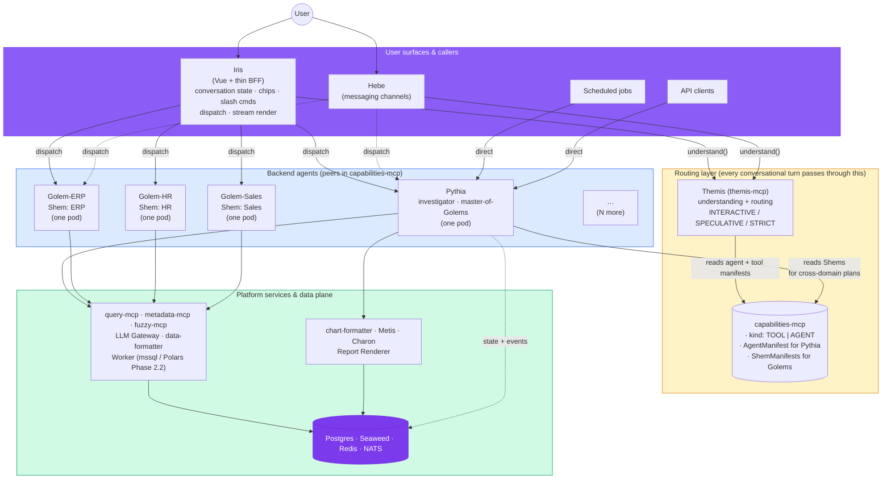
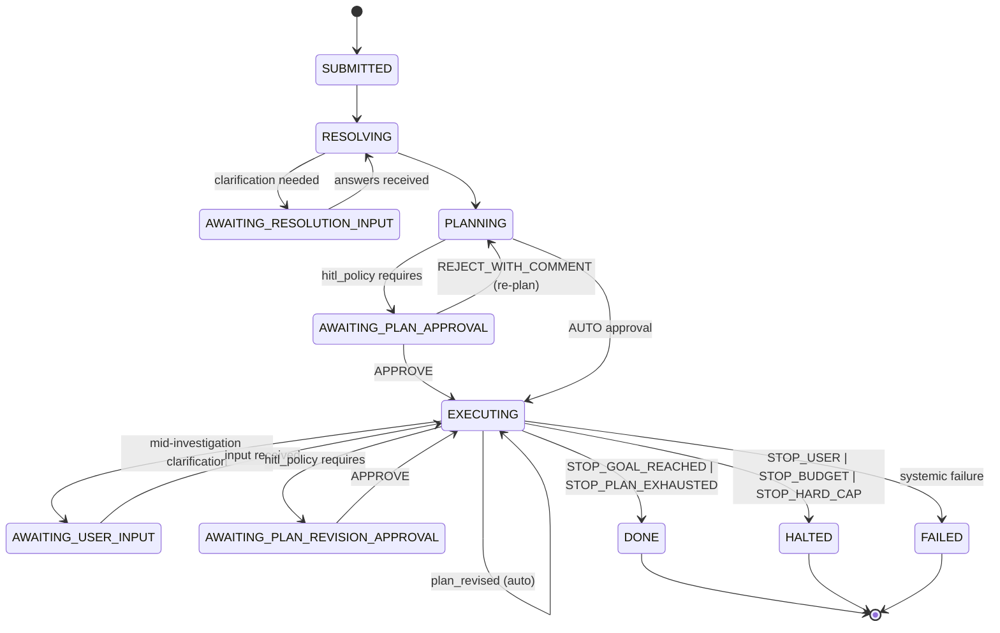

# Pythia v1 Design

> **Scope.** This document is the product definition + architecture for **Pythia**, the autonomous analytical investigator that sits above the V1 Platform. It captures the decisions made during the Bora–Claude design brainstorm of 2026-05-04, organised so that an engineer can read top-to-bottom and start implementing.
>
> **Source material.** The brief in `pythia-brief.md`; the V1 Platform docs in `docs/platform/`; the Analytical Agent spec in `docs/platform/Analytical Agent on V1.md`; the Golem frontend docs in `docs/golem/`; and the brainstorm transcript itself.
>
> **Status:** draft v0.2 — incorporates the architectural reframe of 2026-05-08 (Iris-as-FE, Themis-as-router, Golem-as-template, Pythia-as-one-of-N-peer-agents). Bora review pending. Last updated 2026-05-08.

## Table of Contents

1. [Vision and design principles](#1-vision-and-design-principles)
2. [Pythia's place in the platform picture](#2-pythias-place-in-the-platform-picture)
3. [The Investigation contract](#3-the-investigation-contract)
4. [Worked examples](#4-worked-examples)
5. [Pythia internal subsystems](#5-pythia-internal-subsystems)
6. [Dependencies on the platform](#6-dependencies-on-the-platform)
7. [Roadmap](#7-roadmap)
8. [Resolved decisions](#8-resolved-decisions)
9. [Glossary](#9-glossary)

---

## 1. Vision and design principles

### 1.1 Vision

**Pythia is an autonomous analytical investigator.** Given a (potentially complex) business question or scenario, Pythia plans a multi-step investigation, executes it with optional human-in-the-loop, and delivers a structured **InvestigationArtifact** — a citable, replayable, multi-renderable record of *what was asked, what was done, and what was found*.

Pythia is the **engine**, not a user-facing product, and not the constellation's only agent. The platform's conversational frontend (Iris), the messaging agent (Hebe), scheduled jobs, and API clients all dispatch to whichever backend agent answers a given turn best — Pythia or one of N peer **Golem instances**, each parameterised for a specific domain (ERP, HR, Sales, …). Pythia speaks one contract — `Investigation` in, `InvestigationArtifact` out — that all callers consume when they invoke it.

Pythia handles questions that require a **plan**: multi-step decomposition, intermediate results that feed downstream queries, reasoning over those results, hypothesis testing, and outputs that range from a list to a research-shaped document to a forecast or simulation. In-domain procedural questions are answered by the relevant Golem instance; cross-domain or analytical questions route to Pythia. Pythia is also the **master-of-Golems**: when a planned investigation needs domain-curated knowledge from one or more Golems' Shems (preferred queries, terminology, capabilities), Pythia reads those manifests directly from `capabilities-mcp` and uses them in its plan — no special delegation machinery in v1.

### 1.2 Design principles

These principles govern *how* Pythia is built. They are deliberately phrased as testable choices, not platitudes.

**P1 — Pythia investigates; others render.**
Artifacts are structured; rendering is downstream. The same artifact is consumed by Iris (chat), Report Renderer (DOCX/PDF/HTML), Hebe (messaging digest), API clients (JSON), and any future BI tool. Pythia never owns a render target.

**P2 — Pythia is stateless about data, full of metadata.**
Pythia holds investigation metadata: plans, hypotheses, step records, a *handle table*. It does not hold result data. Workers (Polars/DuckDB) hold hot working sets in session DataFrames; Charon materialises to Seaweed (Arrow IPC) or Redis when persistence is needed; Postgres holds Pythia's own structured state. The handle table maps logical names to typed `Handle` values pointing at where data actually lives.

**P3 — Hypothesis-driven planning is the default.**
Plans are typed DAGs of nodes that test hypotheses. Procedural plans (e.g., "list customers matching X") are the degenerate case: a single trivial hypothesis ("the data exists for this question"). The same planner, executor, and revision machinery serves procedural Q&A, RCA, forecasting, and simulation.

**P4 — Compile before run.**
Pythia inherits the Platform's safety net. Every composed query goes through `query-mcp.compile` before `query-mcp.query`. Every plan node has a typed contract; the executor refuses to launch a node whose inputs don't satisfy its preconditions.

**P5 — Themis and capabilities-mcp are platform infrastructure.**
Three platform questions are solved once and reused by every agent: "what does the user mean?" (Themis), "which agent should answer this turn?" (Themis again, over the agent registry — see §6.2), and "what can any of us do?" (`capabilities-mcp` — the registry of both tool capabilities and agent manifests). MCP services alongside `query-mcp` and `metadata-mcp`. No agent reimplements understanding, routing, or capability lookup.

**P6 — HITL is policy, not architecture.**
The same Pythia handles `INTERACTIVE` (Iris), `SPECULATIVE` (Hebe, scheduled), and `STRICT` (refuses on any blocker). Human-in-the-loop is a per-investigation policy that flows into every decision point — disambiguation, plan approval, suspicion handling, plan revision, budget thresholds.

**P7 — Pythia is a pausable investigator.**
Investigations are long-running, checkpoint-restorable, and may park in any of four `AWAITING_*` states. State lives in Postgres; in-flight steps complete (drain semantics) when the investigation parks. Resume is first-class, not bolted on.

**P8 — Arrow IPC is the universal exchange format.**
Anything that produces persistable intermediate data emits Arrow. Anything that consumes reads Arrow. Storage tiers (Worker session DFs, Seaweed blobs, Redis entries) all hold Arrow. Charon never translates formats — only moves bytes.

**P9 — Tier-as-intent for LLM calls.**
Pythia declares `(modality, tier, task_kind)`; LLM Gateway picks the model. Pythia stays decoupled from model versions and vendors; ops can swap models centrally without code changes.

**P10 — Rules first, LLM fallback.**
Aggressive rule-based gating before any LLM call. Empty-result detection, row-count thresholds, schema-shape checks, predicate-defined hypothesis evaluations — all run as rules. LLM is the fallback when a rule cannot decide.

### 1.3 What Pythia is NOT

These are bright lines, not soft preferences.

- **Not the conversational front.** Iris (frontend) and Hebe (messaging) handle conversation state, multi-turn history, click-to-select, edit-and-resend, slash commands, snapshot rollback. Pythia produces structured artifacts; conversational surfaces wrap them.
- **Not the router.** Themis decides which agent answers a turn; Iris dispatches. Pythia is one of the agents Themis may pick. When chosen, Pythia investigates — it doesn't decide whether it should have been chosen.
- **Not a data store.** The handle table holds typed pointers; Charon materialises; Workers/Seaweed/Redis hold the data. Pythia knows *where* data lives, never *what* it is.
- **Not a renderer.** `data-formatter` (existing) renders tables; `chart-formatter` (new) emits Vega-Lite specs; Iris/Report Renderer/Hebe/API clients assemble blocks into target media.
- **Not a SQL writer.** Pythia composes via the Platform's TransDSL (queries from `metadata-mcp`'s catalog plus a Filter/Project/Sort stack over them). LLM-generated SQL is reserved as the last-resort fallback inside Themis, not Pythia.
- **Not an MCP server (in v1).** Pythia is invoked via API (HTTP/gRPC, with NATS for event streaming). Exposing Pythia itself as MCP is a v1.5+ option, not v1 scope.

---

## 2. Pythia's place in the platform picture

Pythia is **one of N peer backend agents**. The conversational frontend (Iris), the messaging-channel agent (Hebe), scheduled jobs, and API clients all dispatch to whichever agent answers a given turn best. Routing among the agents is owned by **Themis**, the platform's question-understanding service; the agent registry lives in **capabilities-mcp**.



Pythia's internal subsystems — Investigation Orchestrator, Plan Composer, DAG Executor, Hypothesis Evaluator, Plan Reviser, Suspicion Classifier, Budget Tracker, Handle Table, Synthesizer, Checkpointer, Streaming Event Emitter — are described in §5 and are not expanded in the picture above.

Five things to note about the picture:

1. **Iris dispatches; Themis decides; Pythia is one agent among N.** On every conversational turn, Iris (or Hebe) calls `themis.understand(question, prior_context, routing_hint?)` and receives `UnderstandingResult { resolved_intent, routing_decision }`. The caller dispatches to whichever agent Themis names. Themis stays stateless; conversation state lives in Iris. Scheduled jobs and API clients that already know which agent they want bypass the routing layer and call the agent directly.

2. **Pythia is the master-of-Golems for cross-domain questions.** When a question spans multiple domains ("how does headcount growth correlate with sales growth across regions?"), Themis routes to Pythia — not to multiple Golems. Pythia reads each relevant Golem's ShemManifest from `capabilities-mcp` and uses the structured domain knowledge (`preferred_queries`, `domain_terminology`, `preferred_capabilities`) directly when planning. Agents-as-capabilities; no special delegation machinery in v1. (Plan-node-level delegation to a Golem is a v1.5+ option.)

3. **Pythia has its own state; Golems are mostly stateless.** Pythia: investigations, plans, hypotheses, step records, handle table, pause-resume checkpoints — all in Postgres. Golems: one `ConversationalResponse` per turn persisted to Postgres for audit and follow-up turns; no checkpoints, no event log (Golems don't pause).

4. **Most of Pythia's "tools" are existing platform infrastructure.** `query-mcp`, `metadata-mcp`, `fuzzy-mcp`, `LLM Gateway`, `data-formatter`, Worker — all exist. Pythia adds *callers*, not *substitutes*. Golems share the same set of tools, scoped by their Shem.

5. **What's new vs. what's extracted from the V1 Analytical Agent.** Five entirely-new platform pieces: `capabilities-mcp` (registry with `kind: TOOL | AGENT` discriminator), `chart-formatter` library, `Metis` agent (ML/stats), `Charon` agent (Arrow IPC moves), `Report Renderer` service. Three extractions from the V1 Analytical Agent: **Themis** (`themis-mcp` — the AA's intent / fuzzy / query-selection logic, deepened into a stateless MCP service that now also owns routing), **Iris** (the AA's chat surface refactored to a thin FE — owns dispatch and conversation state but no longer makes routing or answer decisions itself), and the **Golem template** (the AA's backend question-answering logic, parameterised by a Shem and deployed one pod per domain). Plus Pythia itself. All are platform-team work items, not Pythia-internal.

---

## 3. The Investigation contract

This is the surface every consumer (Iris, Hebe, scheduled jobs, API clients) interacts with. It is the most important section of this document — everything else is in service of it.

### 3.1 Request shape

```
Investigation {
  id:        UUID                       // assigned by Pythia
  parent_id: UUID?                      // for follow-ups, replays, reproductions
  caller: {
    kind:           IRIS | HEBE | API | SCHEDULED
    user_id:        string
    tenant_id:      string                       // see §6 / open-questions Q6 — partition, retention, billing key
    correlation_id: string
  }

  question: string                      // natural language; locale-tagged
  context: {
    entity_context:        EntityRef?   // active EntityContext from caller's session
    conversation_excerpt:  [Turn]?      // last N relevant turns, if any
    locale:                string       // cs / en / sk / hu / de
    themis_prior_context:  ResolutionContext?
                                        // optional: opaque continuation from caller's earlier
                                        // themis.understand() call. When set, Pythia's RESOLVING
                                        // phase passes it to themis.understand(INVESTIGATION_DEEP)
                                        // so Themis deepens efficiently rather than starting cold.
  }

  style_hint: LIST | NARRATIVE | FORECAST | SIMULATION | AUTO
                                         // AUTO = Pythia infers from question shape

  scenario_params:  ScenarioSpec?       // forecast/simulation only

  constraints: {
    max_llm_cost_usd:   float?
    max_llm_tokens:     int?
    latency_budget_ms:  int?
    max_step_count:     int?            // runaway-prevention safeguard
    depth_budget:       SHALLOW | NORMAL | DEEP
                                         // categorical default mapping to other caps
  }

  hitl_policy: {
    plan_approval:           AUTO | REQUIRED | REQUIRED_FOR_DEEP
    on_suspicious_result:    CONTINUE | WARN | HALT
    on_plan_revision:        AUTO | APPROVE
    on_budget_threshold:     CONTINUE | ASK
    disambiguation:          INTERACTIVE | SPECULATIVE | STRICT
  }

  llm_overrides: {                       // optional per-investigation tier escalations
    evaluator_tier?:  STRONG
    suspicion_tier?:  STRONG
    // any per-call-site default can be overridden
  }
}
```

#### Field notes

- **`parent_id`** establishes the parent/child lineage used by `replay()` and `reproduce()` (§3.6) and by user-driven follow-ups from loose ends.
- **`style_hint = AUTO`** lets Pythia infer the artifact style from the question shape; it may emit a `style_overridden` event if its inference differs from the caller's hint.
- **`scenario_params`** carries structured input for forecasts (model class hint, horizon) and simulations (parameter overrides, what-if values).
- **`depth_budget`** is the lazy-default knob; expert callers set explicit caps. Defaults: SHALLOW ≤3 steps / ~$0.20; NORMAL ≤15 steps / ~$2; DEEP ≤50 steps / ~$10.
- **`hitl_policy.plan_approval`**: defaults are `AUTO` for SHALLOW, `REQUIRED_FOR_DEEP` for NORMAL/DEEP, `REQUIRED` for any production-affecting investigation (forecasts that go into a board pack, simulations that drive pricing).
- **`disambiguation`**: `INTERACTIVE` is Iris's default; `SPECULATIVE` is Hebe's default; `STRICT` is opt-in for callers that refuse to proceed under assumption.
- **Routing is upstream of this contract.** The Investigation contract is what Pythia (and Hebe / scheduled / API callers) consume *after* Pythia has been chosen. The agent-selection decision is owned by Themis — see §6.2 for `themis.understand()` and `RoutingDecision`. Iris (or Hebe), having already called Themis to route, populates `context.themis_prior_context` so Pythia's RESOLVING phase can deepen against prior work rather than starting cold.

### 3.2 Artifact shape

The artifact is the persistent, structured record of the investigation. It is created at submission, populated as the investigation runs, and finalised when the investigation reaches a terminal status. It is **never overwritten**; replays/reproductions create new artifacts with `parent_id` pointing back.

```
InvestigationArtifact {
  id:        UUID
  parent_id: UUID?
  status:    SUBMITTED | RESOLVING | AWAITING_RESOLUTION_INPUT
           | PLANNING | AWAITING_PLAN_APPROVAL
           | EXECUTING | AWAITING_USER_INPUT | AWAITING_PLAN_REVISION_APPROVAL
           | DONE | HALTED | FAILED

  resolution: ResolutionResult           // populated after resolution completes
  plan:       PlanDag                    // current plan (may have been revised)
  steps:      [StepRecord]               // append-only execution log
  hypotheses: [Hypothesis]               // state per hypothesis
  findings:   [Finding]                  // intermediate insights surfaced in-flight
  loose_ends: [LooseEnd]                 // declared at planning + accumulated at stop
  conclusion: Conclusion?                // populated when status = DONE
  resource_usage: ResourceUsage          // running totals + final snapshot
  warnings:   [PlatformWarning]          // forwarded from query-mcp pipeline_warnings

  created_at:   timestamp
  finalised_at: timestamp?
}
```

#### `ResolutionResult`

```
ResolutionResult {
  resolved_intent: ResolvedIntent
  assumptions:     [Assumption]          // SPECULATIVE-mode best-guesses
  clarifications:  [ClarificationRoundtrip]
                                          // record of any back-and-forth with the user
}

ResolvedIntent {
  kind:    PROCEDURAL | RCA | FORECAST | SIMULATION
  entities:           [ResolvedEntity]
  resolved_params:    map<string, any>   // resolved-against-current-time snapshot
  expressed_params:   map<string, any>   // what the user originally said
                                          // (replay vs. reproduce uses both)
  relevant_named_queries: [NamedQueryRef]
  relevant_capabilities:  [CapabilityRef]
}
```

#### `PlanDag`

```
PlanDag {
  hypotheses: [Hypothesis]              // first-class; procedural plans have one trivial hyp
  nodes:      [PlanNode]                // each carries tests: [HypId]
  edges:      [DataDep]                 // step_b.input.X = step_a.output.Y
  rationale:  string                    // LLM's explanation of the plan
  revision:   int                       // 0 for initial; bumps on plan_revised
}

PlanNode = QueryNode | DataFrameNode | ModelNode | ReasoningNode | RenderNode

  QueryNode {
    queryRef:   string                  // query from metadata-mcp's query catalog
    params:     map<string, ParamValue>
    stack:      [TransDSLOp]            // optional Filter/Project/Sort stack
    tests:      [HypId]
  }

  DataFrameNode {                       // requires Polars Worker (Phase 2.2)
    dfdsl:                string
    source_session_df:    Handle
    tests:                [HypId]
  }

  ModelNode {
    capability_id:  string              // e.g. "model.forecast.arima"
    inputs:         [Handle]
    params:         map<string, any>
    tests:          [HypId]
  }

  ReasoningNode {
    prompt_template: string
    inputs:          [Handle]
    output_kind:     STRUCTURED | TEXT
    tier_hint:       STRONG | CHEAP     // planner-declared
  }

  RenderNode {
    kind:           TABLE | CHART | NARRATIVE_FRAGMENT
    input_handles:  [Handle]
    format_options: FormatOptions
    block_role:     PRIMARY | EVIDENCE | SUMMARY
    caption:        string?
  }

ParamValue = LiteralValue | HandleRef { handle, projection }
            // HandleRef enables cross-step parameter binding:
            // params: { customer_ids: HandleRef(H1, "customer_id") }

DataDep {
  from_node_id: NodeId
  to_node_id:   NodeId
  binding:      string                   // e.g. "to_node.params.customer_ids = from_node.output.customer_id"
}
```

#### `Hypothesis`

```
Hypothesis {
  id:          HypId
  parent_id:   HypId?                    // sub-hypothesis tree
  statement:   string                    // human-readable claim
  predicate:   Predicate?                // optional formal eval rule (rules-first)
  status:      PROPOSED | UNDER_TEST | SUPPORTED | REFUTED
             | INCONCLUSIVE | ABANDONED | OUT_OF_SCOPE
  test_steps:  [StepId]
  evidence:    [EvidenceLink]
  confidence:  float                     // [0, 1]; updated as evidence accumulates
  rationale:   string                    // why we proposed this

  // Scoring & display
  estimated_explanatory_power: float     // [0, 1]; planner-supplied, evaluator-refined
  diagnostic_power:            float     // [0, 1]; "if I refute this, how much do I learn?"
  display_priority:            HIDDEN | SECONDARY | PRIMARY
}

EvidenceLink {
  step_id:        StepId
  output_handle:  Handle
  interpretation: SUPPORTS | REFUTES | NEUTRAL
  reasoning:      string                 // LLM's or rule's explanation
  confidence:     float
}

Predicate {
  kind:       ROW_COUNT_GT | ROW_COUNT_LT | METRIC_DELTA_RATIO
            | CORRELATION_STRENGTH | NULL_RATE_LT | …
  parameters: map<string, any>
  threshold:  float
}
```

#### `StepRecord`

```
StepRecord {
  id:           StepId
  node_id:      NodeId                   // which PlanNode produced this step
  status:       SCHEDULED | RUNNING | COMPLETED | FAILED | RETRYING
  started_at:   timestamp
  completed_at: timestamp?
  attempts:     int                      // retries
  input_refs:   [Handle]                 // resolved inputs
  output_handle: Handle?                 // populated on success
  cost: {
    tokens_in:  int?
    tokens_out: int?
    usd:        float
    latency_ms: int
    cached:     bool
    tier_used:  STRONG | CHEAP | null
  }
  error: {
    code:        string?
    message:     string?
    recoverable: bool
  }?
}
```

#### `Conclusion`

```
Conclusion {
  primary:    RenderableArtifact         // the style-specific final answer
  alternates: [RenderableArtifact]       // same content, different shapes
  evidence_refs: [StepId]                // which steps grounded this
  confidence: ConfidenceInfo?            // null for procedural plans

  // Stop reason, surfaced for honesty
  stop_reason: STOP_USER | STOP_BUDGET | STOP_HARD_CAP
             | STOP_PLAN_EXHAUSTED | STOP_GOAL_REACHED
  budget_truncated: bool
}

RenderableArtifact {
  blocks:       [Block]
  layout_hints: LayoutHint?
}

Block = TextBlock | TableBlock | ChartBlock | DividerBlock

  TextBlock {
    content_md: string
    role:       HEADING | BODY | CAPTION | CALLOUT | LOOSE_ENDS_SECTION
  }
  TableBlock {
    data_handle:    Handle
    format_options: FormatOptions        // hide_columns_matching, row_limit, ...
    caption:        string?
  }
  ChartBlock {
    data_handle: Handle
    chart_kind:  TIMESERIES | BAR | DECOMPOSITION | SCATTER | …
    config:      ChartConfig             // axes, series, color
    caption:     string?
  }
  DividerBlock {
    kind: SECTION_BREAK | EVIDENCE_BREAK
  }

ConfidenceInfo {
  kind:     HEURISTIC | MODEL_BASED
  score:    float                        // [0, 1]
  caveats:  [string]
}
```

#### `LooseEnd`

```
LooseEnd {
  hypothesis_id:  HypId                  // the hypothesis this loose end stands for
  source:         PLANNING_TIME | EXECUTION_TIME
  reason:         OUT_OF_DATA_SCOPE | OUT_OF_CAPABILITY_SCOPE
                | DEPRIORITIZED_BY_DEPTH | BUDGET_EXHAUSTED
                | HARD_CAP_EXCEEDED | INCONCLUSIVE_ABANDONED
                | PIVOTED_AWAY | USER_HALTED
  why:            string                 // human-readable
  suggested_followup: string?            // actionable seed for a child investigation
  parent_hypothesis_id: HypId?           // for pivoted/decomposed
}
```

#### `Handle`

```
Handle = WorkerSessionDF | SeaweedArrowBlob | RedisArrowEntry | LiveQueryRef

WorkerSessionDF {
  worker_pod:     string
  session_id:     string
  df_id:          string
  schema:         ArrowSchema
  row_count_est:  int
  created_at:     timestamp
  ttl_until:      timestamp
}

SeaweedArrowBlob {
  url:           string
  schema:        ArrowSchema
  row_count:     int
  content_hash:  string
  size_bytes:    int
  retention_until: timestamp?
}

RedisArrowEntry {
  key:    string
  schema: ArrowSchema
  ttl:    duration
}

LiveQueryRef {                           // not yet executed; lazy
  query_mcp_spec: object
}
```

#### `ResourceUsage`

```
ResourceUsage {
  total_usd:           float
  total_llm_tokens_in: int
  total_llm_tokens_out: int
  total_query_count:   int
  total_latency_ms:    int
  by_tier:             map<Tier, CostBreakdown>
  by_task_kind:        map<TaskKind, CostBreakdown>
  cache_hit_rate:      float
  cache_savings_usd:   float
  halted_at_budget_pct: float?
  hard_cap_hit:        bool
}
```

### 3.3 Streaming protocol

Pythia emits a typed event stream over NATS JetStream, keyed per investigation. Clients subscribe to receive live updates; the same events are persisted as the investigation's append-only event log (Postgres) for replay and audit.

```
// Lifecycle
investigation_submitted        { investigation_id, request }
status_changed                 { from, to, reason? }
investigation_done             { id, status, resource_usage }

// Resolution
resolution_started             { question }
resolution_clarification_needed{ clarification_request }
resolution_clarification_answered { answers }                    // echo on caller response
resolution_completed           { resolved_intent, assumptions }

// Planning
plan_drafted                   { plan, awaiting_approval: bool }
plan_approved                  { plan }
plan_rejected                  { reason, rejection_comment? }    // → triggers re-plan
plan_revised                   { plan, revision_kind: PRUNE|PIVOT|DECOMPOSE,
                                  trigger: refuted_hyp_id? | new_evidence? }

// Hypotheses
hypothesis_proposed            { hypothesis }
hypothesis_under_test          { hyp_id, step_ids }
hypothesis_supported           { hyp_id, evidence_refs, confidence }
hypothesis_refuted             { hyp_id, refuting_step, reasoning }
hypothesis_inconclusive        { hyp_id, reason }
hypothesis_abandoned           { hyp_id, reason }

// Prioritization
hypotheses_prioritized         { ordered: [{hyp_id, score, rationale}, ...] }
deepening_decision             { chose_hyp, score, rationale,
                                  alternates, tie_break_used: bool }

// Execution
batch_launched                 { batch_id, step_ids, projected_cost, max_parallelism }
step_started                   { step_id, node_kind, summary }
step_retrying                  { step_id, attempt, reason }
step_completed                 { step_id, output_ref, row_count, cost }
step_failed                    { step_id, error_code, message, recoverable }
batch_completed                { batch_id, succeeded[], failed[],
                                  inconclusive[], actual_cost }

// Suspicion / findings
suspicion_raised               { step_id, kind, severity, message }
finding                        { id, kind, summary, evidence_refs }

// Loose ends
loose_end_declared             { loose_end, source: PLANNING_TIME }   // with plan_drafted
loose_end_generated            { loose_end, source: EXECUTION_TIME }

// Budget
budget_threshold               { used_$, remaining_$, projected_next_batch_$,
                                  severity: WARN | CRITICAL }
budget_exhausted               { triggered_action: HALT_GRACEFULLY | ASK | ABORT,
                                  remaining_planned_steps: [step_id] }
scheduler_drained              { reason: AWAITING_USER_INPUT | HALTED | … }

// Synthesis
synthesizer_block_started      { block_index, kind }
synthesizer_block_streaming    { block_index, partial_content }
synthesizer_block_completed    { block_index, block }
synthesizer_done               { total_blocks }

// Conclusion
conclusion                     { primary, alternates, evidence_refs,
                                  confidence, stop_reason, budget_truncated }
```

Iris can render investigation progress meaningfully off this event stream: a hypothesis tree that updates as evaluations come in, parallel-batch progress bars, budget-bar warnings, the synthesised conclusion streaming block-by-block.

### 3.4 Lifecycle states



The four `AWAITING_*` states are the **pause-resume seams**. Each has:

- A trigger (what made the investigation park)
- A resume condition (what input ends the wait)
- A timeout / abandon policy (what if no input arrives — investigation expires after configurable TTL, default 24 h)
- Drain semantics for in-flight steps (`AWAITING_USER_INPUT` lets in-flight complete; the others enter the state before any execution starts)

When entering an `AWAITING_*` state, Pythia checkpoints to Postgres (full state snapshot — plan, hypotheses, handle table, step records, scheduler state) and stops launching new steps. The streaming `scheduler_drained` event signals to clients that the investigation has parked.

When resuming, Pythia reloads from the checkpoint and continues. Resume is idempotent: if a client retries the resume signal, only the first one takes effect.

### 3.5 HITL policies — concrete behaviour

| Policy | Value | Behaviour |
|---|---|---|
| `disambiguation` | INTERACTIVE | Themis returns ClarificationRequest on blockers; Pythia parks in `AWAITING_RESOLUTION_INPUT` |
| `disambiguation` | SPECULATIVE | Themis makes best-guess assumptions; Pythia proceeds; assumptions land in `ResolutionResult.assumptions` |
| `disambiguation` | STRICT | Themis returns `RefusalWithGaps` on any blocker; Pythia transitions to FAILED |
| `plan_approval` | AUTO | Pythia proceeds straight to EXECUTING |
| `plan_approval` | REQUIRED | Pythia parks in `AWAITING_PLAN_APPROVAL`; client supplies APPROVE \| REJECT_WITH_COMMENT |
| `plan_approval` | REQUIRED_FOR_DEEP | REQUIRED if `depth_budget == DEEP`; AUTO otherwise |
| `on_suspicious_result` | CONTINUE | Suspicion logged as warning; execution continues |
| `on_suspicious_result` | WARN | `suspicion_raised` event emitted with WARN severity; execution continues |
| `on_suspicious_result` | HALT | Pythia parks in `AWAITING_USER_INPUT` with the suspicion details |
| `on_plan_revision` | AUTO | Plan revisions apply silently (with `plan_revised` event) |
| `on_plan_revision` | APPROVE | Pythia parks in `AWAITING_PLAN_REVISION_APPROVAL`; client supplies APPROVE \| REJECT |
| `on_budget_threshold` | CONTINUE | Budget thresholds emit warning events; execution proceeds |
| `on_budget_threshold` | ASK | At 90 % budget, Pythia parks; client supplies CONTINUE \| HALT_GRACEFULLY \| ABANDON |

### 3.6 Replay vs. reproduce

Two operations on a persisted investigation, both producing new artifacts with `parent_id = original`:

```
investigation.replay(parent_id, overrides?) → new investigation
  - re-resolves all relative params against current date
  - fresh queries, fresh evidence, possibly different conclusion
  - typical use: Hebe "is X still true?", scheduled re-runs

investigation.reproduce(parent_id) → new investigation
  - uses resolved_params snapshot from the parent (frozen time references)
  - if parent's evidence blobs are still in Seaweed, reuses them; otherwise re-executes against frozen source data
  - typical use: audit, debugging, citation
```

**Reproduce fidelity** depends on Seaweed retention policy for evidence blobs — that's a per-deployment configuration. Default retention: 90 days for production investigations, 7 days for SHALLOW investigations.

### 3.7 Investigation parent/child relationships

Beyond replay/reproduce, child investigations are spawned from **loose ends**. Each loose end carries an optional `suggested_followup` string; when a user (or automation) acts on it, a new `Investigation` is created with the loose-end's hypothesis as the seed question and `parent_id` pointing back. This produces an investigation graph: original → child → grandchild, queryable for "tell me everything we've ever investigated about Private channel revenue."

---

## 4. Worked examples

Three end-to-end worked examples, one per investigation kind. Each shows the request, the plan Pythia drafts, the execution trace, and the artifact's terminal state.

### 4.1 Procedural Q&A — Nescafe-Maggi

**Question.** "Customers that returned Nescafe stock in the last year and whose Maggi brand revenue dropped over the last 2 quarters."

**Request from Iris.**

```
Investigation {
  question: "Zákazníci, kteří vrátili Nescafe za poslední rok a u nichž Maggi tržby
             klesly za poslední 2 čtvrtletí",
  context:  { entity_context: null, locale: "cs" },
  style_hint: LIST,
  constraints:  { depth_budget: SHALLOW, latency_budget_ms: 30000 },
  hitl_policy:  { plan_approval: AUTO, disambiguation: INTERACTIVE,
                  on_suspicious_result: WARN }
}
```

**Resolution preface** (synchronous; Pythia parks in RESOLVING then PLANNING):

- Themis runs in `INVESTIGATION_DEEP` mode, `INTERACTIVE` disambiguation.
- `metadata-mcp.list_queries` and `get_entity` fetch model context.
- `fuzzy-mcp` resolves "Nescafe" → `brand.id = 412`, "Maggi" → `brand.id = 507` (no ambiguity).
- Intent classification → PROCEDURAL.
- Capability matching → relevant queries: `returnsByCustomerForBrandInPeriod`, `revenueByCustomerByBrandByQuarter`. No further capabilities needed.
- No blockers; `ResolutionResult` returned with no clarifications and no assumptions.

**Plan drafted** (one trivial hypothesis: "the data exists for this question", display_priority: HIDDEN).

```
N1 [QueryNode]   returnsByCustomerForBrandInPeriod(brand=412, period="last 12mo")
                 → handle: H1 (WorkerSessionDF, schema={customer_id})
N2 [QueryNode]   revenueByCustomerByBrandByQuarter(
                   customer_ids = HandleRef(H1, "customer_id"),
                   brand = 507,
                   quarters = ["2025Q4", "2026Q1"])
                 → handle: H2 (WorkerSessionDF, schema={customer_id, quarter, revenue})
N3 [DataFrameNode]   pivot H2 by quarter; delta = Q1 - Q4; filter delta < 0
                 → handle: H3 (WorkerSessionDF)
N4 [RenderNode]   TABLE(H3) → conclusion.primary
```

`plan_drafted` event fires with `awaiting_approval: false` (SHALLOW + AUTO policy).

**Note.** N3's DataFrameNode requires Polars Worker (Phase 2.2). In Pythia v0 (no Polars Worker), the planner produces an alternative N3 as a TransDSL stack on N2's output (the operation is expressible in SQL). Capabilities-mcp surfaces only what's live; the planner composes around what's available.

**Execution trace.**

```
status_changed                        SUBMITTED → RESOLVING
resolution_started                    { question }
resolution_completed                  { resolved_intent, assumptions: [] }
status_changed                        RESOLVING → PLANNING
plan_drafted                          { plan, awaiting_approval: false }
hypotheses_prioritized                { ordered: [trivial-hyp] }
status_changed                        PLANNING → EXECUTING
batch_launched                        { batch_id: 1, step_ids: [N1],
                                        projected_cost: $0.04 }
step_started                          { N1 }
step_completed                        { N1, row_count: 47, cost: { usd: 0.03, ... } }
batch_completed                       { batch_id: 1, succeeded: [N1] }
batch_launched                        { batch_id: 2, step_ids: [N2],
                                        projected_cost: $0.06 }
step_started                          { N2 }
step_completed                        { N2, row_count: 188, cost: { usd: 0.05, ... } }
batch_launched                        { batch_id: 3, step_ids: [N3] }
step_started                          { N3 }
step_completed                        { N3, row_count: 23 }
hypothesis_supported                  { trivial-hyp, confidence: 1.0 }
batch_launched                        { batch_id: 4, step_ids: [N4] }
step_completed                        { N4 }
synthesizer_block_started             { block_index: 0, kind: TextBlock }
synthesizer_block_completed           { block_index: 0,
                                        block: TextBlock("Found 23 customers...") }
synthesizer_block_completed           { block_index: 1,
                                        block: TableBlock(handle=H3) }
synthesizer_done                      { total_blocks: 2 }
conclusion                            { primary: RenderableArtifact{blocks},
                                        confidence: null,
                                        stop_reason: STOP_GOAL_REACHED,
                                        budget_truncated: false }
status_changed                        EXECUTING → DONE
investigation_done                    { id, status: DONE,
                                        resource_usage: { total_usd: $0.18, ... } }
```

**Artifact terminal state** (abbreviated).

```
InvestigationArtifact {
  status: DONE,
  resolution: { resolved_intent: ..., assumptions: [] },
  plan: { hypotheses: [trivial-hyp], nodes: [N1,N2,N3,N4], revision: 0 },
  hypotheses: [{ id: trivial, status: SUPPORTED, display_priority: HIDDEN }],
  steps: [{N1, COMPLETED}, {N2, COMPLETED}, {N3, COMPLETED}, {N4, COMPLETED}],
  loose_ends: [],
  conclusion: {
    primary: RenderableArtifact{
      blocks: [
        TextBlock("Found 23 customers matching the criteria."),
        TableBlock(handle=H3, caption="Customers with Maggi revenue decline")
      ]
    },
    alternates: [/* CSV rendering */],
    confidence: null,           // procedural; nullable
    stop_reason: STOP_GOAL_REACHED
  },
  resource_usage: { total_usd: 0.18, total_query_count: 2, total_latency_ms: 8200, ... }
}
```

### 4.2 RCA — Private channel revenue

**Question.** "Why is our revenue YoY lower for the channel Private?"

**Request from Iris.**

```
Investigation {
  question: "Proč je naše tržba YoY nižší pro kanál Private?",
  context:  { entity_context: { channel: "Private" }, locale: "cs" },
  style_hint: NARRATIVE,
  constraints:  { depth_budget: NORMAL, max_llm_cost_usd: 2.00 },
  hitl_policy:  { plan_approval: REQUIRED_FOR_DEEP,
                  on_suspicious_result: WARN,
                  on_plan_revision: AUTO,
                  on_budget_threshold: CONTINUE,
                  disambiguation: INTERACTIVE }
}
```

**Resolution preface.**

- Themis runs INVESTIGATION_DEEP. "Private" already resolved by EntityContext. "Revenue YoY" → metric + temporal comparison; no ambiguity.
- Intent → RCA.
- Capability matching includes `model.decompose.variance` if Metis registered (else marked unavailable; falls back to heuristic decomposition).

**Plan drafted with hypothesis tree** (NORMAL → REQUIRED_FOR_DEEP not triggered; AUTO).

```
Diagnostic D0:  confirmRevenueDrop(channel="Private", period="YoY")
                → magnitude X%, period bounds confirmed

HypA "fewer customers"               → test A1: activeCustomersByChannelByMonth
HypB "lower order value"             → test B1: avgOrderValueByChannelByMonth
HypC "price drops"                   → test C1: avgPriceByChannelByProductByMonth (aggregate)
HypD "product mix shift"             → test D1: revenueByChannelByProductFamilyByMonth
HypE "seasonal effect"               → test E1: revenueByChannelByMonth (3-yr history)
HypF "big-customer churn"            → test F1: revenueByChannelByCustomer (ranked)
HypG "data quality issue"            → test G1: recordCountByChannelByMonth (sanity)

Loose ends declared at planning time:
  L1 "salesforce headcount changes" — OUT_OF_DATA_SCOPE; "no HR data in warehouse"
  L2 "marketing spend changes"      — OUT_OF_DATA_SCOPE; "no marketing data in warehouse"

Hypothesis priorities (planner-supplied + heuristic):
  G > A > F > E > D > B > C   (G first — fast diagnostic; if positive, kills RCA premise)
```

**Execution trace** (compressed; the interesting parts).

```
status_changed                        EXECUTING
batch_launched                        { batch_id: 1, step_ids: [D0],
                                        projected_cost: $0.05 }
step_completed                        { D0, row_count: 24, cost: $0.04 }
finding                               { kind: BASELINE,
                                        summary: "Revenue down 14% YoY 2025Q4-2026Q1
                                                  vs. prior year" }

batch_launched                        { batch_id: 2,
                                        step_ids: [G1, A1, F1, E1, D1, B1, C1],
                                        projected_cost: $0.40, max_parallelism: 5 }
                                        // 7 hypotheses, 5 in flight, 2 queued
step_started                          { G1 } { A1 } { F1 } { E1 } { D1 }
step_completed                        { G1, row_count: 24 }
hypothesis_refuted                    { HypG, evidence: G1, predicate: PASSED,
                                        reasoning: "Record counts consistent across
                                                    YoY; no data quality anomaly" }
step_completed                        { A1 }
hypothesis_refuted                    { HypA, predicate: ratio_check FAILED at 1.02,
                                        reasoning: "Customer count grew +2% YoY,
                                                    not declined" }
step_started                          { B1 }     // promoted as G1's slot freed
step_completed                        { F1 }
hypothesis_refuted                    { HypF, reasoning: "Top-10 customer concentration
                                                          stable; no big-customer
                                                          departure dominant" }
step_started                          { C1 }     // promoted
step_completed                        { E1 }
hypothesis_refuted                    { HypE, reasoning: "Seasonal pattern matches
                                                          prior years; YoY decline not
                                                          explained by seasonality" }
step_completed                        { D1 }
hypothesis_supported                  { HypD, confidence: 0.6,
                                        reasoning: "Mix shifted toward
                                                    lower-revenue product family Y" }
step_completed                        { B1 }
hypothesis_supported                  { HypB, confidence: 0.7,
                                        reasoning: "AOV down 8% YoY,
                                                    consistent across months" }
step_completed                        { C1 }
hypothesis_inconclusive               { HypC, reasoning: "Aggregate prices flat
                                                          but product-level variance
                                                          not yet examined" }
batch_completed                       { batch_id: 2, succeeded: 7,
                                        actual_cost: $0.38 }

deepening_decision                    { chose_hyp: HypB,
                                        rationale: "Higher confidence × higher
                                                    explanatory_power than D" }
plan_revised                          { revision: 1,
                                        kind: DECOMPOSE+PIVOT,
                                        trigger: refuted=A,E,F,G;
                                                 supported=B,D;
                                                 inconclusive=C,
                                        new_hypotheses: [
                                          B.1 "AOV drop concentrated in segment X",
                                          B.2 "AOV drop uniform across customers",
                                          D.1 "Mix shift driven by family Y",
                                          C.* "Price decrease hidden in product subset"
                                        ]}

batch_launched                        { batch_id: 3, step_ids: [B1.1, B1.2, D1.1, C2],
                                        projected_cost: $0.45 }
step_completed                        { B1.1 }
hypothesis_supported                  { HypB.1, confidence: 0.8 }
step_completed                        { B1.2 }
hypothesis_refuted                    { HypB.2 }
step_completed                        { D1.1 }
hypothesis_supported                  { HypD.1, confidence: 0.7 }
step_completed                        { C2 }
hypothesis_refuted                    { HypC.* }

// Stop check: explained_variance heuristic = 0.74 (B contrib ~8% of 14% gap = 57%
// of explained; D contrib ~6% of 14% gap = 43%); ≥ 0.75 threshold not quite hit;
// run one more deepening pass
deepening_decision                    { chose_hyp: HypB.1, rationale: "highest score" }
plan_revised                          { revision: 2,
                                        new_hypotheses: [B.1.1 "segment X = SMB tier"] }
batch_launched                        { batch_id: 4, step_ids: [B1.1.1] }
step_completed                        { B1.1.1 }
hypothesis_supported                  { HypB.1.1, confidence: 0.7 }

// Stop check: max_revisions=2 reached for NORMAL; STOP_HARD_CAP triggered.
// All in-flight done; jump to synthesizer.
status_changed                        EXECUTING → DONE_PENDING_SYNTHESIS

batch_launched                        { batch_id: 5, step_ids: [SYNTH] }
synthesizer_block_started             { block_index: 0, kind: TextBlock, role: HEADING }
synthesizer_block_completed           { block_index: 0, block: TextBlock("Private
                                                                          channel
                                                                          revenue: ...") }
synthesizer_block_completed           { block_index: 1, block: ChartBlock(YoY decomp) }
synthesizer_block_completed           { block_index: 2, block: TextBlock("Primary driver
                                                                          B.1: ...") }
synthesizer_block_completed           { block_index: 3, block: TableBlock(SMB segment
                                                                          breakdown) }
synthesizer_block_completed           { block_index: 4, block: TextBlock("Secondary
                                                                          driver D.1: ...") }
synthesizer_block_completed           { block_index: 5, block: ChartBlock(family Y mix
                                                                          shift) }
synthesizer_block_completed           { block_index: 6, block: TextBlock("Loose ends...") }
synthesizer_done                      { total_blocks: 7 }
conclusion                            { primary, alternates,
                                        confidence: { kind: HEURISTIC, score: 0.65,
                                                      caveats: ["variance attribution
                                                                  is heuristic, not
                                                                  exact; consider
                                                                  follow-up with
                                                                  Metis
                                                                  decomposition",
                                                                "salesforce headcount
                                                                  not tested
                                                                  (out of data scope)"]},
                                        stop_reason: STOP_HARD_CAP,
                                        budget_truncated: false }
investigation_done                    { id, status: DONE,
                                        resource_usage: { total_usd: 1.34,
                                                          total_query_count: 13,
                                                          total_latency_ms: 47000, ... } }
```

**Artifact terminal state** (abbreviated).

```
InvestigationArtifact {
  status: DONE,
  plan: { revision: 2, hypotheses: [HypA..G, B.1, B.2, D.1, C.*, B.1.1, trivial],
          nodes: [...], rationale: "..." },
  hypotheses: [
    { HypG, REFUTED },        { HypA, REFUTED },
    { HypF, REFUTED },        { HypE, REFUTED },
    { HypB, SUPPORTED, conf 0.7, display: PRIMARY },
    { HypD, SUPPORTED, conf 0.6, display: PRIMARY },
    { HypC, INCONCLUSIVE → ABANDONED },
    { HypB.1, SUPPORTED, conf 0.8, display: PRIMARY },
    { HypB.2, REFUTED },
    { HypD.1, SUPPORTED, conf 0.7, display: PRIMARY },
    { HypB.1.1, SUPPORTED, conf 0.7, display: SECONDARY }
  ],
  loose_ends: [
    { L1 "salesforce headcount changes", PLANNING_TIME, OUT_OF_DATA_SCOPE,
      suggested_followup: "Stage HR data via Charon, then re-run with extended scope" },
    { L2 "marketing spend changes", PLANNING_TIME, OUT_OF_DATA_SCOPE, ... },
    { L_C "price decrease in deeper product subsets", EXECUTION_TIME, INCONCLUSIVE_ABANDONED,
      suggested_followup: "Investigate at DEEP depth with explicit per-product price scan" }
  ],
  conclusion: { primary: RenderableArtifact{ ~7 blocks }, ...,
                stop_reason: STOP_HARD_CAP, budget_truncated: false },
  resource_usage: { total_usd: 1.34, ... }
}
```

### 4.3 Forecast — Year-end margin

**Question.** "What will our margin look like at the end of the year?"

**Request from API client (no Iris).**

```
Investigation {
  question: "What will our margin be at end of year?",
  context:  { entity_context: null, locale: "en" },
  style_hint: FORECAST,
  scenario_params: { horizon: "2026-12-31",
                     confidence_level: 0.90,
                     include_seasonality: true },
  constraints:  { depth_budget: NORMAL, max_llm_cost_usd: 1.00 },
  hitl_policy:  { plan_approval: AUTO, disambiguation: SPECULATIVE,
                  on_suspicious_result: WARN }
}
```

**Resolution.** SPECULATIVE mode; "margin" resolved to the standard `margin_pct` metric; period assumption "current YTD as input series, project to 2026-12-31" recorded as assumption.

**Plan drafted** (hypothesis: "the data fits a model class that yields stable forecasts at the requested horizon").

```
N1 [QueryNode]   marginByMonth(period="last 36 months")
                 → handle: H1 (Worker session DF, monthly margin series)
N2 [ModelNode]   model.fit.arima(input=H1, seasonality=12)
                 → handle: H2 (Metis model artifact)
N3 [ReasoningNode] diagnostics check (residual normality, autocorrelation)
                 → output: PASS | FAIL with reasons
N4 [ModelNode]   model.project.arima(model=H2, horizon=until 2026-12-31)
                 → handle: H4 (forecast series + CI bands)
N5 [RenderNode]   CHART(H4, kind: TIMESERIES, config: {actuals + forecast + CI})
N6 [RenderNode]   TABLE(H4, format: stat summary)
N7 [RenderNode]   NARRATIVE_FRAGMENT("describe the forecast trend in 2 sentences")

Hypotheses:
  HypFit "data fits ARIMA(p,d,q) with seasonal=12 cleanly" → tests N2 + N3
```

**Execution trace** (compressed).

```
batch_launched   { N1 }
step_completed   { N1, row_count: 36 }
batch_launched   { N2 }
step_completed   { N2, model fit: log_likelihood=..., AIC=... }
batch_launched   { N3 }
step_completed   { N3, output: PASS, residuals_normal, no_autocorr }
hypothesis_supported  { HypFit, confidence: 0.85 }
batch_launched   { N4 }
step_completed   { N4, forecast generated, 95% CI computed }
batch_launched   { N5, N6, N7 (parallel) }
step_completed   { N5, N6, N7 }
synthesizer_block_completed   { 0: TextBlock("Year-end margin forecast: ...") }
synthesizer_block_completed   { 1: ChartBlock(H4) }
synthesizer_block_completed   { 2: TableBlock(H4 summary) }
synthesizer_block_completed   { 3: TextBlock("Caveats: ...") }
conclusion       { primary, confidence: { kind: MODEL_BASED, score: 0.85,
                                           caveats: ["assumes seasonality continues",
                                                     "based on last 36 months of data"] },
                   stop_reason: STOP_GOAL_REACHED }
investigation_done { resource_usage: { total_usd: 0.42, total_latency_ms: 22000 } }
```

**Artifact terminal state.** Smaller than RCA — one supported hypothesis, four render nodes, model-based confidence. The chart shows actuals + forecast + 90% CI bands. The narrative explicitly flags the assumptions Themis recorded (period interpretation, seasonality flag from `scenario_params`).

For **simulation**, the request adds `scenario_params: { price_delta: +0.20, volume_delta: -0.05 }`; the plan inserts a ModelNode `model.simulate.scenario(input=H4, deltas=...)` between N4 and the render nodes; the conclusion includes both the baseline forecast and the scenario forecast for comparison.

---

## 5. Pythia internal subsystems

Pythia is a Kotlin/JVM service. Internally it decomposes into the subsystems below. Each is a coherent module; most are testable in isolation. The subsystem boundaries are also the test boundaries.

### 5.1 Investigation Orchestrator

The top-level state machine. Owns one `Investigation` instance per concurrent investigation; manages transitions between lifecycle states; hosts the streaming event emitter.

Responsibilities: validate incoming `Investigation` requests; drive the lifecycle state machine; coordinate sub-systems (Themis client, Plan Composer, Executor, Evaluator, Reviser, Synthesizer); emit streaming events to NATS; persist checkpoints (delegates to Checkpointer); honour HITL policies.

Implementation: a single Kotlin coroutine per investigation, scoped to the orchestrator's `coroutineScope`. State machine transitions are explicit (no event-sourcing yet).

### 5.2 DAG Executor

The plan executor. Consumes a `PlanDag`, schedules step batches, manages concurrency, retries, failure handling.

Responsibilities: compute the runnable frontier (steps whose data dependencies are satisfied); launch batches with bounded concurrency (per-investigation, per-provider, global Pythia caps); apply sticky-affinity routing hints based on parent handle types; handle step-level retries (transient backoff with jitter); promote steps from queue → running as slots free; drain (let in-flight complete, stop launching new) when investigation parks; honour priority order from hypothesis prioritization.

Implementation: Kotlin coroutines + structured concurrency (`coroutineScope`, `async`/`await`, `Channel`). Each step launch is a child coroutine; supervision keeps one failed step from cascading. Concurrency caps via `Semaphore`. Postgres-backed step records updated transactionally.

### 5.3 Themis Client

Stateless client wrapping the `themis-mcp` calls. Threads `prior_context` across multi-turn resolution. Handles `ClarificationRequest` returns — surfaces as `resolution_clarification_needed` events when `disambiguation: INTERACTIVE`.

Responsibilities: call `themis.understand(question, prior_context = caller's themis_prior_context, disambiguation, mode=INVESTIGATION_DEEP)`; on `ClarificationRequest`, park investigation in `AWAITING_RESOLUTION_INPUT` and re-call with answers on resume; on `UnderstandingResult`, take `resolved_intent` and hand to Plan Composer (the `routing_decision` is informational at this point — routing is upstream of Pythia); on `RefusalWithGaps` (STRICT), transition to FAILED with structured reason.

### 5.4 Plan Composer

The planner LLM caller. Given `ResolvedIntent`, produces a typed `PlanDag` with hypotheses, priorities, and out-of-scope loose ends.

Responsibilities: build the planner prompt (system prompt + ResolvedIntent + relevant capabilities + relevant queries + relevant Shem manifests when the question is cross-domain + RAG-fetched entity descriptions); call LLM Gateway with `(modality: CHAT, tier: STRONG, task_kind: PLANNING)` and structured output (tool: `submit_plan`); validate the returned plan against capability schemas (preconditions, type compatibility); reject + retry (with feedback) if validation fails, max 3 attempts then HALT; emit `plan_drafted` event.

Plan revision uses a similar pattern with `task_kind: PLAN_REVISION`.

### 5.5 Hypothesis Evaluator

Per-step evaluator. Given a completed step's output and the hypotheses that step tests, classify each hypothesis as SUPPORTED / REFUTED / INCONCLUSIVE / NEUTRAL.

Responsibilities: for each test_hypothesis on the completed step, try formal `Predicate` first (rules-first; deterministic); on predicate match, classify directly (no LLM call); on no predicate or predicate non-applicable, LLM call `(CHAT, CHEAP, EVALUATION)` with structured output. Update hypothesis confidence (rolling average of evidence confidences). Emit `hypothesis_*` events. Surface refutations to the Plan Reviser.

### 5.6 Plan Reviser

On refute (or pivot trigger), decide PRUNE / PIVOT / DECOMPOSE / HALT and propose plan changes.

Responsibilities: LLM call `(CHAT, STRONG, task_kind: PLAN_REVISION)` with current plan + hypothesis history + refuting evidence; structured output of revision kind + new hypotheses + new nodes + edges to add + nodes to prune; honour `on_plan_revision` policy (AUTO → apply; APPROVE → park in AWAITING_PLAN_REVISION_APPROVAL); re-prioritize the resulting plan (delegates to scoring); emit `plan_revised` event.

### 5.7 Suspicion Classifier

Runs after every `step_completed` for intrinsic surprise (independent of hypothesis evaluation). Honours `on_suspicious_result` policy.

Rules-first checklist (per step): empty result when prior steps suggest non-empty; row count >10× or <0.1× of recent comparable queries; NULL rate >threshold in a key column; schema mismatch with expected; security/permission flag in `pipeline_warnings`.

LLM fallback: `(CHAT, CHEAP, SUSPICION)` for fuzzy cases that rules can't decide. Emits `suspicion_raised` event with severity.

### 5.8 Budget Tracker

Per-investigation budget enforcer. Projects, reserves, and tracks $, tokens, latency, step count.

Responsibilities: project per-batch cost from `(modality, tier) × token estimate × batch size` using cached Gateway pricing; reserve before launch; release unused after actuals come in; maintain running `ResourceUsage`; apply threshold ladder (75 % → warn; 90 % → ASK if policy; 100 % → HALT_GRACEFULLY; 110 % → emergency hard halt with one synthesizer pass); emit `budget_threshold` and `budget_exhausted` events.

Token estimates per `task_kind` are configured constants (v1); learned moving averages are v1.5 work.

### 5.9 Handle Table

The typed pointer table mapping logical names to `Handle` values. In-memory + Postgres-persisted.

Responsibilities: allocate handle IDs on step output; resolve `HandleRef` parameter bindings at step launch time (fetch the underlying handle, possibly via Charon staging); decide materialization (Worker → Seaweed/Redis) per policy when handles are referenced across worker boundaries or near TTL; garbage-collect Worker session DFs after investigation completes (TTL or explicit evict).

### 5.10 Synthesizer

The final-artifact composer. Given the full investigation state, produces the structured `RenderableArtifact`.

Responsibilities: build the synthesizer prompt (system prompt + plan + hypothesis state + step records + RenderNode outputs + stop reason + loose ends); call LLM Gateway `(CHAT, STRONG, SYNTHESIS)` with structured output (tool: `submit_renderable_artifact`); stream blocks back as `synthesizer_block_*` events; compose `Conclusion` (primary + alternates + confidence + stop_reason).

Conclusion confidence is honest about stop reason: STOP_GOAL_REACHED → confident; STOP_HARD_CAP / STOP_BUDGET → flagged with `budget_truncated` and lower confidence.

### 5.11 Checkpointer

Persists Pythia's full investigation state to Postgres. Restores on resume.

Responsibilities: snapshot on every state transition (especially entering `AWAITING_*`); snapshot on every plan revision; snapshot on every batch_completed; restore on `investigation.resume(id)` — reload plan, hypotheses, handle table, scheduler state; make resume idempotent (multiple resume signals → only first acts).

Implementation: schema in Postgres with one row per investigation + child tables for steps, hypotheses, handles. Snapshot is the diff against the last persisted state, not full re-write (size-controlled).

### 5.12 Streaming Event Emitter

Publishes typed events to NATS JetStream, keyed `pythia.investigation.{id}.events`. Clients subscribe per-investigation.

Responsibilities: serialize events (typed JSON); publish to NATS with at-least-once delivery; maintain per-investigation event sequence numbers (clients can replay from sequence N); persist events to Postgres event log for cold replay (after JetStream retention expires).

NATS is the transport for live streaming; Postgres is the source of truth for events that need to outlive JetStream's retention window.

---

## 6. Dependencies on the platform

Pythia depends on a mix of existing platform services and new ones. This section names every dependency, what Pythia uses it for, and what (if anything) needs to change about the dependency for Pythia to work.

### 6.1 Existing platform services Pythia uses

| Service | What Pythia uses it for | Changes needed |
|---|---|---|
| `query-mcp` | All structured query execution: `compile`, `query`, stackable composition | Per-engine IN-list materialise hint (v1.5); pipeline_warnings forwarded (already in V1 plan as G7) |
| `metadata-mcp` | Entity / attribute / relation lookup; query catalog; (eventually) `cnc.role` | None for Pythia v1; cnc-aware lookups for v1.5 |
| `fuzzy-mcp` | Czech-aware entity matching (NFD diacritics, inflection, fuzzy) | G1 from Analytical Agent doc — must be Czech-aware; consumed by Themis |
| `LLM Gateway` | All LLM calls (modality × tier routing) | Tier-based routing API; embeddings endpoint; pricing API; caching layer (Redis-backed); see §6.3 |
| `data-formatter` library | Table rendering (markdown/csv/tsv/json) with localisation, value labels, hide-by-pattern | None for Pythia (V1 platform Phase 2.1.A delivers this) |
| `sql-security` | Row-level security wrapping (handled inside query-mcp; transparent to Pythia) | None |
| `sql-validator` | SQL validation (handled inside query-mcp; transparent to Pythia) | None |
| Worker (mssql) | Query execution against ERP data | None for v0; Polars Worker with session DF management is Phase 2.2 (enables DataFrameNode) |
| Seaweed | Arrow-IPC blob storage (via Charon) | None — already in platform |
| Redis | Hot Arrow blob storage; LLM Gateway cache | None |
| NATS JetStream | Streaming event transport | None — already in platform |
| Postgres | Pythia's structured state | None — already in platform |
| Keycloak / whois | Identity propagation through query-mcp; user-scoped row security | None — flows through existing channels |

### 6.2 New platform services Pythia depends on

These seven new platform pieces are **prerequisites** for Pythia's v1 ship-readiness — five entirely new (`capabilities-mcp`, `chart-formatter`, Metis, Charon, Report Renderer) and two extracted-and-reshaped from the V1 Analytical Agent (`themis-mcp`, the Golem template). All are platform-team work items. The Iris frontend (also a V1 AA extraction) is sequenced alongside but documented in the Iris-evolution plan rather than here, since it's a frontend rather than a platform service.

#### `themis-mcp` (NEW; extracted from V1 Analytical Agent)

Top-level platform MCP service for **question understanding and routing**. Extracted from the V1 Analytical Agent's Czech entity detection + query-selection logic; deepened with `INVESTIGATION_DEEP` profile, multi-pass convergence, back-and-forth clarification, and a four-layer routing decision over the agent registry in `capabilities-mcp`.

API surface (sketch):

```
themis.understand(
  question:        string,
  context:         ResolutionContext,
  prior_context:   ResolutionContext?,
  disambiguation:  INTERACTIVE | SPECULATIVE | STRICT,
  mode:            CHAT_QUICK | INVESTIGATION_DEEP,
  routing_hint:    AgentId?                     // /investigate, chip click, "send to Pythia"
) → UnderstandingResult | ClarificationRequest | RefusalWithGaps

UnderstandingResult {
  resolved_intent:   ResolvedIntent
  routing_decision:  RoutingDecision
}

RoutingDecision {
  chosen_agent_id:   AgentId
  alternates:        [{ agent_id: AgentId, score: float, why: string }]
  rationale:         string                     // shown to user as "I sent this to X because..."
  confidence:        float                      // [0, 1]
  needs_user_pick:   bool                       // if true: caller renders alternates as chips, doesn't auto-route
}

ClarificationRequest = AmbiguousEntity | UnknownTerm | MissingParameter
                     | MultiQuestionDetected { sub_questions: [string] }
                     // MultiQuestionDetected: caller (Iris) renders sub_questions as chips → N independent follow-up turns
```

Internal loop (per call, max N=3 passes for understanding):
candidate extraction → entity resolution → term-sense disambiguation → intent classification → capability matching → gap detection → **routing decision** → return.

The routing decision is a four-layer cascade applied after gap detection succeeds:

- **Layer 0 — explicit override.** If `routing_hint` is set, fix the chosen agent there. The chosen agent still receives the resolved intent; Themis honours the hint as routing but still does resolution work.
- **Layer 1 — rule-based registry match.** Read agent manifests from `capabilities-mcp.list_agents()`. Apply typed predicates over `(intent.kind, intent.entities, intent.relevant_capabilities, agent.intent_kinds_supported, agent.domain_entities, agent.capability_refs)`. Core rules:
  - `intent.kind ∈ {RCA, FORECAST, SIMULATION}` → Pythia.
  - `intent.kind == PROCEDURAL` and entities map cleanly to one Golem's domain → that Golem.
  - `intent.kind == PROCEDURAL` and entities span multiple registered Golems' domains → Pythia (cross-domain plan).
  - `relevant_capabilities` provided by exactly one agent → that agent.

  Most turns route deterministically here. No LLM call.
- **Layer 2 — LLM fallback.** When Layer 1 returns multiple candidates within score-tolerance ε, or no candidate, fire one LLM call: `(modality: CHAT, tier: CHEAP, task_kind: ROUTING)` with structured output. Inputs: resolved intent + candidate manifests (including `description_for_router`, `example_questions`, `counter_examples`) + the verbatim question. Output: `RoutingDecision`.
- **Layer 3 — `needs_user_pick`.** When Layer 2's confidence < threshold, the response sets `needs_user_pick: true` and Iris renders `alternates` as chips. A chip click reissues the turn with `routing_hint` set — back to Layer 0.

`MultiQuestionDetected` fires when intent classification detects N independent questions in one turn. Themis itself never fans out; Iris decomposes the turn UI-side into N follow-up turns.

Pinned to E-R model for v1; cnc-aware in v1.5. Stateless service; caller (Iris, Hebe, or Pythia) holds the `prior_context` across multi-turn.

#### `capabilities-mcp` (NEW)

Top-level platform MCP service: the registry of **tool capabilities and agents**. *Not* a dispatch layer — a directory.

A capability is an MCP tool plus planner metadata (cost hints, preconditions, search tags). An agent is a higher-order capability provider — composite, multi-step, conversational. Both are registered here under a `kind: TOOL | AGENT` discriminator, so consumers (Themis, Pythia) have one query surface.

Categories at v1:
- **Tool capabilities**: `query.*`, `dataframe.*`, `model.fit.*`, `model.project.*`, `model.decompose.*`, `model.simulate.*`, `move.*`, `render.*`. Roughly 20–40 entries at v1.
- **Agent capabilities**: Pythia and the deployed Golem instances (one per Shem). Roughly 3–10 at v1.

API surface (sketch):

```
capabilities.search(intent, entities, context) → [ranked entries]   // mixed kinds
capabilities.list(category, kind?)
capabilities.get(id)
capabilities.register(manifest, provider)                            // provider startup heartbeat
capabilities.list_agents()                                           // convenience for Themis's router
```

Manifest schemas (sealed-class union):

```
Capability = ToolCapability | AgentCapability

ToolCapability {
  kind:           TOOL
  capability_id:  string                              // e.g. "model.fit.arima"
  category:       string                              // "model.fit.*"
  version:        string
  preconditions:  [Predicate]
  cost_hints:     CostHints
  search_tags:    [string]
  // ... remaining tool-specific fields
}

AgentCapability = AgentManifest | ShemManifest         // discriminated by agent_kind

AgentManifest {                                        // for non-Golem agents (Pythia)
  kind:                   AGENT
  agent_kind:             INVESTIGATOR
  agent_id:               AgentId                      // "pythia"
  display_name:           string
  intent_kinds_supported: [IntentKind]                 // [PROCEDURAL, RCA, FORECAST, SIMULATION] for Pythia
  description_for_router: string                       // 1–2 sentences
  example_questions:      [string]
  counter_examples:       [string]                     // negative few-shot anchors for Layer 2 router
  capability_refs:        [CapabilityId]               // tool capabilities this agent provides
  service_endpoint:       string                       // e.g. "http://pythia-svc.cluster.local:8080"
  health_check_path:      string
  typical_latency_ms:     int
  typical_cost_usd:       float
  hitl_default:           HitlProfile
}

ShemManifest extends AgentManifest {                   // for Golem instances
  agent_kind:             DOMAIN_QA
  // Domain knowledge — structured, registry-visible, used by Pythia's master-of-Golems pattern
  domain_name:            string                       // "ERP" / "HR" / "Sales"
  domain_entities:        [EntityTypeRef]              // entity types in scope
  domain_terminology:     [TermDef]                    // domain-specific term definitions
  preferred_queries:      [QueryRef]                   // curated subset of metadata-mcp's query catalog
  preferred_capabilities: [CapabilityId]               // curated subset of tool capabilities

  // Style only — voice / locale / formatting; never correctness-affecting knowledge
  style_addendum:         string
  locale_defaults:        [LocaleDefault]

  // Note: AgentManifest's intent_kinds_supported is typically [PROCEDURAL] for Golems
}
```

**Discipline rule.** Anything that affects answer correctness (preferred queries for a metric, domain-specific term meanings, curated capabilities) lives in the structured `ShemManifest` fields and is registry-visible. Only voice and presentation live in `style_addendum`. This rule is what makes Pythia's master-of-Golems pattern work — Pythia, when planning a cross-domain question, reads each relevant Golem's manifest and uses the structured knowledge directly without delegating execution.

Provisioning: declared in versioned manifests in source control + runtime-registered for liveness. Themis and Pythia get only live agents/capabilities. Multi-version supported (`model.fit.arima v1` and `v2` coexist; planner can request specific version or "latest stable").

Themis consumes `capabilities.search()` during its capability-matching sub-task (entries of both kinds) and `capabilities.list_agents()` during its routing sub-task (Layer 1 rule evaluation). Pythia consumes `capabilities.search()` during planning, and reads agent manifests directly when composing cross-domain plans.

#### Golem template service (NEW; extracted from V1 Analytical Agent)

The Golem template is the parameterised backend agent for in-domain procedural questions. One codebase; **one Kubernetes pod per Shem**. Each pod loads its `ShemManifest` at boot, registers the manifest in `capabilities-mcp` under `kind: AGENT, agent_kind: DOMAIN_QA`, and serves requests from Iris (or Hebe).

Three deployments at v1: Golem-ERP, Golem-HR, Golem-Sales. Adding a new domain is a new Shem + new pod, no code change.

API surface:

```
golem.answer(request: GolemRequest) → ConversationalResponse        // streamed, block-by-block

GolemRequest {
  id:                UUID                              // ties to the conversation turn
  golem_id:          AgentId                           // matches the pod's loaded Shem
  question:          string                            // verbatim user question
  resolved_intent:   ResolvedIntent                    // from Themis, scoped to this Golem's domain
  context: {
    entity_context:        EntityRef?
    conversation_excerpt:  [Turn]?
    locale:                string
  }
  caller:            { user_id, tenant_id, correlation_id }
  hitl_policy: {
    on_suspicious_result: CONTINUE | WARN
    // No plan_approval (no plan), no plan_revision (no revision),
    // no disambiguation (Themis already handled it upstream).
  }
  constraints: {
    latency_budget_ms:  int?
    max_step_count:     int?                           // runaway prevention
  }
}

ConversationalResponse {
  id:               UUID
  request_id:       UUID
  golem_id:         AgentId
  blocks:           [Block]                            // streamed; same Block contract as Pythia's RenderableArtifact
  step_records:     [StepRecord]                       // transparency: which queries we ran
  warnings:         [PlatformWarning]
  resource_usage:   ResourceUsage
  status:           DONE | FAILED                      // no HALTED — Golem doesn't pause
  finalised_at:     timestamp
}

AgentResponse = ConversationalResponse | InvestigationArtifact      // sealed; Iris renders both via shared Block contract
```

Internal loop: a **mini-plan**. The Golem composes 1–4 typed nodes (`QueryNode`, `RenderNode`, occasionally `ReasoningNode`) using the same plan primitives Pythia uses, but without hypotheses, without plan revision, without checkpointing. Reuses Pythia's executor library.

Streaming events: subset of Pythia's protocol — `step_started`, `step_completed`, `step_failed`, `synthesizer_block_*`, `warnings`, `agent_response_done`. Iris renders the same way for both agent kinds.

Persistence: one row per turn in Postgres (`golem_conversations` + child `golem_step_records`). No checkpoint table, no event log. Iris's conversation history reads from these rows for follow-up turns.

The platform team's work for the Golem template is, in order:

1. Extract the V1 Analytical Agent's backend question-answering logic into the template codebase.
2. Define the `ShemManifest` schema and the Shem-loading mechanism at boot.
3. Wire `capabilities-mcp` registration and liveness pings.
4. Define the `GolemRequest` / `ConversationalResponse` contracts and the streaming protocol.
5. Author the first three Shems (ERP, HR, Sales) by extracting curated knowledge from the V1 AA's existing prompts and configurations — applying the discipline rule (correctness-affecting knowledge goes into structured manifest fields; voice goes into `style_addendum`).

Iris evolution (the FE refactor of the V1 AA) is sequenced alongside this work; documented separately in the Iris-evolution plan.

#### `chart-formatter` library (NEW)

Kotlin library, parallel to `data-formatter`. Takes a `ChartBlock` (data handle + chart_kind + config) and emits a Vega-Lite spec. Universal output; renderers convert Vega-Lite to their target (HTML embeds directly; Word renders to PNG; chat shows interactive in a panel; Vue FE may use a Vega-Lite → ECharts adapter for consistency with existing FE).

#### `Metis` agent (NEW)

Python agent with Polars + ML/stats libraries (statsmodels, prophet, scikit-learn, possibly pyrsm). Exposes capabilities under `model.*` in capabilities-mcp.

Initial capability set (v1):

- `model.fit.arima(input_handle, seasonality_hint?) → model_handle`
- `model.fit.prophet(input_handle, regressors?) → model_handle`
- `model.fit.linear(input_handle, x_cols, y_col) → model_handle`
- `model.project.arima(model_handle, horizon) → forecast_handle`
- `model.project.prophet(model_handle, horizon) → forecast_handle`
- `model.simulate.scenario(forecast_handle, deltas) → simulated_forecast_handle`

`model.decompose.variance` for honest RCA explained-variance is **deferred to v1.5** (currently approximated heuristically in Pythia).

All inputs/outputs are Arrow IPC handles; sticky routing keeps multi-step ML pipelines on the same DS pod.

#### `Charon` agent (NEW)

Arrow IPC mover. The data-plane utility that promotes/demotes data between storage tiers and worker engines.

API surface:

```
mover.materialize(source: Handle, target: SEAWEED | REDIS | POSTGRES) → Handle
mover.stage(source: Handle, target_worker: Polars | DuckDB | Metis) → Handle
mover.copy(source: Handle, target_storage_with_endpoint) → Handle
mover.evict(handle: Handle)
mover.describe(handle: Handle) → Schema + size + provenance
```

Pythia decides *when* to call Charon (per policies); Charon never decides on its own. Examples of Pythia's Charon policies: Worker session DF stays in Worker as long as it's actively chained (sticky routing keeps siblings on the same pod); materialise to Seaweed when (a) result is part of artifact evidence and the investigation will be persisted, (b) next step is on a different worker engine, or (c) Worker session approaches TTL; materialise to Redis for small, hot intermediate results consumed by multiple plan branches.

#### Report Renderer service (NEW)

Standalone service for non-chat artifact rendering. Takes `artifact_id` and target format; produces a downloadable file in Seaweed.

```
report-renderer.render(
  artifact_id: UUID,
  target:      DOCX | PDF | HTML | MARKDOWN,
  options:     ReportOptions
) → ReportHandle (Seaweed URL)
```

One service, multiple internal target adapters that share block-handling code. Adds layout/typography (DOCX templates, HTML CSS), cover/headers/TOC, embedded chart PNGs (Word/PDF), hyperlinks (HTML). Consumed by user downloads, Hebe at delivery time, scheduled reports.

JVM library candidates: docx4j (DOCX), Flying Saucer + ITextRenderer (PDF via HTML), Jsoup + Thymeleaf (HTML). Implementation TBD.

### 6.3 Platform extensions needed

These are smaller adjustments to existing services that Pythia depends on.

| Extension | Service | Notes |
|---|---|---|
| Tier-based routing API | LLM Gateway | Accept `(modality, tier, task_kind)` + per-tier model mapping in Gateway config |
| Embeddings endpoint | LLM Gateway | Currently Azure OpenAI; self-hosted CHEAP embedding model is v1.5 |
| Pricing API | LLM Gateway | `gateway.list_pricing()` for Pythia's budget projector |
| Caching layer | LLM Gateway | Redis-backed; transparent to callers; surfaces `cached: bool` on responses |
| Tool-use / structured output | LLM Gateway | Already supported for Anthropic/OpenAI; verify for any other providers |
| Streaming output | LLM Gateway | Already supported; Pythia uses for synthesizer + planner |
| `pipeline_warnings` surfacing | query-mcp | G7 in Analytical Agent doc; accumulate from sub-services and return on `CallToolResult` |
| Per-engine IN-list hint | query-mcp | v1.5 — exposes per-dialect threshold for inline vs. materialise |
| Polars Worker session DF management | Worker (Phase 2.2) | TTL-bound DataFrames identified by `(worker_pod, session_id, df_id)`; prerequisite for DataFrameNode |
| Sticky routing in dispatcher | dispatcher (Phase 1.7) | Already planned in V1; Pythia uses session_id-derived affinity hints |

### 6.4 Order-of-arrival map

Pythia depends on a sequence of platform deliveries. The roadmap (§7) sequences accordingly.

```
Today's V1 platform              →  Pythia v0 + initial constellation
  (query-mcp, metadata-mcp,         (no Polars; SQL-only plans;
   fuzzy-mcp, LLM Gateway,          INTERACTIVE/SPECULATIVE; Iris dispatches
   data-formatter, Worker mssql)    via Themis to Pythia or first Golem instance)
            +
        themis-mcp v1 (with routing)
        capabilities-mcp v1 (kind: TOOL | AGENT)
        Golem template v1 + first Shems (ERP, HR, Sales)
        Iris (FE refactor of V1 Analytical Agent)
        chart-formatter
        Charon (basic ops)
        Metis (no decomp)
        Report Renderer
            =                    →  Pythia v1 (full Investigation contract,
                                     procedural + RCA + forecast + simulation,
                                     all HITL policies; full agent constellation
                                     live)
            +
        Polars Worker (Phase 2.2)
            =                    →  Pythia v1 + DataFrameNode active

  cnc layer + DS variance
  decomposition
            =                    →  Pythia v1.5 (richer Themis,
                                     honest RCA explained-variance,
                                     plan-node-level Golem delegation)

  Temporal-class workflow infra
            =                    →  Pythia v2 (sweeping simulations,
                                     multi-Pythia coordination, multi-hour runs)
```

---

## 7. Roadmap

The phasing mirrors the platform's Phase 2 cadence and the Analytical Agent's A/B/C/D pattern. Each phase has a clear "what's in" / "what's gated by" / "what's out".

### Phase A — Pythia v0 (after platform Phase 2.1.B + new platform services land)

**Goal.** A minimal Pythia that handles the procedural Q&A use case end-to-end, with INTERACTIVE and SPECULATIVE callers, no DataFrameNode (SQL-only plans), heuristic confidence only.

**In scope.**

- Investigation contract (§3) — request, artifact, streaming protocol, lifecycle states (all four AWAITING_* states implemented)
- DAG executor with Kotlin coroutines + Postgres checkpointing
- Plan composer (LLM, STRONG tier, structured output)
- Hypothesis evaluator (rules-first; CHEAP-tier LLM fallback)
- Plan reviser (PRUNE/PIVOT/DECOMPOSE/HALT)
- Suspicion classifier (rules-first; CHEAP-tier fallback)
- Budget tracker (4 dimensions; threshold ladder; HALT_GRACEFULLY)
- Handle table (WorkerSessionDF, SeaweedArrowBlob, RedisArrowEntry, LiveQueryRef)
- Synthesizer (block-by-block streaming)
- Checkpointer + replay/reproduce
- HITL policies (all combinations; INTERACTIVE/SPECULATIVE/STRICT for disambiguation)
- All streaming events
- Themis client (calls themis-mcp; multi-turn)
- Capabilities client (calls capabilities-mcp; reads pricing from Gateway)

**Gated by (platform deliveries).**

- `themis-mcp` v1 (extracted from Analytical Agent)
- `capabilities-mcp` v1
- `chart-formatter` library
- `Charon` agent (basic materialise/stage/evict ops)
- `Metis` agent (without `model.decompose.variance`)
- `Report Renderer` service
- LLM Gateway extensions: tier routing, embeddings, pricing API, caching, structured output

**Out of scope (deferred).**

- DataFrameNode (Polars Worker not yet live → planner composes SQL-only)
- Honest variance decomposition for RCA (heuristic only)
- cnc-layer-aware Themis (E-R only)
- Self-hosted CHEAP embedding model
- Interactive plan editing UX (REJECT_WITH_COMMENT only)
- Per-call-site mid-flight tier escalation
- Learned token estimates

**Outcome.** Pythia v0 can handle the Nescafe-Maggi-style complex Q&A end-to-end. RCA works with heuristic explained-variance. Forecast and simulation work with whatever Metis v1 provides. Iris can submit and stream investigations; Hebe can fire-and-forget.

### Phase B — Pythia v1 (after Polars Worker Phase 2.2)

**Goal.** Polars Worker live; DataFrameNode capability registers; the planner naturally composes DataFrame ops where SQL stacks would be awkward; session-scoped DataFrames enable cross-step reuse without re-fetching.

**In scope (delta over v0).**

- DataFrameNode in plans (capability lights up via capabilities-mcp registration)
- Sticky-affinity scheduler hints prefer in-Worker DF chaining when handles are WorkerSessionDF
- Charon gains the `move.materialize.seaweed_from_polars` flow (large session DFs persisted to evidence Seaweed blobs at investigation completion)
- Pythia ships Phase B as the "real v1" — what we're calling v1 in this doc.

**Gated by.** Polars Worker Phase 2.2 in the platform.

**Outcome.** RCA with deeper data manipulation; forecasts that benefit from Polars-side feature engineering; lower latency for chained queries (no re-fetch).

### Phase C — Pythia v1.5 (Themis evolves; DS gains decomposition)

**Goal.** Honest RCA explained-variance via Metis; cnc-layer-aware Themis; self-hosted embeddings; minor refinements.

**In scope.**

- Themis consumes `cnc.role` (concept "revenue" → role "metric" → which entities/attributes hold it)
- Metis `model.decompose.variance` capability lands; Pythia routes RCA explained-variance computations to it for high-stakes investigations
- Self-hosted CHEAP embedding model (BGE-M3 or similar; multilingual including Czech)
- Per-engine IN-list materialise threshold via query-mcp hints
- Learned per-task-kind token estimates (replaces configured constants)
- Interactive plan editing UX at approval (promote/demote/reorder hypotheses, not just APPROVE/REJECT)
- Suggested-followup as one-click child-investigation seed in Iris

**Outcome.** Higher-quality RCA; cheaper embeddings at scale; better Czech-locale resolution.

### Phase D — Pythia v2 (sweeping simulations, durable workflow infra)

**Goal.** Investigations that run for hours-to-days (parameter sweeps, large-scale simulations, multi-Pythia coordination).

**In scope.**

- Promote DAG executor from coroutine-based to Temporal (or equivalent durable workflow engine)
- Sweeping simulations: a parent investigation spawns N child investigations across a parameter grid; aggregates results
- Multi-Pythia coordination for partition-by-tenant scaling
- Per-call-site mid-flight tier escalation (planner can spend extra budget on harder evaluations on its own initiative, within investigation cap)

**Gated by.** New infrastructure decision (Temporal cluster or alternative).

**Outcome.** A different shape of workload (long-running, parallelisable across machines).

---

## 8. Resolved decisions

The brainstorm produced positions on six tensions and fourteen pressure points. This table is the consolidated record. Anything not listed here is either (a) an open question (see `open-questions.md`) or (b) a deferred v1.5+ item (see `v1.5-backlog.md`).

### Tensions

| Tension | Position |
|---|---|
| (1) Pythia caller contract | `Investigation` request + `InvestigationArtifact` response, both fully specified in §3. Streaming protocol via NATS. Four AWAITING_* pause states. Replay/reproduce as first-class operations. Same contract for every caller (Iris, Hebe, scheduled, API). |
| (2) Plan representation | Typed DAG of `PlanNode` (QueryNode, DataFrameNode, ModelNode, ReasoningNode, RenderNode) with hypothesis layer. Procedural plans = degenerate hypothesis case. |
| (3) Investigation Artifact | First-class persistent structured output. Multi-renderable. `Conclusion` references `RenderableArtifact` with typed Blocks. |
| (4) Multi-agent topology | Constellation: Iris (FE) → Themis (router) → N peer backend agents — Pythia + Golem instances (one pod per Shem). Pythia orchestrates within an investigation; tools are MCP services; specialist agents (Metis, Charon) are MCP-callable; `capabilities-mcp` registers both tool capabilities and agent manifests via `kind: TOOL | AGENT`. Pythia is master-of-Golems for cross-domain plans (reads Shems directly). NATS for event streams (not state); Postgres authoritative for state. |
| (5) Tech stack | Split: DAG executor is custom Kotlin coroutines + Postgres checkpointer. **LLM orchestration framework: Koog** (decided 2026-05-04; see `framework-evaluation.md`). Pythia uses Koog's LLM-call subset (`PromptExecutor`, `LLMClient`, structured output, MCP), not its graph runtime. Other (future, graph-based) agents in Bora's roadmap will use Koog's full graph paradigm — single framework across all agents. |
| (6) HITL seam | Four AWAITING_* states (RESOLUTION_INPUT, PLAN_APPROVAL, USER_INPUT, PLAN_REVISION_APPROVAL). Per-investigation HITL policies drive every decision point. |

### Pressure points

| # | Decision |
|---|---|
| 1 | Discovery is a multi-pass process, extracted as `themis-mcp` (top-level platform service) — also owns per-turn routing as of the 2026-05-08 reframe; INTERACTIVE/SPECULATIVE/STRICT disambiguation modes; multi-turn HITL via batched ClarificationRequest; stateless Themis, callers (Iris/Hebe/Pythia) hold continuation; pinned to E-R for v1 |
| 2 | IN-list threshold default 500 (sticky routing if ≤500, materialise via Charon otherwise); per-engine refinement v1.5 |
| 3 | Polars Worker is enabler not prerequisite; Pythia v0 ships SQL-only; DataFrameNode lights up when Polars Worker registers in capabilities-mcp |
| 4 | Replay vs. reproduce as two operations; both ship in v1; reproduce-fidelity bounded by Seaweed retention policy |
| 5 | `display_priority: HIDDEN | SECONDARY | PRIMARY` on Hypothesis; planner sets initial; synthesizer can adjust at conclusion time |
| 6 | `Conclusion.confidence` nullable for procedural plans (data is what it is); populated for hypothesis-driven plans |
| 7 | DAG executor is custom Kotlin coroutines + Postgres-backed checkpointer (Temporal v2); per-investigation parallelism cap (default 5), Pythia-wide global cap, per-provider cap; sticky-affinity inherited from WorkerSessionDF parents, dropped for SeaweedArrowBlob; tiered failure handling (transient retry / permanent INCONCLUSIVE / systemic HALT); drain semantics for pause states; budget project-and-reserve before parallel batches; priority-aware launch with promotion as slots free |
| 8 | Three-tier LLM strategy: STRONG (planner, plan revision, synthesizer), CHEAP (evaluator, suspicion, term-sense, intent classifier, loose-end, clarification framer), EMBEDDING (RAG); rule-based 0th tier where possible; modality × tier as orthogonal axes; tier-as-intent (Pythia declares, Gateway picks model); structured output for all parsed calls; caching at Gateway; streaming for synthesizer + planner |
| 9 | Budget tracker: 4 dimensions ($/tokens/latency/step count) — most restrictive wins; threshold ladder 75/90/100/110 %; HALT_GRACEFULLY at 100 % runs synthesizer with current evidence; project-and-reserve per parallel batch using cached Gateway pricing; cost record persisted per investigation; default `on_budget_threshold: CONTINUE` (not ASK) |
| 10 | Hypothesis priority = `confidence × estimated_explanatory_power × (1/cost) × diagnostic_power × novelty_bonus`; planner-supplied at proposal time; evaluator re-rates after first test (CHEAP); LLM tie-breaker only when top-2 within 10 % (CHEAP); sub-hypotheses compete on global score, no inheritance; depth cap from #13 prevents depth-first creep |
| 11 | Capability registry as new `capabilities-mcp` (top-level platform service); split from metadata-mcp (queries stay in metadata-mcp's catalog; non-model-bound capabilities in capabilities-mcp); capability = MCP tool + planner metadata; declared in versioned manifests + runtime-registered for liveness; multi-version support; primitives are capabilities, defaults are policies. Per the 2026-05-08 reframe, `capabilities-mcp` also registers agents (`kind: TOOL | AGENT` discriminator; `AgentManifest` for Pythia, `ShemManifest` for Golems) — one registry serves both tool lookup and the routing layer. |
| 12 | Loose ends are derived view over hypothesis state; OUT_OF_SCOPE added to hypothesis status enum; PLANNING_TIME and EXECUTION_TIME sources; carry `suggested_followup` (in v1); plan rejection supports REJECT_WITH_COMMENT (full editing v1.5) |
| 13 | Stop conditions: 5-element shared spine (USER / BUDGET / HARD_CAP / PLAN_EXHAUSTED / GOAL_REACHED) + per-type completion criteria (declarative, ops-tunable); four brakes on RCA plan growth (decomposition depth, per-hypothesis test count, plan revision count — hard caps; marginal-value — soft brake); stop verdict conditions synthesizer prompt and confidence; loose ends consume orphans; explained-variance is heuristic-with-cap in v1, honest via DS in v1.5 |
| 14 | Three-layer split (synthesizer → formatter libraries → renderers); `RenderableArtifact` = sequence of typed Blocks; new `chart-formatter` library emits Vega-Lite; RenderNode in plan declares specific renderings; synthesizer composes with narrative; `Report Renderer` is its own service with target adapters (DOCX/PDF/HTML/MARKDOWN); block-by-block streaming with explicit indices; TextBlock supports token-level streaming; NARRATIVE_FRAGMENT in RenderNode kept (CHEAP-tier per-fragment LLM call) |

### Architectural reframe (2026-05-08)

The decisions below were captured in a follow-on brainstorm after the original design landed. They reframed the conversational and routing layers without changing Pythia's Investigation contract.

| # | Decision |
|---|---|
| R1 | **Iris / Themis / Pythia separation.** Iris is the conversational frontend (Vue + thin BFF) — owns conversation state, chips, slash commands, snapshot rollback, dispatch, streaming render. Themis (`themis-mcp`) is the router — owns question understanding *and* per-turn agent selection. Pythia is one of N peer backend agents alongside Golem instances. Iris does not decide; Themis does not dispatch. |
| R2 | **Agents-as-capabilities.** `capabilities-mcp` carries a `kind: TOOL \| AGENT` discriminator and serves both tool capabilities and agent manifests through one registry. Sealed-class manifests: `ToolCapability`, `AgentManifest` (Pythia, `agent_kind: INVESTIGATOR`), `ShemManifest extends AgentManifest` (Golems, `agent_kind: DOMAIN_QA`). No separate `agents-mcp` service. |
| R3 | **Themis routing is a four-layer cascade.** Layer 0 explicit override (`routing_hint`) → Layer 1 rule-based registry match (intent kind × domain × capability provision) → Layer 2 LLM fallback (CHEAP tier, structured output, `task_kind: ROUTING`) when rules don't decide → Layer 3 chips (`needs_user_pick`) when confidence is low. `MultiQuestionDetected` ClarificationRequest variant lets Iris decompose a "two questions in one turn" turn UI-side into N follow-up turns. |
| R4 | **Single-target routing per turn for v1.** Cross-domain analytical questions are Pythia's plan, not multi-target dispatch — Pythia is master-of-Golems, reads relevant ShemManifests from `capabilities-mcp`, and uses the structured domain knowledge directly. Plan-node-level delegation to a Golem is deferred to v1.5+. |
| R5 | **Golem template.** Parameterised backend agent for in-domain procedural questions. One Kubernetes pod per Shem; mini-plan internal loop (1–4 nodes, no hypotheses, no plan revision, no checkpointing); reuses Pythia's executor primitives; produces `ConversationalResponse` (sealed-class peer to `InvestigationArtifact` via `AgentResponse`); persists one row per turn to Postgres; doesn't pause. The Golem template + first three Shems (ERP, HR, Sales) are a co-required platform-team deliverable alongside Themis + capabilities-mcp + Iris. |
| R6 | **Discipline rule on Shem content.** Anything that affects answer correctness lives in structured ShemManifest fields (`preferred_queries`, `domain_terminology`, `domain_entities`, `preferred_capabilities`); only voice and presentation live in `style_addendum`. This is what makes the master-of-Golems pattern work — Pythia reads each Shem's structured knowledge directly, not through prompt-walled delegation. |

---

## 9. Glossary

| Term | Definition |
|---|---|
| **Pythia** | The autonomous analytical investigator. Subject of this document. Kotlin/JVM service. |
| **Investigation** | A single Pythia run: a request submitted, a plan executed, an artifact produced. Identified by UUID. May have a parent (replay/reproduce/follow-up). |
| **InvestigationArtifact** | The persistent structured record of an investigation. Contains plan, hypotheses, steps, findings, loose ends, conclusion. |
| **PlanDag** | Pythia's typed plan: nodes (steps) + edges (data dependencies) + hypotheses they test + rationale. |
| **PlanNode** | One step in a plan. Five variants: QueryNode, DataFrameNode, ModelNode, ReasoningNode, RenderNode. |
| **Hypothesis** | A claim Pythia tests. Has status (PROPOSED → SUPPORTED / REFUTED / INCONCLUSIVE / ABANDONED / OUT_OF_SCOPE), confidence, evidence, priority. Tree-structured (parent_id for sub-hypotheses). |
| **Trivial hypothesis** | The single hypothesis a procedural plan carries: "the data exists for this question." Display priority HIDDEN. |
| **Handle** | A typed pointer to where data lives. Variants: WorkerSessionDF, SeaweedArrowBlob, RedisArrowEntry, LiveQueryRef. Pythia holds handles; never the data. |
| **Handle table** | Pythia's mapping of logical names to Handle values, per investigation. |
| **Themis** | New top-level platform MCP service. Multi-pass question understanding *and* per-turn routing: candidate extraction → entity resolution → term-sense disambiguation → intent classification → capability matching → gap detection → routing decision. INTERACTIVE/SPECULATIVE/STRICT modes. Returns `UnderstandingResult { resolved_intent, routing_decision }` from `themis.understand()`. Stateless; caller holds `prior_context`. |
| **Capability** | A callable thing exposed by an agent or worker. = MCP tool + planner metadata (cost, preconditions, search tags). Registered in capabilities-mcp. |
| **capabilities-mcp** | New top-level platform MCP service. Registry of non-model-bound tool capabilities **and** agents. `kind: TOOL \| AGENT` discriminator; sealed-class manifests (`ToolCapability`, `AgentManifest`, `ShemManifest`). Business queries (the named catalog of `metadata-mcp`) stay in `metadata-mcp`; only the references to them appear in ShemManifests' `preferred_queries`. |
| **Charon** | New platform agent. Arrow IPC moves between storage tiers and workers. `materialize`, `stage`, `copy`, `evict`, `describe`. |
| **Metis** | New platform agent (Python). Polars + ML/stats libraries. Exposes `model.fit.*`, `model.project.*`, `model.simulate.*`, eventually `model.decompose.*`. |
| **Worker** | Existing platform service. Today: MS SQL connector. Phase 2.2: Polars Worker with session-scoped DataFrames. |
| **chart-formatter** | New platform Kotlin library. ChartBlock → Vega-Lite spec. Parallel to existing data-formatter. |
| **Report Renderer** | New platform service. Takes artifact_id + target (DOCX/PDF/HTML/MARKDOWN), produces a downloadable file in Seaweed. |
| **RenderableArtifact** | The structured shape of the conclusion (and any sub-rendering). Sequence of typed Blocks: TextBlock, TableBlock, ChartBlock, DividerBlock. |
| **Block** | One unit of renderable content within a RenderableArtifact. |
| **NARRATIVE_FRAGMENT** | A RenderNode kind that fires a CHEAP-tier LLM call to produce a localised TextBlock from data + prompt. Distinct from synthesizer's full-artifact composition. |
| **Resolution context** | The opaque continuation passed across multi-turn Themis calls. Holds resolved entities, prior assumptions, prior clarifications. |
| **HITL policy** | Per-investigation knobs governing when Pythia parks for human input: plan_approval, on_suspicious_result, on_plan_revision, on_budget_threshold, disambiguation. |
| **AWAITING_* states** | The four pause-resume states: AWAITING_RESOLUTION_INPUT, AWAITING_PLAN_APPROVAL, AWAITING_USER_INPUT, AWAITING_PLAN_REVISION_APPROVAL. |
| **Drain semantics** | When entering an AWAITING_* state, in-flight steps complete; no new steps launch. State persisted to Postgres. |
| **Stop verdict** | The reason an investigation terminated: STOP_USER, STOP_BUDGET, STOP_HARD_CAP, STOP_PLAN_EXHAUSTED, STOP_GOAL_REACHED. Conditions synthesizer prompt and confidence. |
| **Replay** | Re-run an investigation against current data (relative time references re-resolved). Produces a new investigation with parent_id pointing back. |
| **Reproduce** | Re-run an investigation against frozen-time data from the parent's resolved_params snapshot. Reuses parent's evidence blobs if Seaweed retention allows. |
| **Loose end** | A hypothesis that didn't reach a definitive verdict. Sourced from PLANNING_TIME (declared upfront as out-of-scope) or EXECUTION_TIME (orphaned by a stop reason). May carry `suggested_followup` for actionable child investigations. |
| **Iris** | The user-facing conversational frontend (Vue + thin BFF). Refactor of the V1 Analytical Agent's chat surface. Owns conversation state, EntityContext, snapshot rollback, slash commands, chip UX, dispatch, and streaming render. Calls `themis.understand()` to route a turn, then dispatches to whichever backend agent (Pythia or a Golem instance) Themis names; consumes `AgentResponse`. Does **not** decide which agent should answer. |
| **Hebe** | Messaging-channel agent (WhatsApp / scheduled). Submits investigations to Pythia in SPECULATIVE mode; delivers artifacts as messaging digests. |
| **Modality** | The kind of LLM call: CHAT, EMBEDDING. Orthogonal to tier. |
| **Tier** | The quality/cost class within a modality: STRONG, CHEAP. Pythia declares; LLM Gateway routes. |
| **task_kind** | Telemetry/routing metadata on every LLM call: PLANNING, EVALUATION, SYNTHESIS, CLASSIFICATION, DISAMBIGUATION, SUSPICION, LOOSE_END, CLARIFICATION, PLAN_REVISION, **ROUTING** (added 2026-05-08 for Themis's Layer-2 LLM router). |
| **Golem** | The parameterised backend agent for in-domain procedural questions. One codebase, N deployments — one Kubernetes pod per Shem (Golem-ERP, Golem-HR, Golem-Sales, …). Extracted from the V1 Analytical Agent's backend Q&A logic. Internal loop is a mini-plan; persists `ConversationalResponse` to Postgres; doesn't pause. |
| **Shem** | The parameterisation that turns the Golem template into a specific domain Golem (ERP / HR / Sales / …). Comprises domain knowledge (entities, terminology, preferred queries, preferred capabilities) and style addendum. Loaded by the Golem pod at boot; published in `capabilities-mcp` as a `ShemManifest`. |
| **ShemManifest** | Typed manifest registered in `capabilities-mcp` under `kind: AGENT, agent_kind: DOMAIN_QA`. Carries the structured Shem (`domain_entities`, `domain_terminology`, `preferred_queries`, `preferred_capabilities`), routing metadata (`description_for_router`, `example_questions`, `counter_examples`), service endpoint, and `style_addendum`. Read by Themis (for routing) and Pythia (for cross-domain plans). |
| **AgentManifest** | Typed manifest registered in `capabilities-mcp` under `kind: AGENT`. Common base; specialised by `ShemManifest` for Golems. Pythia's manifest sets `agent_kind: INVESTIGATOR` and supports all four IntentKinds. |
| **AgentResponse** | Sealed-class union of the two agent-output shapes Iris consumes: `ConversationalResponse` (from Golems) and `InvestigationArtifact` (from Pythia). Both stream blocks via the same Block contract; specialised UI fires only for `InvestigationArtifact` (hypothesis tree, plan visualisation). |
| **ConversationalResponse** | The terminal artifact a Golem produces. Lighter than `InvestigationArtifact`: blocks + step records + warnings + resource usage + `DONE \| FAILED` status. No plan, no hypotheses, no loose ends. Persisted one-row-per-turn to Postgres. |
| **UnderstandingResult** | Themis's success-case return from `themis.understand()`. Carries `resolved_intent` and `routing_decision`. The caller (Iris, Hebe, Pythia) reads `routing_decision.chosen_agent_id` to dispatch. |
| **RoutingDecision** | Themis's per-turn routing output: `chosen_agent_id`, `alternates`, `rationale`, `confidence`, `needs_user_pick`. When `needs_user_pick: true`, Iris renders `alternates` as chips rather than auto-routing. |
| **Counter-example** | A negative few-shot anchor in a `ShemManifest.counter_examples` field — a question shape this Golem should NOT receive. Used by Themis's Layer-2 LLM router to clarify boundaries when two Golems' positive `example_questions` overlap. |
| **Master-of-Golems pattern** | Pythia's behaviour for cross-domain investigations. Pythia reads relevant `ShemManifest`s from `capabilities-mcp` and uses the structured domain knowledge (preferred queries, terminology, capabilities) directly in its plan — no agent-to-agent delegation in v1. Plan-node-level Golem delegation is deferred to v1.5+. |
| **Mini-plan** | Golem's internal loop: 1–4 typed plan nodes (`QueryNode`, `RenderNode`, occasionally `ReasoningNode`) executed via Pythia's executor primitives but without hypotheses, plan revision, or checkpointing. Distinguishes Golem's lightweight planning from Pythia's full hypothesis-driven plan. |
| **Constellation** | Informal name for the full set of agents and routing infrastructure: Iris (FE) + Themis (router) + capabilities-mcp (registry) + Pythia + N Golem instances. The constellation is the v1 deployment shape; Pythia v1 ship-readiness presumes the whole constellation is live. |

---

*Document owner: Bora. Synthesis of the Bora–Claude design brainstorm of 2026-05-04, with the architectural reframe of 2026-05-08.*

*Last updated: 2026-05-08.*


