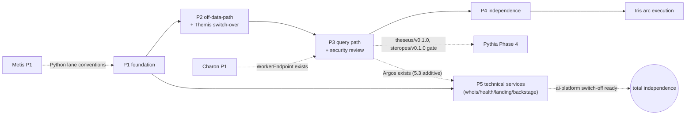

# The Platform Fork — Phased Plan

> **Status:** v0.1 — 2026-06-12. Third artefact of the fork arc; reads with [`../../../architecture/fork/architecture.md`](../../../architecture/fork/architecture.md) + [`contracts.md`](../../../architecture/fork/contracts.md). Follows [`planning-conventions.md`](../../planning-conventions.md).
>
> **Sequencing (Bora, locked 2026-06-12):** *fork first, then develop* — Phases 1–4 run before Iris task-list **execution** begins. Iris/Golem/Pythia task-list **writing** may proceed in parallel (documentation only). Charon and Metis arcs are independent and unaffected except where named.
>
> **Status (2026-06-24).** **Phases 1–5 DONE — the fork is complete.** Phases 1–4 (2026-06-17) forked the pipeline (zero ai-platform coupling, M0+M1 crossed); **Phase 5 (the technical wave — whois / health / landing / backstage + the Argos `whois` role source) landed 2026-06-24 on branch `fork-5`** (Stream-B worktree). All four technical services are forked in-repo and swept off ai-platform branding/packages; **ai-platform can now be switched off without breaking a single kantheon path — One Kantheon.** Tags on merge: `whois`/`health`/`backstage`/v0.1.0, `argos`/v0.2.0. The next Stream-B push is now **Hebe → Kleio**.
>
> Per-stage task lists land here as `tasks-p<n>-s<n.m>-<short>.md` when each stage starts — tracker: [`tasks.md`](./tasks.md) (Phase 1 lists written 2026-06-12). Branches: `feat/fork-p<n>-s<n.m>-<short>`. Tags: `<module-dir>/v0.1.0` at each module's landing.

---

## Phase 1 — Foundation: protos, libs, build independence

**Deliverable:** kantheon builds green with zero ai-platform Maven dependencies; pipeline protos and shared libs live in-repo; Python lane conventions settled for three modules.

### Stage 1.1 — Fork point & conventions
Pre-flight: none.
1. Tag ai-platform `kantheon-fork-point`; record the SHA in `architecture/fork/architecture.md` §1.
2. Define provenance header template (`forked-from: ai-platform@<sha> (<path>)`) + module README convention.
3. Introduce top-level `workers/` in `settings.gradle.kts` + repo layout docs.
4. Settle the Python lane conventions (uv, `just build-py/test-py/proto-py`, CI lane) jointly with Metis Phase 1 — whichever lands first owns them.
5. Reserve port ranges + namespace slots for the ten arrivals (record in contracts §7).
6. Stage-exit checklist doc (`tasks-p1-s1.1-conventions.md` retro-fills).

DONE: conventions documented; fork-point tag pushed; build accepts empty `workers/`.

### Stage 1.2 — Pipeline protos
Pre-flight: 1.1.
1. Fork `plan/v1`, `worker/v1`, `transdsl/v1`, `dfdsl/v1` → `org.tatrman.*` (contracts §1).
2. Wire into `:shared:proto` codegen (KT + PY); `just proto` green.
3. Rule-6 sweep: retarget `messages = 99` types to `org.tatrman.kantheon.common.v1.ResponseMessage`.
4. Proto-level tests (descriptor round-trip; reserved field 99 lint).
5. Charon contracts edit: `worker/v1` import source flips to in-repo (no behavior change yet — Charon still calls ai-platform Polars until Phase 3).
6. Strike `kantheon-v1.1.md` §1 ResponseMessage-extraction item (stand-in promoted to canon).

DONE: generated code compiles in both languages; no kantheon proto imports `cz.dfpartner.*` except `themis/v1` (swapped in Stage 2.6).

### Stage 1.3 — Shared libs & Maven cut
Pre-flight: 1.2.
1. Fork `query-translator`, `db-common`, `data-formatter`, `ttr-parser`, `ttr-writer`, `fuzzy-common` into `shared/libs/kotlin/` with their test suites.
2. Fork `otel-config`, `logging-config`, `ktor-configurator` in-repo; migrate existing kantheon modules off the Maven artifacts.
3. Fork `python/otel-config`.
4. Remove GitHub Packages repositories + PAT bootstrap from `libs.versions.toml`, `AGENTS.md`, CI.
5. Calcite version alignment check (`query-translator` ↔ `libs.versions.toml`; consult `~/Dev/view-only/calcite` on conflicts).
6. Full-repo `just init && just test-all && just lint-all` green.

DONE: the only `cz.dfpartner` Maven coordinate left is Themis's `shared-proto` (nlp.v1 — documented residual, deleted in Stage 2.6); CI green; existing modules unaffected at runtime.

---

## Phase 2 — Off-data-path services

**Deliverable:** Ariadne, Echo, Kadmos, Proteus, Prometheus deployed on local K3s; Themis runs entirely on the forked stack (eval-gated).

### Stage 2.1 — Ariadne (+ ariadne-mcp)
Pre-flight: Phase 1; capabilities-mcp running locally.
1. Fork `infra/metadata` → `services/ariadne`; package + service rename (`AriadneService`); drop package-local ResponseMessage.
2. Fork `tools/meta-mcp` → `tools/ariadne-mcp` (zero-logic check against contracts §2).
3. Model fixtures into `deployment/local`; ClasspathStorage paths re-wired.
4. Forked test suite green; add Rule-6 retarget tests.
5. **Prompt-serving (kantheon-new, 2026-06-13 — contracts §1.1):** widen the Git source from the single `model-ttr` subdir to the whole `ai-models` repo (`model-ttr/` + `prompts/`); add the additive `GetPrompts(agent_id, locale)` RPC returning raw prompt YAML + content hash (no parsing/substitution server-side); surface `get_prompts` through ariadne-mcp; prompt fixtures (`prompts/{golem,resolver}/`) into `deployment/local`; tests on tree selection + hash stability + `/refresh` covering both trees.
6. k8s base/overlays; Jib; deploy local K3s; probes green.
7. ToolCapability fixture + heartbeat registration verified in capabilities-mcp (incl. the `get_prompts` tool).

DONE: ariadne-mcp answers `ListObjects`/`Search`/`GetModel` **and `get_prompts`** on local K3s from fixture model + fixture prompts.

### Stage 2.2 — Echo (+ echo-mcp)
Pre-flight: 1.3 (fuzzy-common in-repo).
Tasks mirror 2.1 (fork, rename `EchoService`, suite green, k8s, heartbeat) + Themis's fuzzy-common dependency re-pointed in-repo.
DONE: echo-mcp `Match` round-trips the Czech-aware cascade, verified by mocked unit/component tests (deployed on local K3s; integration verification deferred to the separate integration-test suite).

### Stage 2.3 — Kadmos (+ kadmos-mcp)
Pre-flight: 1.1 Python lane; Metis conventions alignment.
1. Fork `infra/nlp` → `services/kadmos` (uv; pyproject; Dockerfile per Metis idiom).
2. Engine assets (spaCy/Stanza/MorphoDiTa models) — image strategy: cached base layer (Metis/prophet pattern).
3. Fork `tools/nlp-mcp` → `tools/kadmos-mcp` (Kotlin; HTTP client unchanged).
4. pytest suite green; `just test-py kadmos` lane in CI.
5. k8s + deploy; probes green; heartbeat.
6. Proto types land as `org.tatrman.kadmos.v1` (no gRPC binding at v1 — unchanged).

DONE: kadmos-mcp `Analyze` returns lemmas on local K3s.

### Stage 2.4 — Proteus
Pre-flight: 1.3 (query-translator, ttr-* in-repo).
Tasks mirror 2.1 minus MCP (no wrapper today): fork, rename `ProteusService` (RPC names kept), suite green incl. Calcite golden tests, k8s, deploy.
DONE: `ParseToRelNode`/`UnparseFromRelNode` round-trip green under mocked unit tests, incl. Calcite golden tests (deployed on local K3s; integration verification deferred to the separate integration-test suite).

### Stage 2.5 — Prometheus
Pre-flight: 1.3.
1. Fork `infra/llm-gateway` → `services/prometheus` (Spring Boot module enters the kantheon build — first and only; document the exception).
2. Package rename `org.tatrman.llmgateway.v1` → `org.tatrman.prometheus.v1`; service name aligns.
3. Upstream LLM secrets via sealed-secret idiom; Wiremock LLM fixtures into `deployment/local`.
4. Suite green; k8s; deploy; probes.
5. Existing kantheon agents' llm-gateway endpoint config flips to Prometheus (Themis is the only live caller today).
6. Open PD-11/tier-routing backlog items re-homed to kantheon (`kantheon-v1.1.md` §5 edit).

DONE: Themis completes an LLM call through in-repo Prometheus on local K3s.

### Stage 2.6 — Themis switch-over (the one locked-arc touch)
Pre-flight: 2.1–2.5 deployed.
1. `themis/v1` proto import swap: `cz.dfpartner.nlp.v1` → `org.tatrman.kadmos.v1`.
2. Endpoint config: nlp-mcp/fuzzy-mcp → kadmos-mcp/echo-mcp.
3. `themis/contracts.md` edit per fork contracts §5.
4. Full Themis eval corpus re-run — **gate: no regression vs last green run**.
5. Themis component suite against the forked stack with mocked kadmos-mcp/echo-mcp/Prometheus clients (real-stack integration confirmation deferred to the separate integration-test suite).
6. Remove last `cz.dfpartner` reference from Themis.

DONE: Themis mid-Stage-2.4 work resumes on a fully kantheon-internal stack. **Phase 2 exit = `rg cz\.dfpartner` matches only Phase-3 modules.**

---

## Phase 3 — The query path

**Deliverable:** end-to-end query (theseus-mcp → Theseus → Proteus/Argos/Kyklop → Brontes/Steropes → Arrow IPC back) on local K3s, with per-user RLS under the OBO bearer. **The RLS edge moves in-repo — this phase carries its own security review.**

### Stage 3.1 — Argos I: validator core + bearer roles
Pre-flight: Phase 1; 2.1 (Ariadne — validator reads the model graph).
1. Fork `services/validator` → `services/argos` **tests-first**: the existing suite + policy fixtures land and run before code changes.
2. Package/service rename (`ArgosService`).
3. **Bearer-roles rework** (the one behavior change): `auth_roles` from `realm_access.roles`; whois client deleted; TDD against forked policy fixtures.
4. RLS predicate injection tests green (incl. admin-bypass DF-V02 path).
5. TopN/column-rule/LLM-judge guards green unchanged.
6. k8s; deploy; probes.

DONE: Argos validates fixture plans with role-driven RLS, no whois anywhere.

### Stage 3.2 — Argos II: the policy fold
Pre-flight: 3.1.
1. Fork sql-security's v1 RelNode policy engine **into** Argos (in-process; `SecurityService` gRPC surface not re-exposed).
2. HOCON policy store forked; authoring stays Git-workflow (doc note).
3. Legacy SQL-fragment endpoints confirmed not forked (contracts §1).
4. Combined suite: validator-suite ∪ sql-security-suite, both green in one service.
5. Policy-evaluation latency benchmark (fold must not regress the validate hot path).
6. Provenance headers for both source modules.

DONE: one pod, a hundred eyes; both forked suites green.

### Stage 3.3 — Kyklop + Brontes
Pre-flight: 1.2 (`worker/v1`).
1. Fork `services/dispatcher` → `services/kyklop` (rename `KyklopService`; HOCON worker-capability config).
2. Fork `workers/mssql` → `workers/brontes` (first `workers/` module).
3. MSSQL local-infra manifest into `deployment/local`; connection secrets per Charon's registry idiom.
4. Suites green against a mocked MSSQL driver/fake (real-MSSQL verification deferred to the separate integration-test suite).
5. k8s both; deploy; Kyklop→Brontes dispatch covered by a mocked component test (real-stack integration confirmation deferred to the separate integration-test suite).
6. Arrow IPC streaming path verified against `data-formatter`.

DONE: Kyklop routes a fixture plan to Brontes and streams results back.

### Stage 3.4 — Steropes (+ Charon re-point)
Pre-flight: 1.1 Python lane; Charon Phase 1 landed (its WorkerEndpoint exists).
1. Fork `workers/polars` → `workers/steropes` (uv lane; rename).
2. Schema-fingerprint fixtures: Steropes ↔ Charon ↔ Metis cross-check suite (same algorithm, three implementations, must agree).
3. Charon `WorkerEndpoint` re-points to Steropes (`org.tatrman.worker.v1`, in-repo); `charon/contracts.md` edit.
4. pytest + CI lane green.
5. k8s; deploy; Kyklop→Steropes dispatch + Charon stage-in/read-out covered by mocked component tests (real-stack integration confirmation deferred to the separate integration-test suite).
6. Workspace/session semantics verified (TTL, caps — the patterns Metis ported).

DONE: both Kyklops serve `WorkerService`; Charon stages into Steropes in-repo.

### Stage 3.5 — Theseus (+ theseus-mcp)
Pre-flight: 3.1–3.4, 2.4 (Proteus).
1. Fork `services/query-runner` → `services/theseus` (rename `TheseusService`; orchestration Translator→Validator→Dispatcher re-wired to Proteus→Argos→Kyklop).
2. Plan-cache suite green — **data-flow assertions, not call counts** (the cache-hit replay trap from ai-platform CLAUDE.md).
3. Fork `tools/query-mcp` → `tools/theseus-mcp` **including IdentityResolver** (JWT → PipelineContext; OBO discipline tests).
4. Suites green; k8s both; deploy.
5. ToolCapability fixture + heartbeat.
6. Component smoke: `run_query` through the full forked chain wired with mocked worker/Argos/Proteus clients (true e2e smoke on K3s deferred to the separate integration-test suite).

DONE: theseus-mcp serves `run_query` end-to-end on the kantheon stack; acceptance is met by passing mocked component tests (e2e verification deferred to the separate integration-test suite).

### Stage 3.6 — Security review + acceptance
Pre-flight: 3.5.
> Per the testing policy (planning-conventions.md §4): mocked unit tests only; integration suite is separate. The security-review intent stands; the acceptance checks below are written as mocked component tests, with true e2e acceptance against the live stack deferred to the separate integration-test suite.
1. `kantheon-security.md` §1/§3.4 rewrite (owner swap: theseus-mcp edge, Argos) — review intent stands; the doc claims are validated against mocked component tests (live-stack confirmation deferred to the separate integration-test suite).
2. Per-user RLS acceptance matrix as mocked component tests: two users, different roles, same query → different rows; admin-bypass path; missing-token fail-closed.
3. OBO discipline as a mocked component test: agent-side call with user bearer; service-identity call rejected (live-stack e2e deferred to the separate integration-test suite).
4. Token-expiry behavior matches kantheon-security §2.1 (fail closed, Rule-6 message).
5. Audit interaction check (Iris audit fields still derivable from the forked path — paper check, Iris arc not built yet).
6. Sign-off note in this plan; phase tag set.

DONE: security review signed (acceptance met by passing mocked component tests; e2e acceptance deferred to the separate integration-test suite); Phase 3 modules tagged v0.1.0. **Pythia Phase 4 pre-flight gains: `theseus/v0.1.0` + `steropes/v0.1.0` (alongside `charon/v0.3.0`, `metis/v0.3.0`).**

---

## Phase 4 — Independence & sweep

**Deliverable:** zero cross-repo coupling, docs coherent, agent arcs unblocked.

### Stage 4.1 — Constellation wiring end-state
1. All forked manifests live in capabilities-mcp; registry search returns the full toolset.
2. Decommission expectation of the ai-platform PoC heartbeat (verify nothing in kantheon awaits it; ai-platform untouched).
3. Observability: dashboards/alerts for the ten arrivals (fabric-infra side noted, client config in-repo).
4. Throughput smoke on the query path (baseline numbers recorded for capability cost hints).
5. `deployment/local` one-command bring-up verified from clean K3s.
6. Independence assertion: no kantheon pod egresses outside kantheon + fabric-infra estate.

### Stage 4.2 — Docs & ledger sweep
1. `rg "cz\.dfpartner"` clean across code, resources, HOCON, k8s, docs (except historical/provenance notes).
2. CLAUDE.md §1 (fork supersedes boundary-shift), §2 (roster), §3 (`workers/`), §4 (proto table), §9 (two-tier naming + persona vocabulary rule).
3. `kantheon-architecture.md` §10 rewrite (coupling end-state), §13 decision row.
4. `kantheon-v1.1.md`: strike §1 ResponseMessage item; re-home §5 llm-gateway items to Prometheus backlog; close `aip-v1-gateway-worker-plan.md` (never written — scope absorbed: tier-routing → Prometheus backlog, Polars read-out → Steropes/Charon, done in 3.4); close the aip-v1-impl distribution doc as **superseded by the fork** (kantheon-architecture §12).
5. Iris/Golem/Pythia plan pre-flight pointer edits (theseus-mcp/ariadne-mcp).
6. Memory + handover notes updated; `next-steps.md` points at Iris execution.

DONE: docs verification pass green (cross-doc names, packages, gates, links). **The constellation arcs resume: Iris Stage 1.1 execution starts.**

---

## Phase 5 — Technical services & total independence

> **Added 2026-06-13 (Bora): scope widened — everything forks.** The four "technical" services ai-platform was going to keep (`whois`, `health`, `landing`, `backstage`) fork too, so ai-platform can be switched off with zero kantheon breakage. See architecture §2.1 + contracts §1/§3/§6/§8.
>
> **Independent of Phases 2–4 and of the constellation arcs** (architecture §10). Needs only Phase 1 (shared-lib infra + `infra/` not yet introduced — Stage 5.0 adds it). Does **not** gate Iris. Stage 5.3 is *additive* to the already-shipped Phase-3 Argos and reopens nothing.

**Deliverable:** whois / health / landing / backstage running on local K3s under kantheon names and branding; Argos gains an optional `whois` role source; `rg -i "cz\.dfpartner|com\.platform\.|df.?partner|ai-platform"` is clean repo-wide; ai-platform has no remaining operational or build role.

### Stage 5.0 — `infra/` tree + auth/identity shared libs
Pre-flight: Phase 1 (shared-lib idiom; `db-common` already in-repo).
1. Introduce top-level `infra/` in `settings.gradle.kts` + repo-layout docs (mirrors the Phase-1 `workers/` move); a `_smoke` placeholder proves the build accepts it if no module lands the same stage.
2. Fork `shared/libs/kotlin/whois-common` (3 domain records) → pkg `org.tatrman.whois.domain`; provenance header; test stub green.
3. Extract `shared/libs/kotlin/keycloak-auth` from `erp-sql-common.auth` (4 files: `CachingTokenProvider`, `KeycloakTokenProvider`, `TokenProvider`, `TokenResponse`) → pkg `org.tatrman.keycloak.auth`; confirm (test) it has zero erp-sql-common imports.
4. Register both libs in `settings.gradle.kts`; `just build-kt` green.
5. Provenance headers cite `ai-platform@kantheon-fork-point` + original paths.
6. `just test-all && just lint-all` green.

DONE: `infra/` accepted by the build; `whois-common` + `keycloak-auth` in-repo with green suites; no erp-sql-common dependency introduced.

### Stage 5.1 — whois service
Pre-flight: 5.0.
1. Fork `infra/whois` → `infra/whois` (kantheon); package sweep `infra.whois.*` → `org.tatrman.whois.*` (incl. Jib `mainClass`, `application.conf`); deps → in-repo `whois-common`, `keycloak-auth`, `db-common`, `otel-config`, `ktor-configurator`.
2. Forked suite green unmodified (WhoisCache, sync, repository, OPA bundle handler).
3. whois Postgres as a DB/schema in the one Kantheon PG (architecture §7); Flyway V1–V5 run; local-infra Keycloak/ERP upstream fixtures (Wiremock in CI).
4. k8s `{base,overlays/local}`; Jib image `kantheon/whois`; deploy local K3s; `/health`, `/ready` green.
5. Component test (mocked Keycloak/ERP upstream via Wiremock): a sync populates users/roles; `GET /whois?userId=…` and `GET /bundle/{type}/roles.tar.gz` return expected shapes (true e2e against a live Keycloak deferred to the separate integration-test suite).
6. `just test-all && just lint-all`; tag `whois/v0.1.0`.

DONE: whois serves the user/role directory + OPA bundles on local K3s, fully in-repo.

### Stage 5.2 — health service
Pre-flight: 5.0 (libs already forked; both health deps in-repo from Phase 1.3).
1. Fork `infra/health` → `infra/health`; package sweep `com.platform.health.*` → `org.tatrman.health.*` (incl. Jib `mainClass`).
2. Forked suite green (TCP / Prometheus / native checkers; roll-up route).
3. Check-target config (`application.conf`) re-pointed at kantheon service hosts (Grafana/ArgoCD/probes); landing reads this roll-up.
4. k8s + Jib `kantheon/health`; deploy local K3s; probes green.
5. Component test (mocked check targets): roll-up endpoint reports the kantheon services it's pointed at (true e2e against live services deferred to the separate integration-test suite).
6. lint/test green; tag `health/v0.1.0`.

DONE: health aggregates kantheon service status on local K3s.

### Stage 5.3 — Argos optional `whois` role source (additive)
Pre-flight: 5.1 (whois deployed); Phase 3 Stage 3.1 (Argos exists, bearer-default).
1. **Test first:** spec for `WhoisRoleSource` — bearer `user_id` → whois enrichment → expanded role set; and the config switch defaulting to `bearer`.
2. Add `argos.roleSource = bearer | whois` config (contracts §3) + `WhoisRoleSource` client over `GET /whois` (`whois-common` shapes); TTL cache.
3. `bearer` path proven unchanged (regression: Phase-3 RLS acceptance suite green with default config).
4. `whois` path: RLS predicates reflect ERP-hierarchy roles absent from the token (fixture: a role granted only via hierarchy).
5. Security envelope test: whois enriches but cannot assert identity (a whois response for a different `user_id` than the bearer is ignored/rejected).
6. `kantheon-security.md` Phase-5 addendum; lint/test green; Argos minor-version bump.

DONE: Argos resolves roles from bearer by default and from whois when configured, with no change to the default security posture.

### Stage 5.4 — landing frontend
Pre-flight: 5.2 (health roll-up to read); Iris FE conventions noted (not gated).
1. Fork `frontends/landing` → `frontends/landing`; `npm install` clean.
2. Rebrand i18n `app.title` across `en/de/cs/sk/hu` (contracts §8); `.env` link/Keycloak vars → kantheon ingress + realm.
3. Re-point service-dispatcher links (dev portal → forked backstage, health → forked health, Grafana/ArgoCD/Traefik/Keycloak → kantheon hosts).
4. `vite build` green; Nginx image `kantheon/landing`; deploy local K3s behind ingress.
5. Component test (mocked health roll-up): landing renders kantheon branding in all five locales; links resolve to kantheon hosts; health tiles read the forked roll-up (true e2e in-browser on K3s deferred to the separate integration-test suite).
6. lint/build green; `rg -i "df.?partner|ai-platform" frontends/landing` clean (bar provenance).

DONE: the kantheon landing page serves multilingual, on-brand, with working links on local K3s.

### Stage 5.5 — backstage developer portal
Pre-flight: 5.0 (catalog targets the kantheon modules that exist).
1. Fork `infra/backstage` → `infra/backstage`; `yarn install` clean (own Node toolchain — document the exception, like Prometheus's Spring Boot).
2. Rebrand `app-config*.yaml`: `organization.name` → Kantheon; `*_BASE_URL` → kantheon hosts.
3. Re-point catalog: locations + each module's `catalog-info.yaml` describe the pantheon (agents + platform services + technical services), not ai-platform modules.
4. `yarn build`/`yarn tsc` green; image `kantheon/backstage` (port 7007); deploy local K3s + ingress/middleware (forked from `deployment/apps/backstage`).
5. Component test: portal loads, catalog lists kantheon entities, TechDocs resolves a kantheon module's docs (true e2e on K3s deferred to the separate integration-test suite).
6. `rg -i "df.?partner|ai-platform" infra/backstage` clean (bar provenance); tag `backstage/v0.1.0`.

DONE: the kantheon developer portal serves the kantheon catalog on local K3s.

### Stage 5.6 — Total-independence sweep
Pre-flight: 5.1–5.5.
1. `rg -i "cz\.dfpartner|com\.platform\.|df.?partner|ai-platform"` clean repo-wide (code, resources, HOCON, k8s, i18n, catalog) except historical/provenance notes.
2. CLAUDE.md "Not forked" line, roster, repo layout (`infra/`), coupling §7/§9 reflect total independence; vocabulary canon gains the no-persona-for-infra rule.
3. `kantheon-architecture.md` coupling section: ai-platform has zero operational/build role; only `Collite/modeler` remains as an external Maven dep.
4. `deployment/local` one-command bring-up includes the technical services; verified from clean K3s.
5. Independence assertion re-run from Phase 4 extended to the technical services (no egress to an ai-platform-hosted instance of whois/health/landing/backstage).
6. Memory + `next-steps.md` updated; sign-off note here.

DONE: ai-platform can be switched off without breaking a single kantheon path. **One Kantheon.**

> **Phase 5 sign-off (Bora-delegated, 2026-06-24, branch `fork-5`).** All six stages (5.0–5.6) shipped on the single `fork-5` branch in the Stream-B worktree. **5.0** `infra/` tree + `whois-common` + `keycloak-auth` libs (extraction guard-tested). **5.1** whois service (18 specs; Flyway V1–V5; OPA bundle server; json/db modes). **5.2** health service (9 specs; check targets re-pointed to the kantheon estate + fabric-infra, legacy dropped). **5.3** Argos optional whois role source (additive; default-bearer keeps all 115 argos tests green; fail-closed; `argos/v0.2.0`). **5.4** landing rebrand (Kantheon in 5 locales; `services.json` `tech` keys mirror health; vitest green). **5.5** backstage rebrand + 22-Component pantheon catalog (yarn build CI-gated, YAML-validated). **5.6** independence sweep: **zero live `com.platform.*` / `infra.{whois,health}` / `infra.erp.sql.common` root survives** (verified); only provenance/guard-test/rename-map/historical strings remain; whois fixture emails de-branded. Docs flipped to "fork complete / total independence" (CLAUDE §7, fork/architecture §9, master-plan). **The fork is done.** Tags to cut on merge: `whois`/`health`/`backstage`/v0.1.0 + `argos`/v0.2.0.

---

## Dependency picture

Parallelism inside phases: 2.1–2.5 are independent of each other (2.6 needs all); 3.3/3.4 parallel after 3.2; Iris/Golem/Pythia task-list *writing* parallel throughout. **Phase 5 is off the critical path** — it needs only Phase 1 (and Stage 3.1 for the 5.3 Argos hook); inside it, 5.1/5.2/5.5 are mutually independent after 5.0, 5.3 needs 5.1, 5.4 needs 5.2.

---

*Doc owner: Bora. Fork-first locked 2026-06-12; Phase 5 (technical wave) added 2026-06-13 — everything forks, ai-platform switchable off. Per-stage task lists written when each stage starts.*
